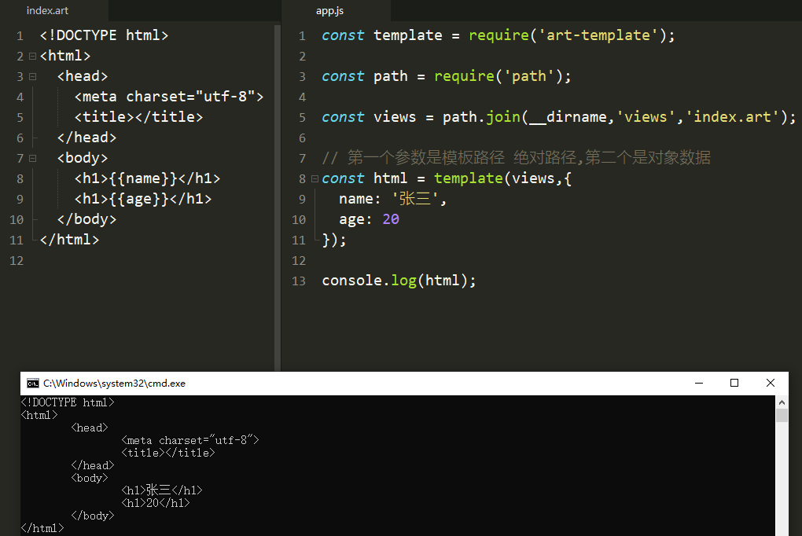
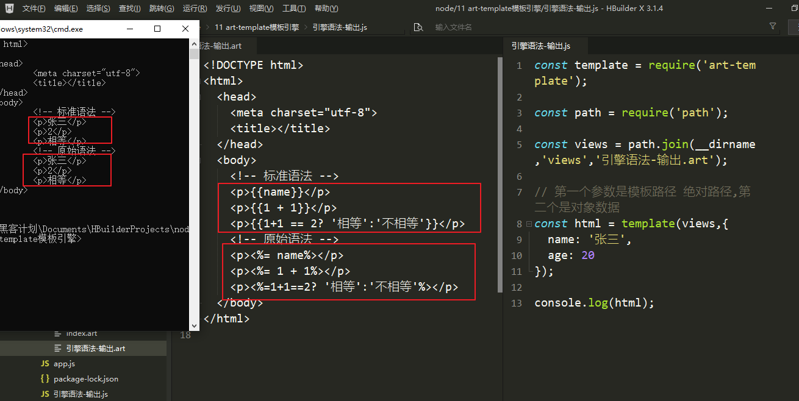
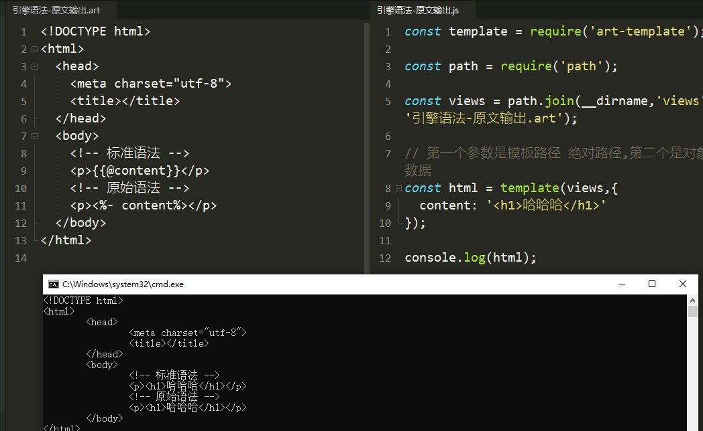
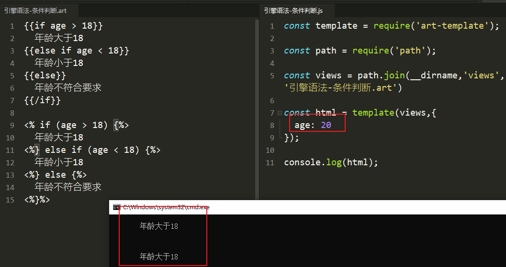
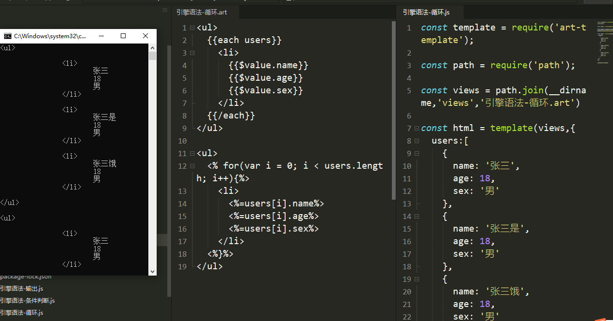
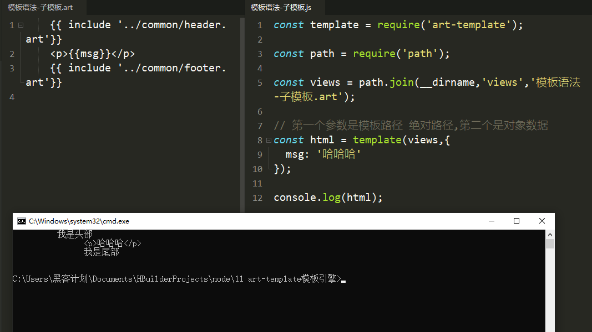
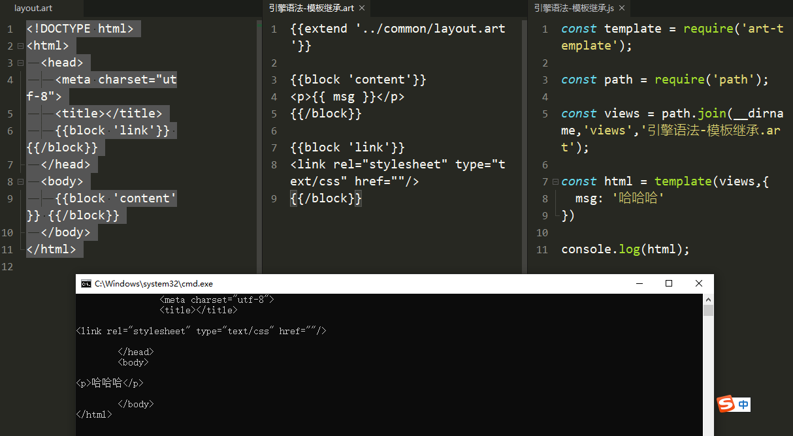
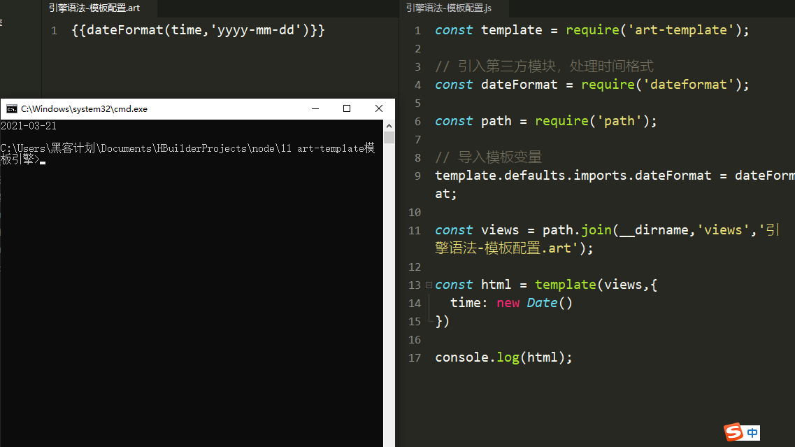
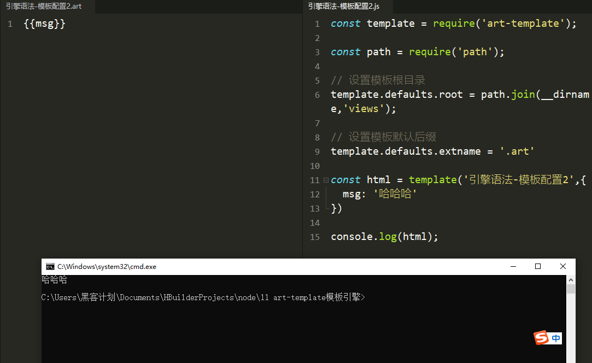

## 什么是第三方模块

```纯文本
别人写好的、具有特定功能的、我们能直接使用的模块即第三方模块，由于第三方模块通常都是由多个文件组成并且被放置在一个文件夹中，所以又名包。
第三方模块有两种存在形式:
●以js文件的形式存在,提供实现项目具体功能的API接口。
●以命令行工具形式存在,辅助项目开发 
```

## 获取第三方模块

```纯文本
npmjs.com网站，第三方模块的发布和存储npm(node package manager)下载node已经自动集成
控制台下载模块 npm install 模块名称 ，默认下载到控制台当前目录路径
卸载 npm uninstall 模块名称
全局安装-g和本地安装
全局安装就是安装到所有的项目的一个公共的目录中，所有的项目都可以使用
本地安装就是安装到当前项目文件中，供当前项目使用
```

## nodemon第三方模块

```纯文本
nodemon是一个命令行工具，用以辅助项目开发。
在Node.js中，每次修改文件都要在命令行工具中重新执行该文件,非常繁琐。
使用步骤
1.使用npm install nodemon -g下载它
2.在命令行工具中用nodemon命令替代node命令执行文件
3.在powershell中ctrl+c暂时退出 y确认
```

## nrm第三方模块

```纯文本
nrm ( npm registry manager): npm下载地址切换工具
npm默认的下载地址在国外，国内下载速度慢
使用步骤.
1.使用npm install nrm -g下载它
2.查询可用下载地址列表nrm ls
https://blog.csdn.net/ougexingfuba/article/details/104056327 显示出错
3.切换npm下载地址nrm use 下载地址名称
切换淘宝镜像https://www.it610.com/article/1282736269557776384.htm
```

## gulp第三方模块

```纯文本
基于node平台开发的前端构建工具
用机械化操作编写成任务，想要执行机械化操作时执行一个命令行命令任务就能自动执行
用机器代替手工，提高开发效率
gulp的作用：项目上线，HTML、css、js文件的压缩合并;语法转换（es6、less）;公共文件抽离；修改文件浏览器自动刷新

```

### gulp的使用

```纯文本
1、使用npm install gulp 下载gulp库文件
2、在项目根目录下建立gulpfile.js文件
3、重构项目的文件夹结构 src目录放置源代码文件 dist 目录放置构建后的文件
4、在gulpfile.js文件中编写任务
5、在命令行工具中执行gulp任务 
```

### gulpfile.js文件的编写

```JavaScript
//gulp中提供的方法不多，gulp.src()：获取任务要处理的文件;gulp.dest() 输出文件;gulp.task()建立gulp任务;gulp.watch()监控文件的变化其中src()的返回值有一个方法 gulp.src().pipe(处理代码); 
// 引入模块
const gulp = require('gulp');

//gulp.task('任务名称',callback)建立任务
gulp.task('first', () => {
  console.log('第一个gulp任务');
  // 使用gulp.src('文件路径')获取要处理的文件
  gulp.src('./src/css/myapp.css')
      .pipe(gulp.dest('dist/css'));
})
```

### gulp模块的插件

#### gulp-cli

```纯文本
下载 npm install gulp-cli -g
命令行多出一个命令gulp
gulp+任务名称 可以执行命令
```

#### gulp-htmlmin

```纯文本
html文件压缩下载npm install gulp-htmlmin 
```


```JavaScript
const htmlmin = require('gulp-htmlmin');
gulp.task('htmlmin', () => {  
    console.log('压缩HTML');  
    gulp.src('./src/index.html')    
        .pipe(htmlmin({collapseWhitespace: true}))    
        .pipe(gulp.dest('dist'));
}) 
```


```纯文本
●gulp-htmlmin: htm|文件压缩
●gulp-csso:压缩cSS 
●gulp-babel: JavaScript语法转化
●gulp-less: less语法转化
●gulp-uglify :压缩混淆JavaScript
●browsersync 浏览器实时同步
```

#### gulp-file-include

```纯文本
提取多个html文件的公共部分下载npm install gulp-file-include
在src中建立一个common存放公共代码的文件夹，将公共代码放在新的空的index-myapp.html文件中再在原始HTML文件中删除公共部分，在删除部位添加@@include('./common/index-myapp.html') 
```


```JavaScript
const fileinclude = require('gulp-file-include');
gulp.task('htmlmin-fileInclude', () => {  
    console.log('压缩HTML，提取公共代码');  
    gulp.src('./src/*.html')    
    //先提取公共部分再压缩    
        .pipe(fileinclude())    
        .pipe(htmlmin({collapseWhitespace: true}))    
        .pipe(gulp.dest('dist'));
}) 
```

#### gulp-less

```纯文本
将less文件转换为css文件下载npm i gulp-less 
```


```JavaScript
const less = require('gulp-less');
gulp.task('lessCss',(done) => {  
    console.log('less转css');  
    gulp.src('./src/css/*.less')      
        .pipe(less())      
        .pipe(gulp.dest('dist/css'))      
    // The following tasks did not complete: lessCss Did you forget to signal async completion?异步执行      // 添加结束回调      
    done();
}) 
```


#### gulp-csso

```纯文本
压缩css代码下载npm i gulp-csso 
```


```javascript
const less = require('gulp-less');
const csso = require('gulp-csso');
gulp.task('lessCssYaSuo',(done) => {  
    console.log('less转css并压缩输出');  
    //多个路径用数组的形式  
    gulp.src(['./src/css/*.less','./dist/css/*.css'])      
        .pipe(less())      
        .pipe(csso())      
        .pipe(gulp.dest('dist/css'))      
    // The following tasks did not complete: lessCss Did you forget to signal async completion?异步执行      // 添加结束回调      
    done();
})
```


#### gulp-babel

```tetx
js语法转换（es6转es5）下载它和它依赖的插件npm install gulp-babel @babel/core @babel/preset-env 
```


```JavaScript
const babel = require('gulp-babel');
gulp.task('jsmin', (done) => {  
    console.log('js语法转换');  
    gulp.src('./src/js/*.js')    
        .pipe(babel({      
        // 判断当前代码的运行环境，并将代码转化为当前环境可以执行的代码      
        presets: ['@babel/env']    
    }))    
        .pipe(gulp.dest('dist/js'))    
    done();
}) 
```


#### gulp-uglify

```纯文本
压缩js文件下载npm install gulp-uglify 
```


```JavaScript
const babel = require('gulp-babel');
const uglify = require('gulp-uglify');
gulp.task('jsmin', (done) => {  
    console.log('js语法转换压缩输出');  
    gulp.src('./src/js/*.js')    
        .pipe(babel({      
        // 判断当前代码的运行环境，并将代码转化为当前环境可以执行的代码      
        presets: ['@babel/env']    
    }))    
        .pipe(uglify())    
        .pipe(gulp.dest('dist/js'))    
    done();
})
```

### 复制图片、其它的文件夹

```纯文本
项目中除了html+css+js,还有其它的文件，这时候就需要将文件夹拷贝到dist中，设置一个复制的任务
```


```JavaScript
gulp.task('copy',(done) => {  
    console.log('复制项目的其它文件夹到dist中');  
    gulp.src(['./src/music','./src/music'])      
        .pipe(gulp.dest('dist'))      
    done();
})
```


### 将所有的任务添加到default任务中

```纯文本
在powershell中输入gulp,gulp会自动的去执行default任务gulp.series：按照顺序执行gulp.parallel：可以并行计算 
```


```JavaScript
gulp.task('default',gulp.parallel('htmlmin-fileInclude','lessCssYaSuo','jsmin','copy',() => {  console.log('所有任务执行完毕');}))
```

## art-template模板引擎

```
1.在命令行工具中使用npm install art-template 命令进行下载
2.使用const template = require ('art-template' )引入模板引擎
3.告诉模板引擎要拼接的数据和模板在哪const html = template( '模板路径',数据);
```

#### 初次使用

`index.art:`

```html
<!DOCTYPE html>
<html>  
<head>    
<meta charset="utf-8">    
    <title></title>  
    </head>  <body>   
    <h1>{{name}}</h1>   
    <h1>{{age}}</h1>  
    </body>
</html>
```

`app.js`

```JavaScript
const template = require('art-template');
const path = require('path');
const views = path.join(__dirname,'views','index.art');
// 第一个参数是模板路径 绝对路径,第二个是对象数据
const html = template(views,{  name: '张三',  age: 20});
console.log(html);
```




#### 模板语法

```
art-template同时支持两种模板语法:标准语法和原始语法。
标准语法可以让模板更容易读写，原始语法具有强大的逻辑处理能力。
```

#### 输出：

```
标准语法:{{数据}}
原始语法: <%=数据%>
```

引擎语法-输出.art

```html
<!DOCTYPE html>
<html>
  <head>
    <meta charset="utf-8" />
    <title></title>
  </head>
  <body>
    <!-- 标准语法 -->
    <p>{{ name }}</p>
    <p>{{ 1 + 1 }}</p>
    <p>{{ 1 + 1 == 2 ? "相等" : "不相等" }}</p>
    <!-- 原始语法 -->
    <p><%= name%></p>
    <p><%= 1 + 1%></p>
    <p><%=1+1==2? '相等':'不相等'%></p>
  </body>
</html>
```


引擎语法-输出.js

```JavaScript
const template = require("art-template");
const path = require("path");
// 第一个参数是模板路径 绝对路径,第二个是对象数据
const html = template(views,{  name: '张三',  age: 20});
console.log(html);
const views = path.join(__dirname, "views", "引擎语法-输出.art"); 
```




#### 原文输出：

引擎语法-原文输出.art

```html
<!DOCTYPE html>
<html>
  <head>
    <meta charset="utf-8" />
    <title></title>
  </head>
  <body>
    <!-- 标准语法 -->
    <p>{{@content}}</p>
    <!-- 原始语法 -->
    <p><%- content%></p>
  </body>
</html>

```


引擎语法-原文输出.js

```JavaScript
const template = require('art-template');
const path = require('path');
const views = path.join(__dirname,'views','引擎语法-原文输出.art');
// 第一个参数是模板路径 绝对路径,第二个是对象数据
const html = template(views,{  content: '<h1>哈哈哈</h1>'});
console.log(html);
```





```js
router.get('/', function(req, res, next) {
  res.render('index', { title: 'Hello' });// 渲染index页面，并传送变量title
});
```

```html
<!DOCTYPE html>
<html lang="en">
<head>
    <meta charset="UTF-8">
    <title>Title</title>
</head>
<body>
    <!-- 放一个h1标签 -->
    <h1>这是一个HTML文件</h1>
    ++ <h2>这是title的值：{{title}}</h2>
</body>
</html>
```

```js
// 定义一个GET请求“/”的路由
    router.get('/', function(req, res, next) {
      // 渲染index页面，传入对象
      res.render('index', {                             
        title: 'Hello',
        name: '零度逍遥',
        age: 31
      });
    });
```

```html
<!DOCTYPE html>
<html lang="en">
<head>
    <meta charset="UTF-8">
    <title>Title</title>
</head>
<body>
    <!-- 放一个h1标签 -->
    <h1>这是一个HTML文件</h1>
    <h2>这是title的值：{{title}}</h2>
    ++ <p>大家好，我是{{name}}，我今年{{age}}岁，很高兴认识大家！</p>
</body>
</html>
```

#### 条件判断

```
可以在原始语法中写原生js代码
```

引擎语法-条件判断.art

```html
{{if age > 18}}  年龄大于18{{else if age < 18}}  年龄小于18{{else}}  年龄不符合要求{{/if}}  <% if (age > 18)  else if (age < 18)  else %>
```


引擎语法-条件判断.js

```JavaScript
const template = require('art-template');
const path = require('path');
const views = path.join(__dirname,'views','引擎语法-条件判断.art')
const html = template(views,{  age: 20});
console.log(html);
```





```html
<!DOCTYPE html>
<html lang="en">
<head>
  <meta charset="UTF-8">
  <title>Title</title>
</head>
<body>
<h2>{{title}}</h2>
++ <!-- 判断年龄小于30 -->
    ++ {{if age<30 }}
    <p>大家好，我是{{name}}，我今年{{age}}岁，很高兴认识大家！</p>
    ++ {{/if}}
++ <!-- 判断年龄大于等于30 -->
    ++ {{if age>=30 }}
    ++ <p>大家好，我是{{name}}，很高兴认识大家！</p>
    ++ {{/if}}
</body>
</html>
```

```html
<!DOCTYPE html>
<html lang="en">
<head>
  <meta charset="UTF-8">
  <title>Title</title>
</head>
<body>
<h2>{{title}}</h2>
++ <!-- 判断年龄小于30 -->
    ++ {{if age<30 }}
    <p>大家好，我是{{name}}，我今年{{age}}岁，很高兴认识大家！</p>
    ++ {{else}}
    ++ <p>大家好，我是{{name}}，很高兴认识大家！</p>
    ++ {{/if}}
</body>
</html>
```


```html
<!DOCTYPE html>
<html lang="en">
<head>
  <meta charset="UTF-8">
  <title>Title</title>
</head>
<body>
    <h2>{{title}}</h2>
    <!-- 判断年龄小于30 -->
    {{if age<30 }}
    	<p>大家好，我是{{name}}，我今年{{age}}岁，很高兴认识大家！</p>
    {{/if}}
    <!-- 判断年龄大于等于30 -->
    {{if age>=30 }}
      	-- <p>大家好，我是{{name}}，很高兴认识大家！</p>
    	++ <p>大家好，我是{{name}}，
      	++ <!-- 判断happy字段是否为真 -->
      	++ {{if happy }}
      	++ <span>很高兴认识大家！</span>
      	++ {{/if}}
    	</p>
	{{/if}}
</body>
</html>
```

```js
//首页路由
router.get('/', function(req, res, next) {
    // 渲染index页面，传入对象
    res.render('index', {
        title: 'Hello',
        name: '零度逍遥',
        age: 32,
        ++ happy: true
    });
});
```

#### 循环渲染

引擎语法-循环.art

```html
<ul>
  {{each users}}
  <li>{{ $value.name }} {{ $value.age }} {{ $value.sex }}</li>
  {{/each}}
</ul>
<ul>
  <% for(var i = 0; i < users.length; i++){%>
  <li><%=users[i].name%> <%=users[i].age%> <%=users[i].sex%></li>
  <%}%>
</ul>
```


引擎语法-循环.js

```JavaScript
const template = require('art-template');
const path = require('path');
const views = path.join(__dirname,'views','引擎语法-循环.art')
const html = template(views,{  
    users:[    
        {      
            name: '张三',      
            age: 18,      
            sex: '男'    
        },    
        {      
            name: '张三是',      
            age: 18,      
            sex: '男'    
        },    
        {      
            name: '张三饿',      
            age: 18,      
            sex: '男'    
        }  
    ]});
console.log(html);
```




```js
// 定义一个GET请求“/”的路由
router.get("/for", function(req, res, next) {
    // 渲染index页面，传入渲染对象
    res.render("for", {
        title: "Hello",
        // 定义一个数组，每一项都是一个对象
        list: [{
                id: 1,
                content: "今天天气不错",
            },
            {
                id: 2,
                content: "昨天你吃了什么？",
            },
            {
                id: 3,
                content: "工作好累",
            },
        ],
        targetId: 2, // 定义一个变量，表示当前被选中的id
    });
});
```

```html
<!DOCTYPE html>
<html lang="en">

<head>
    <meta charset="UTF-8">
    <title>Title</title>
</head>

<body>
    <h2>{{title}}</h2>
    <!-- 循环list，每一项为item -->
    {{each list as item }}
    	<!-- 判断list中的每一项item的id属性是否等于targetId字段 -->
    	{{if item.id === targetId}}
    		<p style="color: #f00;">数据id：{{item.id}}，内容：{{item.content}}</p>
    	{{else}}
    		<p>数据id：{{item.id}}，内容：{{item.content}}</p>
    	{{/if}} 
    {{/each}}
</body>

</html>
```


#### 子模板

在当前模板引入其它的模板

header.art

```纯文本
我是头部
```


footer.art

```纯文本
我是尾部
```


模板语法-子模板.art

```纯文本
{{ include '../common/header.art'}}    
<p>{{msg}}</p>    
{{ include '../common/footer.art'}}
```


模板语法-子模板.js

```JavaScript
const template = require('art-template');
const path = require('path');
const views = path.join(__dirname,'views','模板语法-子模板.art');
// 第一个参数是模板路径 绝对路径,第二个是对象数据
const html = template(views,{  msg: '哈哈哈'});
console.log(html);
```




#### 模板继承

使用模板继承可以将网站HTML骨架抽离到单独的文件中，其它页面模板可以继承骨架文件

`latout.art`

```html
<!DOCTYPE html>
	<html>  
		<head>    
			<meta charset="utf-8">   
			<title></title>    
			{{block 'link'}} 
			{{/block}}  
		</head>  
	<body>    
		{{block 'content'}} 
		{{/block}}  
	</body>
</html>
```

`引擎语法-模板继承.art`

```html
{{extend '../common/layout.art'}}
{{block 'content'}}
	<p>
		{{ msg }}
	</p>
{{/block}}
{{block 'link'}}
<link rel="stylesheet" type="text/css" href=""/>
{{/block}}
```

`引擎语法-模板继承.js`

```JavaScript
const template = require('art-template');
const path = require('path');
const views = path.join(__dirname,'views','引擎语法-模板继承.art');
const html = template(views,{  msg: '哈哈哈'})
console.log(html);
```




模板配置

1、向模板中导入变量 template.dafaults.imports.变量名 = 变量值（第三方模块，自定义方法）；

2、配置默认后缀名，template.defaults.extname

代码验证第一点：

引擎语法-模板配置.js

```JavaScript
const template = require('art-template');
// 引入第三方模块，处理时间格式
const dateFormat = require('dateformat');
const path = require('path');
// 导入模板变量，变量可以是自己写的方法，也可以是第三方模块里的方法
template.defaults.imports.dateFormat = dateFormat;
const views = path.join(__dirname,'views','引擎语法-模板配置.art');
const html = template(views,{  time: new Date()})
console.log(html);
```


引擎语法-模板配置.art

```纯文本
{{dateFormat(time,'yyyy-mm-dd')}}
```




引擎语法-模板配置2.js

```JavaScript
const template = require('art-template');const path = require('path');// 设置模板根目录template.defaults.root = path.join(__dirname,'views');// 设置模板默认后缀template.defaults.extname = '.art'const html = template('引擎语法-模板配置2',{  msg: '哈哈哈'})console.log(html);
```


引擎语法-模板配置2.art

```纯文本
{{msg}}
```




## ejs模板引擎

### 安装

`npm i ejs --save`

`npm i koa-views --save`

### 基本使用

`/views/index.html`

```html
<!DOCTYPE html>
<html lang="en">
  <head>
    <meta charset="UTF-8" />
    <meta name="viewport" content="width=device-width, initial-scale=1.0" />
    <meta http-equiv="X-UA-Compatible" content="ie=edge" />
    <title>{{title}}</title>
  </head>
  <body>
    <h1>{{title}}</h1>
  </body>
</html>
```

`app.js`

```javascript
const Koa = require('koa')
const views = require('koa-view')
const path = require('path')
const app = new Koa()

app.use(views(path.join(__dirname,'./views'),{
  extension:'ejs'
}))

app.use(async ctx => {
  let title = 'Hello world'
  // 通过模板引擎传递参数给页面
  await ctx.render('index',{title})
})

app.listen(3000,() => {
  console.log('http://localhost:3000');
})
```

## mysql 连接数据库mysql的驱动

[mysql npm地址](https://www.npmjs.com/package/mysql)

`提取一点重点`

mysql的兼容升级npm包mysql2

### mysql连接的配置信息

```js
// db.config.js
// 创建mysql连接
module.exports = {
    host: 'localhost', // 服务器地址
    user: 'root', // mysql用户名称
    password: '123456', // mysql用户密码
    port: '3306', // 端口
    database: 'todolist', // 数据库名称
}
```

### 封装mysql的语句执行方法

```js
// db.js 
const mysql = require('mysql2');
const dbConfig = require('./db.config');

module.exports = {
    query: function(sql, params, callback) {
        //每次使用的时候需要创建链接，数据操作完成之后要关闭连接
        const connection = mysql.createConnection(dbConfig)
        connection.connect(function(err) {
            if (err) {
                throw err
            }
            //开始数据操作
            connection.query(sql, params, function(err, results, fields) {
                if (err) {
                    throw err
                }
                //将查询出来的数据返回给回调函数
                callback &&
                    callback(
                        JSON.parse(JSON.stringify(results)),
                        JSON.parse(JSON.stringify(fields))
                    )
                    //停止链接数据库，必须在查询语句后，要不然一调用这个方法，就直接停止链接，数据操作就会失败
                connection.end(function(err) {
                    if (err) {
                        console.log('关闭数据库连接失败！')
                        throw err
                    }
                })
            })
        })
    },
}
```

```js
router.get('/userList', (req, res, next) => {
    // sql查询user表
    db.query('select * from list', [], function(results, fields) {
        // 以json的形式返回
        res.json({ results })
    })
})
```

### query的两种查询

```js
connection.query('SELECT * FROM `books` WHERE `author` = "David"', function (error, results, fields) {
  // error will be an Error if one occurred during the query
  // results will contain the results of the query
  // fields will contain information about the returned results fields (if any)
});
```

```js
connection.query('SELECT * FROM `books` WHERE `author` = ?', ['David'], function (error, results, fields) {
  // error will be an Error if one occurred during the query
  // results will contain the results of the query
  // fields will contain information about the returned results fields (if any)
});
```

### 获取受影响的行数

```js
// 您可以从插入、更新或删除语句中获取受影响的行数。
connection.query('DELETE FROM posts WHERE title = "wrong"', function (error, results, fields) {
  if (error) throw error;
  console.log('deleted ' + results.affectedRows + ' rows');
})
```

### 获取更改的行数

```js
您可以从更新语句中获取更改的行数。“changedRows”与“affectedRows”的不同之处在于它不计算值未更改的更新行。
connection.query('UPDATE posts SET ...', function (error, results, fields) {
  if (error) throw error;
  console.log('changed ' + results.changedRows + ' rows');
})
```

### 多语句查询

```js
// 句查询会被SQL注入，如果确定想使用可以开启
var connection = mysql.createConnection({multipleStatements: true});
```

### 事务

```js
// 开启一个简单的事务
connection.beginTransaction(function(err) {
  if (err) { throw err; }
  connection.query('INSERT INTO posts SET title=?', title, function (error, results, fields) {
    if (error) {
      return connection.rollback(function() {
        throw error;
      });
    }
 
    var log = 'Post ' + results.insertId + ' added';
 
    connection.query('INSERT INTO log SET data=?', log, function (error, results, fields) {
      if (error) {
        return connection.rollback(function() {
          throw error;
        });
      }
      connection.commit(function(err) {
        if (err) {
          return connection.rollback(function() {
            throw err;
          });
        }
        console.log('success!');
      });
    });
  });
});
```

### Exception Safety 类型重铸

```
为方便起见，默认情况下，此驱动程序会将 mysql 类型转换为原生 JavaScript 类型。
```

| mysql                                                   | javascript |
| ------------------------------------------------------- | ---------- |
| TINYINT                                                 | Number     |
| SMALLINT                                                | Number     |
| INT                                                     | Number     |
| MEDIUMINT                                               | Number     |
| YEAR                                                    | Number     |
| FLOAT                                                   | Number     |
| DOUBLE                                                  | Number     |
| TIMESTAMP                                               | Date       |
| DATE                                                    | Date       |
| DATETIME                                                | Date       |
| TINYBLOB                                                | Buffer     |
| MEDIUMBLOB                                              | Buffer     |
| LONGBLOB                                                | Buffer     |
| BLOB                                                    | Buffer     |
| BINARY                                                  | Buffer     |
| VARBINARY                                               | Buffer     |
| BIT (last byte will be filled with 0 bits as necessary) | Buffer     |
| char                                                    | String     |
| varchar                                                 | String     |
| tinytext                                                | String     |
| mediumtext                                              | String     |
| longtext                                                | String     |
| text                                                    | String     |
| enum                                                    | String     |
| set                                                     | String     |
| decimal                                                 | String     |
| bigint                                                  | String     |
| time                                                    | String     |
| geometry                                                | String     |