# Node前置知识

## Node是什么？

```纯文本
node既不是语言，也不是框架
node是一个JavaScript运行时环境
可以解析、执行js代码
以前只有浏览器可以执行JavaScript代码
有了node之后就可以脱离浏览器执行JavaScript代码
在node中，没有DOM、BOM，为JavaScript提供了一些服务器级别的操作API
Node使用事件驱动，异步，使它轻量、高效
npm 是世界上最大的开源的包生态系统，绝大多数的JavaScript包都放在npm上
node基于Chrome的V8引擎， 
```

## node能做什么？

```纯文本
1、Web服务器后台
    
2、命令行工具
    npm(node)
    hexo(node)
    git(c语言开发)
    ...
```

## node环境安装

```纯文本
下载网址：https://nodejs.org/en/download
LTS版，长期支持版稳定版
current版，最新版

下载msi,双击，next...
win+r ,cmd或者powershell(cmd的超集) , node -v , 显示版本

```

## node执行.js文件

```纯文本
win+r powershell cd文件目录下 node 文件名(含js后缀)
需要注意的是，被执行的文件名不能是node
```

## node的模块化开发的好处是什么?

```纯文本
javascript开发的弊端，文件依赖和命名冲突。引用一个js文件，可能这个js文件又引入了其它的js文件，无限套娃、多个js文件可能有变量命名冲突。而模块化开发可以解决这两个问题，此外，模块化开发可以哪坏了修哪，哪要改就改哪个模块
```

## node模块化开发规范

```纯文本
node规定一个JavaScript文件就是一个模块，模块内部定义的变量和函数默认情况下在外部无法访问模块内部可以使用exports，将变量和函数作为exports对象的属性和方法导出，其它模块使用require方法导入该模块，该方法的返回值就是exports对象 
```

## node加载与导出模块中的方法和变量

```纯文本
在HTML中，用<script></script>标签引入js文件
那么在node中，是怎样引入别的js文件呢？
    使用require()引入文件模块
    require('文件路径');
    文件路径的相对路径要加./，不能省略，省略之后就当成了核心模块去找，就找不到会报错
    .js后缀名可以省略
    
在node中模块有模块作用域，也就是当前模块只能访问当前模块的变量和函数，不能访问其它模块的...就算是已经引入了的文件模块也不行，外部不能访问内部，内部也不能访问外部

但是require方法的作用不仅仅是加载模块的代码，还有一个很重要的作用是，会返回一个exports对象，这个文件模块中，该对象默认是一个空对象。核心模块中该对象包含了很多属性和方法

导出：因此我们想要该文件模块中的属性和方法能够被其它模块使用的话我们需要exports.属性名/方法名 = ...   赋值 

加载：var a = require()
```

## 代码示例1用exports导出（a.js）

```JavaScript
var b = require('./b.js');
var num1 = 111;
console.log(b.num1);//11
b.sum(num1,b.num2);//113
```

### (b.js)

```javascript
var num1 = 1;

var num2 = 2;

exports.num1 = 11;

exports.num2 = num2;

exports.sum = function(n1,n2){
  console.log(n1 + n2);
}
```

## 代码示例2用module.exports导出（a.js）

```javascript
var b = require('./b.js');
var num1 = 111;
console.log(b.num1);//11
b.sum(num1,b.num2);//113
```

### (b.js)

```javascript
var num1 = 1;

var num2 = 2;

module.exports.num1 = 11;

module.exports.num2 = num2;

module.exports.sum = function(n1,n2){
  console.log(n1 + n2);
}
```

## exports和module.exports的区别

```纯文本
简单来说exports只是module.exports的简写，相当于地址的引用
因此，当exports和module.exports导出属性和方法不冲突的时候，都可以导出
当module.exports和exports所对应的对象不同时,以module.exports为准
当module.exports好exports所对应的对象相同，属性名或方法名冲突时，以module.exports为准 
```

## 代码验证三种情况

属性和方法不冲突的时候

```JavaScript
  //aa.js
var bb = require('./bb.js');

console.log(bb.num1);//10

console.log(bb.num2);//20

```


```JavaScript
//bb.js
var num1 = 10;

var num2 = 20;

exports.num1 = num1;

module.exports.num2 = num2; 
```


所对应的对象不同时

```JavaScript
//aaa.js
var bbb = require('./bbb.js');

console.log(bbb);//{say: [Function: say]} 
```


```JavaScript
//bbb.js
var num = 10;

exports.num = num;

module.exports = {
  say: function(){
    console.log('nihao');
  }
} 
```


所对应的对象相同，属性名或方法名冲突时

```javascript
//a.js
var b = require('./b.js');

console.log(b.a);//20 
```


```JavaScript
//b.js
var a = 10;
var b = 20;
function sum(num1,num2){
  return num1+num2;
}

exports.a = a;

module.exports.a = b; 
```


# 系统（核心）模块

```纯文本
系统（核心）模块：Node为JavaScript提供了很多的API，这些API绝大多数都被包装到一个具体的核心模块中了。例如文件操作的fs核心模块，http服务的http模块，path路径操作模块，os操作系统信息模块，Node提供了几十个模块...
```


## 文件模块fs(file system 文件操作系统)

### 语法

```JavaScript
//引入模块
const fs = require('fs');

//读文件
fs.readFile('待读取的文件路径','[编码utf8]',callbakc);  

//写文件
fs.writeFile('待写入文件的路径','要写入的内容'，callback); 
```


### 代码示例读文件

```JavaScript
var fs = require('fs');

fs.readFile('./待读取的文件.txt',function(err,doc){
  //如果读取失败，err就是错误对象    如果读取成功，err就是null
  //如果读取失败，doc就是undefined  如果读取成功，doc就是文件内容
  console.log(doc);//hahaha读取的数据转换为<Buffer 68 61 68 61 68 61> 16进制,通过toString方法转化为我们认识的编码
  console.log(doc.toString());//hahaha
  console.log(err);//null
  //err可以用来进行错误处理的
  if(err){
    console.log('读取失败');
  }else{
    console.log('读取成功');
  }
});
```


### 代码示例写文件

```JavaScript
var fs = require('fs');

//如果写的路径中没有这个文件名，会自动创建文件
fs.writeFile('07待写入的文件.txt','哈哈哈',function(err){
  //如果写入失败，err就是错误对象  如果写入成功，err就是null
  //err可以用来进行错误处理的
  if(err){
    console.log('写入失败');
  }else{  
    console.log('写入成功');
  }
  console.log(err);//null
})
```


## 系统模块path

### 语法

```JavaScript
//引入模块
const path = require('path');

//拼接路径（不同的操作系统的路径拼接符不一样windows是\/都可以Linux是/）
let finalPath = path.join('DCIM','Camera','image');

//相对路径和绝对路径，大多数情况使用绝对路径，因为有时候相对路径是相对于命令行工具的路径，比如文件操作（读写）
fs.readFile(path.join(__dirname,'文件名称')，callback);
```


### 代码示例拼接路径

```JavaScript
const path = require('path');

var finalPath = path.join('DCIM','Camera','image');

console.log(finalPath);//DCIM\Camera\image
```


### 代码示例绝对路径读写文件

```JavaScript
const fs = require('fs');

const path = require('path');

fs.readFile(path.join(__dirname,'hh.txt'),function(err,doc){
  console.log(doc.toString());
})

fs.writeFile(path.join(__dirname,'ww.txt'),'nihao',function(err){
  if(err){
    console.log(err);
  }else{
    console.log('写入成功');
  }
})
```


# package.json

```
node_modules文件夹的问题：
1、文件夹及文件过多过碎，当我们的项目整体拷贝给别人的时候，传输速度会很慢很慢
2、复杂的模块依赖关系需要被记录，确保模块的版本与当前的保持一致，否则项目运行可能会出错
package.json文件的作用：
1、项目描述文件，记录了当前项目的信息，例如项目名称、版本、作者、GitHub地址，当前项目依赖了哪些第三方模块等，可以使用`npm init -y `快速生成，如果想自己填写项目的名称、版本、作者、GitHub地址，就不使用-y
```

使用``npm run xxx`xxx代表scripts中的简写名称


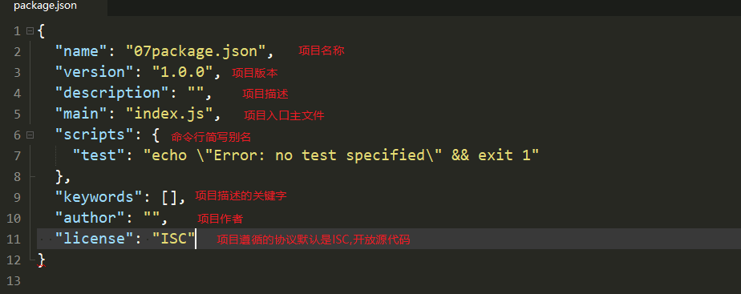

下载第三方模块之后，解决node_modules文件夹的过多过碎、复杂项目依赖的问题

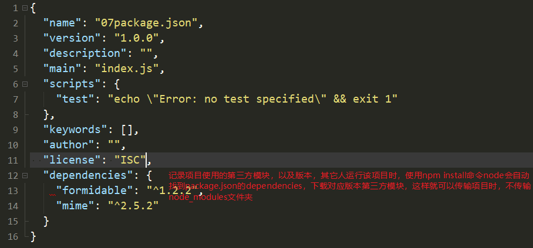

有些第三方模块只在开发时使用，等项目上线的时候不会使用的，称为开发依赖，下载开发依赖``需要和项目依赖分开，上线之后，少下载模块提升速度

`npm install `安装所有依赖
`npm install --production `安装生产依赖
`npm install xx --save `安装XX到生产环境依赖
`npm install xx --save-dev `安装XX到开发环境依赖

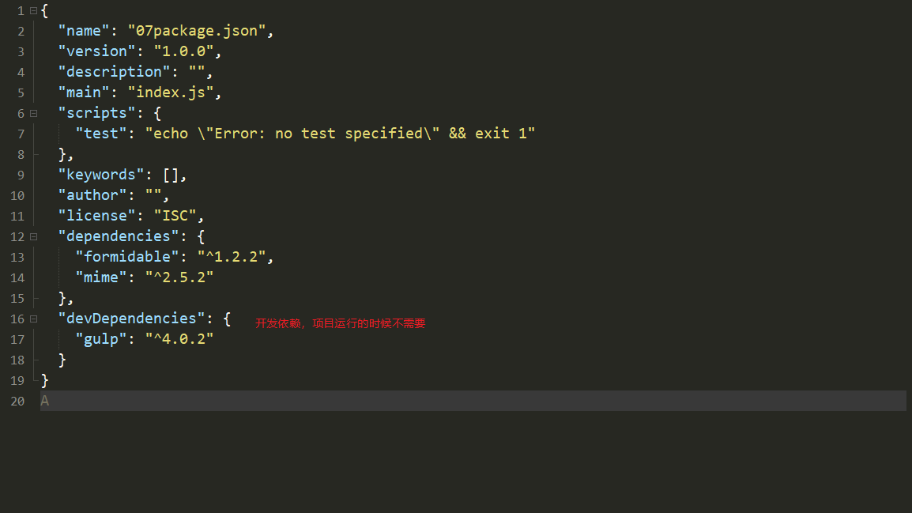

# package-lock.json

```
作用：1、锁定包的版本，确保再次下载时不会因为包版本不同而产生问题 
2、加快下载速度，因为该文件已经记录了项目依赖第三方包的树状结构和包的下载地址，重新安装时只需下载即可，不需要其它额外的工作
```

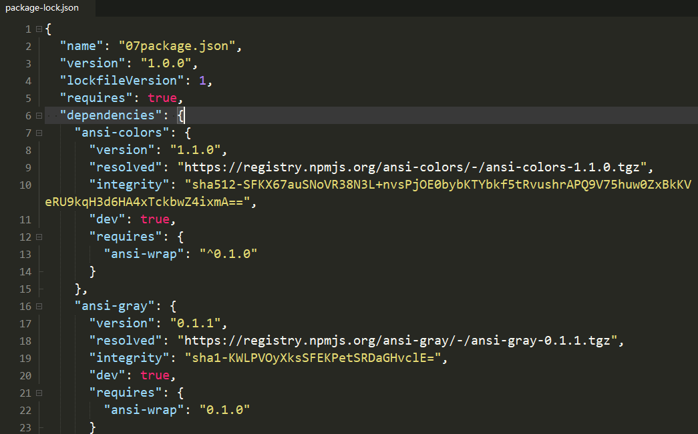

# node.js中模块加载机制

## 当模块拥有路径但没有后缀时

```纯文本
1、require先按路径查找模块，如果是完整路径，直接引入模块
2、如果省略了后缀，按路径先找同名js文件，再找同名文件夹
3、如果找到同名文件夹，就去这个文件夹中找index.js
4、如果没有index.js，就去这个文件夹中找到package.json中找main选项的项目入口文件
5、如果还是没有就报错 
```

## 当模块没有路径，没有后缀名时

```纯文本
1、假设是系统模块
2、不是系统模块，就去node_modules文件夹中找是否有同名js文件
3、如果没有就去找同名文件夹
4、找同名文件的index.js文件
5、没有找package.json的main的主入口文件
6、没有就报错 
```

# node.js异步编程

## 同步API

只有当前API执行完毕后，才能继续指向下一个API

```JavaScript
console.log('first');
console.log('second'); 
```


## 异步API

当前API的执行不会阻塞后续代码的执行

```JavaScript
console.log('first');
setTimeout(()=>{
  console.log('third');
},2000)
console.log('second');
```


## 同步API与异步API的区别

### 获取返回值的方面

同步API可以从返回值中拿到API执行的结果，但是异步API是不可以的

```JavaScript
function sum(num1,num2){
  return num1+num2;
}

const Sum = sum(1,2);

console.log(Sum);//3
```


```JavaScript
function fn1() {
  setTimeout(function(){
    return {msg:'hello'};
  },2000)
}

console.log(fn1());//undefined

```


异步API通过回调函数拿返回值，将函数的return值在函数作业域中，其它函数通过回调这个函数，就能拿到这个函数中的return值了

```JavaScript
function fn1(callback) {
  setTimeout(function(){
    callback({msg:'hello'});
  },2000)
}

fn1(function(data){console.log(data)});//{msg:'hello'}

```


### 代码执行顺序

同步代码执行，异步代码进入队列，同步代码执行完毕，回调函数执行

## node.js中的异步API

事件就是异步API，回调函数当事件发生时，会被自动调用

## 回调地狱：

回调函数嵌套过多（依次调用回调函数）,难以维护

```JavaScript
const fs = require('fs');

fs.readFile('./1.txt','utf8',(err,result1) => {
  console.log(result1);
  fs.readFile('./2.txt','utf8',(err,result2) => {
    console.log(result2);
    fs.readFile('./3.txt','utf8',(err,result3) => {
      console.log(result3);
    })
  })
})
```


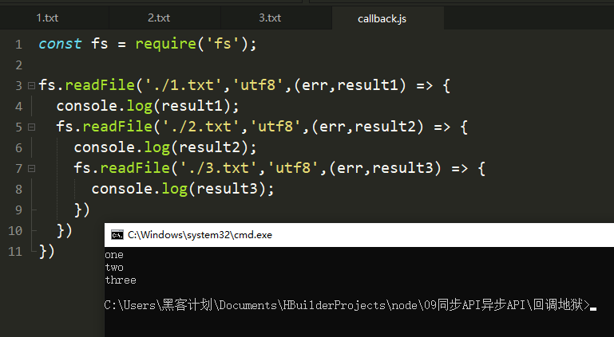

## 解决回调地狱的问题

### es6 Promise  构造函数出现的目的就是为了解决Node.js异步编程中回调地狱的问题

```JavaScript
const fs = require('fs');

function p1(){
  // resolve成功调用的函数 reject失败调用的函数
  return new Promise((resolve,reject) => {
    fs.readFile('./1.txt','utf8',(err , result) => {
      if(err != null) {
        // 也就是向promise对象的catch方法传递参数
        reject(err)
      }else {
        // 也就是向promise对象的then方法传递参数
        resolve(result);
      }
    });
  });
}

function p2(){
  // resolve成功调用的函数 reject失败调用的函数
  return new Promise((resolve,reject) => {
    fs.readFile('./2.txt','utf8',(err , result) => {
      if(err != null) {
        // 也就是向promise对象的catch方法传递参数
        reject(err)
      }else {
        // 也就是向promise对象的then方法传递参数
        resolve(result);
      }
    });
  });
}

function p3(){
  // resolve成功调用的函数 reject失败调用的函数
  return new Promise((resolve,reject) => {
    fs.readFile('./3.txt','utf8',(err , result) => {
      if(err != null) {
        // 也就是向promise对象的catch方法传递参数
        reject(err)
      }else {
        // 也就是向promise对象的then方法传递参数
        resolve(result);
      }
    });
  });
}

p1().then((result) => {
  console.log(result);
  return p2();
}).then((result) => {
  console.log(result);
  return p3();
}).then((result) => {
  console.log(result);
})


p1().catch((result) => {
  console.log(result);
  return p2();
}).catch((result) => {
  console.log(result);
  return p3();
}).catch((result) => {
  console.log(result);
})
```


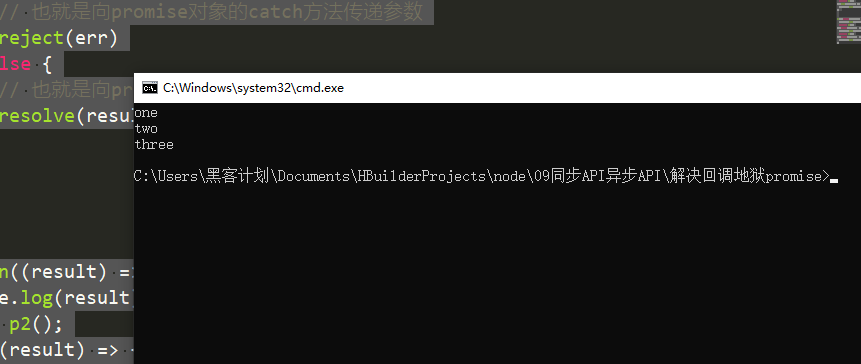

### es7 异步函数

异步函数可以将异步代码写成同步的形式，让代码不再有回调函数嵌套，使代码变得更加清晰

```JavaScript
// 异步函数的返回值默认是promise对象
async function fn() {
  // throw抛出错误信息，throw一旦执行后面的代码就不会执行了
  if (true) {
    return 123;
  } else {
    throw '发生了错误';
  }
}

fn().then(function(data) {
  console.log(data);
}).catch(function(err) {
  console.log(err);
});

```


```JavaScript
// await关键字只能出现在异步函数中，它的作用是可以暂时暂停异步函数的执行，等待promise对象传递过来的时候，再向下指向代码
async function p1() {
  return 'p1';
}

async function p2() {
  return 'p2';
}

async function p3() {
  return 'p3';
}

async function run() {
  let r1 = await p1();
  let r2 = await p2();
  let r3 = await p3();
  console.log(r1,r2,r3);
}

run();
```


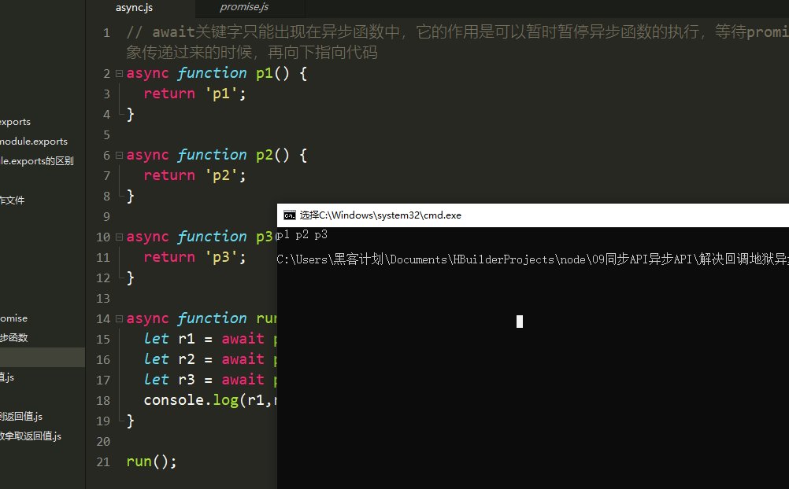

```JavaScript
const fs = require('fs');

// 系统模块util中的promisify方法可以在node中将函数的返回值转换为promise对象
const promisify = require('util').promisify;
const readFile = promisify(fs.readFile);


async function run() {
  let r1 = await readFile('./1.txt','utf8');
  let r2 = await readFile('./2.txt','utf8');
  let r3 = await readFile('./3.txt','utf8');
  console.log(r1,r2,r3);
}

run();
```


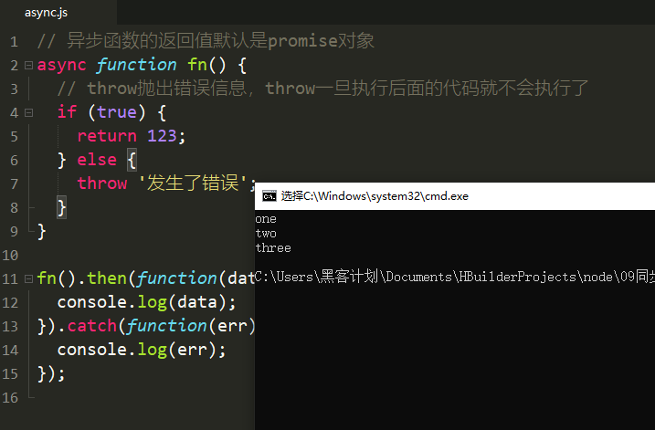

# node.js全局对象global

在浏览器中全局对象是window，在node中是global

global的方法:

```纯文本
console.log()
setTimeout()
clearTimeout()
setInterval()
clearInterval() 
```

# Node.js使用Bootstrap等第三方js文件包

```
下载bootstrap
npm install bootstrap

下载jquery
npm install jquery

配置使用
文件放置
在node_modules目录中找到jquery和bootstrap

将jquery和bootstrap的js文件拷贝到项目目录下pubic的javascripts下

将bootstrap的dist目录下的css目录下的文件拷贝到项目目录下的public的stylesheets目录下

配置使用
因为用的是ejs模板引擎，所以使用方式和html一样，将index.ejs改为如下代码
```

```html
<!DOCTYPE html>

<html>

  <head>

    <title><%= title %></title>

    <link rel='stylesheet' href='/stylesheets/style.css' />

    <link rel='stylesheet' href='/stylesheets/bootstrap.css' />

    <link rel='stylesheet' href='stylesheets/bootstrap-theme.css'>

  </head>

  <body>

    <h1>我是主页</h1>

    <!-- 标准的按钮 -->

    <button type="button" class="btn btn-default">默认按钮</button>

    <!-- 提供额外的视觉效果，标识一组按钮中的原始动作 -->

    <button type="button" class="btn btn-primary">原始按钮</button>

    <!-- 表示一个成功的或积极的动作 -->

    <button type="button" class="btn btn-success">成功按钮</button>

    <!-- 信息警告消息的上下文按钮 -->

    <button type="button" class="btn btn-info">信息按钮</button>

    <!-- 表示应谨慎采取的动作 -->

    <button type="button" class="btn btn-warning">警告按钮</button>

    <!-- 表示一个危险的或潜在的负面动作 -->

    <button type="button" class="btn btn-danger">危险按钮</button>

    <!-- 并不强调是一个按钮，看起来像一个链接，但同时保持按钮的行为 -->

    <button type="button" class="btn btn-link">链接按钮</button>

  </body>

  <script src="/javascripts/jquery.js"></script>

  <script src="/javascripts/bootstrap.js"></script>

</html>
```

# Node服务器

## 服务器基础概念

### 服务器

```
负责存储数据和处理应用逻辑
```

### Node网站服务器

```
接收客户端的请求，能够对请求做出响应
```

### IP地址

```
互联网中唯一的标识，代表互联网协议地址，可以使用ip地址访问服务器
```

### 域名

```
由于ip地址难于记忆，所以产生了域名，也就是网址

输入域名，浏览器引擎会将域名转换为ip地址，然后访问网站服务器
```

### 端口

```
端口号，就是客户端告诉服务器我需要哪种服务，端口号不同，服务不同
```

### URL

```
统一资源定位符，表示Internet网上资源地址的一种编址方式

URL的组成：传输协议://服务器ip或域名：端口（平时不写是默认80）/资源所在位置的标识

http：超文本传输协议，提供了一种发布接收HTML的方法
```

### HTTP协议

```
超文本传输协议：规定了如何从网站服务器传输超文本到本地浏览器，它基于客户端服务器架构工作，是客户端和服务器端请求和应答的标准
```

## 创建web服务器

```JavaScript
// 引用系统模块
const http = require('http');
// 创建web服务器
const app = http.createServer();
// 给服务器添加请求监听事件,回调函数处理事件，req请求、res响应
app.on('request',(req,res) => {
  res.end('<h1>hhh</h1>');
});
// 添加端口
app.listen(80);
console.log('服务器启动成功');
```


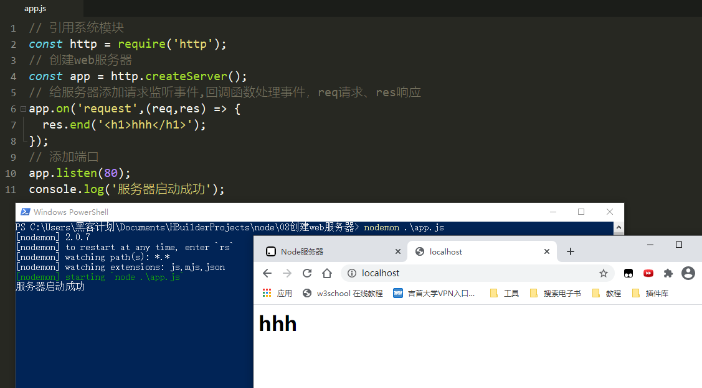


### 报文

```
在HTTP请求和响应的过程中传递的数据块就叫做报文，包括要传送的数据和一些附加信息，并遵循规定好的格式
```

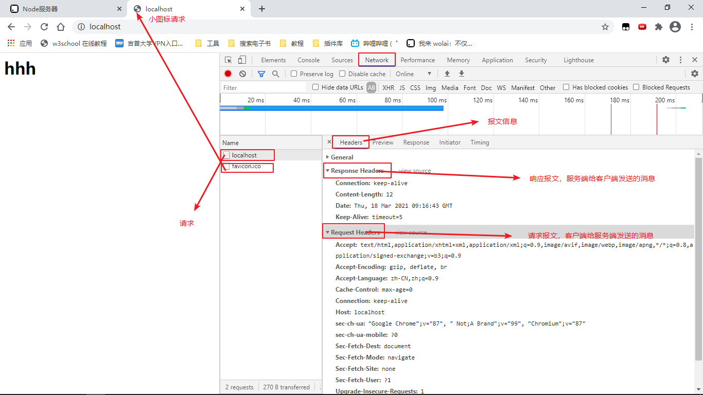

#### 请求报文

```
客户端——》服务器端

请求方式+请求地址+数据内容
```

##### 获取请求方式：GET请求数据（浏览器地址）、POST发送数据（表单的方式）

```JavaScript
// 引用系统模块
const http = require('http');
// 创建web服务器
const app = http.createServer();
// 给服务器添加请求监听事件,回调函数处理事件，req请求、res响应
app.on('request',(req,res) => {
  // 获取请求方式
  // req.method
  console.log(req.method);
  res.end('<h1>hhh</h1>');
});
// 添加端口
app.listen(80);
console.log('服务器启动成功');
```


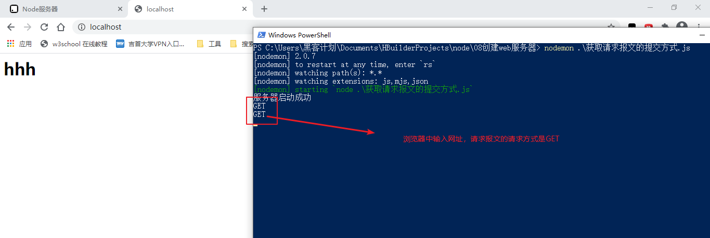

```html
<!DOCTYPE html>
<html>
  <head>
    <meta charset="utf-8">
    <title></title>
  </head>
  <body>
    <!-- method 提交方式
         action 提交的地址
    -->
    <form action="http://localhost:80" method="post">
      <input type="submit" name="" id="" value="提交" />
    </form>
  </body>
</html>

```


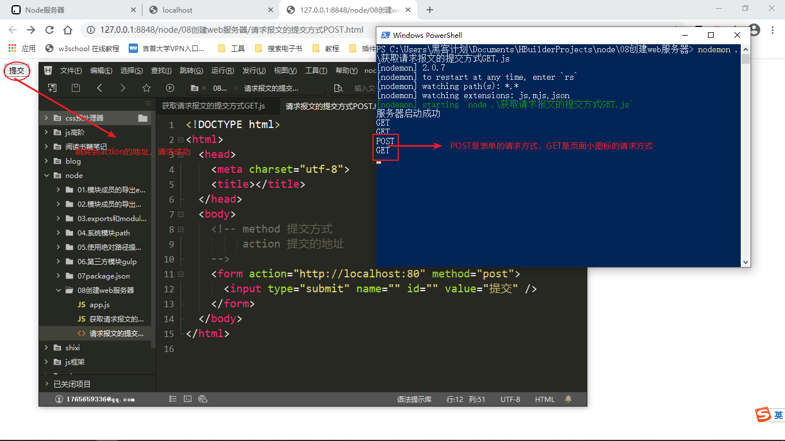

##### 请求地址

```JavaScript
// 引用系统模块
const http = require('http');
// 创建web服务器
const app = http.createServer();
// 给服务器添加请求监听事件,回调函数处理事件，req请求、res响应
app.on('request', (req, res) => {
  // 获取请求地址
  console.log(req.url);
  if (req.url == '/index' || req.url == '/') {
    res.end('index');
  } else if (req.url = '/list') {
    res.end('list');
  } else {
    res.end('URL not found');
  }
});
// 添加端口
app.listen(80);
console.log('服务器启动成功');
```


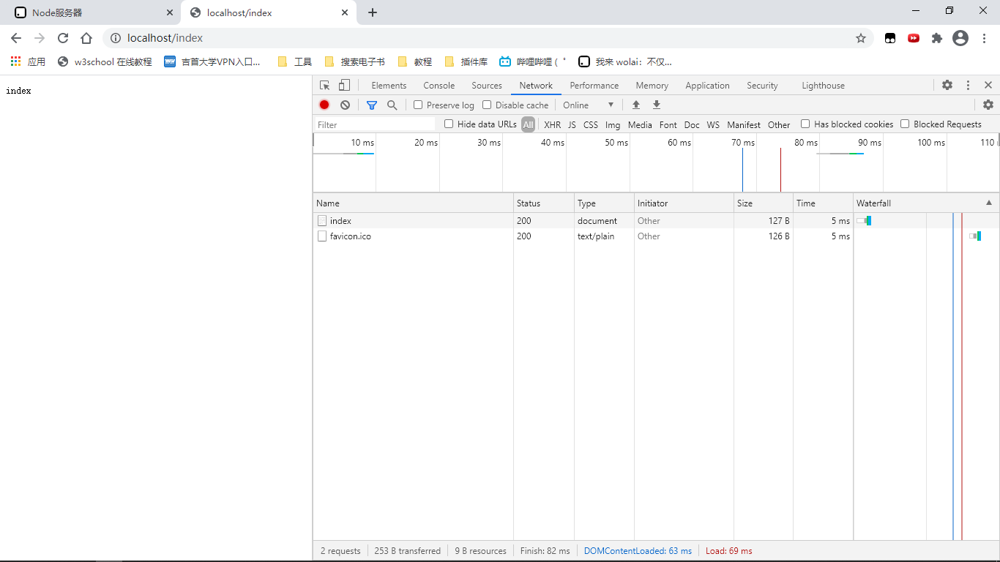

##### 获取请求报文

```JavaScript
// 引用系统模块
const http = require('http');
// 创建web服务器
const app = http.createServer();
// 给服务器添加请求监听事件,回调函数处理事件，req请求、res响应
app.on('request', (req, res) => {

  // 获取请求报文res.headers是一个对象，用[’属性名’]获取属性值
  console.log(req.headers);

  res.end('index');
});
// 添加端口
app.listen(80);
console.log('服务器启动成功');
```

#### 响应报文

```
服务器端——》客户端

内容类型text\html+内容长度20+数据内容
```

##### HTTP状态码

```
常见转态码：200，请求成功；404，请求支资源没有找到； 500，服务器端错误； 400，客户端请求方式有问题
```

##### 设置HTTP状态码

```JavaScript
// 引用系统模块
const http = require('http');
// 创建web服务器
const app = http.createServer();
// 给服务器添加请求监听事件,回调函数处理事件，req请求、res响应
app.on('request', (req, res) => {
  // 假设我们定250是请求成功
  res.writeHead(250);
  res.end('index');
});
// 添加端口
app.listen(80);
console.log('服务器启动成功');

```


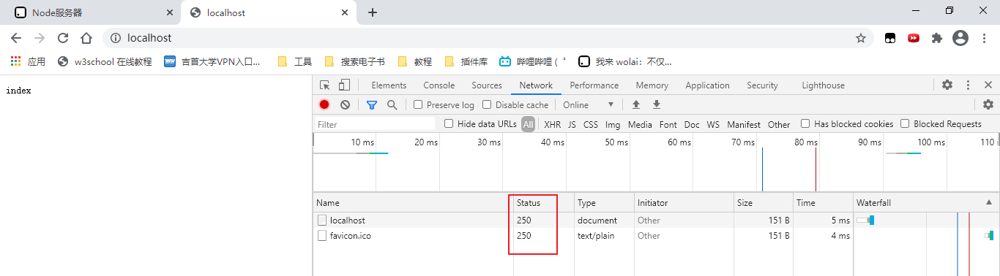

##### 内容类型

```
text/html（默认值）    text/css    application/javascript    image/jpeg     application/json    text/plain纯文本
```

##### 设置内容类型

```JavaScript
// 引用系统模块
const http = require('http');
// 创建web服务器
const app = http.createServer();
// 给服务器添加请求监听事件,回调函数处理事件，req请求、res响应
app.on('request', (req, res) => {
  res.writeHead(200,{
    'content-type': 'text/plain',
  });
  res.end('<h1>index</h1>');
});
// 添加端口
app.listen(80);
console.log('服务器启动成功');
```


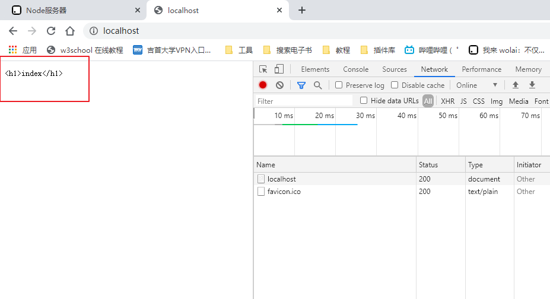

##### 中文乱码

```JavaScript
// 引用系统模块
const http = require('http');
// 创建web服务器
const app = http.createServer();
// 给服务器添加请求监听事件,回调函数处理事件，req请求、res响应
app.on('request', (req, res) => {
  res.writeHead(200,{
    // charset=utf8设置编码，不设置中文会乱码
    'content-type': 'text/html;charset=utf8'
  });
  res.end('<h1>你好</h1>');
});
// 添加端口
app.listen(80);
console.log('服务器启动成功');
```


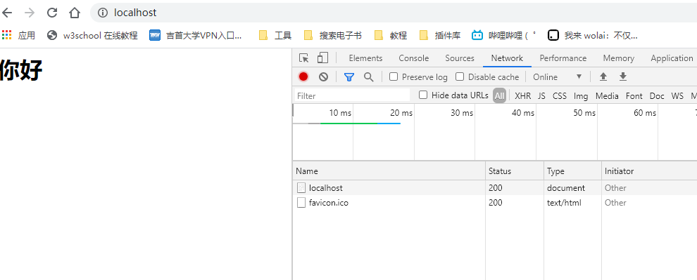

### 请求参数

```
客户端向服务器发送请求时，有时需要携带一些客户信息，客户信息需要通过请求参数的形式传递到服务器端，比如登录操作
```

#### GET请求参数

```
参数被放置在浏览器地址栏，例如：http://localhost:80/?name=zhangsan&age=18
```

##### 获取请求参数

```JavaScript
const http = require('http');
// 使用内置模块url处理网址
const url = require('url');
const app = http.createServer();
app.on('request',(req,res) => {  
    // 获取请求参数使用url.parse()方法处理路径获取请求参数  
    let {query,pathname} = url.parse(req.url,true); 
    console.log(query.name,query.age);  
    console.log(pathname);
})
app.listen(80);
```


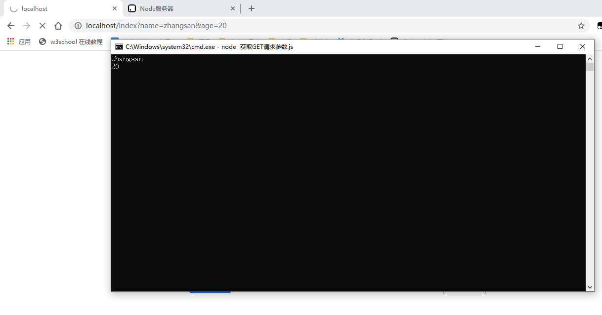

#### POST请求参数

```
参数被放置在请求体中进行传递

获取POST参数需要使用data事件和end事件

使用queryString系统模块将参数转换为对象格式
```

```JavaScript
const http = require('http');
const app = http.createServer();
// 系统模块将字符串转换为对象
const querystring = require('querystring');
app.on('request', (req, res) => {  
    // data 参数传递调用  
    // end 传递结束调用  
    let postParams = '';  
    req.on('data', params => {    postParams += params;  })  
    req.on('end', () => {    
        console.log(querystring.parse(postParams));
    })  
    res.end('ok');
})
app.listen(80);console.log('服务器启动成功');
```


```html
<!DOCTYPE html>
<html>  <head>    
    <meta charset="utf-8">    
    <title></title>  
    </head>  
    <body>    
        <form action="http://localhost:80" method="post">      
            <input type="text" name="username" id="" value="" />      
            <input type="password" name="password" id="" value="" />      
            <input type="submit" value="提交"/>    
        </form>  
    </body>
</html>
```


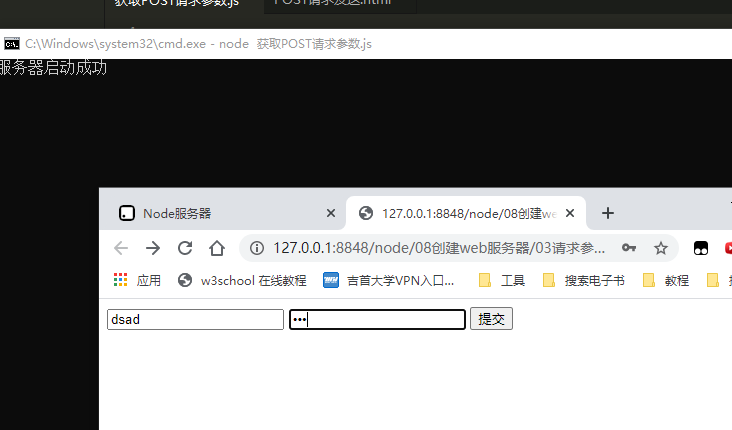

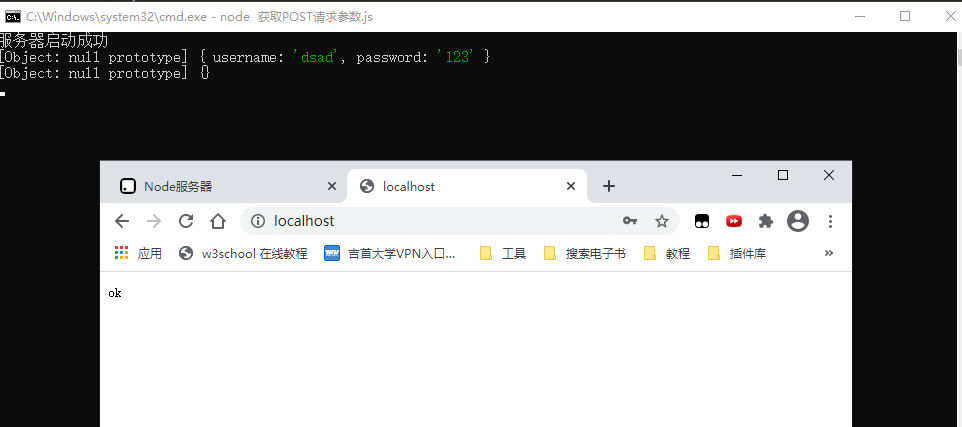

## 路由

```
路由是客户端请求地址与服务器端程序代码的对应关系，简单的说，就是请求什么响应什么
```

```JavaScript
// 引入系统模块http
const http = require('http');
// 引入系统模块url
const url = require('url');
// 创建网站服务器
const app = http.createServer();
// 实现路由
app.on('request', (req, res) => {  
    // 获取客户端的请求方式,将大写的POST和GET转换为小写  
    const method = req.method.toLowerCase();  
    // 获取请求地址  
    const pathname = url.parse(req.url).pathname;    
    // 设置报文  
    res.writeHead(200,{    
        'content-type': 'text/html;charset=utf8'  
    })  
    if (method == 'get') {    
        if (pathname == '/' || pathname == '/index') {      
            res.end('首页');    
        } else if (pathname == '/list') {      
            res.end('列表页');    
        } else {      
            res.end('页面不存在');    
        }  
    } else if (method == 'post') {
    }
})
app.listen(80);console.log('服务器启动成功');
```


## 资源

### 静态资源

```
服务器端不需要处理，可以直接响应给客户端的资源就是静态资源，例如HTML、CSS、JavaScript、image文件等
```

例如：[https://image.baidu.com/search/detail?ct=503316480&z=0&ipn=false&word=图片 壁纸](https://image.baidu.com/search/detail?ct=503316480&z=0&ipn=false&word=图片 壁纸&step_word=&hs=2&pn=0&spn=0&di=20240&pi=0&rn=1&tn=baiduimagedetail&is=0,0&istype=2&ie=utf-8&oe=utf-8&in=&cl=2&lm=-1&st=-1&cs=111713540,615806613&os=3275214250,2157200754&simid=3304861670,4081601877&adpicid=0&lpn=0&ln=3866&fr=&fmq=1389861203899_R&fm=&ic=0&s=undefined&hd=undefined&latest=undefined&copyright=undefined&se=&sme=&tab=0&width=&height=&face=undefined&ist=&jit=&cg=wallpaper&bdtype=0&oriquery=图片&objurl=https://gimg2.baidu.com/image_search/src=http://img.pconline.com.cn/images/upload/upc/tx/wallpaper/1212/10/c1/16491670_1355126816487.jpg&refer=http://img.pconline.com.cn&app=2002&size=f9999,10000&q=a80&n=0&g=0n&fmt=jpeg?sec=1618716691&t=ba3755ea38400d2182507e6fbc23e767&fromurl=ippr_z2C$qAzdH3FAzdH3Fooo_z&e3Bpwrpwr_z&e3Bv54AzdH3Fp5rtvAzdH3F8nd9cbnl&gsm=1&rpstart=0&rpnum=0&islist=&querylist=&force=undefined)

```JavaScript
const http = require('http');
const url = require('url');
const path = require('path');
const fs = require('fs');
const mime = require('mime');
const app = http.createServer();
app.on('request', (req, res) => {  
    // 获取用户的请求路径  
    let pathname = url.parse(req.url).pathname;    
    // 处理路径为/时也要直接到首页  
    pathname = pathname == '/' ? '/index.html' : pathname;    
    // 当前文件所在的绝对路径—__dirname + url ,用path系统模块拼接，根据系统拼接路径符  
    // realPath 文件的真实硬盘路径  
    let realPath = path.join(__dirname, 'public' + pathname);    
    // 静态资源的类型  
    let type = mime.getType(realPath);    
    fs.readFile(realPath, (error, data) => {    
        if (error == null) {      
            // html文件会外链其它的文件（linkcss,image...）如果报文头content-type就无法确定类型,第三发模块mime(npm install mime)可以帮我们判断文件类型并读取      
            res.writeHead('200',{        
                // 不用设置charset=utf8因为html文件中有    
                <meta charset="utf-8">        
                'content-type': type      
            })      
            res.end(data);    
        }else {      
            res.writeHead('404',{        
                'content-type': 'text/html;charset=utf8'      
            });      
            res.end('<h1>404<h1><h3>该路径资源没有找到</h3>');    
        }  
    })
}).listen(80);console.log('服务器启动成功');
```


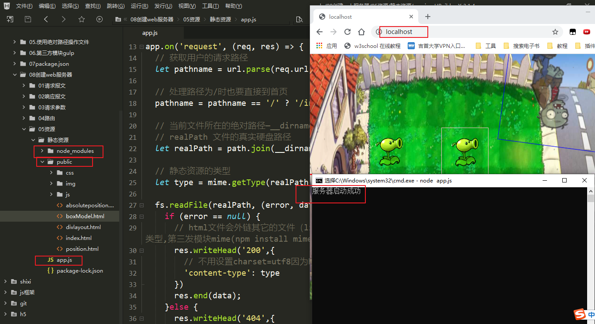

### 动态资源

相同的请求地址不同的响应资源，这种资源就是动态资源例如：http://www.itcast.cn/article?id=1     http://www.itcast.cn/article?id=2