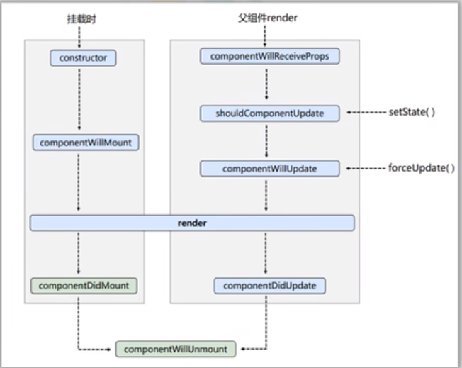
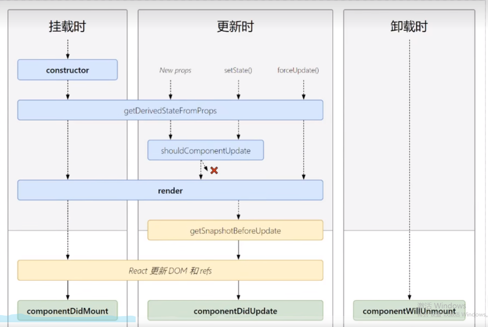

## 旧版生命周期
<div class="div-warning-message animate__animated animate__zoomInDown">react17版本已更新</div>
react生命周期分为三个阶段，如下图所示


react生命周期流程图，如下所示


## 第一阶段挂载
创建时的生命周期

1. constructor         组件创建的时候最先执行        一般用来初始化state和为事件绑定this
2. render              每次组件渲染的时候都会触发     一般用来渲染UI。<span class="span-warning-message">不能调用setState,会造成死循环</span>
3. componentDidMount   组件挂载之后（完成UI渲染之后） 一般用来发送网络请求和DOM操作

:::details 点我查看到代码
```js
import React from 'react';

class App extends React.Component {

  constructor(props) {
    super(props);
    this.getDOM('生命周期函数constructor');
    this.state = {
      count: 0
    }
  }

  getDOM = (message) => {
    const btn = document.getElementById('btn');
    console.log(message, btn);
  }

  render() {
    this.getDOM('生命周期函数render');

    return (
      <div>
        <h1>统计次数：{this.state.count}</h1>
        <button id="btn">点击</button>
      </div>
    )
  }

  componentWillMount() {
    console.log("组件将要挂载");
  }

  // 组件挂载完毕
  componentDidMount() {
    // 只有在componentDidMount中拿到DOM
    this.getDOM('生命周期函数componentDidMount');
  }

}

export default App;
```
:::

## 第二阶段更新
组件更新
导致组件更新的三种情况：

1. 组件的状态数据(state,props)发生改变
2. 组件调用了setState()方法
3. 组件调用了forceUpdate()方法强制更新

1. render             每次组件渲染都会触发         主要用来渲染UI
2. componentDidUpdate 组件更新（完成DOM渲染之后）  主要用来发送网络请求和DOM操作<span class="span-warning-message">如果要使用setState(),可以通过componentDidUpdate()第一个参数来判断上一次的props和这次的props是否相同</span>

:::details 点我查看代码
```js
import React from 'react';

class Father extends React.Component {

  update = () => {
    this.forceUpdate()
  }

  render() {
    return (
      <>
        <button onClick={this.update}>父组件更新</button>
        <App />
      </>
    )
  }
}

class App extends React.Component {

  constructor(props) {
    super(props);
    this.getDOM('生命周期函数constructor');
    this.state = {
      count: 0
    }
  }

  getDOM = (message) => {
    const btn = document.getElementById('btn');
    console.log(message, btn);
  }

  btn = () => {
    this.setState(
      {
        count: this.state.count + 1
      }
    )
  }

  update = () => {
    this.forceUpdate()
  }

  render() {
    this.getDOM('生命周期函数render');

    return (
      <div>
        <h1>统计次数：{this.state.count}</h1>
        <button id="btn" onClick={this.btn}>点击</button>
        <button onClick={this.update}>强制更新</button>
      </div>
    )
  }

  // 组件将要挂载
  componentWillMount() {
    console.log("组件将要挂载");
  }

  // 组件挂载完毕
  componentDidMount() {
    // 只有在componentDidMount中拿到DOM
    this.getDOM('生命周期函数componentDidMount');
  }

  // 父组件render更新
  componentWillReceiveProps(nextProps) {
    console.log("本次更新的props", nextProps);
    console.log("父组件更新");
  }

  // setState钩子
  shouldComponentUpdate(nextProps, nextState) {
    console.log("本次更新的props", nextProps, "本次更新的State", nextState);
    console.log("setState组件更新");
    // 必须要返回一个布尔值，如果返回true，当前setState才会生效,默认返回true
    return true
  }

  // forceUpdate钩子
  componentWillUpdate(nextProps, nextState) {
    console.log("本次更新的props", nextProps, "本次更新的State", nextState);
    console.log("组件forceUpdate将要更新");
  }

  // 组件更新完毕
  componentDidUpdate(prevProps, prevState, snapshot) {
    console.log("上一次props的值", prevProps, "上一次state的值", prevState, "", snapshot)
    console.log("组件更新完毕");
  }
}

export default Father;
```
:::

## 第三阶段卸载

组件卸载
组件卸载的钩子函数只有一个componentWillUnmount,触发条件是组件卸载之前的时刻,一般用来清除一些程序员在之前自己定义的一些操作，比如定时器

触发条件
1. ReactDom.unmountComponentAtNode(document.getElementById("app"))
2. v-if = false

:::details 点我查看代码
```js
import React from 'react';

class Father extends React.Component {

  state = {
    isShow: true
  }

  update = () => {
    this.forceUpdate()
  }

  render() {
    return (
      <>
        <button onClick={this.update}>父组件更新</button>
        <button onClick={() => {
          this.setState({
            isShow: !this.state.isShow
          })
        }}>挂载/卸载App</button>
        {this.state.isShow ? <App /> : null}
      </>
    )
  }
}

class App extends React.Component {

  constructor(props) {
    super(props);
    this.getDOM('生命周期函数constructor');
    this.state = {
      count: 0
    }
  }

  getDOM = (message) => {
    const btn = document.getElementById('btn');
    console.log(message, btn);
  }

  btn = () => {
    this.setState(
      {
        count: this.state.count + 1
      }
    )
  }

  update = () => {
    this.forceUpdate()
  }

  render() {
    this.getDOM('生命周期函数render');

    return (
      <div>
        <h1>统计次数：{this.state.count}</h1>
        <button id="btn" onClick={this.btn}>点击</button>
        <button onClick={this.update}>强制更新</button>
      </div>
    )
  }

  // 组件将要挂载
  componentWillMount() {
    console.log("组件将要挂载");
  }

  // 组件挂载完毕
  componentDidMount() {
    // 只有在componentDidMount中拿到DOM
    this.getDOM('生命周期函数componentDidMount');
  }

  // 父组件render更新
  componentWillReceiveProps(nextProps) {
    console.log("本次更新的props", nextProps);
    console.log("父组件更新");
  }

  // setState钩子
  shouldComponentUpdate(nextProps, nextState) {
    console.log("本次更新的props", nextProps, "本次更新的State", nextState);
    console.log("setState组件更新");
    // 必须要返回一个布尔值，如果返回true，当前setState才会生效,默认返回true
    return true
  }

  // forceUpdate钩子
  componentWillUpdate(nextProps, nextState) {
    console.log("本次更新的props", nextProps, "本次更新的State", nextState);
    console.log("组件forceUpdate将要更新");
  }

  // 组件更新完毕
  componentDidUpdate(prevProps, prevState) {
    console.log("上一次props的值", prevProps, "上一次state的值", prevState)
    console.log("组件更新完毕");
  }

  // 组件卸载
  componentWillUnmount() {
    console.log("组件卸载");
  }
}

export default Father;
```
:::

## 新版生命周期函数



## 第一阶段挂载

:::details 点我查看代码
```js
import React from "react";

class Father extends React.Component {

  render() {
    return (
      <App count={100} />
    )
  }
}

class App extends React.Component {

  constructor(props) {
    console.log('生命周期函数constructor');
    super(props);
  }

  state = {};

  // 静态方法 用props来影响state的值
  static getDerivedStateFromProps = (props) => {
    console.log("接收的props的值", props);
    console.log('生命周期函数getDerivedStateFromProps');
    // 必须返回一个state对象或者null
    return { count: props.count };
  }

  componentDidMount() {
    console.log('生命周期函数componentDidMount');
  }

  render() {
    console.log("生命周期函数render");
    return (
      <div>App{this.state.count}</div>
    )
  }
}

export default Father;
```
::: 点我查看代码
## 第二阶段更新

:::details
```js
class Father extends React.Component {

  render() {
    return (
      <App count={100} />
    )
  }
}

class App extends React.Component {

  constructor(props) {
    console.log('生命周期函数constructor');
    super(props);
  }

  state = { count: 0 };

  btn = () => {
    this.setState({
      count: this.state.count + 1
    })
  }

  // 静态方法 用props来影响state的值
  static getDerivedStateFromProps = (props) => {
    console.log("接收的props的值", props);
    console.log('生命周期函数getDerivedStateFromProps');
    // 必须返回一个state对象或者null
    // return { count: props.count };
    return null;
  }

  componentDidMount() {
    console.log('生命周期函数componentDidMount');
  }

  getSnapshotBeforeUpdate() {
    console.log("生命周期函数getSnapshotBeforeUpdate");
    return { scrollY: 100 };
  }

  componentDidUpdate(preProps, preState, snapshotValue) {
    console.log("getSnapshotBeforeUpdate生命周期函数返回的值", snapshotValue);
    console.log("生命周期函数componentDidUpdate");
  }

  render() {
    console.log("生命周期函数render");
    return (
      <>App
        {this.state.count}
        <button onClick={this.btn}>+1</button>
      </>
    )
  }
}

export default Father;
```
:::

## 第三阶段卸载

与旧版一致没有发生改变,详情查看
[第三阶段卸载](./lifeCycle#第三阶段卸载)