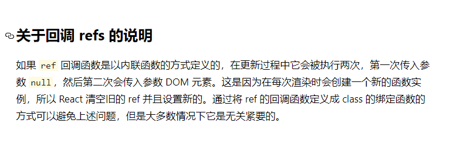

## 字符串形式获取真实dom

<div class="div-warning-message animate__animated animate__zoomInDown">React18版本已废弃</div>

:::details 点我查看代码
```js
import React from "react";
class App extends React.Component {

  showInfo = (type) => {
    const { left, right } = this.refs;
    type === "left"? console.log(type,left.value):console.log(type,right.value);
  }

  render() {
    return (
      <>
        <input type="text" ref="left" />
        <div onClick={() => this.showInfo("left")}>点我提示左侧的内容</div>
        <input type="text" placeholder="失去焦点触发" onBlur={() => this.showInfo("right")} ref="right" />
      </>
    )
  }
}

export default App;
```
:::

## 回调函数的形式获取真实dom
<div class="div-warning-message animate__animated animate__zoomInDown">回调函数在组件更新的时候会被调用两次,回调函数的参数第一次会为null,第二次才是真实DOM,解决办法不用内联事件而是作为类的方法，因为组件更新时，render会被重新调用，但是组件不会重新实例化</div>

[官方文档](https://zh-hans.reactjs.org/docs/refs-and-the-dom.html)中对此也有说明




:::details 点我查看代码
```js
import React from "react";

class App extends React.Component {

  showInfo = (type) => {
    const { left, right } = this;
    type === "left" ? console.log(type, left.value) : console.log(type, right.value);
  }

  rightRef = (c) =>{
    this.right = c;
  }

  render() {
    return (
      <>
        <input type="text" ref={c => this.left = c} />
        <div onClick={()=>this.showInfo("left")}>点我提示左侧的内容</div>
        <input type="text" placeholder="失去焦点触发" onBlur={()=>this.showInfo("right")} ref={this.rightRef} />
      </>
    )
  }
}

export default App;
```
:::

## createRef获取真实dom

:::details 点我查看代码
```js
import React from "react";

class App extends React.Component {

  showInfo = (type) => {
    const { left, right, div } = this;
    console.log(div.current);
    type === "left" ? console.log(type, left.value) : console.log(type, right.value);
  }

  rightRef = (c) => {
    this.right = c;
  }

  div = React.createRef();

  render() {
    return (
      <>
        <input type="text" ref={c => this.left = c} />
        <div onClick={() => this.showInfo("left")} ref={this.div}>点我提示左侧的内容</div>
        <input type="text" placeholder="失去焦点触发" onBlur={() => this.showInfo("right")} ref={this.rightRef} />
      </>
    )
  }
}

export default App;
```
:::