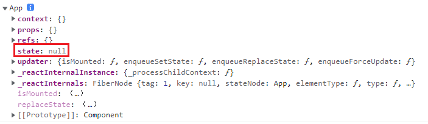

## 状态数据state
在render中打印this，打印的其实就是react组件实例，我们可以看到组件实例身上有很多属性，state就是其中之一。
如下图所示


## 定义state
<span class="span-warning-message">函数式组件中没有state</span>

:::details
```js
import React from "react";
import './App.css';
class App extends React.Component {
	// constructor(props) {
	//   super(props);
	// 	this.state = {
	// 		count: 0
	// 	}
	// }
	
	// 简便写法
	state = {
		count: 1
	}

    render(){
        return (
            <div>
                    <span>数据为:{this.state.count}</span>
            </div>
        )
    }
}
export default App;
```
:::

## 修改state
state不能直接修改，如果直接修改，相当于将一个对象的引用地址修改重新赋值，此时react并不知道你修改了值，因此不会去触发dom树更新，从而页面不会重新渲染

:::details 点我查看代码
```js
import React from "react";
import './App.css';

class App extends React.Component {
  // constructor(props) {
  //   super(props);
  // 	this.state = {
  // 		count: 0
  // 	}
  // }

  // 简便写法
  state = {
    count: 1
  }

  btnClick = () => {
    this.setState({
      count: this.state.count + 1
    })
  }

  render() {
    return (
      <div>
        <span>数据为:{this.state.count}</span>
        <button onClick={this.btnClick}>+1</button>
      </div>
    )
  }
}

export default App;
```
:::