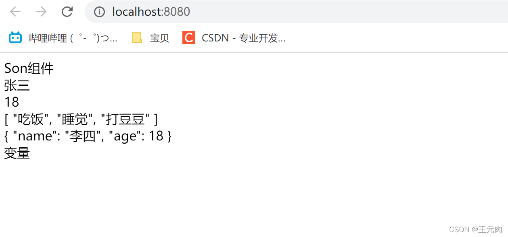
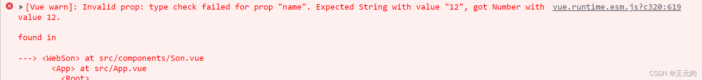
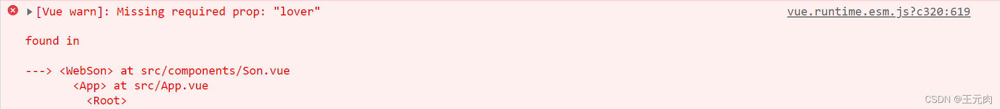
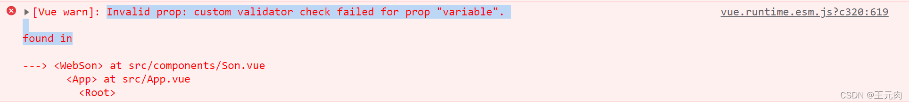
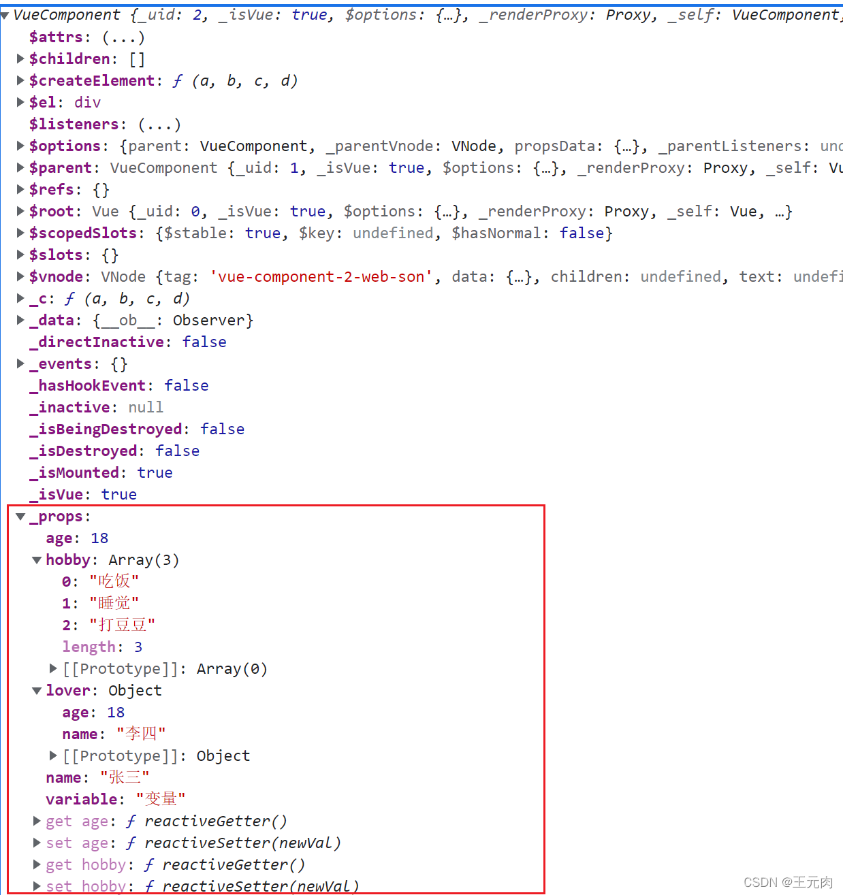
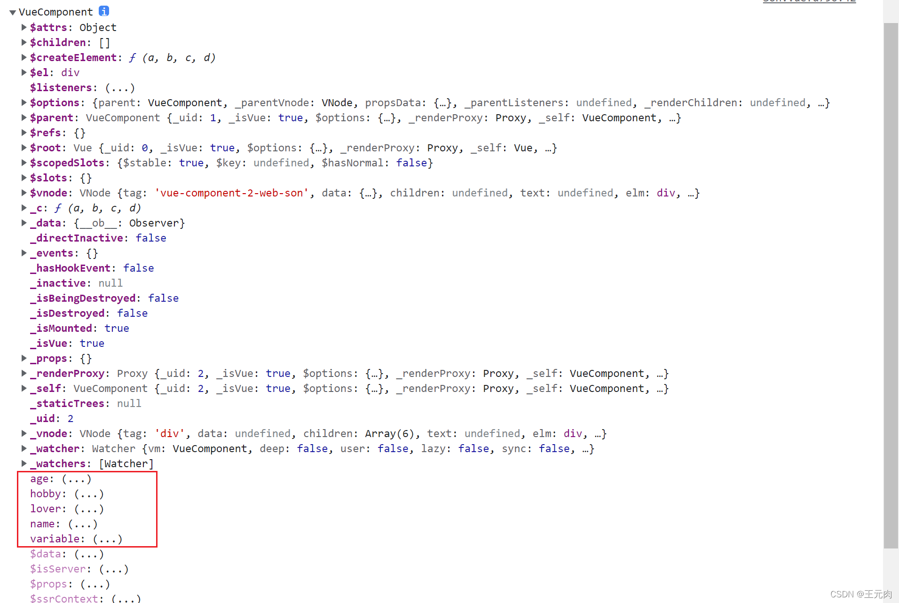
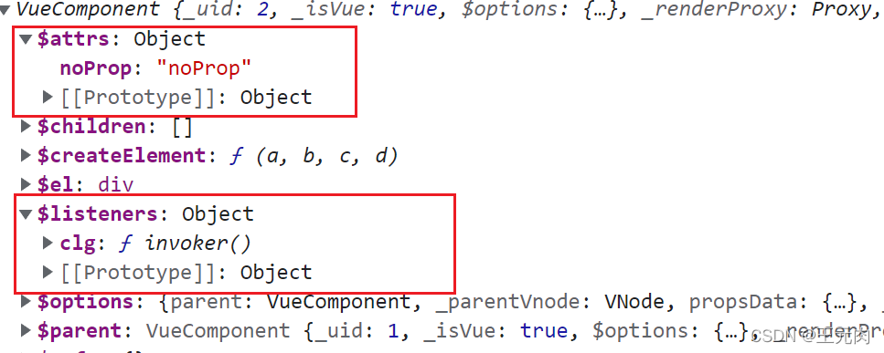
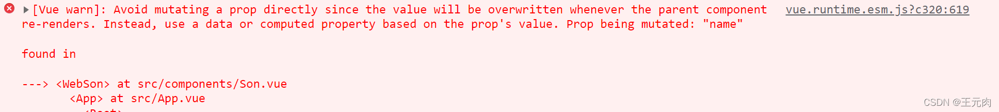

# 组件通信

## 父传子

## 父组件怎么发送数据
父组件给子组件传递数据，发送者就是父组件，那么怎么发送数据给子组件呢？

步骤

1、引入：在父组件中引入子组件

2、挂载：components中挂载

3、传值：通过键值对的形式书写在子组件身上(注意：传递js表达式（常量，变量，数字，
对象，数组），要加:冒号。不加的话，vue模板解析会认为是一个字符串)
:::details 点我查看代码
```js
<template>
  <div>
    <!-- 3、传递 -->
    <Son
      name="张三"
      :age="18"
      :hobby="['吃饭', '睡觉', '打豆豆']"
      :lover="{ name: '李四', age: 18 }"
      noProp="noProp"
    ></Son>
  </div>
</template>

<script>
// 1、引入
import Son from "./components/Son.vue";

export default {
  name: "App",
  // 2、挂载
  components: {
    Son,
  },
};
</script>
```
:::

## 子组件怎么接收?
父组件已经传递值了，那么子组件怎么接收呢?

有两种接收方式：

1、数组的形式（简单接收）

2、对象的形式（复杂接收，可以设置类型校验，默认值，是否必传，以及自定义校验规则）

有两种方法接收函数：

1、 this.$emit

2、this.$listeners
## 简单接收
:::details 子组件
```js
<template>
  <div>
    <div>Son组件</div>
    <div>{{ name }}</div>
    <div>{{age}}</div>
    <div>{{hobby}}</div>
    <div>{{lover}}</div>
    <div>{{variable}}</div>
  </div>
</template>

<script>
export default {
  name: "web-son",
  // 简单接收
  props: ["name", "age", "hobby", "lover", "variable"],
  //接收方法
   mounted() {
    //两种方法调取函数
   //第二个是参数
     this.$emit("fn",1);
     this.$listeners.fn(1);
  },
};
</script>
```
:::
:::details  父组件
```js
<template>
  <div>
    <!-- 3、传递 -->
    <Son
      name="张三"
      :age="18"
      :hobby="['吃饭', '睡觉', '打豆豆']"
      :lover="{ name: '李四', age: 18 }"
      :variable="variable"
      @fn="fn"
      noProp="noProp"
      :page.sync="page"
    ></Son>
    <div>father-page:{{page}}</div>
  </div>
</template>

<script>
// 1、引入
import Son from "./components/Son.vue";
export default {
  name: "App",
  data() {
    return {
      variable: "变量",
      page: 1
    };
  },
  // 2、挂载
  components: {
    Son,
  },
   methods: {
    fn(a) {
      alert("fn"+a);
    },
   
  },
};
</script>

<style>
</style>
```
:::

如下图所示


## 复杂接收
:::details 点我查看代码
```js
<template>
  <div>
    <div>Son组件</div>
    <div>{{ name }}</div>
    <div>{{ age }}</div>
    <div>{{ hobby }}</div>
    <div>{{ lover }}</div>
    <div>{{ variable }}</div>
  </div>
</template>

<script>
export default {
  name: "web-son",
  props: {
    name: String,
    age: Number,
    hobby: {
      // 允许传递多种数据类型
      type: [Array, Object],
    },
    lover: {
      type: Object,
    //   必须传值
      required: true,
    },
    variable: {
      type: String,
    //   父组件不传这个数据，那么这个值的默认值就为default的内容
      default: "我是默认值",
      //   自定义校验函数，返回值为true则校验通过，否则不通过
      validator: function(value){
        //   value为父组件传递的值
        // 常用的场景，封装组件库时，规定这个props值只能是哪些值
        return ["变量","我是默认值"].indexOf(value) != -1
      }
    },
    /* 说明：一般required和default不一块使用，因为没有啥
    意义，必传就一定用不上默认值 */
  },
};
</script>


```
:::
如下图所示


## 不满足校验规则的一些报错信息（常见于用开源ui组件库时）
## 数据类型不对
当类型为String的name，我传入一个数字12时，报错翻译过来就是无效的prop类型检验

失败，应该传入一个字符串，但是12是一个数字
如下图所示

## 必传未传
这个报错就比较容易理解了，丢失了一个必传的prop "lover"
如下图所示

## 自定义校验函数未通过
当我给variable传入一个"变量2",报错信息为，对prop值variable自定义校验函数失败
如下图所示

## props接收的值存在哪？
为什么我们按照这种方式传值之后，可以直接在组件中通过this.xxx访问到呢？

我们打印一下当前的组件VueComponent对象查看一下
:::details 点我查看代码
```js
mounted(){
    console.log(this);
  }

```
:::


可以发现，vue直接从_props中将这些属性添加到了当前的组件实例身上，所以我们才能通过this.xxx访问得到。

## 父组件传了，子组件props未声明接收，值去哪了？
父组件中传的noProp字符串，怎么没在子组件中接收呢？

它们去哪了呢？其实vue对于这种情况也做了处理。vue将变量（传了但是props未接收的），

就会被放在vue组件实例.$attrs身上，它和$listeners属性牵扯到vue2另外一种组件通信

## 为什么不建议子组件修改props？
从之前打印的实例对象发现，实例对象身上并没有与之对应get和set方法。

（_props对象上有）并且如果我们直接通过this.xxx = ?修改props的值，vue会报错。
eslint代码检验也会报错。如果通过this._props.xxx = ?修改props的值，可以修改成功，
但是根据vue的数据流，子组件虽然更改了值，由于数据是从父组件来的，父组件的值并没有被修改，
因此子组件重新渲染的时候，值依然是父组件中的值。并且如果你这么做，谷歌浏览器控制台也会弹出warn
:::details 点我查看代码
```js
 mounted() {
    console.log(this, "SonComponent");
    console.log(this.$attrs.b);
  },
```
:::



## 想要修改props的值怎么办？四种方法
从之前控制台的warn可以发现，vue官方给予我们提示了，你可以使用data
来复制一份props中的值，然后再进行修改以及后续业务逻辑的处理。（补充：根据vue源码得知，props的加载顺序在data之前，因此在data或访问props中的值不会是undefined）
## 1.在data里面改（只能更改子组件的值父组件的值更改不了）
:::details 点我查看代码
```js
<template>
  <div>
     {{ copuA }}
    <button @click="copuA++">+1</button>
  </div>
</template>
<script>
  export default {
  name: "SonComponent",
  data() {
    return {
      copuA: this.age,
    };
  },
  };
  <script>
```
:::
## 2.在computed里面更改（能把父和子组件的值都更改）
:::details 点我查看代码
```js
 computed: {
    copuAA: {
      get() {
        return this.age;
      },
      set(value) {
         this.$emit("update:age",value);
        
      },
    },
  },
```
:::
## 3.当给子组件传递一个值时，使用.sync修饰（能把父和子组件的值都更改）
:::details 点我查看代码
```js
<template>
  <div>
    <!-- 3、传递 -->
    <Son
      :age.sync="age"
    ></Son>
    <div>father-age:{{age}}</div>
  </div>
</template>

<script>
// 1、引入
import Son from "./components/Son.vue";
export default {
  name: "App",
  data() {
    return {
      ...
      age: 1
    };
  },
  // 2、挂载
  components: {
    Son,
  },
};
</script>

```
:::

:::details 点我查看代码
```js
mounted() {
    ...
    this.$emit("update:age",2);
  },
```
:::
## 4.给父组件加一个事件或者使用v-model
:::details 父组件
```js
<template>
    <div>
      <Son :age.sync="age"  @changeA="change"></Son>
      </div>
</template>

<script>
import Son from "./Son.vue";
export default {
  name: "FatherComponent",
  data() {
    return {
      age: 1,
    };
  },
  methods: {
    change(value){
      this.a = value;
    }
  },
  components: {
    Son,
  },
};
</script>

```
:::
:::details 子组件
```js
 computed: {
    copuAA: {
      get() {
        return this.age;
      },
      set(value) {
        this.$listeners.changeA(value);
      },
    },
  },
```
:::

<span class="span-info-message">上面的实现也就是v-model的原理,使用v-model传递的值，子组件中会接收一个value属性和一个input事件</span>

父组件
:::details 点我查看代码
```vue
<template>
  <div>
    <Son v-model="a"></Son>
  </div>
</template>

<script>
import Son from "./Son.vue";
export default {
  name: "FatherComponent",
  data() {
    return {
      a: 1,
    };
  },
  components: {
    Son,
  },
};
</script>

<style lang="less"></style>


```
:::

子组件
:::details 点我查看代码
```vue
<template>
  <div>
    <div>
      {{ this.value }}
    </div>
    <button
      @click="
        () => {
          this.add(this.value + 1);
        }
      "
    >
      +1
    </button>
  </div>
</template>

<script>
export default {
  name: "SonComponent",
  props: {
    value: {
      type: Number,
    },
  },
  methods: {
    add(value) {
      this.$emit("input", value);
    },
  },
};
</script>

<style lang="less" scoped></style>

```
:::

<span class="span-info-message">我们也可以自定义v-model传入的属性名和方法名,使用的是Vue{{model}}属性</span>

父组件
:::details 点我查看代码
```vue
<template>
  <div>
    <Son v-model="a"></Son>
  </div>
</template>

<script>
import Son from "./Son.vue";
export default {
  name: "FatherComponent",
  data() {
    return {
      a: 1,
    };
  },
  components: {
    Son,
  },
};
</script>

<style lang="less"></style>


```
:::

子组件
:::details 点我查看代码
```vue
<template>
  <div>
    <div>
      {{ this.valueCustom }}
    </div>
    <button
      @click="
        () => {
          this.add(this.valueCustom + 1);
        }
      "
    >
      +1
    </button>
  </div>
</template>

<script>
export default {
  name: "SonComponent",
  model: {
    prop: "valueCustom",
    event: "changeCustom",
  },
  props: {
    valueCustom: {
      type: Number,
    },
  },
  methods: {
    add(value) {
      this.$emit("changeCustom", value);
    },
  },
};
</script>

<style lang="less" scoped></style>

```
:::
