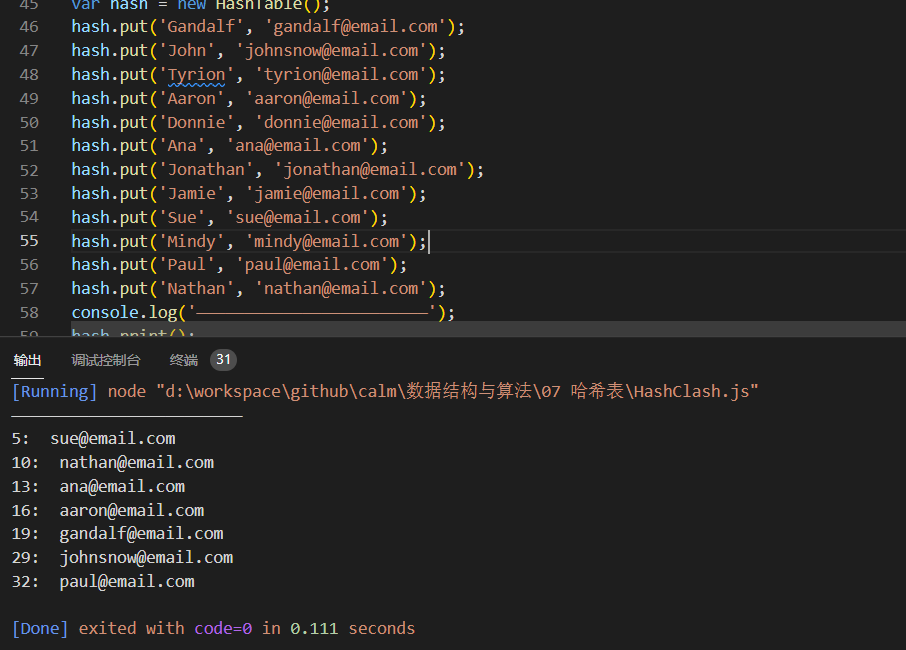

# 哈希表/散列表

## 哈希表的定义
```
使用散列函数，就知道值的具体位置,能够快速检索到该值。散列函数的作用是给定一个键值, 然后返回值在表中的地址。
```

## 哈希表的作用
```
数组虽然查找和修改数据数据的值效率很快，但是删除和新增数组的操作很消耗性能
    1. 而哈希表可以提供快速的插入-删除-查找操作
    2. 无论多少数据，哈希表的插入与删除操作需要的时间都是O(1)。
    3. 哈希表的速度比树还要快，基本可以瞬间查找到想要的元素
```

## 哈希表的缺点
```
哈希表中的数据是没有顺序的，所以不能以一种固定的顺序去遍历所有的元素
通常情况下，哈希表的键key是不允许重复的，不能用相同的key去存不同的value。
```

## 创建更好的哈希算法
```
一个表现良好的散列函数是由几个方面构成的:插人和检索元素的时间(即性能)，当然也包括较低的冲突可能性。我们可以在网上找到一些不同的实现方法，或者也可以实现自己的散列函数。
1. 好的哈希函数应该尽可能让计算的过程变得简单，提供计算的效率
    1.1 哈希表的主要优点就是它的速度快，所以哈希函数速度很慢，那么将毫无意义
    1.2 提高速度的一个方法就是让哈希函数中尽可能的少出现乘法和除法，因为这两种操作性能比较低
2. 哈希函数看重
    2.1 速度快慢
    2.2 值分布是否均匀
```

```js
    // 这并不是最好的散列函数，但这是最被社区推荐的散列函数之一 。
    const djb2HashCode = function (key) { 
    let hash = 5381; 
    for (let i = 0; i < key.length; i++) { 
        hash = hash * 33 + key.charCodeAt(i); 
    } 
    return hash % 1013;
}; 
```


## 哈希表的封装

### 基于数组
```js
const HashTable = function() {
    this.table = [];

    //散列函数,计算传进来的值的ASCLL码的之和
    const hashFunction = function(key) {
        let hash = 0;
        for (let i = 0; i < key.length; i++) {
            hash += key.charCodeAt(i);
        }
        return hash % 37;
    };

    // 向散列表中添加元素
    HashTable.prototype.put = function(key, value) {
        const hash = hashFunction(key);
        this.table[hash] = value;
    };

    // 从散列表中查找一个值
    HashTable.prototype.get = function(key) {
        return this.table[hashFunction(key)];
    };

    // 清空散列表
    HashTable.prototype.clear = function() {
        this.table = [];
    };

    // 移除散列表中的一个元素
    HashTable.prototype.remove = function(key) {
        this.table[hashFunction(key)] = undefined;
    };

    // 输出散列表中所有的元素
    HashTable.prototype.print = function() {
        for (let i = 0; i < this.table.length; i++) {
            /*在创建稀疏数组时，会存在一些空白单元JavaScript会将这些空白单元隐式的赋值为undefined（但这与将其显式赋值为 undefined是有所区别的）这个过程并且会影响length的值*/
            if (this.table[i] !== undefined) {
                console.log(i + ':  ' + this.table[i]);
            }
        }
    }
}
```

### 基于链表
```js

```

## 解决哈希表的冲突

### 哈希冲突
```js
const HashTable = function() {
    this.table = [];

    //散列函数,计算传进来的值的ASCLL码的之和
    const hashFunction = function(key) {
        let hash = 0;
        for (let i = 0; i < key.length; i++) {
            hash += key.charCodeAt(i);
        }
        return hash % 37;
    };

    // 向散列表中添加元素
    HashTable.prototype.put = function(key, value) {
        const hash = hashFunction(key);
        this.table[hash] = value;
    };

    // 从散列表中查找一个值
    HashTable.prototype.get = function(key) {
        return this.table[hashFunction(key)];
    };

    // 清空散列表
    HashTable.prototype.clear = function() {
        this.table = [];
    };

    // 移除散列表中的一个元素
    HashTable.prototype.remove = function(key) {
        this.table[hashFunction(key)] = undefined;
    };

    // 输出散列表中所有的元素
    HashTable.prototype.print = function() {
        for (let i = 0; i < table.length; i++) {
            /*在创建稀疏数组时，会存在一些空白单元JavaScript会将这些空白单元隐式的赋值为undefined（但这与将其显式赋值为 undefined是有所区别的）这个过程并且会影响length的值*/
            if (this.table[i] !== undefined) {
                console.log(i + ':  ' + this.table[i]);
            }
        }
    }
}

var hash = new HashTable();
hash.put('Gandalf', 'gandalf@email.com');
hash.put('John', 'johnsnow@email.com');
hash.put('Tyrion', 'tyrion@email.com');
hash.put('Aaron', 'aaron@email.com');
hash.put('Donnie', 'donnie@email.com');
hash.put('Ana', 'ana@email.com');
hash.put('Jonathan', 'jonathan@email.com');
hash.put('Jamie', 'jamie@email.com');
hash.put('Sue', 'sue@email.com');
hash.put('Mindy', 'mindy@email.com');
hash.put('Paul', 'paul@email.com');
hash.put('Nathan', 'nathan@email.com');
console.log('————————————————————————');
hash.print();
```

```
当内部的哈希函数返回的下标冲突时，值会发生覆盖，之前传入的值会丢失
```



### 解决哈希冲突方法1--分离链接

```js
/* 
    方法1，分离链接
    分离链接法包括为散列表的每一个位置创建一个链表并将元索存储在里面。它是解决冲突的
最简单的方法，但是它在HashTable实例之外还需要额外的存储空间。
*/
// 使用链表加数组来解决哈希冲突
const HashTable = function() {
    this.table = [];

    //散列函数,计算传进来的值的ASCLL码的之和
    const hashFunction = function(key) {
        let hash = 0;
        for (let i = 0; i < key.length; i++) {
            hash += key.charCodeAt(i);
        }
        return hash % 37;
    };

    // 向散列表中添加元素
    HashTable.prototype.put = function(key, value) {
        const hash = hashFunction(key);
        if (this.table[hash] === undefined) {
            this.table[hash] = new LikedList();
        }
        this.table[hash].append(value);
    };

    // 从散列表中查找一个值(根据键名)
    HashTable.prototype.get = function(key) {
        const hash = hashFunction(key);
        if (this.table[hash] === undefined) {
            return false;
        } else {
            // 应该得到整个链表，后续在链表中加入返回所有值的方法
            return this.table[hash];
        }
    };

    // 清空散列表
    HashTable.prototype.clear = function() {
        this.table = [];
    };

    // 移除散列表中的一个元素(根据键名)
    HashTable.prototype.remove = function(key) {
        this.table[hashFunction(key)] = undefined;
    };

    // 输出散列表中所有的元素
    HashTable.prototype.print = function() {
        for (let i = 0; i < this.table.length; i++) {
            /*在创建稀疏数组时，会存在一些空白单元JavaScript会将这些空白单元隐式的赋值为undefined（但这与将其显式赋值为 undefined是有所区别的）这个过程并且会影响length的值*/
            if (this.table[i] !== undefined) {
                console.log(i + ":  " + this.table[i].getHead());
            }
        }
    };
};

let hashtable = new HashTable();
hashtable.put("a", 1);
hashtable.put("c", 2);
hashtable.put("b", 3);
hashtable.print();
console.log(hashtable.get("a"));
console.log(hashtable.get("b"));
console.log(hashtable.get("c"));
hashtable.remove("a");
hashtable.print();
hashtable.clear();
hashtable.print();
```

### 解决哈希冲突方法2--线性探查
```js
/* 
    方法2，线性探查
    当想向表中某个位置加入一个新元素的时候，如果索引
为index的位置已经被占据了，就尝试index+1的位置。如果index+1的位置也被 占据了，就尝试index+2的位置，以此类推。
    在js中，我们不需要像其它语言一样担心数组的长度超出可用范围，需要手动扩容。因为js的数组会自动扩容，但是会影响性能，所以需要好好
设计一下，数组的初始长度给多大，一次扩容多少，这些问题较为复杂，目前还没有水平去深入-__-
*/
const HashTable = function() {
    this.table = [];

    //散列函数,计算传进来的值的ASCLL码的之和
    const hashFunction = function(key) {
        let hash = 0;
        for (let i = 0; i < key.length; i++) {
            hash += key.charCodeAt(i);
        }
        return hash % 37;
    };

    // 向散列表中添加元素
    HashTable.prototype.put = function(key, value) {
        let hash = hashFunction(key);
        while (this.table[hash] !== undefined) {
            hash++;
        }
        this.table[hash] = value;
    };

    // 从散列表中查找一个值(根据键名)
    HashTable.prototype.get = function(key) {
        const hash = hashFunction(key);
        if (this.table[hash] === undefined) {
            return false;
        } else {
            return this.table[hash];
        }
    };

    // 清空散列表
    HashTable.prototype.clear = function() {
        this.table = [];
    };

    // 移除散列表中的一个元素(根据键名)
    HashTable.prototype.remove = function(key) {
        this.table[hashFunction(key)] = undefined;
    };

    // 输出散列表中所有的元素
    HashTable.prototype.print = function() {
        for (let i = 0; i < this.table.length; i++) {
            /*在创建稀疏数组时，会存在一些空白单元JavaScript会将这些空白单元隐式的赋值为undefined（但这与将其显式赋值为 undefined是有所区别的）这个过程并且会影响length的值*/
            if (this.table[i] !== undefined) {
                console.log(i + ":  " + this.table[i]);
            }
        }
    };
};

let hashtable = new HashTable();
hashtable.put("a", 1);
hashtable.put("c", 2);
hashtable.put("b", 3);
hashtable.print();
console.log(hashtable.get("a"));
console.log(hashtable.get("b"));
console.log(hashtable.get("c"));
hashtable.remove("a");
hashtable.print();
hashtable.clear();
hashtable.print();
```