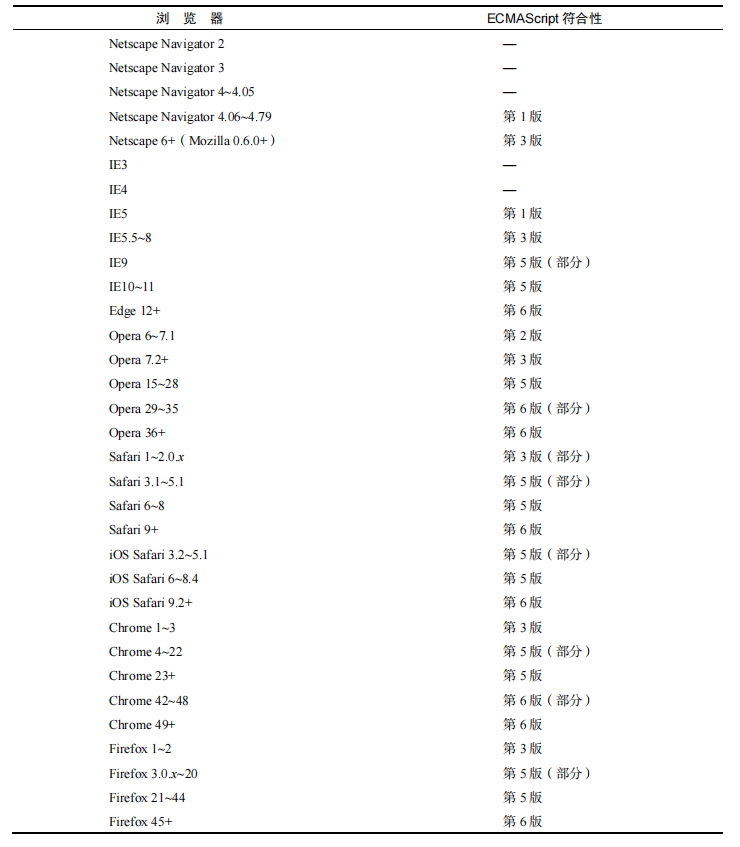
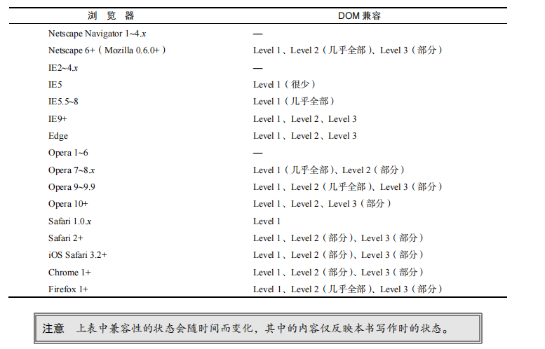

总结：第一章没有什么太多需要特别记忆的，讲的都是JavaScript的发展，与浏览器的兼容，标准的制定等等。总结下来的知识点如下
1. 五大浏览器（IE，Chrome，Safari，Firefox，Opera）

2. JavaScript由ECMAScript、DOM、BOM组成

3. ECMAScript是JavaScript的标准规范了这门语言最基础的部分，DOM是网页DOM树操作节点和内容，BOM是操作浏览器（如：回退、刷新...）

4. 各大浏览器对ECMAScript的兼容性

   

5. 各大浏览器去DOM的支持度

   

6. 各大浏览器对BOM的支持各不相同，现如今还没有统一的标准。