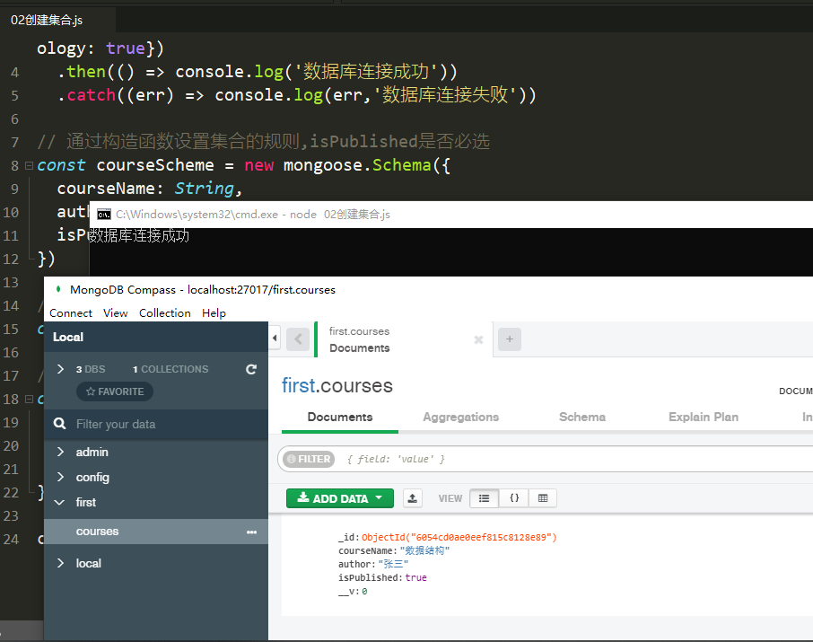
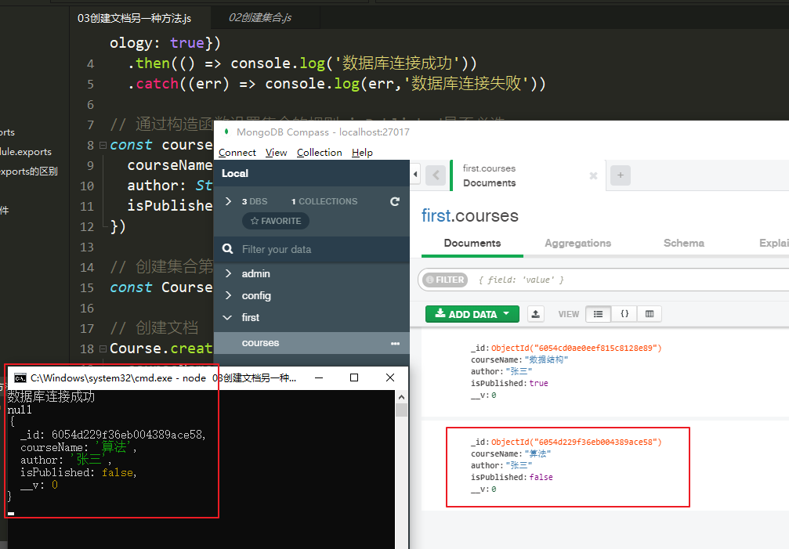
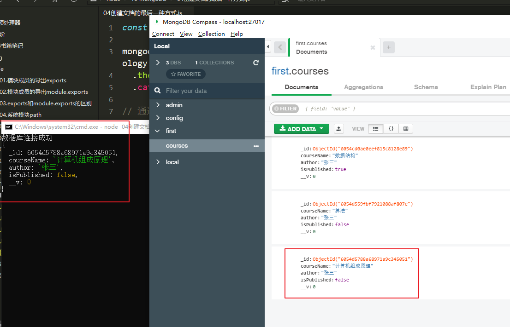
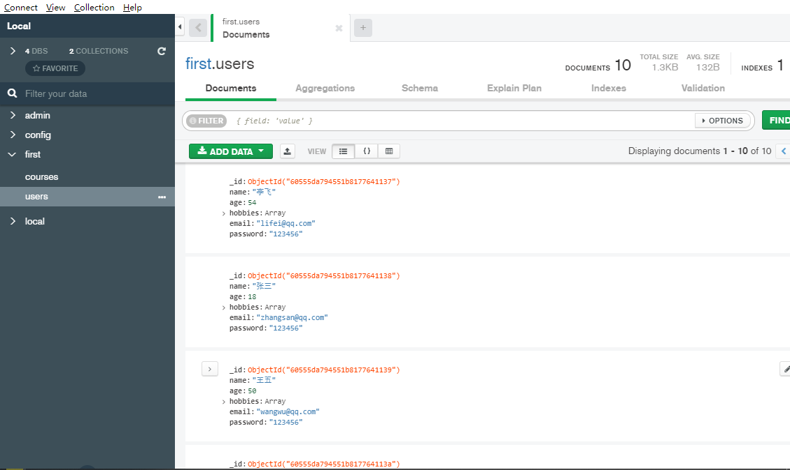
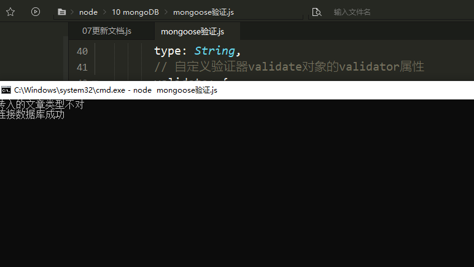

# MongoDB的前置知识

## 为什么要使用数据库

1、动态网站中的数据都是存储在数据库中的
2、数据库可以用来持久存储客户端通过表单收集的用户信息
3、数据库软件本身可以对数据进行效的管理

## 什么是数据库

数据库即存储数据的仓库，可以将数据进行有序的分i别类的存储。它是独立于语言之外的软件，可以通过API去操作它。

## 下载MongoDB

下载网址：[https://www.mongodb.com/download-center/community](https://www.mongodb.com/download-center/community)

## 下载可视化软件compass

MongoDB安装时勾选下载安装

也可以直接访问[https://www.mongodb.com/try/download/tools](https://www.mongodb.com/try/download/tools)下载安装速度更快

## 数据库的相关概念

在一个数据库软件中可以包含多个数据仓库database,在每个数据仓库中可以包含多个数据集合collection,每个数据集合中可以包含多条文档(具体的数据)document。数据的属性又称为字段field     可以理解了js文件，文件的构造函数，实例对象，对象的属性

## 在node中操作mongoDB的模块Mongoose

npm install mongoose下载

## 启动、关闭MongoDB

管理员的身份开启命令行（搜索cmd，右键） net start mongoDB 启动    net stop mongoDB 关闭  不然权限不够

## 连接数据库

使用mongoDB的connect方法连接

```JavaScript
const mongoose = require('mongoose');

// first是数据库的名称，没有这个数据库就会自动创建这个数据库
mongoose.connect('mongodb://localhost/first',{ useNewUrlParser: true, useUnifiedTopology: true})
  .then(() => console.log('数据库连接成功'))
  .catch((err) => console.log(err,'数据库连接失败'))
```


## 创建数据库

在MongoDB中不需要显示的创建数据库，如果正在使用的数据库不存在，MongoDB会自动创建

# MongoDB增删改查操作

！！！ 数据库相关的方法返回值都是一个promise对象，在函数中使用的时候需要使用await接收这个promise对象，并给这个函数添加async

## 创建集合

## 创建文档

创建集合分为两步，一是对对集合设定规则， 二是创建集合，创建mongoose.Schema构造函数的实例即可创建集合。

集合中没有文档，集合就不会显示

```JavaScript
const mongoose = require('mongoose');

mongoose.connect('mongodb://localhost/first',{ useNewUrlParser: true, useUnifiedTopology: true})
  .then(() => console.log('数据库连接成功'))
  .catch((err) => console.log(err,'数据库连接失败'))

// 通过构造函数设置集合的规则,isPublished是否必选
const courseScheme = new mongoose.Schema({
  courseName: String,
  author: String,
  isPublished: Boolean
})

// 创建集合第一个Course是集合构造函数，第二个Course是集合的名称
const Course = mongoose.model('Course',courseScheme);

// 创建文档
const course1 = new Course({
  courseName: '数据结构',
  author: '张三',
  isPublished: true
})

course1.save();
```




## 创建文档另一种方法

创建文档实际上就是向集合中插入数据，分为两步：1、创建集合实例2、调用实例对象下的save方法将数据保存在数据库中

```JavaScript
const mongoose = require('mongoose');

mongoose.connect('mongodb://localhost/first',{ useNewUrlParser: true, useUnifiedTopology: true})
  .then(() => console.log('数据库连接成功'))
  .catch((err) => console.log(err,'数据库连接失败'))

// 通过构造函数设置集合的规则,isPublished是否必选
const courseScheme = new mongoose.Schema({
  courseName: String,
  author: String,
  isPublished: Boolean
})

// 创建集合第一个Course是集合构造函数，第二个Course是集合的名称
const Course = mongoose.model('Course',courseScheme);

// 创建文档
Course.create({
  courseName: '算法',
  author: '张三',
  isPublished: false
},(err,doc) => {
  console.log(err);
  // 输出添加的数据
  console.log(doc);
})
```




## 创建文档的最后一种方式

```JavaScript
const mongoose = require('mongoose');

mongoose.connect('mongodb://localhost/first',{ useNewUrlParser: true, useUnifiedTopology: true})
  .then(() => console.log('数据库连接成功'))
  .catch((err) => console.log(err,'数据库连接失败'))

// 通过构造函数设置集合的规则,isPublished是否必选
const courseScheme = new mongoose.Schema({
  courseName: String,
  author: String,
  isPublished: Boolean
})

// 创建集合第一个Course是集合构造函数，第二个Course是集合的名称
const Course = mongoose.model('Course',courseScheme);

// 创建文档
Course.create({
  courseName: '计算机组成原理',
  author: '张三',
  isPublished: false
}).then((doc) => console.log(doc)).catch((err) => console.log(err))
```




## MongoDB数据库导入数据

mongoimport -d数据库名称 -c 集合名称  - -file 要导入的数据文件

安装的时候如果是默认路径，那么就找到C:\Program Files\MongoDB\Server\4.4\bin 下查找有没有mongoimport.exe 工具,如果缺少就去[https://www.mongodb.com/try/download/database-tools?tck=docs_databasetools](https://www.mongodb.com/try/download/database-tools?tck=docs_databasetools)网址下载包，再将包下bin目录下的工具复制粘贴到C:\Program Files\MongoDB\Server\4.4\bin 然后右击我的电脑→属性→高级系统设置→环境变量→系统变量path→添加到C:\Program Files\MongoDB\Server\4.4\bin

示例：找到文件目录shift+右键打开powershell输入 mongoimport -d first -c users --file .\导入数据库的文档.json



## 查询文档

```JavaScript
const mongoose = require('mongoose');

mongoose.connect('mongodb://localhost/first', {
    useNewUrlParser: true,
    useUnifiedTopology: true
  })
  .then(() => console.log('连接数据库成功'))
  .catch(err => console.log(err, '连接数据库失败'))

const UserSchema = new mongoose.Schema({
  name: String,
  age: Number,
  hobbies: [String],
  email: String,
  password: String
});

const User = mongoose.model('User', UserSchema);

/*
// find()中不加判断条件是查询全部
User.find().then(doc => console.log(doc));
*/

/*// 根据_id唯一标识查询
User.find({_id:'60555da794551b8177641137'}).then(doc => console.log(doc));
*/

/*// 返回查询到的第一个数据对象(原始数据中有两个user的age是67)
 
*/

/*// 匹配大于小于
User.find({age: {$gt:20,$lt:60}}).then(doc => console.log(doc));
*/

/*// 匹配包含
User.find({hobbies: {$in: ['唱歌']}}).then(doc => console.log(doc));
*/

/*// 选择要查询的字段"属性"
User.find().select('name age -_id').then(doc => console.log(doc));
*/

/*// 按照年龄进行升序排列
User.find().sort('age').then(doc => console.log(doc));
*/

/*// 按照年龄进行降序排列
User.find().sort('-age').then(doc => console.log(doc));
*/

// skip跳过多少条数据，limit限制查询数量，一般搭配sort使用
User.find().skip(2).limit(2).then(doc => console.log(doc));
```


## 删除文档

```JavaScript
const mongoose = require('mongoose');

mongoose.connect('mongodb://localhost/first', {
    useNewUrlParser: true,
    useUnifiedTopology: true
  })
  .then(() => console.log('连接数据库成功'))
  .catch(err => console.log(err, '连接数据库失败'))

const UserSchema = new mongoose.Schema({
  name: String,
  age: Number,
  hobbies: [String],
  email: String,
  password: String
});

const User = mongoose.model('User', UserSchema);

/*// 匹配多个删除单个文档
User.findOneAndDelete({_id: '60555da794551b8177641137'}).then(doc => console.log(doc));
*/

// 删除多个,不加条件全部删除，慎重操作
User.deleteMany({age: '67'}).then(doc => console.log(doc));
// 返回值：{ n: 2, ok: 1, deletedCount: 2 }
```


## 更新文档

```JavaScript
const mongoose = require('mongoose');

mongoose.connect('mongodb://localhost/first', {
    useNewUrlParser: true,
    useUnifiedTopology: true
  })
  .then(() => console.log('连接数据库成功'))
  .catch(err => console.log(err, '连接数据库失败'))

const UserSchema = new mongoose.Schema({
  name: String,
  age: Number,
  hobbies: [String],
  email: String,
  password: String
});

const User = mongoose.model('User', UserSchema);

/*// 更新集合中的一条文档
User.updateOne({name: '张三'},{name: '张傻'}).then(doc => console.log(doc));
// 返回值{ n: 0, nModified: 0, ok: 1 }
*/

// 更想集合中多条文档,第一个对象为空就是全部匹配
User.updateMany({password: '123456'},{password: '654321'}).then(doc => console.log(doc));
// 返回值{ n: 7, nModified: 7, ok: 1 }ok为1就是成功
```


## mongoose验证

```JavaScript
const mongoose = require('mongoose');

mongoose.connect('mongodb://localhost/first',{useNewUrlParser: true, useUnifiedTopology: true})
  .then(() => console.log('连接数据库成功'))
  .catch(err => console.log(err,'连接数据库失败'))
  
const newsSchema = new mongoose.Schema({
    title: {
        type: String,
        require: [true, '请传入文章标题'],
        minlength: [2, '输入长度不能小于2'],
        maxlength: [5, '输入长度不能大于5'],
        //不允许有空格
        trim: true
    },
    age: {
        type: Number,
        //数字得最小范围
        min: 18,
        //数字得最大范围
        max: 100
    },
    // 当前时间
    publishDate: {
        type: Date,
        default: Date.now
    },
    // 枚举值判断是否在这些值的范围中
    category: {
        type: String,
        enum: {
            values: ['科学', '文学', '天文'],
            // 自定义错误信息
            message: '传入的文章类型不对'
        },
 
    },
 
    author: {
        type: String,
        // 自定义验证器validate对象的validator属性
        validate: {
            validator: v => {
                //true 验证成功
                //false验证失败v.length>4
                return v && v.length >= 4
            },
            //自定义错误信息
            message: '传入的作者姓名长度小于4'
        }
    }
});

const News = mongoose.model('News',newsSchema);

News.create({title:'hhh',category:'ds'}).then(doc => console.log(doc));
```


## mongoose验证拿到错误信息

```JavaScript
const mongoose = require('mongoose');

mongoose.connect('mongodb://localhost/first',{useNewUrlParser: true, useUnifiedTopology: true})
  .then(() => console.log('连接数据库成功'))
  .catch(err => console.log(err,'连接数据库失败'))
  
const newsSchema = new mongoose.Schema({
    title: {
        type: String,
        require: [true, '请传入文章标题'],
        minlength: [2, '输入长度不能小于2'],
        maxlength: [5, '输入长度不能大于5'],
        //不允许有空格
        trim: true
    },
    age: {
        type: Number,
        //数字得最小范围
        min: 18,
        //数字得最大范围
        max: 100
    },
    // 当前时间
    publishDate: {
        type: Date,
        default: Date.now
    },
    // 枚举值判断是否在这些值的范围中
    category: {
        type: String,
        enum: {
            values: ['科学', '文学', '天文'],
            // 自定义错误信息
            message: '传入的文章类型不对'
        },
 
    },
 
    author: {
        type: String,
        // 自定义验证器validate对象的validator属性
        validate: {
            validator: v => {
                //true 验证成功
                //false验证失败v.length>4
                return v && v.length >= 4
            },
            //自定义错误信息
            message: '传入的作者姓名长度小于4或者不存在'
        }
    }
});

const News = mongoose.model('News',newsSchema);

News.create({title:'hhh',category:'ds'})
  .then(doc => console.log(doc))
  .catch(err => {
    // 拿到err对象的errors属性
    const errs = err.errors;
    // errors属性中有多个对象,每个错误对象中有message属性
    for(let i in errs) {
      console.log(errs[i]['message']);
    }
  })
```




## 集合关联

```
通常不同集合的数据之间是有关系的，例如文章信息和用户信息存储在不同集合中，但文章是某个用户发表的
要查询文章的所有信息包括发表用户,就需要用到集合关联。
使用id对集合进行关联
使用populate方法进行关联集合查询
```


```JavaScript
const mongoose = require('mongoose');

mongoose.connect('mongodb://localhost/first',{ useNewUrlParser: true ,useUnifiedTopology: true})
  .then(() => console.log('数据库连接成功'))
  .catch(err => console.log(err,'数据库连接失败'))
  
const userSchema = mongoose.Schema({
  name: String
})

const User = new mongoose.model('User',userSchema);

const newsSchema = mongoose.Schema({
  name: String,
  author: {
    type: mongoose.Schema.Types.ObjectId,
    ref: 'User'
  }
})

const News = new mongoose.model('News',newsSchema);

User.create({name: '张三'}).then(doc => console.log(doc))

News.create({name: '哈哈哈',author: '60557e977c226e37b46ae84c'}).then(doc => console.log(doc))

// 用populate查找对应作者的信息
News.find({name: '哈哈哈'}).populate('author').then(doc => console.log(doc))
```

