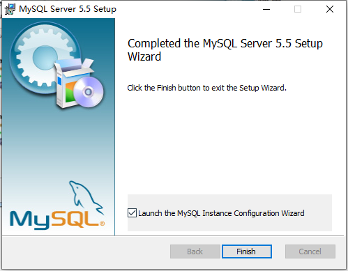
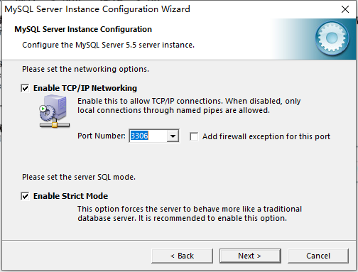
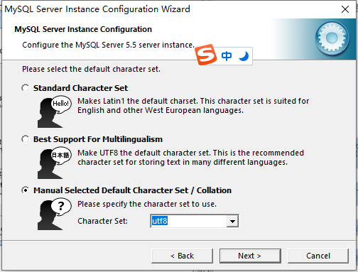
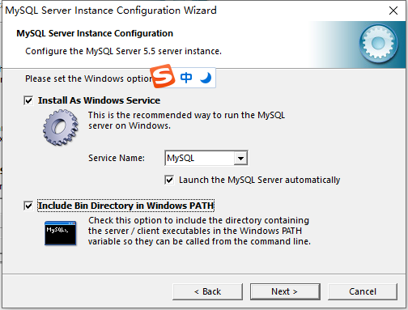
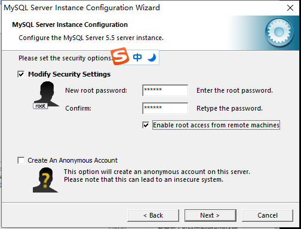
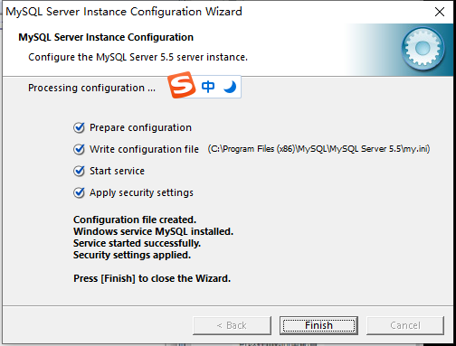

## 下载msi文件并点击安装标准版

勾选第一个，选择标准版

## 勾选进行MySQL配置

一直下一步，直到出现

需要记住MySQL的默认的端口号是3306，然后下一步

## 设置MySQL支持的编码为UTF-8字符集

## MySQL服务的默认名称为MySQL，勾选自动配置环境变量

## 设置MySQL数据库的超级管理员的密码设置为123456，超级管理员账号默认为root，勾选允许超级管理员外地远程访问，不勾选的话就只能本地访问

## 安装成功

