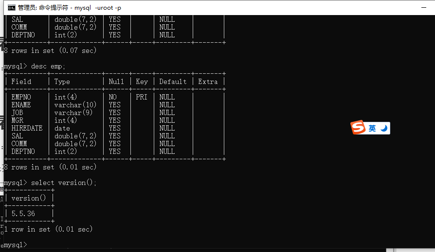
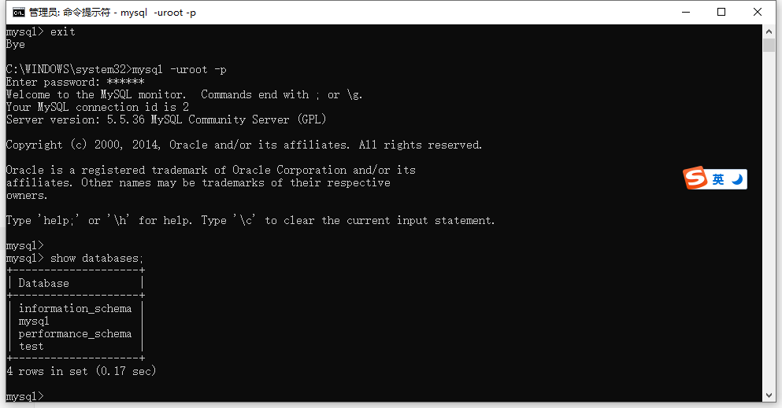
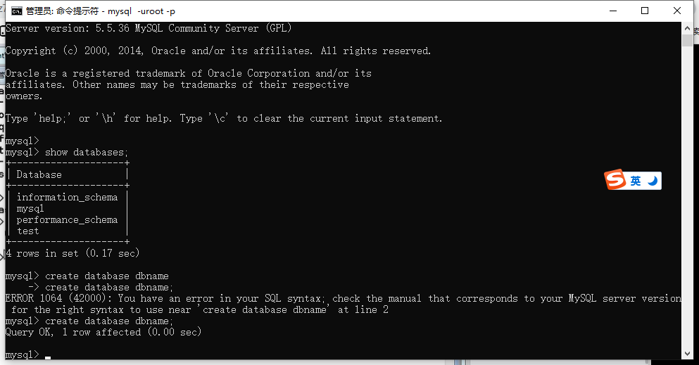
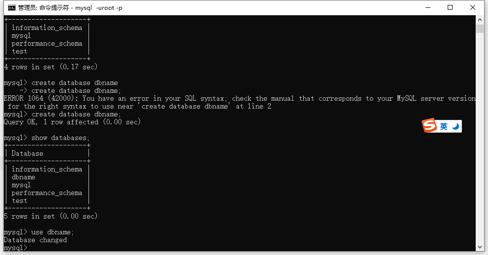
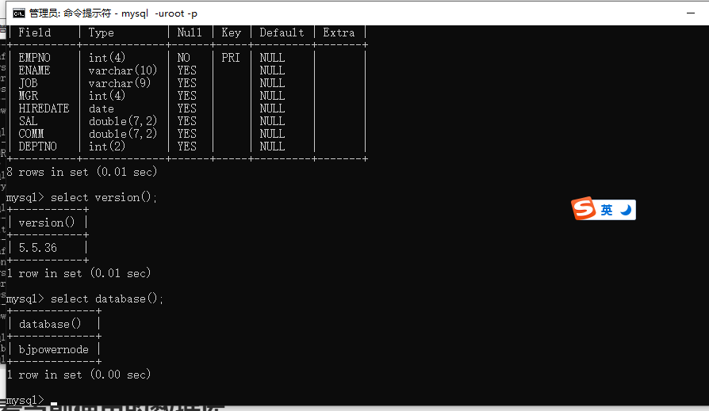
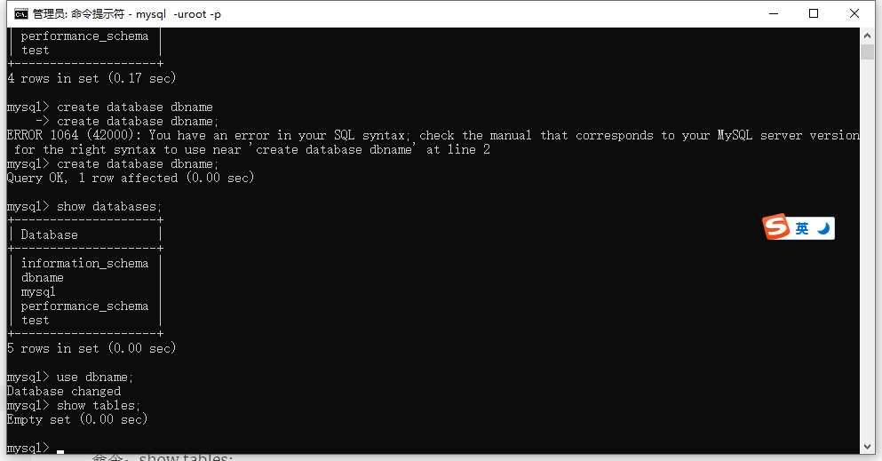
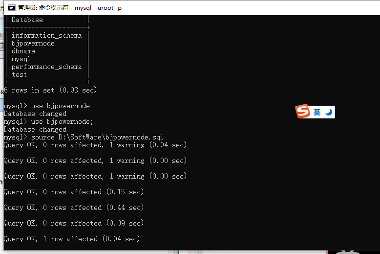
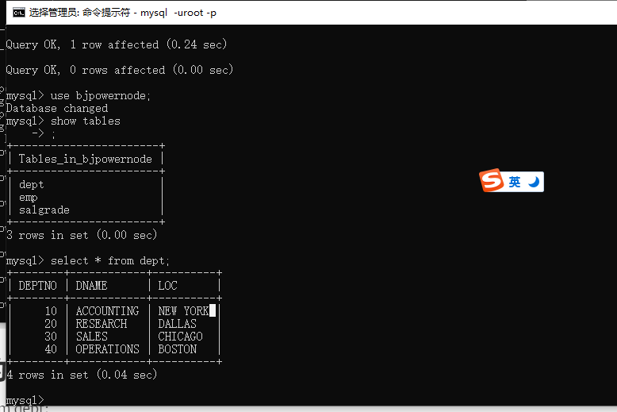
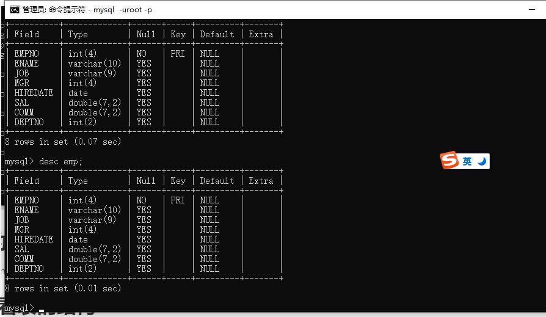
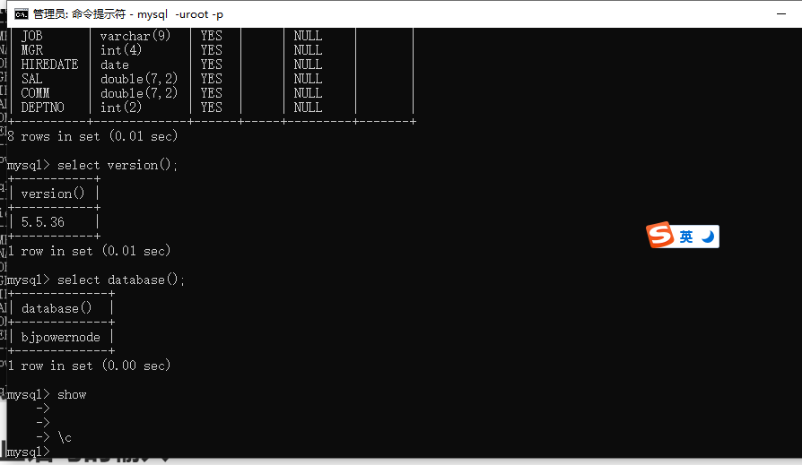

## 查看MySQL数据库的版本号

命令：

```mysql
select version();
```

注意：SQL语句不区分大小写



## 查看MySQL中有哪些数据库

命令：

```mysql
show databases;
```

(;)是英文分号



MySQL默认自带4个数据库

## 创建数据库

命令：

```mysql
create database dbname;
```



## 使用/进入数据库

命令：use 数据库的名称;



## 查看当前使用的数据库

命令：

```mysql
select database();
```



## 查看数据库中的表

命令：

```mysql
show tables;
```



## 导入数据或批量执行SQL语句

命令：

`shift+右键复制文件路径或者直接把文件拖到cmd窗口`

```mysql
source D:\SoftWare\bjpowernode.sql
```

注意：路径中不要有中文

以.sql结尾的文件中有批量的SQL语句，称为SQL脚本文件



## 查看表中的数据

命令：

```mysql
select * from dept;
```



## 查看表的结构(字段)

命令：desc 表名;或者describe 表名;



## 终止语句的输入

命令：\c


