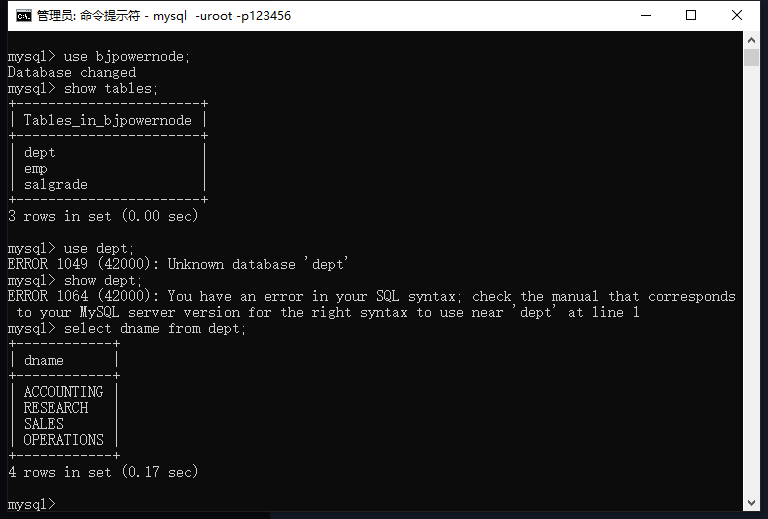
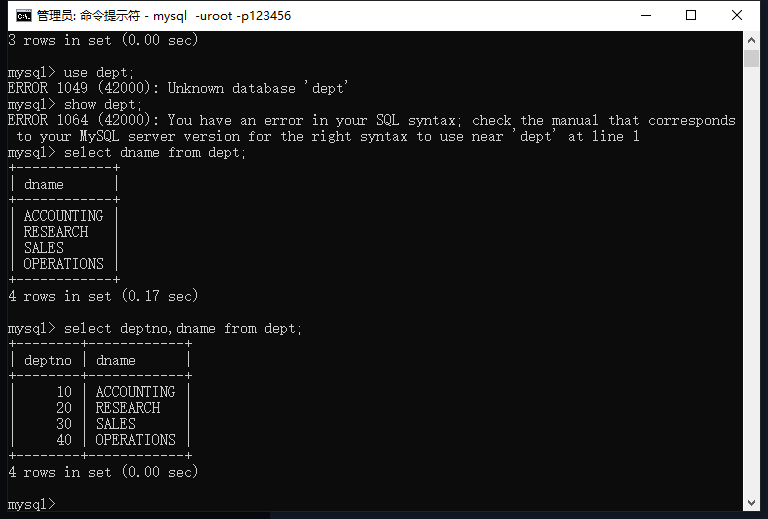
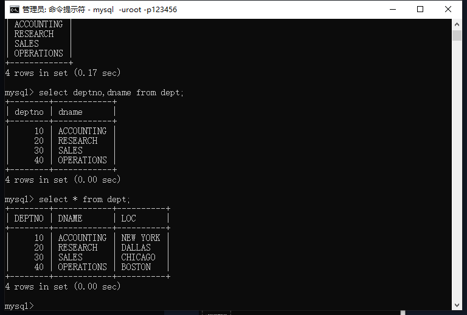
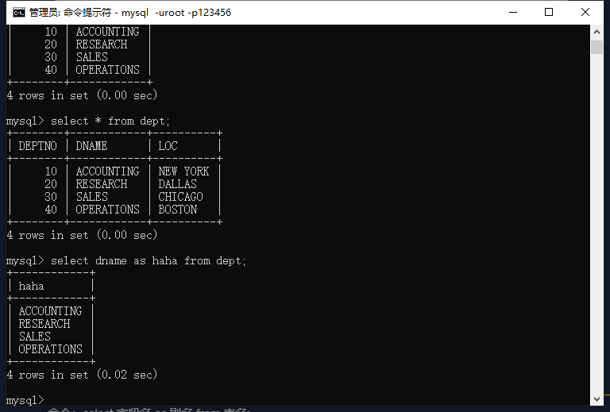
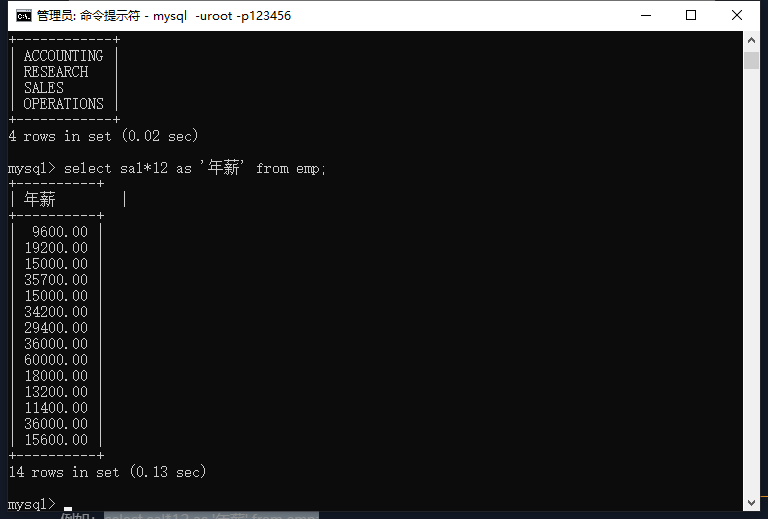

## 查询一个字段

命令：select 字段名 from 表名;



## 查询两个字段或者多个字段

命令：select 字段名,字段名 from 表名;



## 查询所有的字段

命令：select * from 表名;



## 给查询的字段起别名

命令：select 字段名 as 别名 from 表名;

注意：1、不会改变原表的字段名 2、as可以省略，省略处用逗号隔开 3、别名中有空格怎么办，使用单引号或者双引号（Oracle中识别不了双引号，推荐使用单引号）把含空格的别名包裹起来



## 字段名可以进行数学运算

例如：

```mysql
select sal*12 as '年薪' from emp;
```




