## 条件查询的基本格式

select

​	字段名1,字段名2,...

from

​	表名

where

​	条件;

## 条件有哪些?

### =等于

例如:

```mysql
select empno,ename from emp where sal = 3000;
```

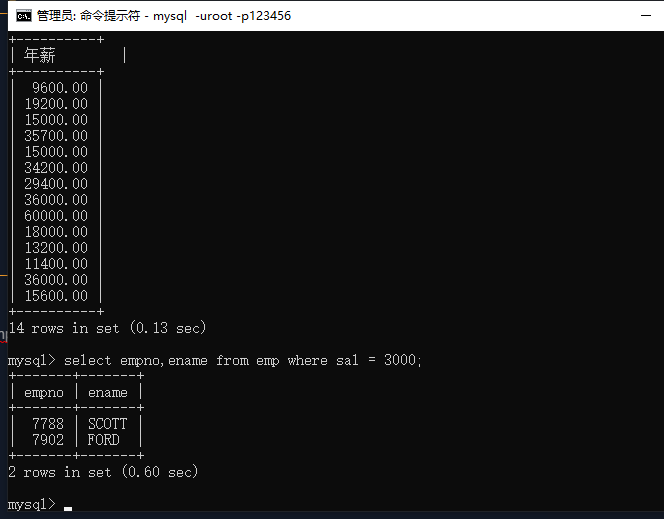

### <>或者!=不等于

例如：

```mysql
select empno,ename from emp where sal != 800;
```

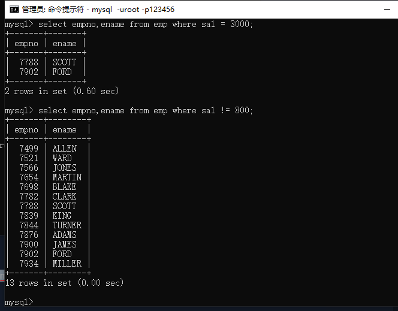

### < 小于

例如：

```mysql
select empno,ename,sal from emp where sal < 2000;
```

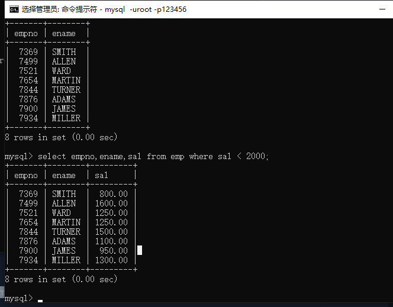

### <= 小于等于

例如：

```mysql
select empno,ename,sal from emp where sal <= 3000;
```

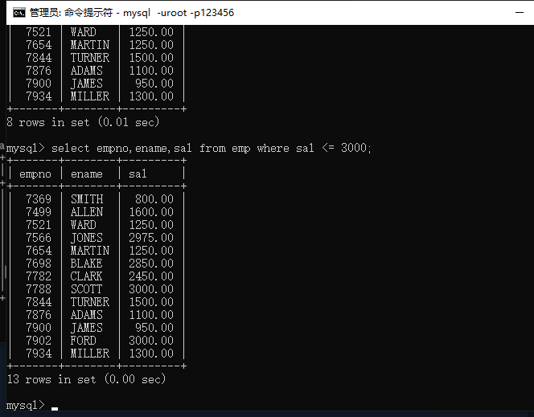

### > 大于

例如：

```mysql
select empno,ename,sal from emp where sal > 3000;
```

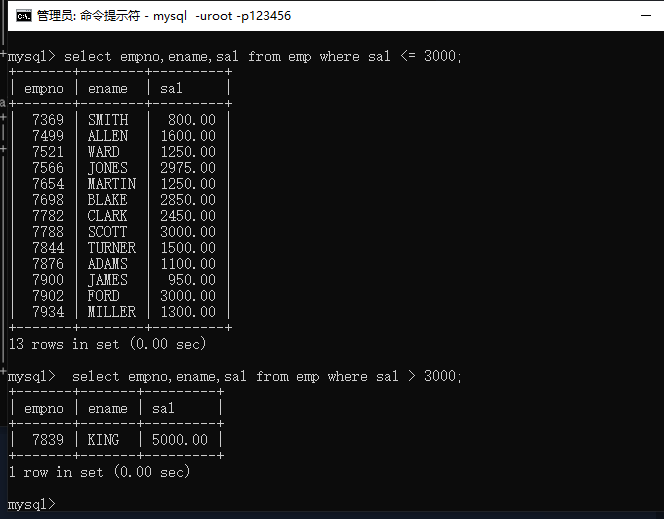

### >= 大于等于

例如：

```mysql
select empno,ename,sal from emp where sal >= 3000;
```

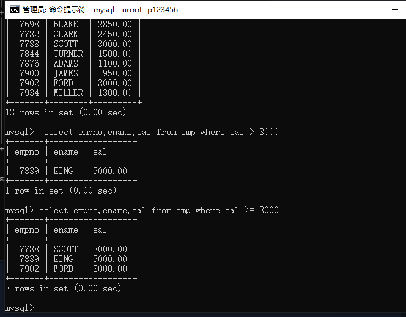

### between...and... 或者...>=... and ...<=... 两者之间

注意：包括两端的值

例如：

```mysql
select empno,ename,sal from emp where sal between 2450 and 3000;
```

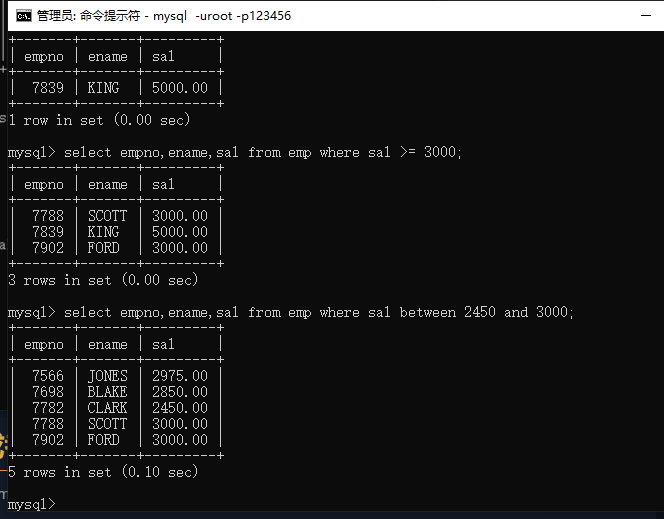

例如： 

```mysql
select empno,ename,sal from emp where sal >= 2450 and sal<= 3000;
```

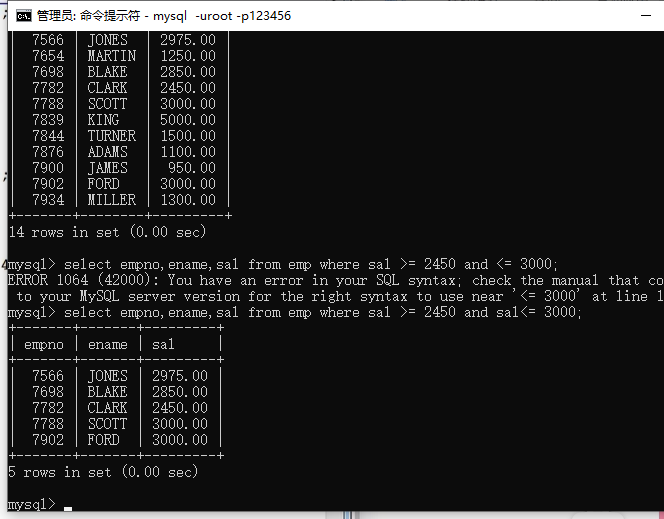

### is null 为空

例如： 

```mysql
select empno,ename,sal,comm from emp where comm is null;
```

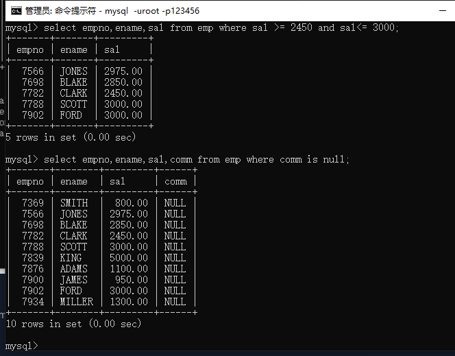

### is not null 不为null

例如：

```mysql
select empno,ename,sal,comm from emp where comm is not null;
```

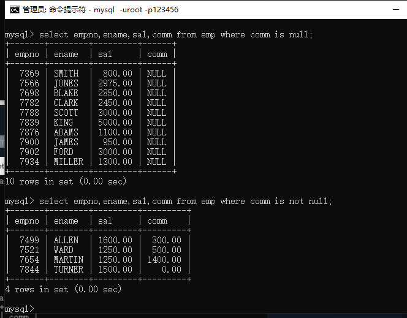

### and 并且

### or 或者

注意：and 和 or 同时出现的时候，and的优先级比or高，先执行and再执行or，要想or先执行可以使用小括号（）

例如：

```mysql
select empno,ename,job from emp where job= 'manager'or job = 'salesman';
```

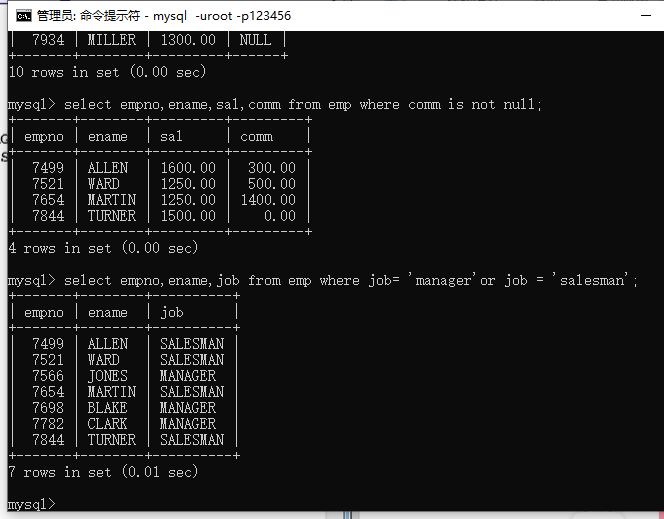

### in 包含

例如：

```mysql
select empno,ename,job from emp where job in('manager','salesman');
```

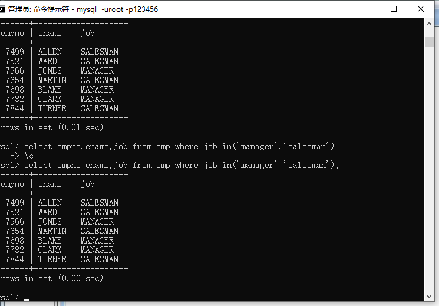

### not in 不包含


### not 取反 用在 in 和 is null 中


### 模糊查询

%匹配多个字符

_（下划线）匹配一个字符

例如：

```mysql
select ename from emp where ename like '%O%';
```

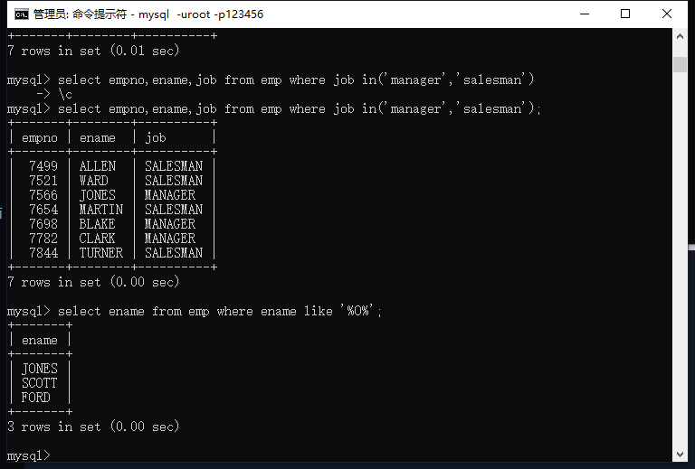

注意：如果要匹配含有_的应该使用转义符 '\ _'  （中间没有空格，Typora编辑器的原因会显示一个空格）

### distinct 去重

命令：

```mysql
select distinct job from emp;
```

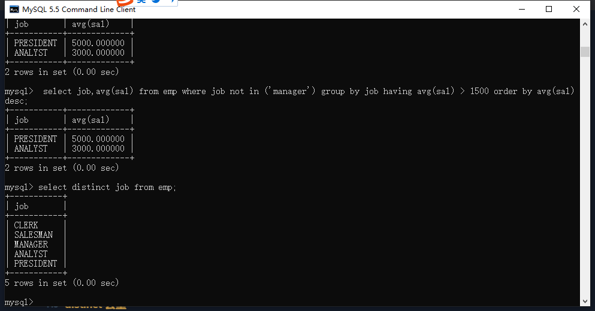

联合起来去重，多个字段都相同才去重命令：

```mysql
select distinct job,deptno from emp;
```

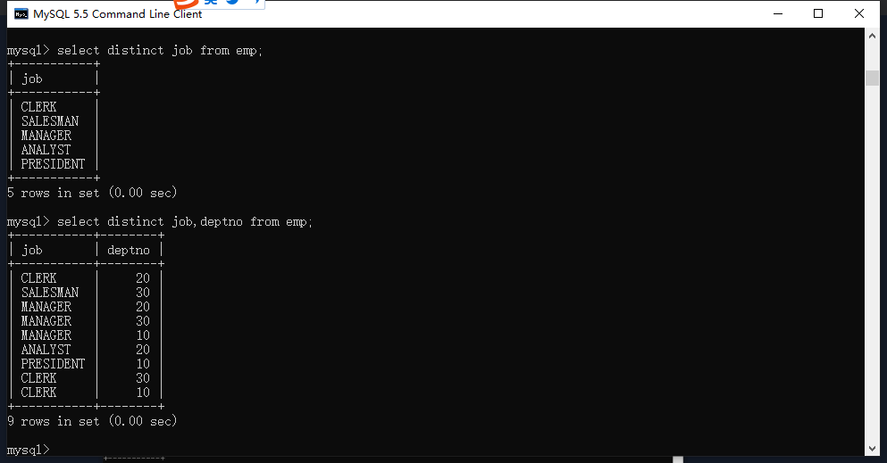

