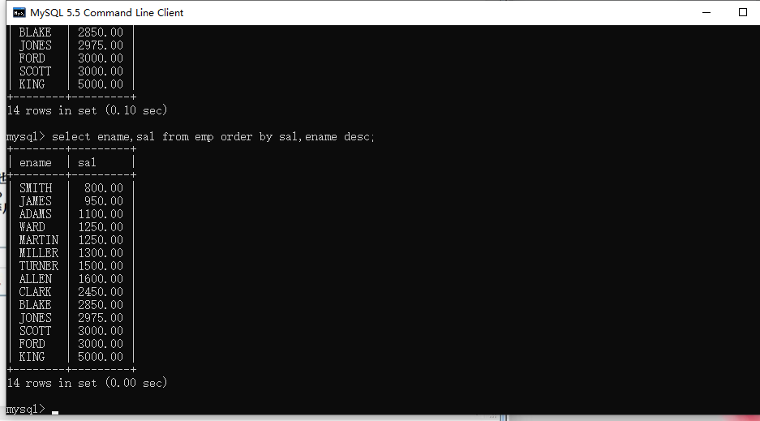
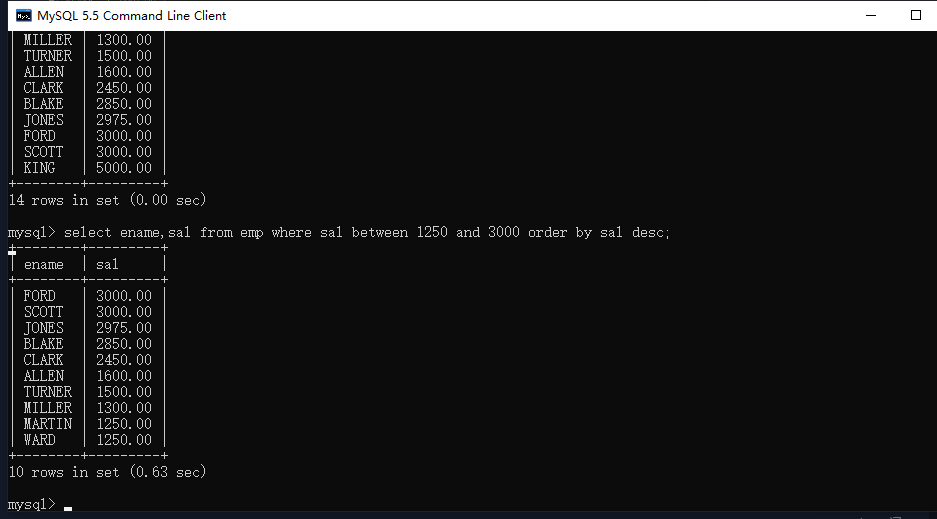

## 升序

命令：

```mysql
select ename,sal from emp order by sal;
```

或者 

```mysql
select ename,sal from emp order by sal asc;
```

注意：默认就是升序


## 降序

命令：

```mysql
select ename,sal from emp order by sal desc;
```


## 多个字段排序

命令：

```mysql
select ename,sal from emp order by sal,ename;
```

排序字段条件用逗号隔开，先按左边的排序，左边相等的时候，再按右一位的字段进行排序。可以给每个字段都添加是按升序还是按降序排列。如：select ename,sal from emp order by sal,ename desc;



## （了解即可）根据字段位置进行排序

命令：

```mysql
select ename,sal from emp order by 2;
```

注意：不推荐使用，因为字段的顺序可以改变，不利于维护。


## 综合案例

命令：

```mysql
select ename,sal from emp where sal between 1250 and 3000 order by sal desc;
```

注意：关键词的顺序不能变，select... from... where... order by...

关键词的执行顺序是1、from 2、where 3、select 4、order by 排序永远都是在最后面



