## 基本概念

数据处理函数又别称为单行处理函数。

### 单行处理函数的特点

一个输入对应一个输出，执行的时候，是对表格中的数据一行一行的进行函数执行。

### 与之对应的是多行处理函数特点

多个输入对应一个输出

## 单行处理函数

### lower() 将内容全部转小写

命令：

```mysql
select lower(ename) from emp;
```

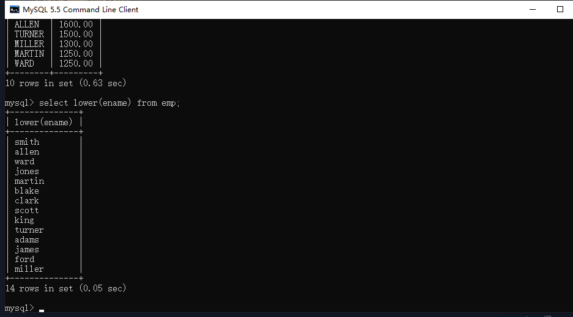

### upper() 将内容全部转换为大写


### substr（被截取的字符串，起始位置，截取的长度） 取子串

命令：

```mysql
select substr(ename,1,1) from emp;
```

注意：下标是从1开始

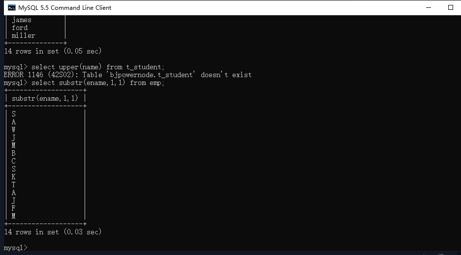

#### 再例如：select ename from emp where substr(ename,1,1) = 'A';

#### 等同于：select ename from emp where ename like 'A%';

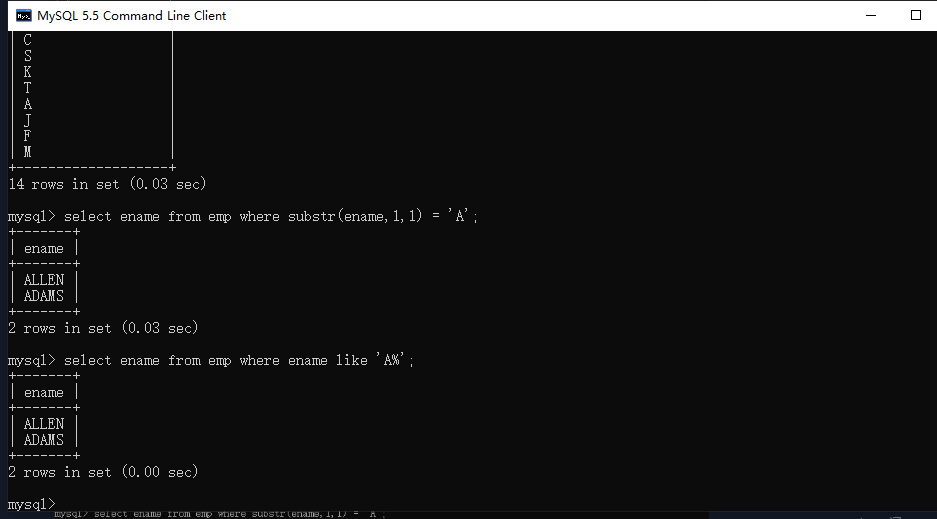

### concat() 字符串拼接

命令：

```mysql
select concat(ename,sal) from emp;
```

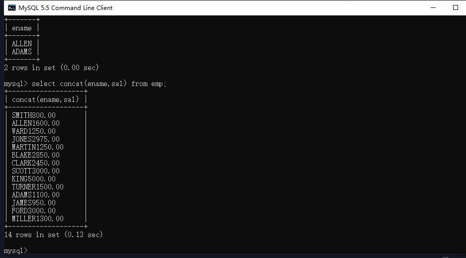

### length() 取长度

命令：

```mysql
select length(ename) from emp;
```

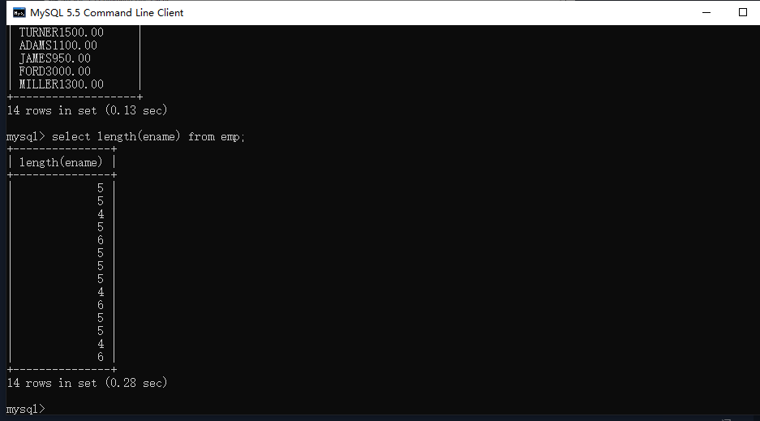

### trim() 去除左右空格

命令

```mysql
：select * from emp where ename = trim('     KING');
```

注意：实际中，trim中的内容是接收过来的变量

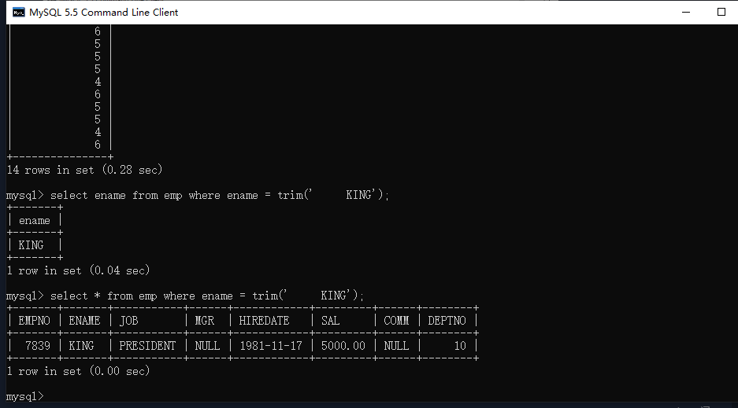

### round(待处理的数据,保留到多少位)

命令：

```mysql
select round(1234.567,2) from emp;
```

注意：1、select后面可以跟字段名，也可以跟字面量。当跟字面量时，会借助表的结构进行输出。

2、后面保留到的位数：2保留到小数位第二位；0保留到整数位；-1保留到十位

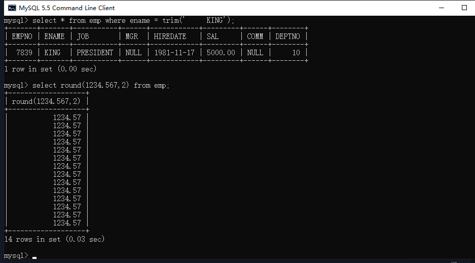

### rand() 生成0~1大小之间的随机数

命令：

```mysql
select rand() from emp;
```

注意：这里select后面也是字面量会借助表的结构

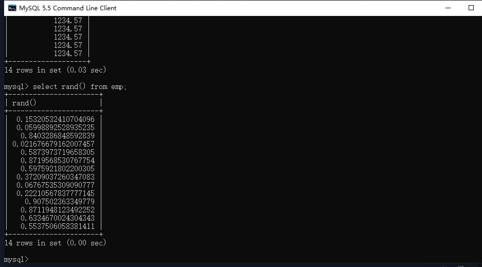

#### 小案例生成100以内的随机数

命令：

```mysql
select round(rand()*100,0) from emp;
```

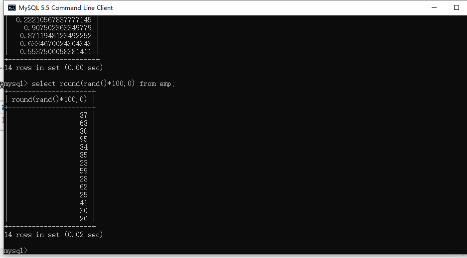

### ifnull(要判断的字段，当成的值) 可以将null 转换为一个具体的值

命令：

```mysql
select ename,sal+comm from emp;
```

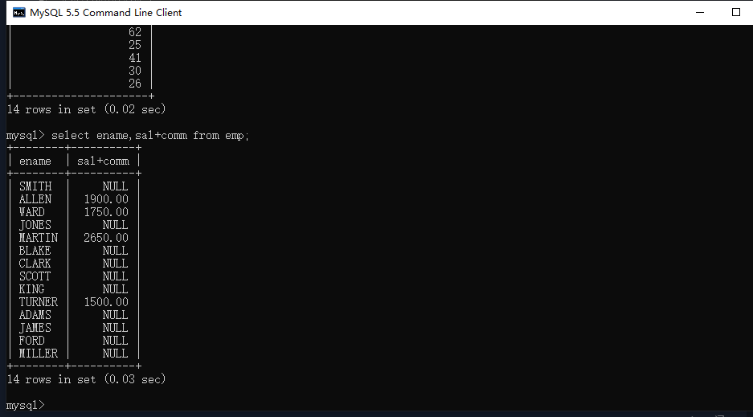

注意：在数据库中，null参与数学计算，结果都是null

#### 使用ifnull之后

命令：

```mysql
select ename,sal+ifnull(comm,0) from emp;
```

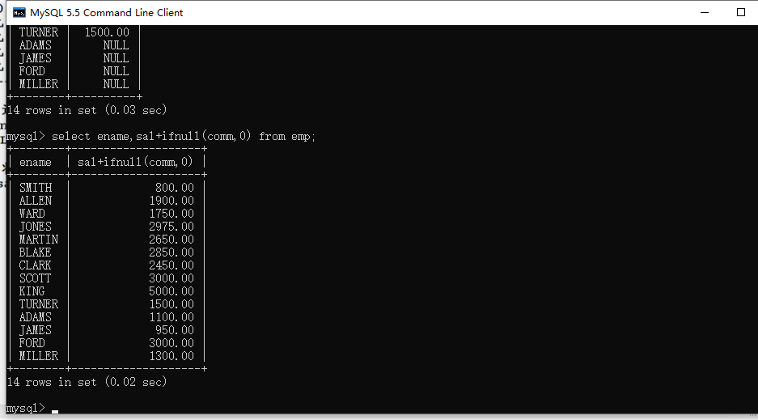

### case...when...then...when...then...else...end

当job是manager时工资x1.5，当job是clerk时工资x2，其它的不变

命令：

```mysql
select ename,job,sal as oldjob,(case job when 'manager' then sal * 1.5 when 'clerk' then sal * 2 else sal end) as newsal from emp;
```

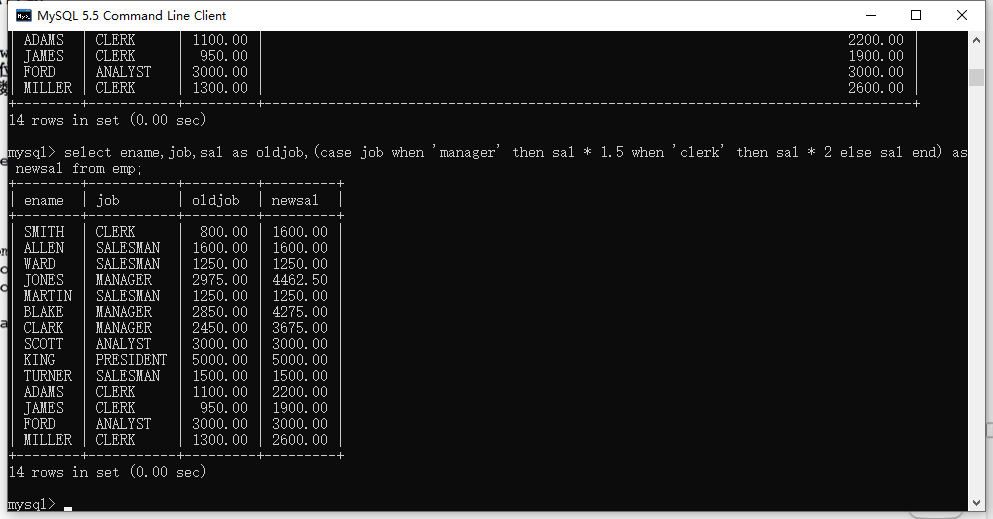

### format

数字格式化

命令：

```mysql
select ename,format(sal,'$999.999') as sal from emp;
```

显示千分位

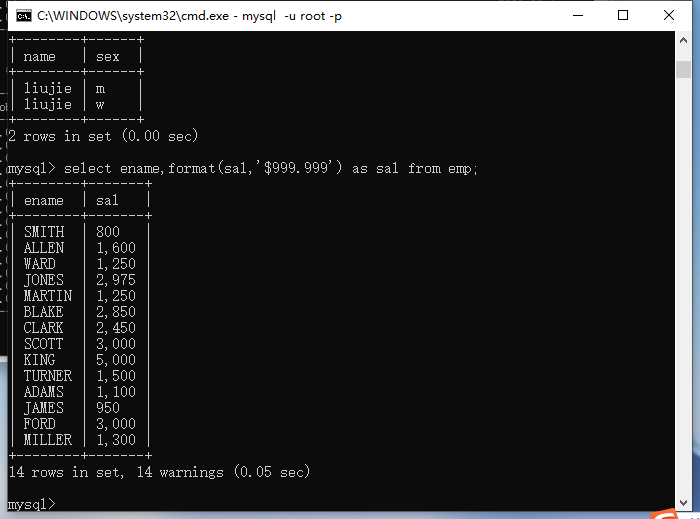

### str_to_date()

数据库命名规范：全部都是小写，单词与单词之间用下划线隔开

将字符串类型转换成日期类型

通常使用在insert里面，这两个函数在表的操作insert插入数据章节中有详细讲解

### date_format()

将日期转换成有格式的字符串


