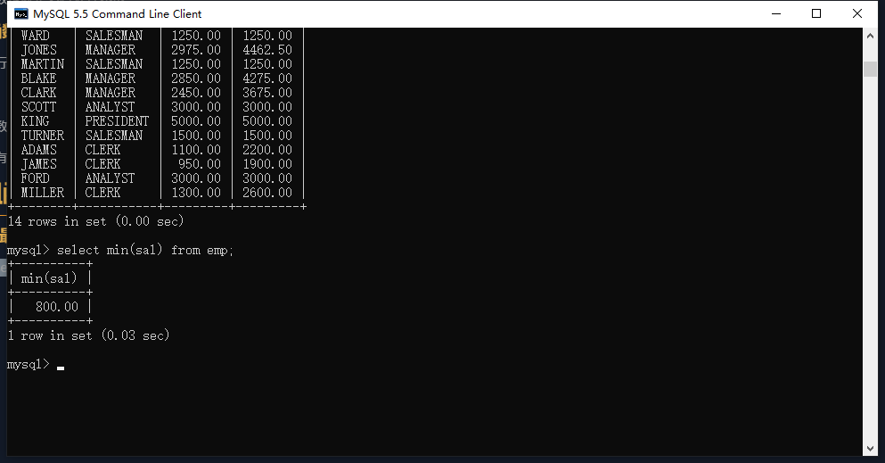
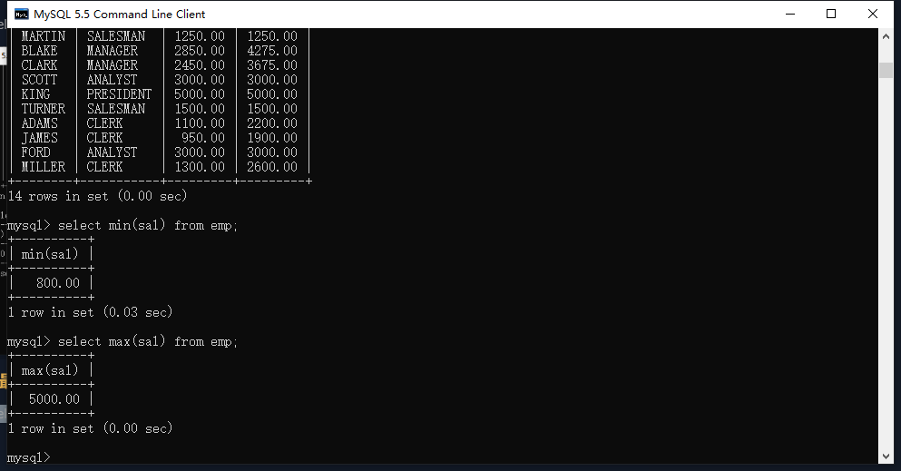
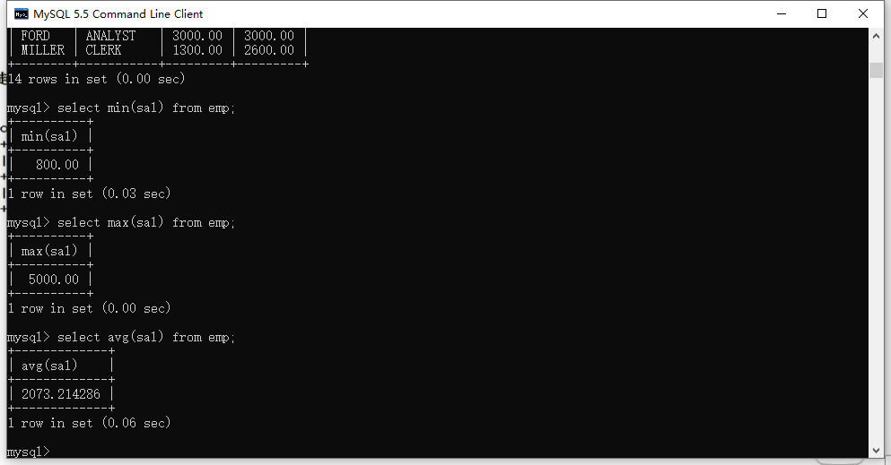
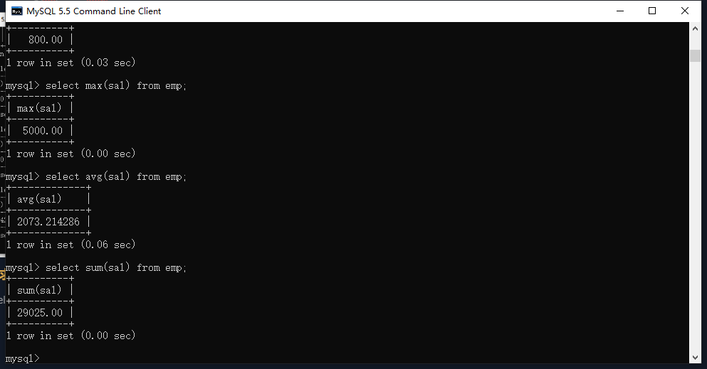
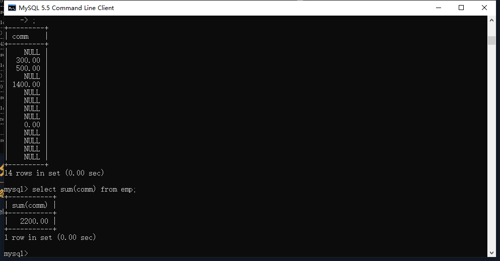
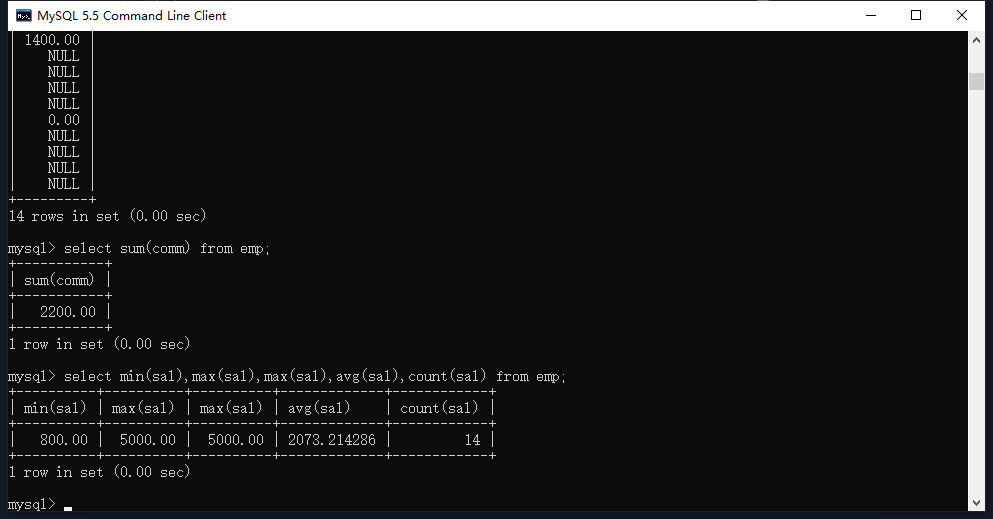

## 基本概念

分组函数也就是多行处理函数

### 分组函数的特点

输入多行，最终输出一行

### 注意

分组函数必须先分组才能使用

如果没有分组，整张表就是一组

## 分组函数

### min() 最小值

命令：

```mysql
select min(sal) from emp;
```



### max() 最大值

命令：

```mysql
select max(sal) from emp;
```



### avg() 平均值

命令：

```mysql
select avg(sal) from emp;
```



### sum() 求和

命令：

```mysql
select sum(sal) from emp;
```



### count() 统计数量

命令：

```mysql
select count(ename) from emp;
```


## 使用分组函数的注意事项

### 会自动忽略null,包括count！！！！！！

命令：

```mysql
select comm,sum(comm) from emp;
```



### count（字段）与count（*）的区别

count（字段）统计的是字段的记录数

count（*）统计的是表的总行数

### 分组函数不能使用在where子句中

因为where执行在group by 之前，执行where的时候还没有分组，不能执行分组函数。

那么为什么select min(sal) from emp;可以执行，因为min()分组函数指向在select之后，当执行select的时候group by 分组已经执行了，因此可以使用分组函数。

### 分组函数可以组合起来使用

命令：

```mysql
select min(sal),max(sal),max(sal),avg(sal),count(sal) from emp;
```




