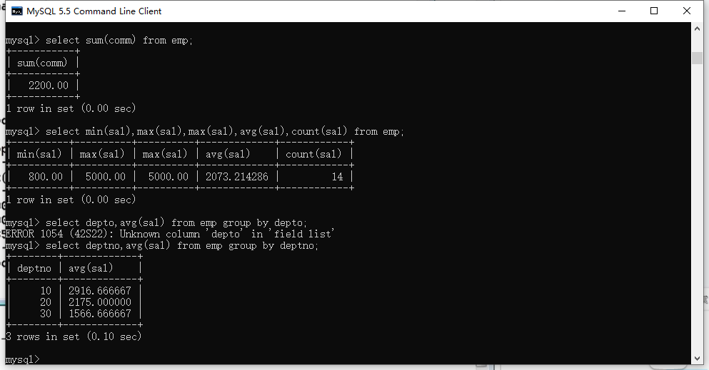
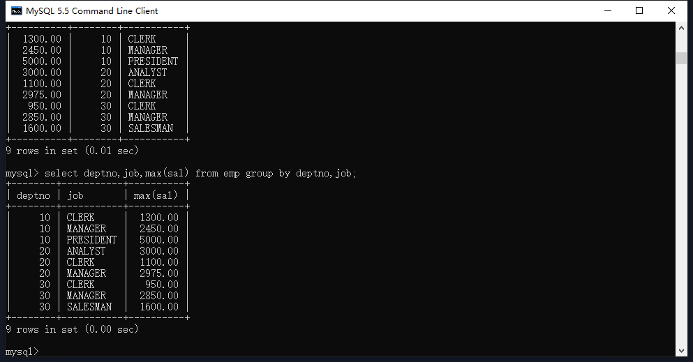
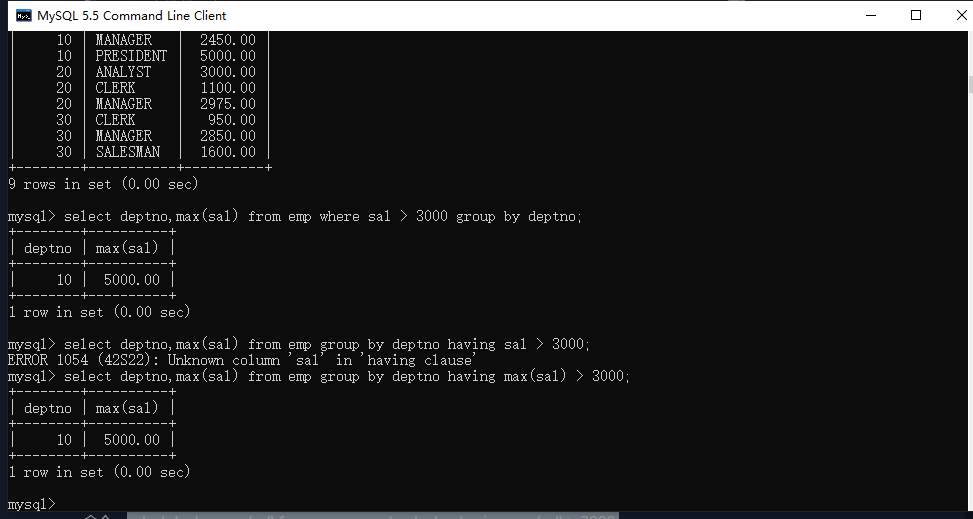

## 基本概念

### 什么是分组查询？

先进行分组，再对每一组数据进行操作

### 所有的关键字的顺序是?

select...	from...	where...	group by...	order by...

### 所有关键字的执行顺序是什么？

1、from 2、where 3、group by 4、select 5、order by

## 注意事项

### 当有group by 语句时，select 后面只能跟分组的字段和分组函数，否则会报错

命令：

```mysql
select deptno,avg(sal) from emp group by deptno;
```



### 嵌套分组对一轮分组结果的每一个类别再进行分组

命令：

```mysql
select deptno,job,max(sal) from emp group by deptno,job;
```



### having

命令：

```mysql
select deptno,max(sal) from emp group by deptno having max(sal) > 3000;
```

类似于：

```mysql
select deptno,max(sal) from emp where sal > 3000 group by deptno;
```

注意：下面的方法效率更高，先筛选，再分组，再执行函数，比第一种先分组，再执行函数，再筛选效率高。因为执行了更少次的函数。

结论：能使用where的，尽量使用where，不能使用where的才使用having

什么时候不能使用where，比如：找出部门的平均薪资 > 2500。此时无法使用where对sal薪资筛选



