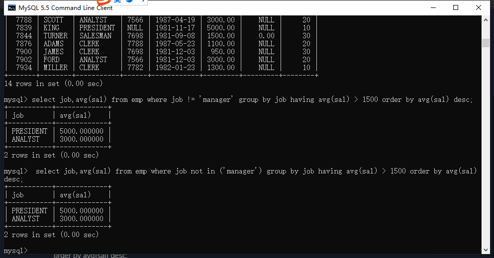

## 所有语句的书写顺序

select

​	...

from

​	...

where

​	...

group by

​	...

having

​	...

order by

​	...

;

## 所有语句的执行顺序

1、from 	2、where 	3、group by 	4、having 	5、select 	6、order by

## 单表查询的综合案例

找出每个岗位（除manager之外）的平均薪资，只要平均薪资大于1500的，要求按照平均薪资降序排

命令： 

```mysql
select job,avg(sal) from emp where job != 'manager' group by job having avg(sal) > 1500 order by avg(sal) desc;
```

或者： 

```mysql
select job,avg(sal) from emp where job not in ('manager') group by job having avg(sal) > 1500 order by avg(sal) desc;
```



