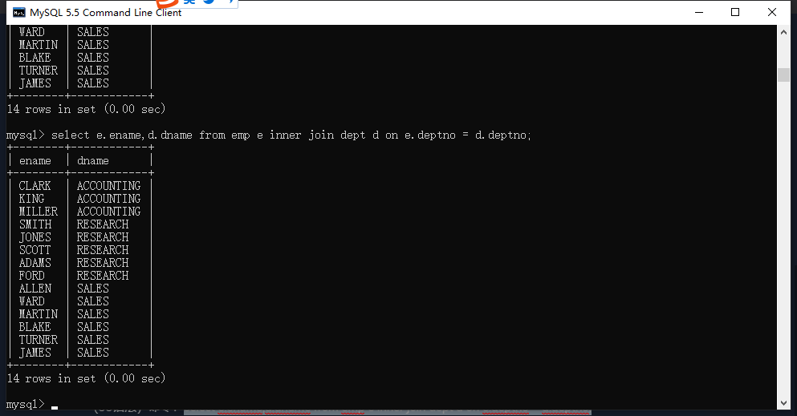
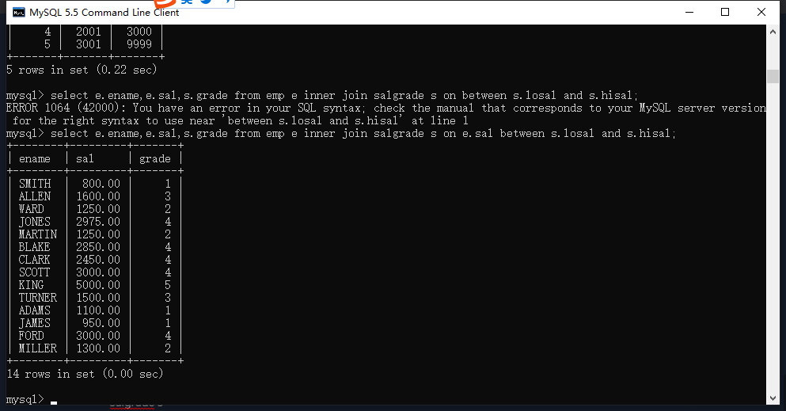
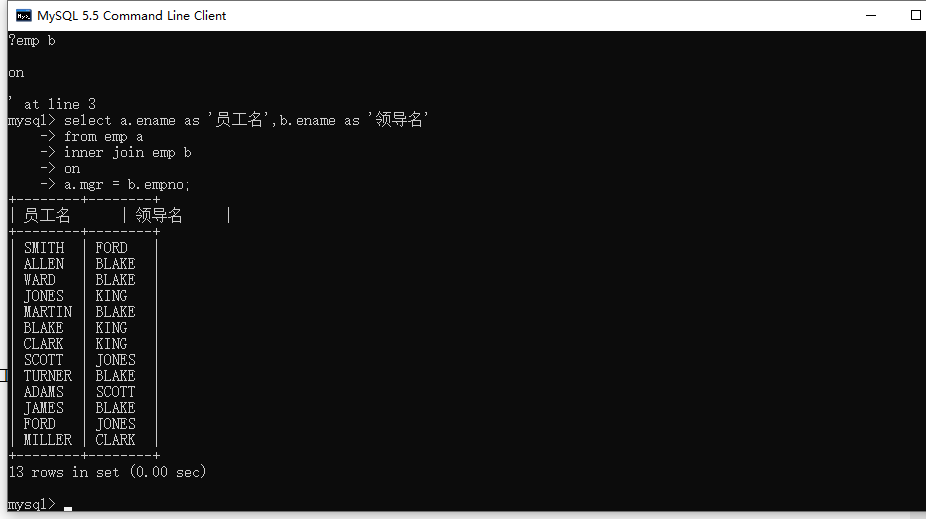
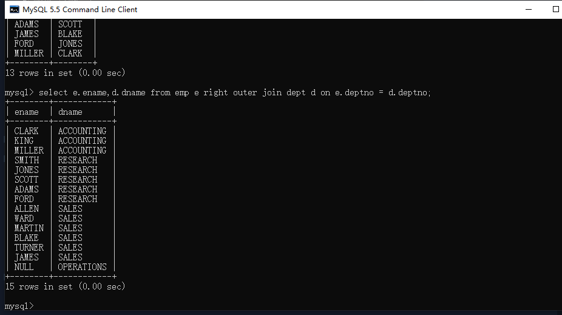
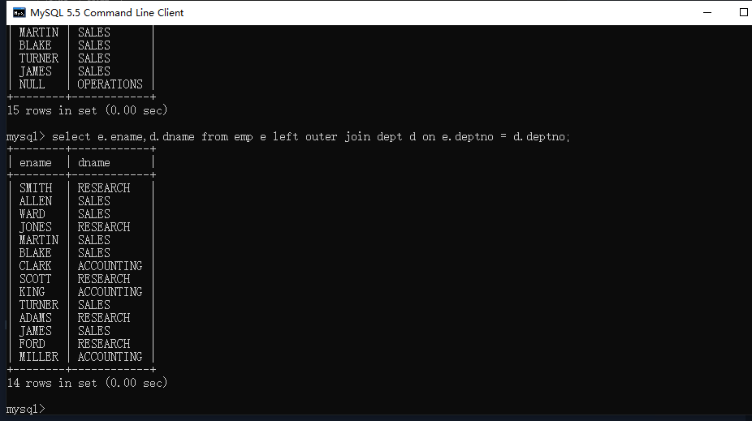
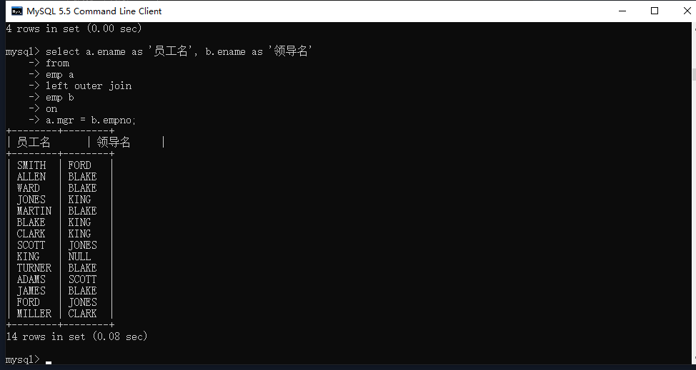
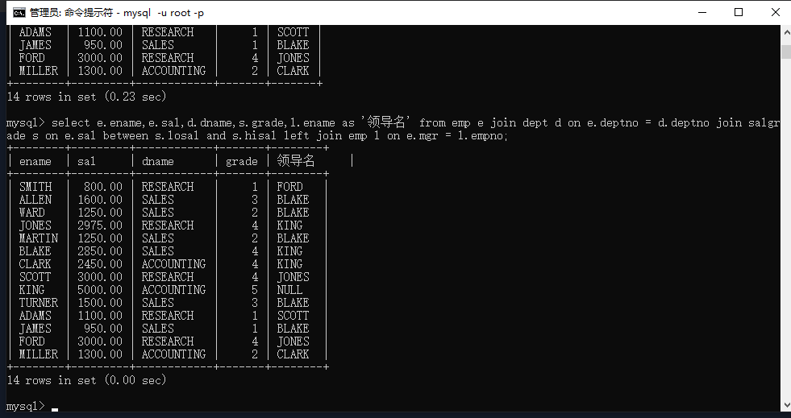

## 基本概念

从一张表中单独查询，称为单表查询

多个表联合起来查询数据，跨表查询称为连接查询

## 连接查询的分类

### 根据语法年代分类

SQL92

SQL99（重点学习SQL99的语法）

### 根据表连接的方式进行分类

内连接

​	等值连接

​	非等值连接

​	自连接

外连接

​	右外连接（右连接）

​	左外连接（左连接）

全连接（几乎不用）

## 连接查询的一种常见现象（笛卡尔积）

当两张表进行连接查询时，如果没有加任何的条件筛选，那么查询的结果条数就是两张表的数据调条数的乘积，这种现象称为：笛卡尔积现象

## 避免笛卡尔积现象

连接时加where条件筛选

命令：

```mysql
select ename,dname from emp,dept where emp.deptno = dept.deptno;
```

提高查询效率的办法

命令：

```mysql
select e.ename,d.dname from emp e,dept d where e.deptno = d.deptno;
```


## 内连接——等值连接

查询每个员工所在部门名称，显示员工名和部门名？

（92语法）命令：

```mysql
select e.ename,d.dname from emp e,dept d where e.deptno = d.deptno; 
```

92语法的缺点，语法结构不清晰，连接条件和筛选条件都写到了where语句中

（99语法）命令：

```mysql
select e.ename,d.dname from emp e inner join dept d on e.deptno = d.deptno;
```

inner可以省略，但是推荐写上，写上之后一眼就能看出来是内连接。on后面还可以再加上where 筛选条件



## 内连接——非等值连接

案例：找出每个员工的薪资等级，要求显示员工名、薪资、薪资等级？

命令：

```mysql
select  e.ename,e.sal,s.grade from emp e inner join salgrade s on e.sal between s.losal and s.hisal;
```



## 内连接——自连接

案例：查询员工的上级领导，要求显示员工名和对应的领导名？

命令：

```mysql
select a.ename as '员工名',b.ename as '领导名' from emp a inner join emp b on a.mgr = b.empno;
```



## 外连接

#### 右外连接

概念：就是将join右边的表作为主表，输出的结果包含主表的所有内容，再加上on 关键字 后面条件匹配的数据。

命令：

```mysql
select e.ename,d.dname from emp e right outer join dept d on e.deptno = d.deptno;
```



outer可以省略

#### 左外连接

概念：与右外连接刚好相反

命令：

```mysql
select e.ename,d.dname from emp e left outer join dept d on e.deptno = d.deptno;
```



outer可以省略

注意：连接条件相同时，外连接查询的结果数量 >= 内连接查询的结果数量

练习：查询每个员工的上级领导，要求显示所有员工的名字和领导名？

命令：

```mysql
 select a.ename as '员工名', b.ename as '领导名' from emp a left outer join emp b on a.mgr = b.empno;
```



## 外连接与内连接的区别

内连接就是将满足条件的结果，展示出来，不满足的不会展示。

外连接在内连接的基础上会以一个表为主表，不管条件如何主表中的数据都会展示，最终结果是主表的内容+满足条件on的。

外连接的查询结果的条数一定是大于等于内连接的查询结果

## 多表连接

语法：select	...	from	a	join	b	on	a和b的连接条件 join c on a和c的连接条件

命令：

```mysql
select e.ename,e.sal,d.dname,s.grade,l.ename as '领导名' from emp e join dept d on e.deptno = d.deptno join salgrade s on e.sal between s.losal and s.hisal left join emp l on e.mgr = l.empno;
```



