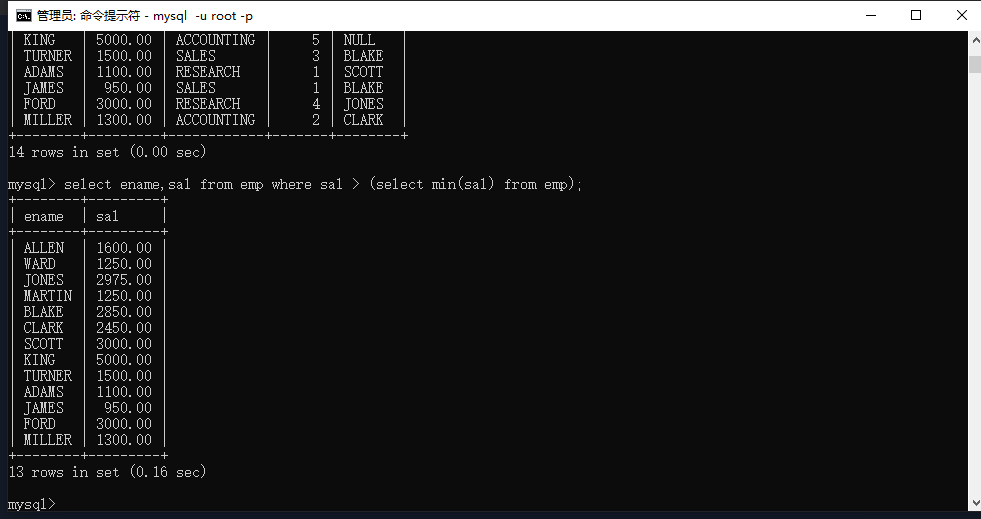
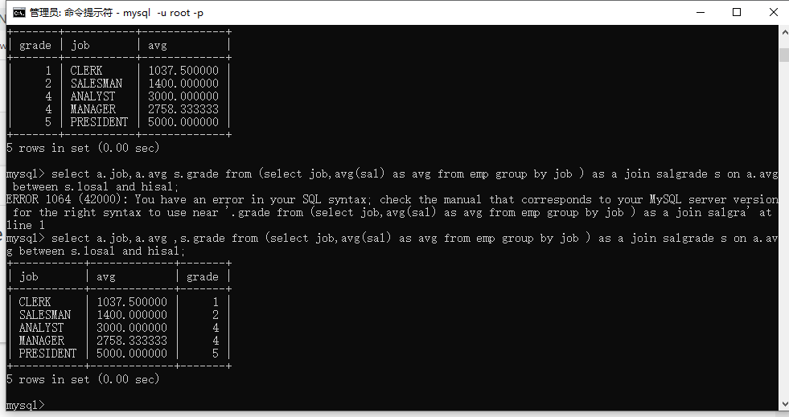
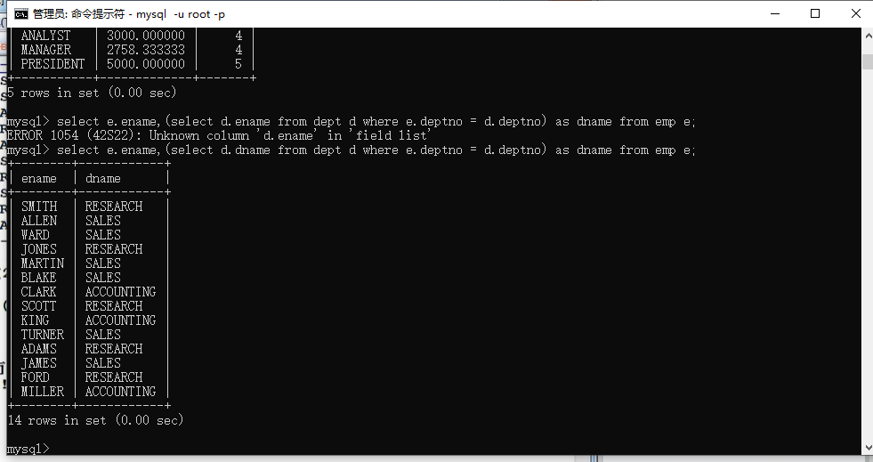

## 子查询的概述

### 什么是子查询？

select语句中嵌套select语句，被嵌套的select语句称为子查询

### 子查询都可以出现在什么位置？

select后面

from后面

where后面

## where子句中的子查询

一般是查询出一个数据结果，用来做条件判断。

命令：

```mysql
select ename,sal from emp where sal > (select min(sal) from emp);
```



## from子句中的子查询

from后面的子查询可以将子查询的查询结果当成一张临时的表

命令： 

```mysql
select a.job,a.avg ,s.grade from (select job,avg(sal) as avg from emp group by job ) as a join salgrade s on a.avg between s.losal and hisal;
```



## select 子句中的子查询(了解即可)

命令：

```mysql
select e.ename,(select d.dname from dept d where e.deptno = d.deptno) as dname from emp e;
```



