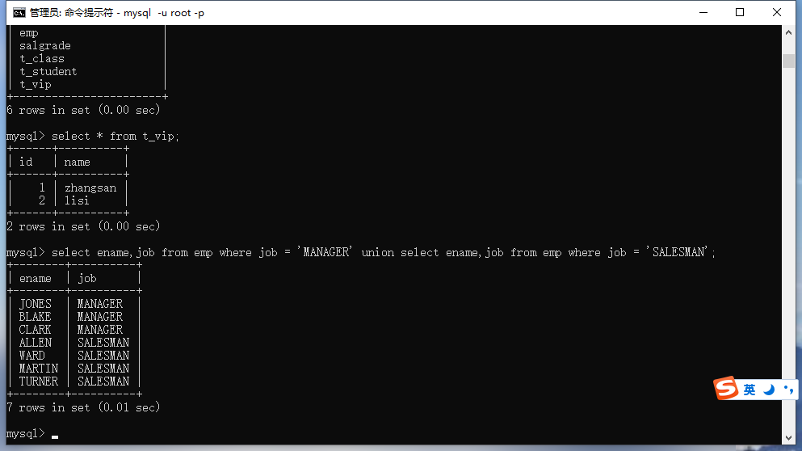

## union合并查询的结果

### union的使用

命令：

```mysql
select ename,job from emp where job = 'MANAGER' union select ename,job from emp where job = 'SALESMAN';
```



等同于：

```mysql
select ename,job from emp where job = 'MANAGER' or job = 'SALESMAN';
```

或者：

```mysql
select ename,job from emp where job in ('MANAGER','SALESMAN');
```


### 那么union和另外两种写法的区别在哪呢？

最大的区别在于效率问题，使用连接就会有笛卡尔积现象的发生比如：三个表连接查询的次数是10x10x10=1000

但是使用union的次数就是10x10+10x10=200。效率会得到大大的提升。

### union使用的时候有什么注意事项吗？

union使用的时候要保证合并的两个查询结果集的列数要相同。

比如：

```mysql
select ename,job from emp where job = 'MANAGER' union select ename from emp where job = 'SALESMAN';
```

因为前面有两列后面只有一列，不相等所以就会报错。

ERROR 1222 (21000): The used SELECT statements have a different number of columns


特别提醒：当列与列的数据类型不相同时，在MySQL中不会报错但是在Oracle中会报错

