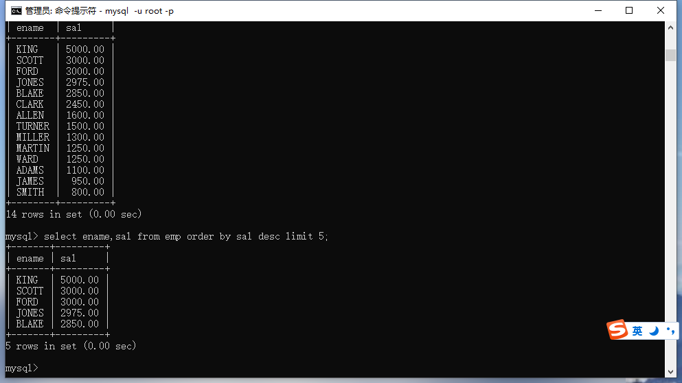
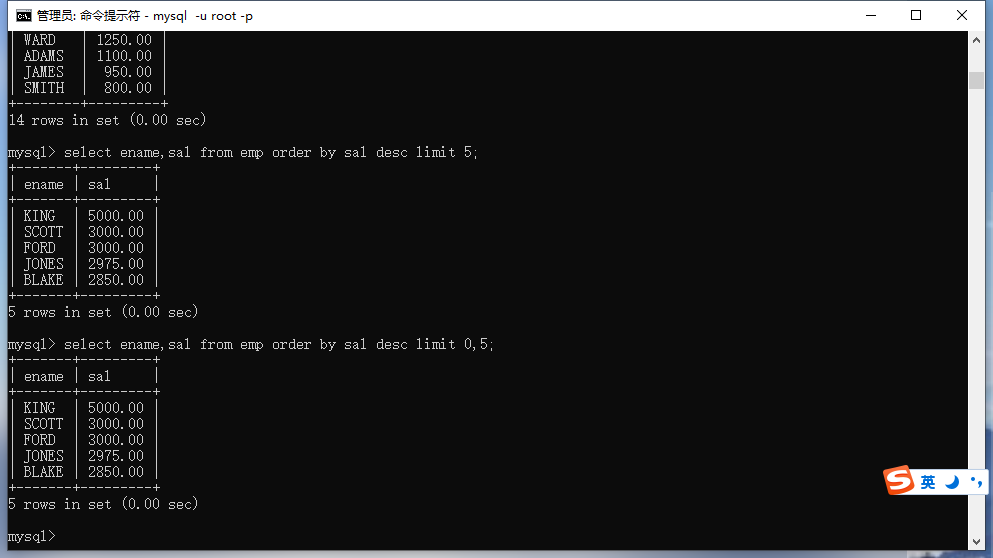

### limit是什么？

limit是将查询结果集的一部分取出来，一般使用在分页查询中。

### limit的使用?

limit后面可以跟两个数字参数，一个是开始坐标，后面是长度，起始下标默认是0。

命令：

```mysql
select ename,sal from emp order by sal desc limit 5;
```



命令：

```mysql
select ename,sal from emp order by sal desc limit 0,5;
```



