## 表的创建

语法：create table 表名(字段名1 数据类型，字段名 2数据类型...);

命名规范：表名用t_开头，字段名见名知意

示例：

```mysql
create table t_test(no int,name varchar(32),sex char(1),age int(3),email varchar(255));
```

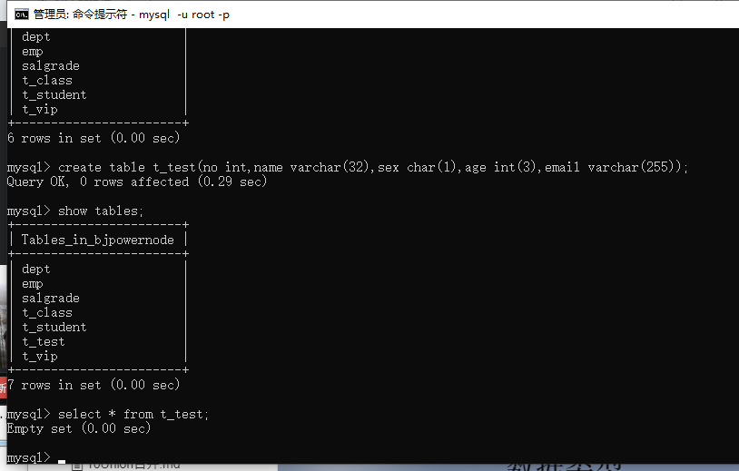

## 数据类型

### varchar（255）

可变长度的字符串，比较智能，节省空间，会根据实际的数据长度动态的分配存储空间

### char（255）

固定长度的字符串，不管实际的数据长度是多少，分配固定长度的存储空间来存储数据，实际使用起来可能会浪费空间，但是效率比varchar效率高,速度快

### varchar和char的选择？

当实际长度比较固定时，可以使用char提升效率，当长度不固定，为了节省空间，只能牺牲效率了，因此varchar和char的选择实际上就是空间和效率的选择

### int（11）

整型

### bigint

大整型

### float

单精度浮点型

### double

双精度浮点型

### date

短日期类型

### datetime

长日期类型

### clob

Character large object

字符大对象，最多可以存储4G的字符串（存文章）

超过255的

### blob

Binary large object

二进制大对象

存图片，声音，视频等流媒体数据

## 删除表

语法1：drop table 表名;

当这张表不存在的时候会报错

语法2：drop table if exists 表名;

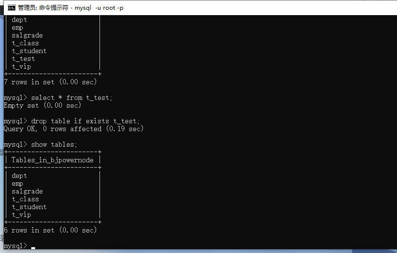

## 插入数据

### 插入普通数据

insert into 表名(字段1,字段2,字段3) values(值1,值2,值3);

示例：

```mysql
insert into t_student(no,name,sex,age,email) values (2017403601,'liujie','m',22,'1765659336@qq.com');
```

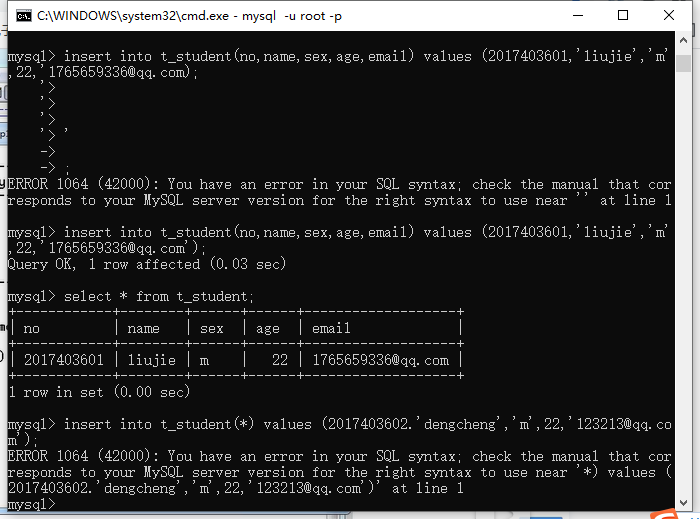

没有给字段指定值，默认值是NULL，可以使用default指定默认值

### 插入日期数据

创建一个表格包含日期类型的字段

命令：

```mysql
create table t_user(id int,name varchar(32),birth date);
```

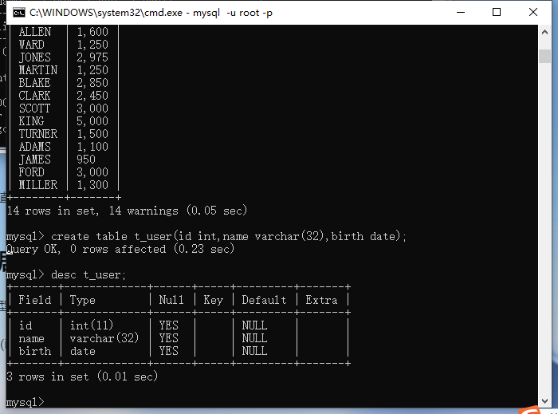

命令：

```mysql
insert into t_user(id,name,birth) values(1,'liujie','01-01-1999');
```

这里的日期是字符串的格式，不是日期类型所以报错

Incorrect date value: '01-01-1999' for column 'birth' at row 1

因此要使用str_to_date函数将日期字符串转换为日期

日期格式 %Y 年 %m 月 %d 日 %h 时 %i 分 %s 秒

命令：

```mysql
insert into t_user(id,name,birth) values(1,'liujie',str_to_date('01-01-1999','%d-%m-%Y'));
```

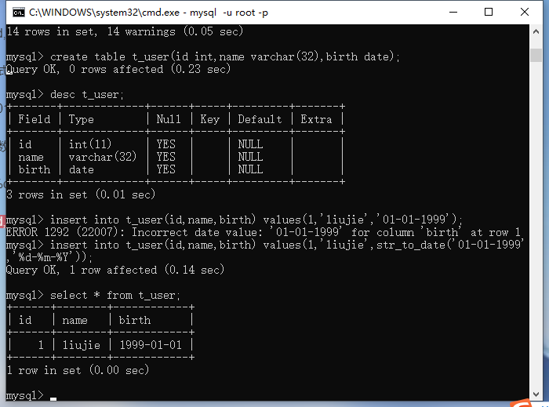

值得注意的是，如果传入的日期格式是%Y-%m-%d，就不需要使用str_to_date函数。mysql会自动执行这个函数

命令：

```mysql
insert into t_user(id,name,birth) values(1,'zhangsan','2000-02-11');
```

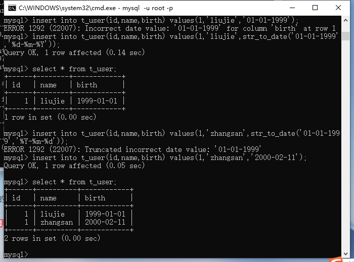

当我们查询数据展示的时候要自己修改日期的展示格式

可以使用date_fromat函数

命令：

```mysql
select id,name,date_format(birth, '%m/%d/%Y') as birth from t_user;
```

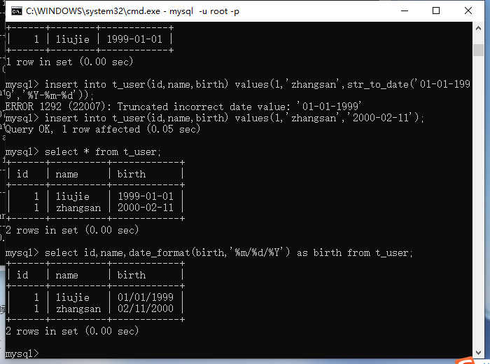

当我们不使用date_format函数时，展示数据的格式是%Y-%m-%d

命令：

```mysql
select id,name,birth from t_user;
```

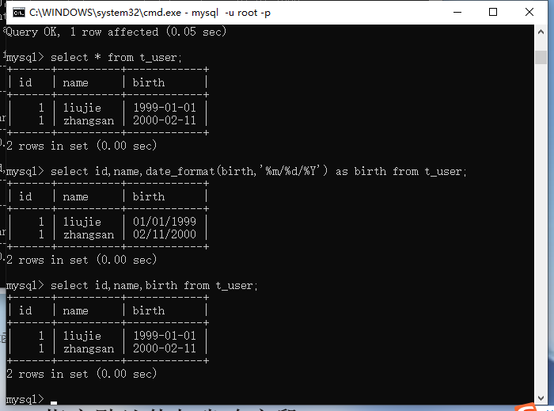

### date和datetime两个类型的区别

date是短日期只包含年月日而datetime是长日期包含年月日时分秒

date的默认格式是%Y-%m-%d

datetime的默认格式是%Y-%m-%d %h:%i:%s

### mysql获取系统默认时间

now（）函数

命令：

```mysql
 insert into t_user values(3,'liujie',now());
```

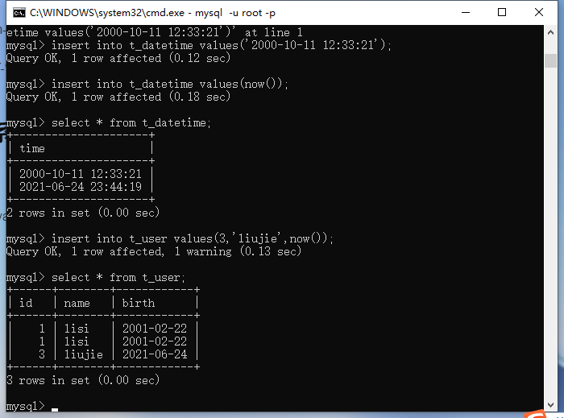

### 一次插入多条记录

语法：insert into 表名(字段名...) values (记录1),（记录2);

命令： 

```mysql
insert into t_user values (1,'zhangsha',now()),(2,'lisi',now());
```

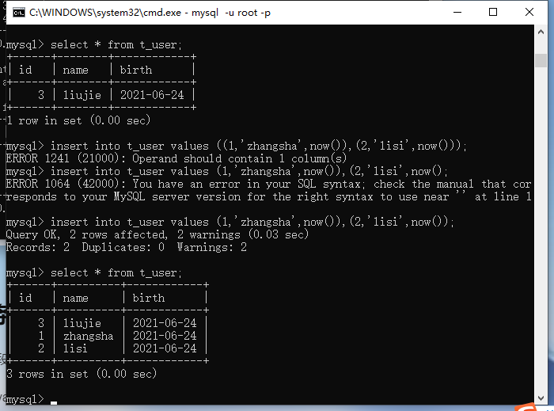

## 指定默认值与省略字段

### 指定默认值

示例：

```mysql
create table t_default(name varchar(32),sex char(1) default 'm');
```

指定性别的默认值为男m

```mysql
insert into t_default(name) values ('liujie');
```

传入一个数据，没有传递性别

 

```mysql
select * from t_default;
```

展示数据

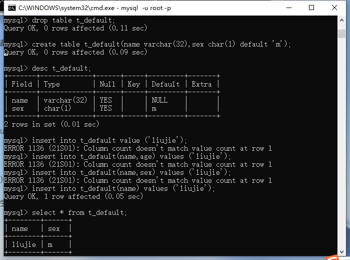

### 省略字段

当表名后面不写字段名时（实际上就相当于全写上了），后面传值时不能省略，且顺序不能错。否则会报列数不同的错误Column count doesn't match value count at row 1

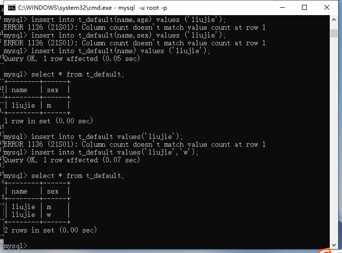

## 修改数据

语法：update 表名 set 字段名1=值1，字段名2=值2...where 条件

！！！！！！！如果不加条件会将表中的数据全部改变

命令： 

```mysql
update t_user set name='lisi',birth='2001-02-22' where id = 1;
```

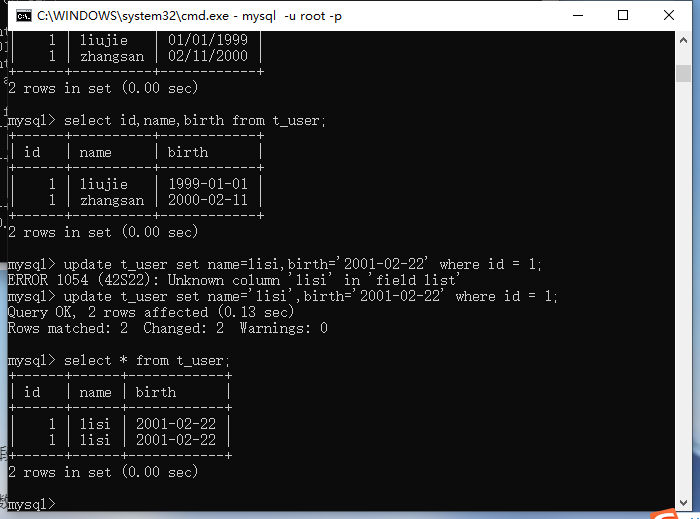

## 删除数据

语法:delete from 表名 where 条件;

！！！！一定要加条件，不加条件整张表的数据都会被删除

命令：

```mysql
delete from t_user where id = 1;
```


## 复制表

语法：create table 表名 as 查询结果

命令：

```mysql
create table t_user2 as select * from t_user;
```

原理：将查询结果创建为一张新的表格

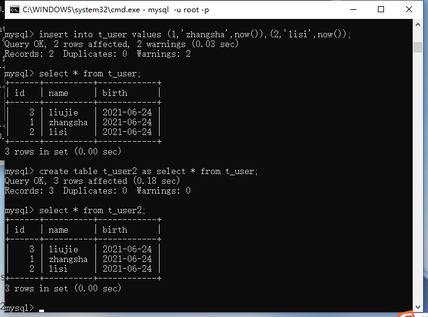

## 插入表（了解）

将查询结果表格插入到别的表中

语法：insert into 要插入的表名 查询的结果

命令：

```mysql
insert into t_user select * from t_user;
```

一般很少用，因为要求插入的表格列数和待插入的表格列数要相同

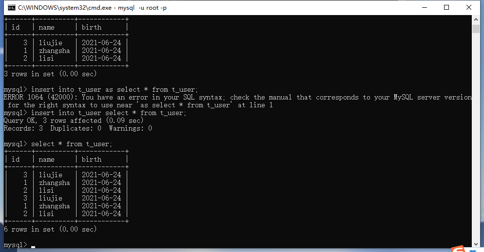

## 快速删除表中的数据

//删除dept_bak表中的数据

```mysql
delete from dept_bak;
```

 这种删除数据的方式比较慢。

delete语句删除数据的原理？（delete属于DML语句！！！）
	表中的数据被删除了，但是这个数据在硬盘上的真实存储空间不会被释放！！！
	这种删除缺点是：删除效率比较低。
	这种删除优点是：支持事务rollback回滚，后悔了可以再恢复数据！！！

truncate语句删除数据的原理？
	这种删除效率比较高，表被一次截断，物理删除。
	这种删除缺点：不支持回滚。
	这种删除优点：快速。

用法：

```mysql
truncate table dept_bak; 
```

大表非常大，上亿条记录?
	删除的时候，使用delete，也许需要执行1个小时才能删除完！效率较低。
	可以选择使用truncate删除表中的数据。只需要不到1秒钟的时间就删除结束。效率较高。
	但是使用truncate之前，必须仔细询问客户是否真的要删除，并警告删除之后不可恢复！

​	truncate是删除表中的数据，表还在！

删除表操作？
	drop table 表名; // 这不是删除表中的数据，这是把表删除。

## 对表结构的增删改

什么是对表结构的修改？
		添加一个字段，删除一个字段，修改一个字段！！！

对表结构的修改需要使用：alter

第一：在实际的开发中，需求一旦确定之后，表一旦设计好之后，很少的进行表结构的修改。因为开发进行中的时候，修改表结构，成本比较高。修改表的结构，对应的java代码就需要进行大量的修改。成本是比较高的。这个责任应该由设计人员来承担！

第二：由于修改表结构的操作很少，所以我们不需要掌握，如果有一天
真的要修改表结构，你可以使用工具！！！！
