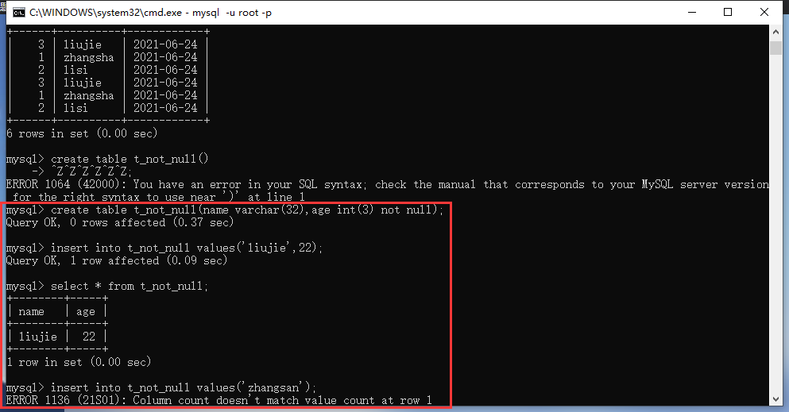
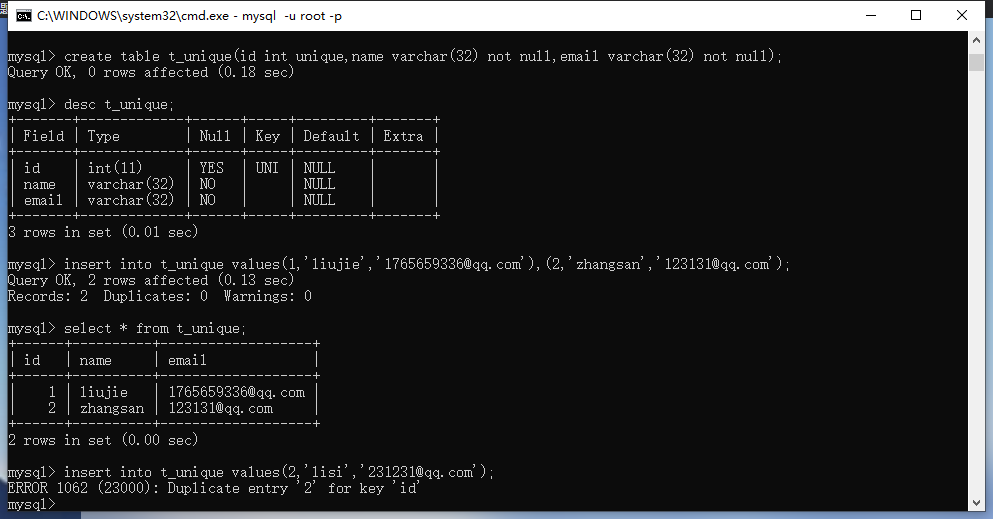
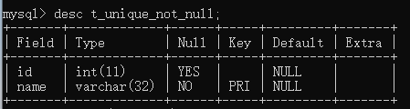
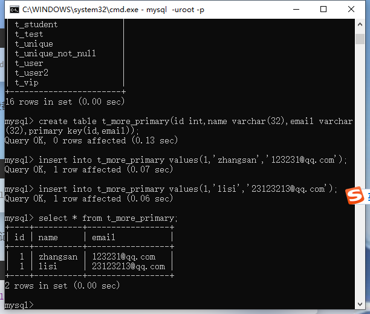
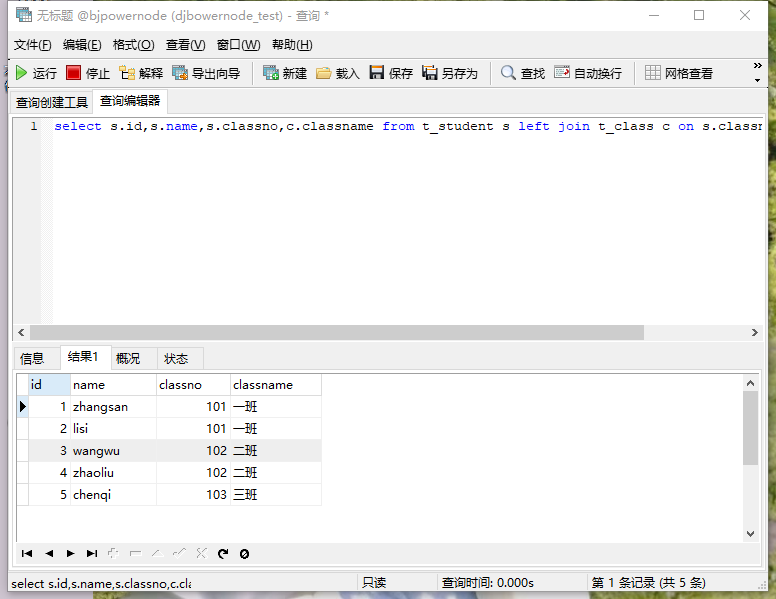

## 什么是约束

约束（constraint）在创建表的时候，给表中的字段添加一些约束，来保证字段中数据的完整性和有效性

## 常见的约束

### 非空约束

not null

被约束的字段不能为空，否则会报错

1、创建一个有非空约束的表

```mysql
create table t_not_null(name varchar(32),age int(3) not null);
```

2、插入一组数据

```mysql
insert into t_not_null values('liujie',22);
```

3、约束了age不能为空，当插入数据时不传入值进去，默认传入的值为NULL

```mysql
insert into t_not_null values('zhangsan');
```

报错：ERROR 1136 (21S01): Column count doesn't match value count at row 1



### 唯一性约束

unique

唯一性约束的字段不能重复，但是可以为NULL，重复为NULL

#### 单个字段唯一

1、首先创建一个带有唯一性约束的表

```mysql
create table t_unique(id int unique,name varchar(32) not null,email varchar(32) not null);
```

2、插入数据

```mysql
insert into t_unique values(1,'liujie','1765659336@qq.com'),(2,'zhangsan','123131@qq.com');
```

3、插入与之前插入数据冲突的数据

```mysql
insert into t_unique values(2,'lisi','231231@qq.com');
```

报错：ERROR 1062 (23000): Duplicate entry '2' for key 'id'



#### 多个字段联合起来唯一

当我们约束多个字段联合起来匹配查看是否唯一，需要两个数据的所有被约束的字段都不唯一才会报错

1、创建一个多个字段联合唯一的表

```mysql
create table t_more_unique(id int,name varchar(32),email varchar(32),unique(id,email));
```

2、插入一组数据

```mysql
insert into t_more_unique values(1,'liujie','13231@qq.com');
```

3、当只有id冲突或者email冲突时，可以插入

```mysql
insert into t_more_unique value(1,'lisi','1232131@qq.com'),(2,'dasd','13231@qq.com');
```

4、当id和email都冲突时，报错

```mysql
insert into t_more_unique values(1,'dsdjas','13231@qq.com');
```

报错：ERROR 1062 (23000): Duplicate entry '1-13231@qq.com' for key 'id'

#### not null 和 unique 同时约束

创建一个字段不能为空且唯一的表

```mysql
create table t_unique_not_null(id int,name varchar(32) not null unique);
```

在mysql中，如果一个字段not null 且 unique，那么这个字段自动成为主键，在Oracle中不是这样的



先插入一组正确的数据

```mysql
insert into t_unique_not_null values(1,'zhangsan');
```

再插入一组冲突的数据

```mysql
insert into t_unique_not_null values(2,'zhangsan');
```

报错：ERROR 1062 (23000): Duplicate entry 'zhangsan' for key 'name'

再插入一组name为空的数据

```mysql
insert into t_unique_not_null values(2);
```

报错：ERROR 1364 (HY000): Field 'name' doesn't have a default value

### 主键约束

primary key

#### 单一主键

主键字段：被主键约束的字段

主键值：主键字段中的值

主键的作用：主键值是每一行记录的唯一标识，用来区分记录

主键的特征：不能为空且不能重复not null unique

创建一个带有主键约束的表

```mysql
create table t_primary_key(id int primary key,name varchar(32));
```

插入一组正常的数据

```mysql
insert into t_primary_key values(1,'zhangsan');
```

再插入主键冲突的和为空的两种数据

```
 insert into t_primary_key values(1,'lisi');
```

报错：ERROR 1062 (23000): Duplicate entry '1' for key 'PRIMARY'

```mysql
insert into t_primary_key(name) values('lisi');
```

报错：ERROR 1364 (HY000): Field 'id' doesn't have a default value

#### 复合主键（开发不建议使用）

多个字段联合起来做主键

创建一个带有复合主键的表

```mysql
create table t_more_primary(id int,name varchar(32),email varchar(32),primary key(id,email));
```

此时联合的字段都不为空且联合的字段都不重复，这条记录才能被插入

举例：先插入一组数据

```mysql
insert into t_more_primary values(1,'zhangsan','123231@qq.com');
```

当我们再插入id冲突但是邮箱不冲突的记录时，不会报错可以插入进去

```mysql
insert into t_more_primary values(1,'lisi','23123213@qq.com');
```



#### 主键的数量

一个表中的主键约束只能有一个，多于两个会报错

创建带有两个主键约束的表

```mysql
create table t_xxx(id int primary key,name varchar(32) primary key);
```

报错：ERROR 1068 (42000): Multiple primary key defined

#### 主键值的类型

建议使用int、bigint、char类型的字段作为主键

#### 自然主键和业务主键

自然主键：是一个自然数，也实际的业务无关

业务主键：与实际的业务挂钩，比如银行卡卡号

不推荐使用业务主键，而使用自然主键。因为实际开发中，业务可以会发生改变，而主键的作用就是一个唯一标识，自然主键能够满足要求。

在mysql中，有一个自动递增的功能

```mysql
create table t_auto_primary(id int primary key auto_increment,name varchar(32));
```

插入两条记录，不给id值

```mysql
insert into t_auto_primary(name) values('zhangsan'),('lisi');
```

```mysql
select * from t_auto_primary;
```


### 外键约束

foreign key

外键字段：添加了外键约束的字段

外键值：外键字段中的每一个值

案例：有一张表学生表

| no(primary key) | name     | classno | classname |
| --------------- | -------- | ------- | --------- |
| 1               | zhangsan | 101     | 一班      |
| 2               | lisi     | 101     | 一班      |
| 3               | wangwu   | 102     | 二班      |
| 4               | zhaoliu  | 102     | 二班      |
| 5               | chenqi   | 103     | 三班      |

班级名称和班级编号是一一对应的关系，学生表里面可以只存班级编号即可，再存班级名称是浪费空间

因此可以改成两张表

t_class

| classno(primary key) | classname |
| -------------------- | --------- |
| 101                  | 一班      |
| 102                  | 二班      |
| 103                  | 三班      |

t_student

| id(primary key) | name     | classno(foreign key) |
| --------------- | -------- | -------------------- |
| 1               | zhangsan | 101                  |
| 2               | lisi     | 101                  |
| 3               | wangwu   | 102                  |
| 4               | zhaoliu  | 102                  |
| 5               | chenqi   | 103                  |

t_student表中的classno字段，如果不加外键约束，可能会产生无用的记录，比如明明没有104班级编号，但是该记录就是可以传入表格，但是加了外键就会限制，如果传入无用的记录会报错

**外键引用父表中的某个字段，这个字段必须唯一，可以为NULL，因此这个字段不一定要是主键**

代码实现：

t_class是父表，t_student是子表

删表删记录是先删子再删父

创建表创建记录是先父再子

1、先创建父表t_class

```mysql
create table t_class(classno int primary key,classname varchar(32));
```

2、再创建子表t_student

```mysql
 create table t_student(id int primary key auto_increment,name varchar(32),classno int,foreign key(classno) references t_class(classno));
```

3、先插入父表的记录

```mysql
insert into t_class values(101,'一班'),(102,'二班'),(103,'三班');
```

注意：cmd窗口的默认编码与mysql的默认编码不一样，传入中文会乱码，可以使用Navicat工具新建查询编写mysql代码

4、再插入子表的记录

```mysql
insert into t_student(name,classno) values('zhangsan',101),('lisi',101),('wangwu',102),('zhaoliu',102),('chenqi',103);
```

5、查询记录

```mysql
select s.id,s.name,s.classno,c.classname from t_student s left join t_class c on s.classno = c.classno;
```



### 检查约束check

