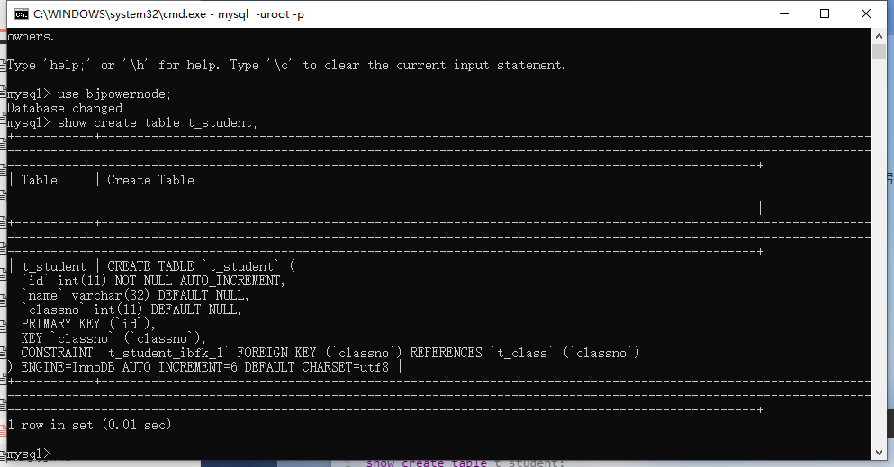
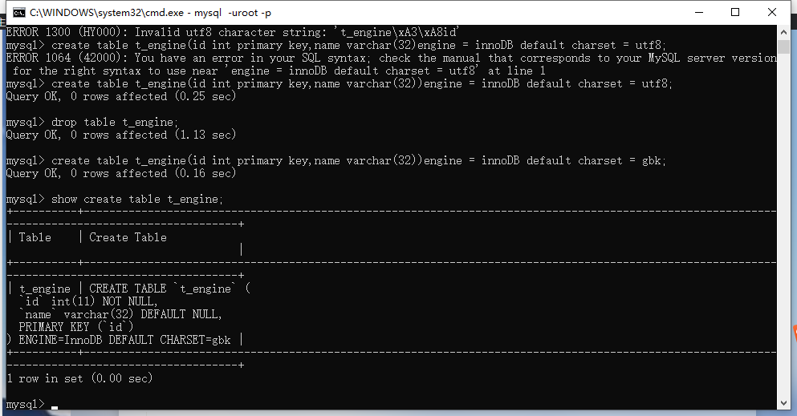
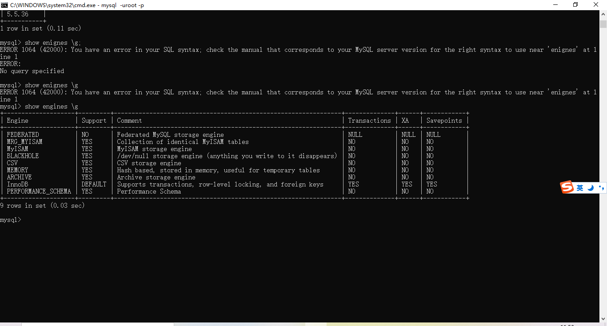

### 什么是存储引擎？

存储引擎是mysql中特有的术语，存储引擎是一个表存储/组织数据的方式，不同的存储引擎，表存储数据的方式不同。

### 怎样给表添加/指定存储引擎？

可以在表创建的时候指定

展示表创建的语句

```mysql
show create table t_student;
```



默认的存储引擎是InnoDB，默认的字符编码是utf8

我们可以在创建表的时候自己指定，比如：

```mysql
create table t_engine(id int primary key,name varchar(32))engine = innoDB default charset = gbk;
```



### 查看当前版本mysql支持哪些存储引擎

查看版本

```mysql
select version();
```

查看支持哪些存储引擎

```mysql
 show engines \g
```



### mysql常用的存储引擎

#### MyISAM存储引擎

它管理的表具有以下特征： 

– 使用三个文件表示每个表：

​		• 格式文件 — 存储表结构的定义（mytable.frm） 

​		• 数据文件 — 存储表行的内容（mytable.MYD） 

​		• 索引文件 — 存储表上索引（mytable.MYI） 

– 灵活的 AUTO_INCREMENT 字段处理

 – 可被转换为压缩、只读表来节省空间（这个存储引擎最大的优势）

#### InnoDB 存储引擎 

• InnoDB 存储引擎是 MySQL 重量级的存储引擎。同时也是默认的，最大的优点是支持事务安全，因此效率较低，也不能压缩，不能转换为只读。 

• 它管理的表具有下列主要特征：

 – 每个 InnoDB 表在数据库目录中以.frm 格式文件表示 

– InnoDB 表空间 tablespace 被用于存储表的内容 

– 提供一组用来记录事务性活动的日志文件 

– 用 COMMIT(提交)、SAVEPOINT 及 ROLLBACK(回滚)支持事务处理 （以保证数据的安全）

– 提供全 ACID 兼容 

– 在 MySQL 服务器崩溃后提供自动恢复 – 多版本（MVCC）和行级锁定 

– 支持外键及引用的完整性，包括级联删除和更新

#### MEMORY 存储引擎 

• 使用 MEMORY 存储引擎的表，其数据存储在内存中，不需要和硬盘交互，且行的长度固定，这两个特点使得 MEMORY 存储引擎非常快，但是数据不安全，关机之后，内存清空数据丢失。

• MEMORY 存储引擎管理的表具有下列特征： 

– 在数据库目录内，每个表均以.frm 格式的文件表示。 

– 表数据及索引被存储在内存中。 

– 表级锁机制。

– 不能包含 TEXT 或 BLOB 字段。 • MEMORY 存储引擎以前被称为 HEAP 引擎。

#### 选择合适的存储引擎

• MyISAM 表最适合于大量的数据读而少量数据更新的混合操作。MyISAM 表的另一种适用情形是使用压缩的只 读表。 

• 如果查询中包含较多的数据更新操作，应使用 InnoDB。其行级锁机制和多版本的支持为数据读取和更新的混合 操作提供了良好的并发机制。 

• 可使用 MEMORY 存储引擎来存储非永久需要的数据，或者是能够从基于磁盘的表中重新生成的数据。