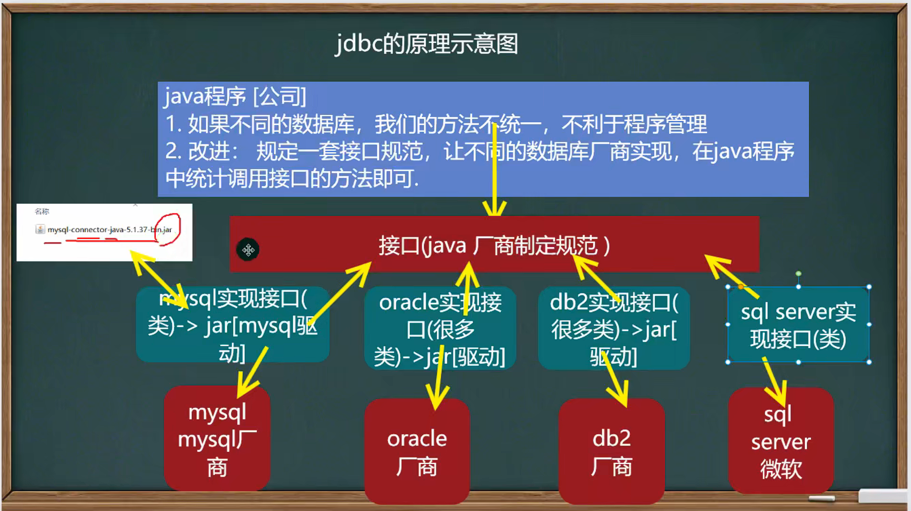
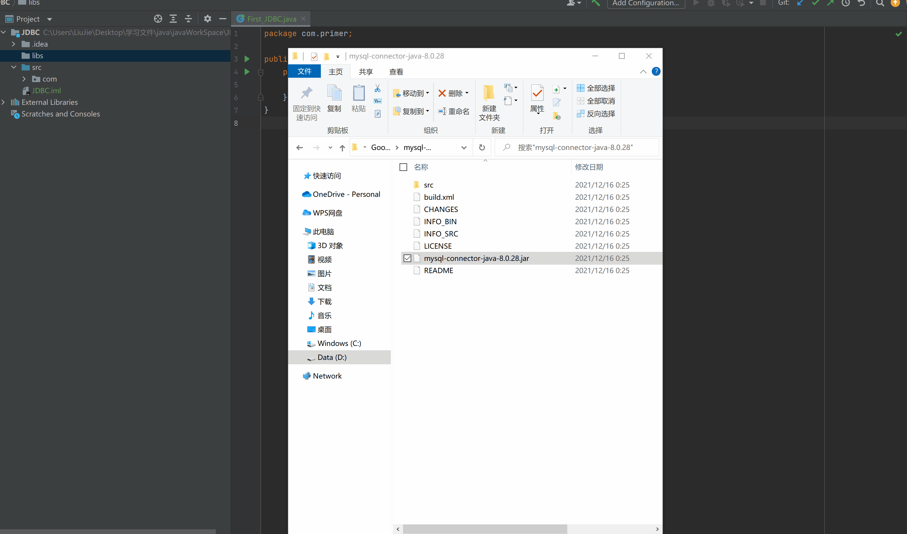
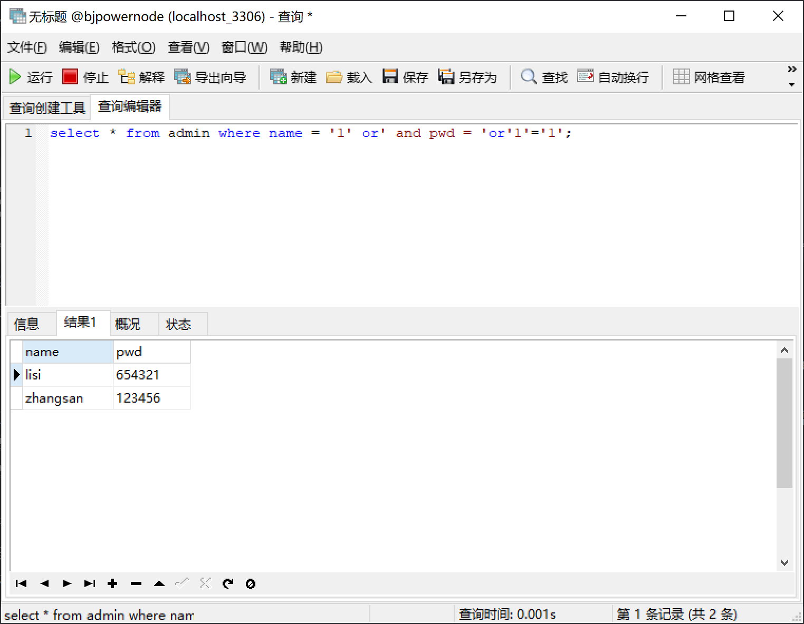

## JDBC的定义与原理

```
因为数据库有很多种，java想统一去连接，靠的就是提供一个接口，然后让其它数据库厂商去实现这个接口，开发出相应的类，然后打包生成一个jar（java驱动包）。
JDBC实际上就是Java提供一套用于数据库操作的接口API,Java程序员只需要面向这套接口编程即可。不同的数据库厂商，需要针对这套接口，提供不同实现。
```



## JDBC API

```
JDBC API是一系列的接口，它统一和规范了应用程序与数据库的连接、执行SQL语句，并到得到返回结果等各类操作,相关类和接口在java.sql与javaxssql包中
```

## JDBC编写步骤

```
1、注册驱动 -- 加载Driver类
2、获取连接 -- 得到Connection
3、执行增删改查 -- 发送SQL给mysql执行
4、释放资源 -- 关闭相关连接
```

## 导入jar包

```
以MySQL为例
1、前往https://dev.mysql.com/downloads/connector/j/ 网站下载jar包，本地电脑mysql的版本是5.5.x，目前mysql提供5和8版本的jar包。经过查阅得知8版本jar包兼容5.5版本数据库。我直接下载的8版本，window系统的zip文件
2、解压将jar结尾的jar包放在项目目录下，并添加到项目，见下图所示
```



## 数据库连接

### 方式1 静态加载

```
静态加载，灵活性差，依赖性强
```

```java
package com.primer;

import com.mysql.cj.jdbc.Driver;

import java.sql.*;
import java.util.Properties;

public class First_JDBC {
    public static void main(String[] args) throws SQLException {
        // 1、注册驱动
        Driver driver = new Driver();
        /* 2、得到连接:
         *   */
        String url = "jdbc:mysql://localhost:3306/bjpowernode";
        Properties properties = new Properties();
        properties.setProperty("user", "root");
        properties.setProperty("password", "123456");
        Connection connect = driver.connect(url, properties);
        // 3、执行sql
        String sql = "select * from dept";
        // 接收返回的结果对象
        Statement statement = connect.createStatement();
        ResultSet result = statement.executeQuery(sql);
        ResultSetMetaData rsmd = result.getMetaData();
        int columnsNumber = rsmd.getColumnCount();
        while (result.next()) {
            for (int i = 1; i <= columnsNumber; i++) {
                if (i > 1) System.out.print(",  ");
                String columnValue = result.getString(i);
                System.out.print("[列名:" + rsmd.getColumnName(i) + "](值:" + columnValue + ")");
            }
            System.out.println("");
        }
        // 4、关闭连接
        statement.close();
        connect.close();
        result.close();
    }
}
```

### 方式2 动态加载

```
使用反射加载Driver类，动态加载，更加的灵活，减少依赖性
注意：newInstance()被注释成过时方法了，故不再推荐该方式
```

```java
package com.primer;

import com.mysql.cj.jdbc.Driver;

import java.sql.*;
import java.util.Properties;

public class Second_JDBC {
    public static void main(String[] args) throws ClassNotFoundException, InstantiationException, IllegalAccessException, SQLException {
        Class<?> aClass = Class.forName("com.mysql.cj.jdbc.Driver");
        // 1、注册驱动
        Driver driver = (Driver)aClass.newInstance();
        /* 2、得到连接:
         *   */
        String url = "jdbc:mysql://localhost:3306/bjpowernode";
        Properties properties = new Properties();
        properties.setProperty("user", "root");
        properties.setProperty("password", "123456");
        Connection connect = driver.connect(url, properties);
        // 3、执行sql
        String sql = "select * from dept";
        // 接收返回的结果对象
        Statement statement = connect.createStatement();
        ResultSet result = statement.executeQuery(sql);
        ResultSetMetaData rsmd = result.getMetaData();
        int columnsNumber = rsmd.getColumnCount();
        while (result.next()) {
            for (int i = 1; i <= columnsNumber; i++) {
                if (i > 1) System.out.print(",  ");
                String columnValue = result.getString(i);
                System.out.print("[列名:" + rsmd.getColumnName(i) + "](值:" + columnValue + ")");
            }
            System.out.println("");
        }
        // 4、关闭连接
        statement.close();
        connect.close();
        result.close();
    }
}
```

### 方式3 统一管理

```
使用DriverManager替代Driver
```

```java
package com.primer;

import com.mysql.cj.jdbc.Driver;
import java.sql.*;

public class Third_JDBC {
    public static void main(String[] args) throws ClassNotFoundException, InstantiationException, IllegalAccessException, SQLException {
        Class<?> aClass = Class.forName("com.mysql.cj.jdbc.Driver");
        // 1、注册驱动
        Driver driver = (Driver)aClass.newInstance();
        /* 2、得到连接:
         *   */
        String url = "jdbc:mysql://localhost:3306/bjpowernode";
        String username = "root";
        String password = "123456";
        DriverManager.registerDriver(driver);
        Connection connect = DriverManager.getConnection(url,username,password);
        // 3、执行sql
        String sql = "select * from dept";
        // 接收返回的结果对象
        Statement statement = connect.createStatement();
        ResultSet result = statement.executeQuery(sql);
        ResultSetMetaData rsmd = result.getMetaData();
        int columnsNumber = rsmd.getColumnCount();
        while (result.next()) {
            for (int i = 1; i <= columnsNumber; i++) {
                if (i > 1) System.out.print(",  ");
                String columnValue = result.getString(i);
                System.out.print("[列名:" + rsmd.getColumnName(i) + "](值:" + columnValue + ")");
            }
            System.out.println("");
        }
        // 4、关闭连接
        statement.close();
        connect.close();
        result.close();
    }
}
```

### 方式4 统一管理的简写

```
Driver类有一个静态代码块，用反射加载Driver类时，源码帮我们执行了DriverManager.registerDriver(driver);
```

```java
package com.primer;

import com.mysql.cj.jdbc.Driver;

import java.sql.*;

public class Fourth_JDBC {
    public static void main(String[] args) throws ClassNotFoundException, InstantiationException, IllegalAccessException, SQLException {
        // 1、注册驱动
        Class.forName("com.mysql.cj.jdbc.Driver");
        /* 2、得到连接:
         *   */
        String url = "jdbc:mysql://localhost:3306/bjpowernode";
        String username = "root";
        String password = "123456";
        Connection connect = DriverManager.getConnection(url,username,password);
        // 3、执行sql
        String sql = "select * from dept";
        // 接收返回的结果对象
        Statement statement = connect.createStatement();
        ResultSet result = statement.executeQuery(sql);
        ResultSetMetaData rsmd = result.getMetaData();
        int columnsNumber = rsmd.getColumnCount();
        while (result.next()) {
            for (int i = 1; i <= columnsNumber; i++) {
                if (i > 1) System.out.print(",  ");
                String columnValue = result.getString(i);
                System.out.print("[列名:" + rsmd.getColumnName(i) + "](值:" + columnValue + ")");
            }
            System.out.println("");
        }
        // 4、关闭连接
        statement.close();
        connect.close();
        result.close();
    }
}
```

### 方式5 统一管理特定版本下再次简写(不建议省略)

```
1.mysqL驱动5.1.6可以无需CLass.forName("com.mysql.cj.jdbc.Driver");
2.从jdk1.5以后使用了jdbc4,不再需要显示调用class.forName()注册驱动而是自动调用驱动jar包下META-INF\services\java .sql.Driver文本中的类名称去注册
```

```
package com.primer;

import com.mysql.cj.jdbc.Driver;

import java.sql.*;

public class Fourth_JDBC {
    public static void main(String[] args) throws ClassNotFoundException, InstantiationException, IllegalAccessException, SQLException {
        // 1、注册驱动
        // Class.forName("com.mysql.cj.jdbc.Driver");
        /* 2、得到连接:
         *   */
        String url = "jdbc:mysql://localhost:3306/bjpowernode";
        String username = "root";
        String password = "123456";
        Connection connect = DriverManager.getConnection(url,username,password);
        // 3、执行sql
        String sql = "select * from dept";
        // 接收返回的结果对象
        Statement statement = connect.createStatement();
        ResultSet result = statement.executeQuery(sql);
        ResultSetMetaData rsmd = result.getMetaData();
        int columnsNumber = rsmd.getColumnCount();
        while (result.next()) {
            for (int i = 1; i <= columnsNumber; i++) {
                if (i > 1) System.out.print(",  ");
                String columnValue = result.getString(i);
                System.out.print("[列名:" + rsmd.getColumnName(i) + "](值:" + columnValue + ")");
            }
            System.out.println("");
        }
        // 4、关闭连接
        statement.close();
        connect.close();
        result.close();
    }
}
```


## ResultSet

```
表示数据库结果集的数据表，通常通过执行查询数据库的语句生成。
ResultSet对象保持一个光标指向其当前的数据行。 最初，光标位于第一行之前。 next方法将光标移动到下一行，并且由于在ResultSet对象中没有更多行时返回false ，因此可以在while循环中使用循环来遍历结果集。 
```

```java
package com.ResultSet;
import java.sql.*;

public class Main {
    public static void main(String[] args) throws ClassNotFoundException, SQLException {
        // 1、注册驱动
        Class.forName("com.mysql.cj.jdbc.Driver");
        /* 2、得到连接:
         *   */
        String url = "jdbc:mysql://localhost:3306/bjpowernode";
        String username = "root";
        String password = "123456";
        Connection connect = DriverManager.getConnection(url, username, password);
        // 3、执行sql
        String sql = "select * from dept";
        // 接收返回的结果对象
        Statement statement = connect.createStatement();
        ResultSet result = statement.executeQuery(sql);
        ResultSetMetaData rsmd = result.getMetaData();
        while (result.next()) {
            for (int i = 1; i <= rsmd.getColumnCount(); i++) {
                if (i > 1) System.out.print(",  ");
                String columnValue = result.getString(i);
                System.out.print("[列名:" + rsmd.getColumnName(i) + "](值:" + columnValue + ")");
            }
            System.out.println("");
        }
        // 4、关闭连接
        statement.close();
        connect.close();
        result.close();
    }
}
```

## Statement接口

```
用于执行静态SQL语句并返回其生成的结果的对象。存在一个SQL注入风险。
PreparedStatement[预处理]CallableStatement[存储过程]
SQL注入是利用某些系统没有对用户输入的数据进行充分的检查，而在用户输入数据中注入非法的SQL语句段或命令,恶意攻击数据库。
要防范SQL注入,只要用 PreparedStatement(从Statement扩展而来)取代Statement就可以了
```

## SQL注入

```sql
// 当用户在登录的时候，正常的输入账号名和密码，执行的SQL语句应该是这样的
select * from admin where name = 'tom' and pwd = '123';
// 但是，有心之人可以输入账号名为 1' or 密码为 or '1' = '1 ,此时sql语句就变成了
select * from admin where name = '1' or' and pwd = 'or'1'='1';
// '1' = '1'是永远为true的，因此就能查到账号，就拥有了登录的权限
```



```java
/*
 * @说明：演示statement的SQL注入问题
 * */
package com.statement_;

import java.sql.*;
import java.util.Scanner;

public class Main {
    public static void main(String[] args) throws ClassNotFoundException, SQLException {
        /*
         * next() 会将空格作为一次输入，如果直接复制粘贴1' or，会被当成两次输入，然后程序会立刻执行，报错
         * nextLine() 是接收一行
         * */
        Scanner scanner = new Scanner(System.in);
        System.out.println("请输入用户名");
//        String admin_name = scanner.next();
        String admin_name = scanner.nextLine();
        System.out.println("请输入密码");
//        String admin_pwd = scanner.next();
        String admin_pwd = scanner.nextLine();
        // 1、注册驱动
        Class.forName("com.mysql.cj.jdbc.Driver");
        /* 2、得到连接:
         *   */
        String url = "jdbc:mysql://localhost:3306/bjpowernode";
        String username = "root";
        String password = "123456";
        Connection connection = DriverManager.getConnection(url, username, password);
        // 3、执行sql
        String sql = "select name,pwd from admin where name = '" + admin_name + "' and pwd = '" + admin_pwd + "'";
        System.out.println(sql);
        // 接收返回的结果对象
        Statement statement = connection.createStatement();
        ResultSet result = statement.executeQuery(sql);
        ResultSetMetaData rsmd = result.getMetaData();
        if (result.next()) {
            // 查询到用户
            System.out.println("登录成功");
            for (int i = 1; i <= rsmd.getColumnCount(); i++) {
                if (i > 1) System.out.print(",  ");
                String columnValue = result.getString(i);
                System.out.print("[列名:" + rsmd.getColumnName(i) + "](值:" + columnValue + ")");
            }
            System.out.println("");
        } else {
            System.out.println("登录失败");
        }
        // 4、关闭连接
        statement.close();
        connection.close();
        result.close();
        scanner.close();
    }
}
```


## 预处理PreparedStatement接口

```
表示预编译的SQL语句的对象。 
SQL语句已预编译并存储在PreparedStatement对象中。 然后可以使用该对象多次有效地执行此语句。
方法：
    1. PreparedStatement 执行的SQL语句中的参数用问号(?)来表示，调用PreparedStatement对象的setXxx()方法来设置这些参数. 
    setXxx()方法有两个参数，第一个参数是要设置的SQL语句中的参数的索引(从1开始),第二个是设置的SQL语句中的参数的值
    2.调用executeQueryO，返回 ResuiltSet 对象
    3.调用executeUpdate():执行更新，包括增、删、修改，返回受影响的行数
好处：
	1.不再使用+拼接sql语句，减少语法错误
	2.有效的解决了sql注入问题!
	3.大大减少了编译次数，效率较高
```

```java
/*
    @说明:演示PreparedStatement的使用
*/
package com.preparedStatement_;

import java.sql.*;
import java.util.Scanner;

public class Main {
    public static void main(String[] args) throws ClassNotFoundException, SQLException {
        Scanner scanner = new Scanner(System.in);
        System.out.println("请输入用户名");
//        String admin_name = scanner.next();
        String admin_name = scanner.nextLine();
        System.out.println("请输入密码");
//        String admin_pwd = scanner.next();
        String admin_pwd = scanner.nextLine();
        // 1、注册驱动
        Class.forName("com.mysql.cj.jdbc.Driver");
        /* 2、得到连接:
         *   */
        String url = "jdbc:mysql://localhost:3306/bjpowernode";
        String username = "root";
        String password = "123456";
        Connection connection = DriverManager.getConnection(url, username, password);
        // 3、执行sql,?占位符
        String sql = "select name,pwd from admin where name = ? and pwd = ?";
        // 接收返回的结果对象
        PreparedStatement preparedStatement = connection.prepareStatement(sql);
        preparedStatement.setString(1,admin_name);
        preparedStatement.setString(2,admin_pwd);
        ResultSet result = preparedStatement.executeQuery();
        if (result.next()) {
            // 查询到用户
            System.out.println("登录成功");
        } else {
            System.out.println("登录失败");
        }
        sql = "insert into admin values (?,?)";
        preparedStatement = connection.prepareStatement(sql);
        preparedStatement.setString(1,admin_name+"1");
        preparedStatement.setString(2,admin_pwd+"1");
        Integer i = preparedStatement.executeUpdate();
        System.out.println(i);
        // 4、关闭连接
        preparedStatement.close();
        connection.close();
        result.close();
        scanner.close();
    }
}
```

## JDBCUtils类

```java
/*
    @说明:封装一个JDBC的工具类
    @作用:连接数据库，关闭数据库
*/
package com.JDBCUtils;

import java.io.FileInputStream;
import java.io.IOException;
import java.sql.*;
import java.util.Properties;

public class JDBCUtils {
    private static String user = "";
    private static String password = "";
    private static String url = "";
    private static String driver = "";

    static {
        Properties properties = new Properties();
        try {
            properties.load(new FileInputStream("src\\mysql.init"));
            user = properties.getProperty("user");
            password = properties.getProperty("password");
            url = properties.getProperty("url");
            driver = properties.getProperty("driver");
        } catch (IOException e) {
            // 实际开发时，经常将编译异常转为运行异常，调用者就可以选择默认处理和自己处理
            throw new RuntimeException(e);
        }
    }

    // 建立连接
    public static Connection getConnection(){
        try {
            return DriverManager.getConnection(url,user,password);
        } catch (SQLException e) {
            throw new RuntimeException(e);
        }
    }

    // 关闭相关资源
    public static void close(ResultSet set, Statement statement, Connection connection){
        try {
            if(set != null){
                set.close();
            }
            if(statement != null){
                statement.close();
            }
            if(connection != null){
                connection.close();
            }
        }catch (SQLException e){
            throw new RuntimeException(e);
        }
    }
}
```

```java
/*
    @说明:JDBCUtils工具类的使用
*/
package com.JDBCUtils;

import java.sql.Connection;
import java.sql.PreparedStatement;
import java.sql.ResultSet;
import java.sql.SQLException;

public class JDBCUtils_Use {
    public static void main(String[] args) {
        Connection connection = JDBCUtils.getConnection();
        String sql = "select * from dept";
        try {
            PreparedStatement statement = connection.prepareStatement(sql);
            ResultSet result = statement.executeQuery();
            if(result.next()){
                System.out.println(result.getString(1)+"-"+result.getString(2)+"-"+result.getString(3));
            }
            JDBCUtils.close(result,statement,connection);
        } catch (SQLException e) {
            throw new RuntimeException(e);
        }
    }
}
```

## 事务

```
1. JDBC程序中当一个Connection对象创建时，默认情况下是自动提交事务。每次执行一个SQL语句时，如果执行成功，就会向数据库自动提交,而不能回滚。
2. JDBC程序中为了让多个SQL语句作为一个整体执行，需要使用事务。
3.调用Connection的setAutoCommit(false)可以取消自动提交事务
4.在所有的SQL语句都成功执行后,调用commit();方法提交事务
5.在其中某个操作失败或出现异常时,调用rollback();方法回滚事务
```

`不使用事务`

```java
/*
    @说明: 练习preparedStatement的使用
*/
package com.preparedStatement_;

import java.sql.*;

public class Practice {
    /*
    * create table admin(id int primary key auto_increment,name varchar(32) not null,pwd varchar(32) not null);
insert into admin(name,pwd) values ('tom','123456'),('lisi','123456'),('li3si','123456'),('li4si','123456'),('lis2i','123456');
update admin set name='king' where name = 'tom';
delete from admin where name = 'lisi';
select * from admin;*/
    public static void main(String[] args) throws ClassNotFoundException, SQLException {
        // 1、注册驱动
        Class.forName("com.mysql.cj.jdbc.Driver");
        /* 2、得到连接:
         *   */
        String url = "jdbc:mysql://localhost:3306/bjpowernode";
        String username = "root";
        String password = "123456";
        Connection connection = DriverManager.getConnection(url, username, password);
        // 3、执行sql
        String sql = "create table admin(id int primary key auto_increment,name varchar(32) not null,pwd varchar(32) not null);";
        String sqlS = "select * from admin;";
        // 接收返回的结果对象
        PreparedStatement preparedStatement = connection.prepareStatement(sql);
        preparedStatement.execute();
        sql = "insert into admin(name,pwd) values ('tom','123456'),('lisi','123456'),('li3si','123456'),('li4si','123456'),('lis2i','123456');";
        preparedStatement = connection.prepareStatement(sql);
        preparedStatement.execute();
        sql = "update admin set name='king' where name = 'tom';";
        preparedStatement = connection.prepareStatement(sql);
        preparedStatement.execute();
        preparedStatement.execute();
        preparedStatement = connection.prepareStatement(sqlS);
        ResultSet result = preparedStatement.executeQuery();
        if (result.next()) {
            // 查询到用户
            System.out.println("登录成功");
        } else {
            System.out.println("登录失败");
        }
        // 4、关闭连接
        preparedStatement.close();
        connection.close();
        result.close();
    }
}
```

`使用事务`

