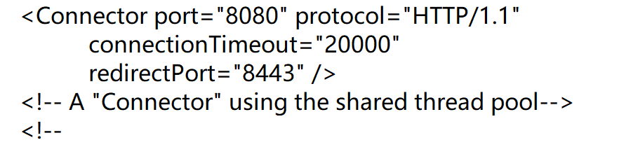

CS和BS的区别

```
CS：客户端-服务器架构模式
	优点：充分利用客户端机器的资源，减轻服务器端的负荷（一部分安全要求不高的计算存储任务可以放在客户端执行，不需要把所有的计算和存储都放在服务器上执行，从而能够减轻服务器端的压力，也能减轻网络的负担，降低网络的延迟）（cf：需要安装，但是网络延迟低和4399网页版枪战游戏：不需要安装，但是网络延迟高的区别）。
	缺点：需要安装，升级维护成本高。
BS：浏览器-服务器架构模式
	优点：客户端不需要安装，有浏览器就行，维护成本低。
	缺点：所有的计算和存储都放在服务器端，服务器端的负荷较重，在服务器端计算完成之后把结果再传输给客户端，因此客户端和服务器端会进行频繁的数据通信，网络负荷较重。
```

## tomcat的定义、下载、安装

```
定义：web容器，用来部署项目。
优点：免费，体积小，性能不差。
下载：官网（https://tomcat.apache.org/）下载，注意下载的版本号，我在这选择8版本。
安装：阅读博客（https://blog.csdn.net/qq_45745964/article/details/121213057）
注意：安装目录不能有空格和中文，tomcat其实也是一个java项目，服务器端也需要jre，需要给tomcat配置一个JAVA_HOME环境变量指向服务器端的jdk或者jre目录。
```


```
tomcat项目文件夹目录说明：
	bin:可执行文件目录，其中tomcat8w.exe为tomcat的启动程序
	conf:配置文件目录
	lib:存放lib的目录，全是jar包
	logs:日志文件目录
	webapps:项目部署的目录
	work:工作目录
	temp:临时文件
```


```
部署项目：最简单的方式就是在webapps静态资源目录下新建项目的根目录，在项目的根目录下面新建一个WEB-INF文件夹。因为tomcat的配置文件D:\softInstall\tomcat8\conf\server.xml的默认配置信息如下
```




## 在idea中新建javaweb项目与使用tomcat

[idea新建javaweb项目与配置tomcat](https://blog.csdn.net/llplllll/article/details/116903198)

### idea的web静态文件目录在哪


`对博客内容的补充`


## javaweb入门案例

### 导入tomcat依赖

```
为了导入tomcat\lib下的http jar包来接收前端的请求
```


### 导入数据库依赖


### 编写代码

`Servlet`

```java
/*
    @说明: 设置一个接口
*/
package com.servlets;


import javax.servlet.ServletException;
import javax.servlet.http.HttpServlet;
import javax.servlet.http.HttpServletRequest;
import javax.servlet.http.HttpServletResponse;
import java.io.BufferedReader;
import java.io.IOException;

public class AddServlet extends HttpServlet {
    @Override
    public void doPost(HttpServletRequest req, HttpServletResponse resp) throws ServletException, IOException {
        StringBuilder sb = new StringBuilder();
        BufferedReader reader = req.getReader();
        char[] buf = new char[1024];
        int len;
        while ((len = reader.read(buf)) != -1){
            sb.append(buf,0,len);
        }
        System.out.println(sb.toString());
    }
}
```

`web.xml`

```xml
<?xml version="1.0" encoding="UTF-8"?>
<web-app xmlns="http://xmlns.jcp.org/xml/ns/javaee"
         xmlns:xsi="http://www.w3.org/2001/XMLSchema-instance"
         xsi:schemaLocation="http://xmlns.jcp.org/xml/ns/javaee http://xmlns.jcp.org/xml/ns/javaee/web-app_4_0.xsd"
         version="4.0">
    <servlet>
        <servlet-name>AddServlet</servlet-name>
        <servlet-class>com.servlets.AddServlet</servlet-class>
    </servlet>
    <servlet-mapping>
        <servlet-name>AddServlet</servlet-name>
        <url-pattern>/add</url-pattern>
    </servlet-mapping>
    <servlet>
        <servlet-name>TServlet</servlet-name>
        <servlet-class>com.servlets.TServlet</servlet-class>
    </servlet>
    <servlet-mapping>
        <servlet-name>TServlet</servlet-name>
        <url-pattern>/ts</url-pattern>
    </servlet-mapping>
    <!--
    1．用户发请求, action=add
    2．项目中, web.xml中找到url-pattern = /add
    3．找和servlet-mapping中servlet-name一致的servlet
    4．找第8行的servlet-class ->
    -->
</web-app>
```

`index.html`

```html
<!DOCTYPE html>
<html lang="en">
<head>
    <meta charset="UTF-8">
    <title>Title</title>
    <script src="https://cdn.bootcdn.net/ajax/libs/axios/0.26.1/axios.js"></script>
</head>
<body>
名称：<input type="text" class="value"/><br>
价格：<input type="text" class="value"/><br>
数量：<input type="text" class="value"/><br>
备注：<input type="text" class="value"/><br>
<button type="submit" id="btn">提交</button>
<script>
    const btn = document.getElementById("btn");
    const fname = document.getElementsByClassName("value");
    btn.addEventListener("click", function () {
        axios.post("http://localhost:8089/add", {
            "name": fname[0].value,
            "price": fname[1].value,
            "count": fname[2].value,
            "remark": fname[3].value
        });
    }, false);
</script>
</body>
</html>
```

### 运行示例


## 对tomcat的一些理解

```
1、WEB-INF/web.xml里面配置了tomcat接管的servlet类，只要在里面配置了，tomcat源代码会去读取这个文件，从而去加载对应的servlet类，如果配置的类不是servlet类，idea会有下划线提示错误。
2、tomcat8/conf/web.xml下配置了tomcat源代码需要加载的servlet类，里面有jsp文件的映射，jsp文件在tomcat中会被解析成一个class文件，通过javap反编译得知jsp会被解析成一个继承了servlet的类。
3、我们编写的类为什么doPost()和doGet()方法会被执行，是因为Servlet接口定义了service()方法，GenericServlet抽象类抽象了service()，HttpServlet()给出了service()的具体实现，而tomcat源代码会调用web.xml中servlet类的service()。在HttpServlet中的service()中会调用doPost()，因此我们只需要重写父类HttpServlet中的doGet()等方法就能被执行。
```


```
4、通过前面的理解我们可以自己举例实现一下，进行自己的封装
```

```java
package com.servlets;

import javax.servlet.GenericServlet;
import javax.servlet.ServletException;
import javax.servlet.ServletRequest;
import javax.servlet.ServletResponse;
import javax.servlet.http.HttpServletRequest;
import javax.servlet.http.HttpServletResponse;
import java.io.IOException;

public class MyHttpServlet extends GenericServlet {

    @Override
    public void service(ServletRequest servletRequest, ServletResponse servletResponse) throws ServletException, IOException {
        HttpServletRequest request;
        HttpServletResponse response;
        try {
            request = (HttpServletRequest)servletRequest;
            response = (HttpServletResponse)servletResponse;
        } catch (ClassCastException var6) {
            throw new ServletException("http.non_http");
        }
        String method = request.getMethod();
        long lastModified;
        if (method.equals("GET")) {
            System.out.println("get");
            this.myDoget(request,response);
        }
        if (method.equals("POST")){
            System.out.println("post");
            this.myDoget(request,response);
        }
    }
    public void myDoget(HttpServletRequest servletRequest, HttpServletResponse servletResponse){
        System.out.println("执行了....");
    }
}
```

```java
package com.servlets;

import javax.servlet.http.HttpServletRequest;
import javax.servlet.http.HttpServletResponse;

public class TServlet extends MyHttpServlet{
    @Override
    public void myDoget(HttpServletRequest servletRequest, HttpServletResponse servletResponse) {
        System.out.println(111);
    }
}
```

## tomcat控制台乱码

```
cmd的编码默认是GBK
tomcat8\conf\logging.properties里面的java.util.logging.ConsoleHandler.encoding = GBK的编码
二者保持一致即可
```

