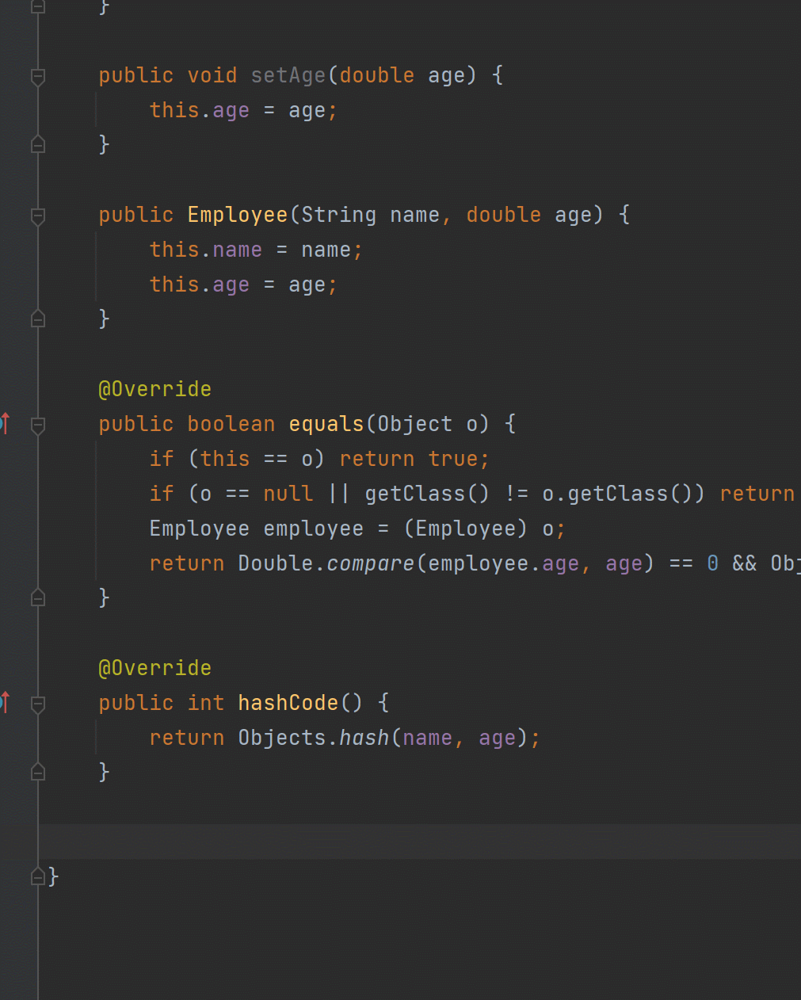
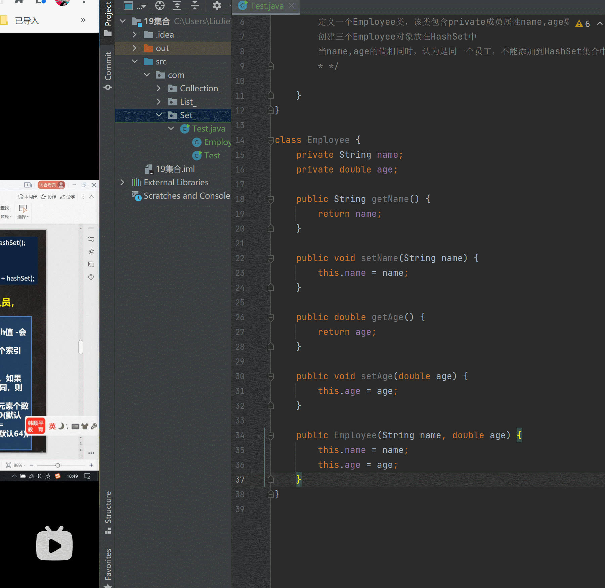
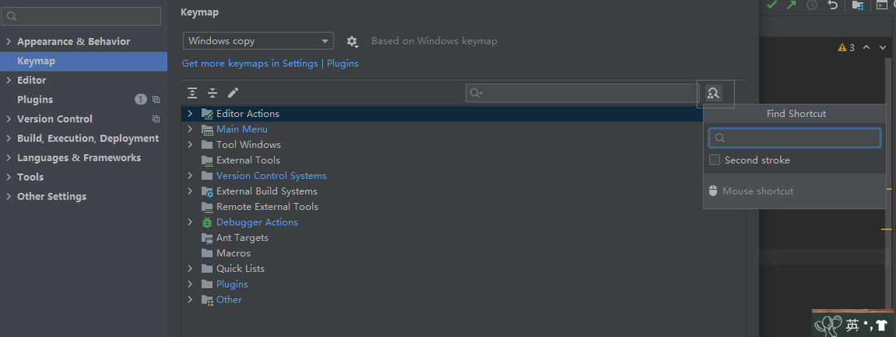
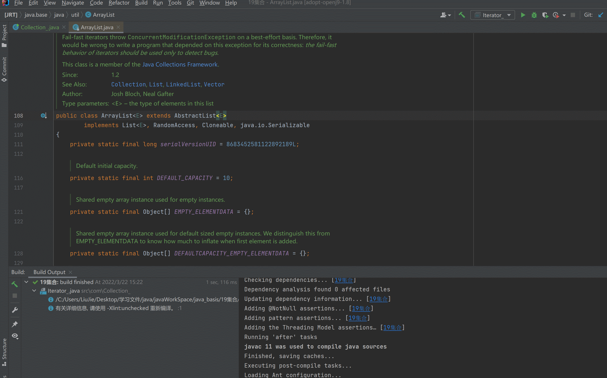

### 新建项目

1. 


2. 选择jdk


3. 选择新项目文件夹的位置


### 新建文件

1. 


2. 输入文件的名称


### 修改字体大小

`选择File/Setting`


### 设置文件的编码

`选择File/Setting`


### 使用IDEA实现一个冒泡排序

1. 案例源码


2. 右键执行


3. 文件说明

```
src 是项目的java文件
out 是项目运行编译之后生成的class文件
```


### IDEA的快捷键


### 自动导包


### 批量生成get和set


### 自动生成构造器


### 重写toString方法



### 重写hashCode的equals方法



### 查看当前类的结构


### 断点调试


### 修改快捷键时的方法

通过快捷（键盘/组合键）搜索



### new Class().var

快速生成 `Class class = new Class();`


### 动态模板

```
ctrl + j 查看所有的快捷键
```

#### psvm/main

```
快速生成main方法
```
#### sout
```
快速生成`System.out.printLn();`
```
#### fori
```
快速生成for循环
```
#### itit
```java
// 快速生成迭代循环
while (iterator.hasNext()) {
	Object next = iterator.next();
	
}
```
#### I

```
// 快速生成增强for循环
for (Object o :) {
    
}
```

### intellij IDEA创建文件添加注释模板


### 查看类的继承结构图


