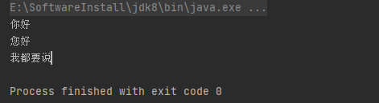
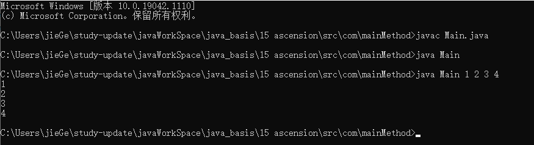
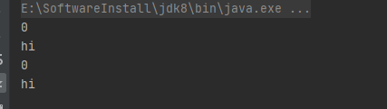

### 类变量（静态变量/静态属性）

#### 我们为什么需要类变量？

`下面给出一个案例`

```java
package com.vari;

public class Main {
    /* 现在有一个需求，就是一群小孩子在玩游戏，一会又有小朋友会陆陆续续的加入，
    请问我怎么知道当前有多少小朋友在玩游戏 不使用oop的话*/
    public static void main(String[] args) {
        // 所有学生的数量
        int count = 0;

        Student student = new Student();
        student.setName("小红");
        count++;

        Student student2 = new Student();
        student.setName("小红2");
        count++;

        Student student3 = new Student();
        student.setName("小红3");
        count++;
        System.out.println(count); // 3
    }
}

class Student {
    private String name;

    public Student() {

    }

    public String getName() {
        return name;
    }

    public void setName(String name) {
        this.name = name;
    }
}
```

`我们发现`

```
1、count独立于一个对象，java是面向对象编程的语言，count的存在很尴尬
2、以后我们访问count很麻烦。
```

`因此我们需要类变量`

#### 用类变量来实现

````
和JavaScript的构造函数身上的变量一样，可以被构造函数new出来的对象通过原型链访问到，当然构造函数的子构造函数new出来的对象也可以访问的到。
在java中，类变量被类new出来的所有对象共享。
````

`代码改造`

```java
package com.classVari;

public class Main {
    /* 现在有一个需求，就是一群小孩子在玩游戏，一会又有小朋友会陆陆续续的加入，
    请问我怎么知道当前有多少小朋友在玩游戏 使用oop的话*/
    public static void main(String[] args) {
        Student student = new Student();
        student.setName("小红");
        student.count++;

        Student student2 = new Student();
        student.setName("小红2");
        student2.count++;

        Student student3 = new Student();
        student.setName("小红3");
        student3.count++;
        System.out.println(student.count); // 3
    }
}

class Student {
    private String name;
	// 类变量
    public static int count = 0;
    public Student() {

    }

    public String getName() {
        return name;
    }

    public void setName(String name) {
        this.name = name;
    }
}
```

#### 类变量的定义语法

```
访问修饰符 static 数据类型 变量名; 推荐的方式
static 访问修饰符 数据类型 变量名;
```

#### 如何访问类变量

```
类名.类变量名 推荐的方式
对象名.类变量名
```

#### 类变量的使用细节

```
1、当我们需要让某个类的所有对象都共享一个变量时，就可以考虑使用类变量。比如学生类，需要统计所有学生的数量。
2、类变量与实例变量的区别：类变量是改类的所有对象共享的，而实例变量是每个对象独享的。
3、加上static称为类变量或静态变量，否则称为实例变量。
4、类变量可以通过类名.变量名或者对象名.变量名访问，但是推荐使用类名.变量名访问。访问的前提是满足访问修饰符的访问权限与规则。
5、类变量是在类加载时就初始化了，也就是说，即使没有创建对象，只要类加载了，依然可以使用类变量访问。案例1-1演示
6、类变量的生命周期是随着类的加载开始，随着类的消亡而终止的。
```

`1-1案例`

```java
package com.classVari;

public class Main2 {
    public static void main(String[] args) {
//        可以直接访问到
        System.out.println(Dog.count); //0
    }
}

class Dog {
    public static int count = 0;
    public Dog() {
    }
}
```

### 类方法（静态方法）
#### 类方法的语法
```
访问修饰符 static 数据返回类型 方法名(){} 推荐的方式
static 访问修饰符 数据返回类型 方法名(){}
```

#### 类方法的调用
```
类名.类方法名
对象.类方法名 前提是满足访问修饰符的权限和规则
```

#### 为什么要使用类方法？
```
如果我们希望不创建实例，也可以调用某个方法，该方法与对象无关对应着JavaScript原型链上的方法。一般静态方法多为工具方法。
```

#### 使用类方法的注意事项
```
1、类方法和类变量一致，都是随着类的加载而开始，随着类的销毁而终止
2、类方法与对象无关，因此不存在this参数，而普通方法中有this，同理super也是一样的。
3、普通方法/成员方法需要通过对象.方法名调用，不能使用类名.方法名调用
4、类方法中只能访问静态变量和静态方法。
5、普通成员方法中，既可以访问普通方法也可以访问静态变量。
```

```java
package com.publicMethod;

public class Main {
    public static void main(String[] args) {
        Student.say();
        Student.content = "您好";
        Student.sayAll();
    }
}

class Student {
    public static String content = "你好";
    public static void say(){
        System.out.println(Student.content);
    }

    public  static void sayAll(){
        Student.say();
        System.out.println("我都要说");
    }
}
```



### 理解main()方法语法

#### 什么是main方法？

```
1、main方法由java虚拟机调用
2、java虚拟机需要调用类的main方法，所以该方法的访问权限必须是public
3、java虚拟机在执行main()方法时不必创建对象，因此该方法必须是static静态的
4、该方法接收java虚拟机传递的String类型的数组参数
5、传递参数的形式 java Main 参数1 参数2 参数3 ...
```

```java
public class Main {
    public static void main(String[] args) {
        for (int i = 0; i < args.length; i++) {
            System.out.println(args[i]);
        }
    }
}
```



#### 使用main方法的注意事项

```
在main方法中，可以直接访问main方法所在类中的类变量和类方法，但是不能访问类的成员变量和成员方法，必须实例一个对象，通过对象.去调用
```

```java
package com.mainMethod.note;

public class Main {
    /**
     * @a 类变量
     * @b 成员变量
     * @say 类方法
     * @say2 成员方法
     */
    public static int a;

    public static void say() {
        System.out.println("hi");
    }

    public int b;

    public void say2() {
        System.out.println("hi");
    }

    public static void main(String[] args) {
        //        在main方法中成员变量和方法要通过new一个对象来访问
        Main main = new Main();
        System.out.println(main.b);
        //        类方法和类变量直接访问
        main.say2();
        System.out.println(a);
        say();
    }
}
```



### 代码块

#### 代码块是什么？

```
1、代码块又称为初始化块，属于类中的成员，类似于方法，但是没有方法名，没有返回，没有参数，不用通过对象或者类.去调用，而是在类加载时，或者new一个对象时隐式调用。
2、基本语法：
	修饰符{
		代码
	};
3、修饰符只能是static
4、末尾的;可以省略
```

#### 代码块的作用？

```
与构造器结合使用，当多个构造器中有很多重复的代码时，可以将重复的代码放在代码块中，这样在new一个对象时，代码块也可以被隐式调用。
```

```java
package com.codingBlock.role;

public class Main {
    public static void main(String[] args) {
        System.out.println("哈哈哈");
    }
}

class Student {
    {
        System.out.println("不加static，在类加载的时候不会被执行，当new一个对象的时候会被调用");
    };
}
```

#### 代码块的使用细节

```
1、static代码块也叫静态代码块，作用就是对类进行初始化，而且它随着类的加载而执行，并且只会执行一次。如果是普通代码块，每创建一个对象就会执行一次。
2、类什么时候被加载：
	1、创建对象时
	2、创建子类对象时 见案例演示1
	3、使用类的静态成员时 见案例演示1
3、创建一个对象时，在一个类中的调用顺序是什么： 见案例演示2
	1、静态代码块和静态属性初始化（他们两个按照定义的顺序调用）
	2、普通代码块和普通属性初始化（他们两个按照定义的顺序调用）
	3、调用构造方法
4、静态代码块中只能直接访问静态属性和静态方法，因为静态代码块只执行一次就是在类加载的时候，此时根本就没有对象，更不会有this了。
5、创建一个子类时，他们的静态代码块、普通代码块、静态属性初始化、普通属性初始化、构造器的调用顺序是： 见案例演示3
	1、父静态变量初始化和父静态代码块
	2、子静态变量初始化和子静态代码块
	3、父普通变量初始化和父普通代码块
	4、父构造器
	5、子普通变量初始化和子普通代码块
	6、子构造器
	解析：new 一个变量需要先加载类，因此先加载父类，再加载子类，此时执行顺序1、2。然后new一个子类对象，执行子构造器，在子构造器的最前面默认调用super和普通代码块和普通变量初始化，先调用super()会调用父类的构造器，父类的构造器默认调用super和普通代码块和普通变量初始化，此时执行顺序3、4。再回到子类构造器，普通代码块和普通变量初始化再执行，此时执行顺序5。最后再将子构造器中的逻辑继续执行完，执行顺序6。
```

`演示1`

```java
package com.codingBlock.details;

public class Main {
    public static void main(String[] args) {
        System.out.println(Son.a);
        Son son = new Son();
    }
}

class Father {
    static {
        System.out.println("静态代码块");
    }
}

class Son extends Father {
    public static int a;
    static {
        System.out.println("静态代码块");
    }
}
```


`演示2`

```java
package com.codingBlock.details;

public class Main2 {
    public static void main(String[] args) {
        Dog dog = new Dog();
    }
}

class Dog {
    //    静态变量初始化
    public static int a = A();

    private static int A() {
        System.out.println("静态变量初始化");
        return 1;
    }

    //    普通代码块
    {
        System.out.println("普通代码块");
    }

    //    属性初始化
    public int b = B();

    private int B() {
        System.out.println("属性初始化");
        return 1;
    }

    //    静态代码块
    static {
        System.out.println("静态代码块");
    }


    //    构造器
    public Dog() {
        // 隐式调用了super()和普通代码块，因此普通代码块的逻辑执行先与构造器中的逻辑
        System.out.println("构造器");
    }
}
```


`演示3`

```java
package com.codingBlock.details;

public class Main3 {
    public static void main(String[] args) {
        Cat cat = new Cat();
    }
}

class Animal{
    //    静态变量初始化
    public static int a = A();

    private static int A() {
        System.out.println("父静态变量初始化");
        return 1;
    }

    //    普通代码块
    {
        System.out.println("父普通代码块");
    }

    //    属性初始化
    public int b = B();

    private int B() {
        System.out.println("父属性初始化");
        return 1;
    }

    //    静态代码块
    static {
        System.out.println("父静态代码块");
    }


    //    构造器
    public Animal() {
        // 隐式调用了super()和普通代码块，因此普通代码块的逻辑执行先与构造器中的逻辑
        System.out.println("父构造器");
    }
}

class Cat extends Animal{
    //    静态变量初始化
    public static int a = A();

    private static int A() {
        System.out.println("子静态变量初始化");
        return 1;
    }

    //    普通代码块
    {
        System.out.println("子普通代码块");
    }

    //    属性初始化
    public int b = B();

    private int B() {
        System.out.println("子属性初始化");
        return 1;
    }

    //    静态代码块
    static {
        System.out.println("子静态代码块");
    }

    //    构造器
    public Cat() {
        // 隐式调用了super()和普通代码块，因此普通代码块的逻辑执行先与构造器中的逻辑
        System.out.println("子构造器");
    }
}
```


### 静态代码块和静态属性的经典应用场景之单例模式

```
单例模式指整个系统中，只需要这个类的一个对象。
有两种：饿汉式和懒汉式
```

#### 饿汉式

```
类将构造器私有化，不让调用者自己new，类自己nwe一个对象，然后提供一个静态方法将这个对象返回给调用者。
```

```java
package com.singleton;

public class Main {
    public static void main(String[] args) {
        //    1、不让调用者使用new一个对象
//    Singleton singleton = new Singleton();
//    2、提供一个方法给调用者访问对象
        Singleton singleton = Singleton.getSingleton();
        System.out.println(singleton.getName());
        /*
        * 修改第一次得到的对象的成员变量，然后修改，再得到一次对象，发现两个对象的成员变量相同，证明是同一个对象*/
        singleton.setName(singleton,"zhangsan");
        singleton = Singleton.getSingleton();
        System.out.println(singleton.getName());
        Singleton singleton2 = Singleton.getSingleton();
        System.out.println(singleton2.getName());
        System.out.println(singleton.equals(singleton2));
    }
}

class Singleton {
    public static int a;
    // 如果我们只是访问一下a,此时类会被加载，从而这个对象会被创建，但是我们并不需要这个对象
    private static Singleton singleton = new Singleton();
    public String name;

    private Singleton() {

    }

    public static Singleton getSingleton() {
        return singleton;
    }

    public static String getName() {
        return singleton.name;
    }

    public static Singleton setName(Singleton singleton,String name) {
        singleton.name = name;
        return singleton;
    }
}
```


#### 懒汉式

```
饿汉式，当类中有静态变量时，我们只是调用了一下，我们并不想要创建这个对象，但是因为类加载了，这个对象也在内部被创建了，浪费内存空间，因此饿汉式更好
```

```java
package com.singleton.c2;

public class Main2 {
    public static void main(String[] args) {
        //    1、不让调用者使用new一个对象
//    Singleton singleton = new Singleton();
//    2、提供一个方法给调用者访问对象
        Singleton singleton = Singleton.getSingleton();
        System.out.println(singleton.getName());
        /*
         * 修改第一次得到的对象的成员变量，然后修改，再得到一次对象，发现两个对象的成员变量相同，证明是同一个对象*/
        singleton.setName(singleton,"zhangsan");
        singleton = Singleton.getSingleton();
        System.out.println(singleton.getName());
        Singleton singleton2 = Singleton.getSingleton();
        System.out.println(singleton2.getName());
        System.out.println(singleton.equals(singleton2));
    }
}

class Singleton {
    private static Singleton singleton;
    public String name;

    private Singleton() {

    }

    public static Singleton getSingleton() {
        // 当我们真正需要这个对象时再创建
        if(singleton == null){
            singleton = new Singleton();
        }
        return singleton;
    }

    public static String getName() {
        return singleton.name;
    }

    public static Singleton setName(Singleton singleton,String name) {
        singleton.name = name;
        return singleton;
    }
}
```

### final关键字

#### final的定义与使用

```
final翻译成最后，最终的意思，顾名思义不可改变
final可以用来修饰类、属性、方法、局部变量
经常在以下场景中使用
	1、类不想被继承时
	2、类中的方法不想被重写
	3、类中的属性的值不想被改变
	4、局部变量的值不想被修改
```

```java
package com.fina;

public class introduce {
    public static void main(String[] args) {
        // Father.name = "hhh";

    }
}

class Father {
    //    类的属性不想被修改
    public static final String name = null;

    //方法不想被重写
    public final void say() {
//        局部变量不想被修改
        final int a = 0;
        System.out.println("父hi");
//        a = 1;
    }
}

//类不想被继承
final class Son extends Father {
//    public void say() {
//        System.out.println("子hi");
//    }
}

//class SonSon extends Son {
//
//}
```

#### final的使用细节

```
1、final修饰的变量又叫常量，一般用xx_xx_xx来命名。
2、final修饰的属性在定义时，必须要赋初始值，并且以后不能修改，赋值可以在三个位置 见案例1
	1、定义时
	2、在构造器中
	3、在非静态代码块
3、如果final修饰的属性是静态的，则初始化的位置只能是定义时和静态代码块中，不能在构造器中和非静态代码块赋值。 见案例1
4、final类不能被继承，但是可以实例化对象。
5、如果类不是final类，但是方法被final修饰，改方法不能被重写，但是可以被继承。
6、一般类是final修饰的，不能被继承，方法就不需要使用final修饰了。
7、final不能用来修饰构造器
8、final和static往往搭配使用，因为这么做底层效率更高。
9、包装类Integer、Double、Float、Boolean、String类都是final类。
```

`案例1`

```java
package com.fina.define;

public class Main {
    public static void main(String[] args) {

    }
}

class Dog {
//    public static final int A_B;
    public final int A_B;
    //    1.定义时给初始值
    //    public static final int a = 0;
//    2.构造器中给初始值
    public Dog() {
        A_B = 1;
    }

    //    3.代码块中定义初始值
//     {
//        A_B = 2;
//    }
//    static {
//        A_B = 2;
//    }
}
```


### 抽象类

#### 什么是抽象类

```
当父类的某些方法，需要声明，但是又不知道具体怎么实现（没有方法体）的时候，可以先将其声明成抽象方法，那么这个类就是抽象类。需要声明成一个abstract类。一般来说抽象类都会被继承
```

```java
package com.abst;

public class define {
    
}

abstract class Animal {
    public abstract void eat();
}

class Cat extends Animal {
    public void eat() {
        System.out.println("猫吃鱼");
    }
}
```

#### 抽象类的使用细节

```
1、抽象类不能被实例化
2、抽象类可以没有抽象方法
3、一旦类中有抽象方法，那么这个类就必须是抽象类
4、abstract只能用来修饰类和方法
5、抽象类依然还是类，类中有的（构造器、代码块、成员），抽象类也可以有。
6、抽象方法不能有主体，没有{}
7、如果一个类继承了抽象类，那么就必须实现抽象类中所有的抽象方法，除非子类也是抽象类
```

#### 抽象类的经典实现场景-模板设计模式

```java
package com.abst;

public class TemplatePattern {
    public static void main(String[] args) {
        Job1 job1 = new Job1();
        Job2 job2 = new Job2();
        System.out.println(job1.time());
        System.out.println(job2.time());
    }
}

abstract class statisticalTime{
    public abstract void job();
    public long time(){
        long lStart = System.currentTimeMillis();
        job();
        long lEnd = System.currentTimeMillis();
        return lEnd -lStart;
    }
}

class Job1 extends statisticalTime{
    @Override
    public void job() {
        String s = "";
        for (int i = 0; i < 10000; i++) {
            s += i + "";
        }
    }
}

class Job2 extends statisticalTime{
    @Override
    public void job() {
        String s = "";
        for (int i = 0; i < 10000; i++) {
            s += i + "";
        }
    }
}
```


### 接口

#### 用接口模拟USB快速入门接口

```java
// interface
package com.interfac.acquaintance;

public interface UsbInterface {
    public void start();

    public void end();
}

// Usb1
package com.interfac.acquaintance;

public class Usb1 implements UsbInterface{
    @Override
    public void start() {
        System.out.println("手机接入");
    }
    @Override
    public void end() {
        System.out.println("手机弹出");
    }
}

// Usb2
package com.interfac.acquaintance;

public class Usb2 implements UsbInterface{

    @Override
    public void start() {
        System.out.println("u盘接入");
    }

    @Override
    public void end() {
        System.out.println("U盘弹出");
    }
}

// computer
package com.interfac.acquaintance;

public class Computer {
    public static void work(UsbInterface usbInterface){
        usbInterface.start();
        usbInterface.end();
    }
}

// Main
package com.interfac.acquaintance;

public class Main {
    public static void main(String[] args) {
        Usb1 usb1 = new Usb1();
        Usb2 usb2 = new Usb2();
        Computer.work(usb1);
        Computer.work(usb2);
    }
}
```


#### 接口的定义

```
1、就是给出一些没有实现的方法，封装到一起，到某个类要使用的时候，再根据具体的情况将这些方法给写出来
2、语法：
interface 接口名{
	// 属性
	// 方法/抽象方法，可以省略abstract
}

class ；类名 implements 接口 {
	// 自己的属性
	// 自己的方法
	// 必须实现接口中的抽象方法
}

3、小结：在jdk7.0之前 接口中的所有方法都没有方法体。在jdk8之后的接口类可以有静态方法，默认方法（需要使用default关键字修饰），也就是说接口中可以有具体的实现。
```

```java
package com.interfac.define;

public class Main {
    public static void main(String[] args) {

    }
}

interface CCC{
    // 可以有自己的变量
    public int a = 0;

    // 可以有自己的静态方法
    public static void say(){
        System.out.println("hai");
    }

    // 可以有自己的成员方法，带方法体,必须要用default来修饰
    public default void start(){
        System.out.println("开始");
    }
}
```

#### 什么时候用接口呢？

```
列举一个场景帮助我们辨别是不是应该用接口
```

```java
package com.interfac.scenario;

/*
 * 给出我们的需求：
 *       我们需要连接三种数据库：MySQL，MongoDB、Oracle
 *       开发三个类，每个类中都要有连接和断开对应数据库的方法
 * */
// 不使用接口，交给三个程序员来开发对应的类
public class Main {
    public static void main(String[] args) {
        /*1、我们发现三个程序员可能声明的连接和断开的方法名称不一致
        * 2、再者我们调用连接和断开方法时，不能统一一套代码都能够调用*/
        Mysql1 mysql1 = new Mysql1();
        MongoDB1 mongoDB1 = new MongoDB1();
        Oracle1 oracle1 = new Oracle1();
        mysql1.connect();
        mongoDB1.start();
        oracle1.link();
        mysql1.disconnection();
        mongoDB1.end();
        oracle1.shotDowm();
    }
}

class Mysql1 {
    //    连接MySQL
    public void connect() {
        System.out.println("连接mysql");
    }

    //    断开MySQL
    public void disconnection() {
        System.out.println("断开mysql");
    }
}

class MongoDB1 {
    public void start() {
        System.out.println("连接MongoDB");
    }

    public void end() {
        System.out.println("断开MongoDB");
    }
}

class Oracle1 {
    public void link(){
        System.out.println("连接Oracle");
    }
    public void shotDowm(){
        System.out.println("断开Oracle");
    }
}
```

```java
package com.interfac.scenario;

/*
 * 给出我们的需求：
 *       我们需要连接三种数据库：MySQL，MongoDB、Oracle
 *       开发三个类，每个类中都要有连接和断开对应数据库的方法
 * */
// 使用接口，交给三个程序员来开发对应的类
public class Main2 {
    public static void main(String[] args) {
        /*1、我们发现三个程序员接和断开的方法名称被接口统一了
         * 2、再者我们调用连接和断开方法时，统一一套代码都能够调用*/
        test(new Mysql2());
        test(new MongoDB2());
        test(new Oracle2());
    }

    public static void test(DB db){
        db.connect();
        db.disconnection();
    }
}
// 定义一个数据库连接接口，里面必须要有连接和断开的方法
interface DB {
    public void connect();
    public void disconnection();
}

class Mysql2 implements DB{
    //    连接MySQL
    public void connect() {
        System.out.println("连接mysql");
    }

    //    断开MySQL
    public void disconnection() {
        System.out.println("断开mysql");
    }
}

class MongoDB2 implements DB{
    public void connect() {
        System.out.println("连接MongoDB");

    }

    public void disconnection() {
        System.out.println("断开MongoDB");
    }
}

class Oracle2 implements DB{
    public void connect() {
        System.out.println("连接Oracle");

    }

    public void disconnection() {
        System.out.println("断开Oracle");
    }
}
```

#### 接口的注意事项

```
1、接口不能被实例化。
2、接口中所有的方法是public方法，接口中的抽象方法，可以不用abstract修饰。
3、一个普通类实现接口，必须要实现接口中的所有抽象方法。
4、抽象类实现接口，可以不用实现接口的方法。
5、一个接口不能继承类，但是可以继承多个接口。
6、接口中的属性，只能是public static final。比如int a = 1;实际上是public static final int a = 1;必须要给初始值。
7、接口中的属性访问方法是：接口名.属性名
8、一个接口不能继承多个类，但是可以实现多个接口 见案例2
9、接口的修饰符只能是public 和 默认。
```

`案例1`

```java
package com.interfac.detail;

public class Main {
    public static void main(String[] args) {

    }
}

interface AA {
    public void a();
}

interface BB {
    public void b();
}

interface CC extends AA,BB{
    public void c();
}

class test implements CC{

    @Override
    public void a() {
        
    }

    @Override
    public void b() {

    }

    @Override
    public void c() {

    }
}
```

`案例2`

```java
package com.interfac.detail;

public class Main2 {
    public static void main(String[] args) {
        People people = new People();
        people.say();
        people.run();
    }
}

interface A {
    public abstract void say();
}

interface B {
    public void run();
}

class People implements A,B {

    @Override
    public void say() {
        System.out.println("hai");
    }

    @Override
    public void run() {
        System.out.println("run");
    }
}
```

#### 接口和继承的区别

```
1、价值不同：继承的价值在于解决代码的复用性和可维护性，要是多个子类有一个方法很相同，那么就可以将这个方法放在父类中，从而提高代码的复用性；而接口在于设计，设计好一批类应该具有哪些功能。约束好代码规范。
2、自由度不同：继承是一种is - a关系，接口是一种like - a的关系
```

#### 接口的多态体现

```
1、多态参数 见案例1
2、多态数组 见案例2
3、接口存在多态传递现象（实现这个接口的类不只是可以多态成它的直接实现的接口，如果它的接口继承了另外一个接口，那么这个类也可以多态成继承的接口） 见案例3
```

`案例1`

```java
package com.interfac.Polym;

public class Main1 {
    public static void main(String[] args) {
        A a = new B();
        A a2 = new C();
        say(a);
        say(a2);
    }

    public static void say(A a){
        a.say();
    }
}

interface A{
    void say();
}
class B implements A {
    @Override
    public void say() {
        System.out.println("b");
    }
}
class C implements A {
    @Override
    public void say() {
        System.out.println("c");
    }
}
```

`案例2`

```java
package com.interfac.Polym;

public class Main2 {
    public static void main(String[] args) {
        test(new AA[]{new BB(), new CC(), new CC(), new BB()});
    }

    public static void test(AA[] aa){
        for (int i = 0; i < aa.length; i++) {
            aa[i].say();
            if(aa[i] instanceof CC){
                // 转型
                ((CC)aa[i]).special();
            }
        }
    }
}

interface AA {
    void say();
}

class BB implements AA {

    @Override
    public void say() {
        System.out.println(1);
    }
}

class CC implements AA {
    @Override
    public void say() {
        System.out.println(2);
    }

    public static void special(){
        System.out.println("特别的");
    }
}
```

`案例3`

```java
package com.interfac.Polym;

public class Main3 {
    public static void main(String[] args) {
        AAA aaa = new CCC();
        BBB bbb = new CCC();
    }
}

interface AAA extends BBB{

}

interface BBB {

}

class CCC implements AAA {

}
```

### 内部类

#### 内部类的定义

```
一个类的内部又定义了一个类，这个类就是内部类。是我们类的第五大成员（变量，方法，构造器，代码块）。
```

#### 内部类的特点

```
1、内部类最大的特点是可以直接访问私有属性，体现类与类之间的包含关系。
```

#### 内部类的基本语法

```
class Outer {
	class Inner {
		
	}
}
```

#### 内部类的分类

```
1、定义在方法中
	1、局部内部类（有类名）
	2、匿名内部类（无类名）
2、定义在外部类的其它位置上
	1、成员内部类（没有用static修饰）
	2、静态内部类（使用static修饰）
```

##### 局部内部类

```
1.可以直接访问外部的所有成员，包括私有的。
2.它的地位就是一个局部变量，因此可以用final修饰，被final修饰之后不能被继承。
3.本质上还是一个类，如果没有被final修饰就可以被继承。
4.作用域：仅仅在定义它的方法或代码块中。
5.外部类访问局部类的成员方式，先创建对象,必须在作用域中。
6.外部其它类不能访问局部内部类，因为局部内部类是一个局部变量
7.如果外部类和局部内部类的成员重名时，遵循就近原则，如果要访问外部类的成员则可以使用this.成员名
```

```java
package com.innerClass;

public class Main {
    public static void main(String[] args) {
        Outer outer = new Outer();
        outer.say();
    }
}

class Outer {
    private int a = 0;

    public void say() {
        System.out.println("nihao");
        way();
    }

    public void run(){
        System.out.println("run");
    }

    public void way() {
        // 2.它的地位就是一个局部变量，因此可以用final修饰，被final修饰之后不能被继承
        final class Inner {
            // 4.作用域：仅仅在定义它的方法或代码块中
            {
                // 1.可以直接访问外部的所有成员，包括私有的
                System.out.println(a);
                // 7.如果外部类和局部内部类的成员重名时，遵循就近原则，如果要访问外部类的成员则可以使用外部类名.this.成员名
                run();
                Outer.this.run();
                // 此时这个this就是这个局部内部类
                System.out.println(this);
            }

            public void print() {
                System.out.println("print");
            }

            public void run() {
                System.out.println("内部类");
            }
        }

        // 3.本质上还是一个类，如果没有被final修饰就可以被继承
        class Father {

        }

        class Son extends Father {

        }

        // 5.外部类访问局部类的成员方式，先创建对象,必须在作用域中
        Inner inner = new Inner();
        inner.print();
    }
}
```

##### 匿名内部类

```
1、本质上还是一个类，同时还是一个对象。
2、匿名内部类定义在外部类的局部位置，比如方法中。
3、匿名内部类的基本语法：
	new 类或接口 {
		类体
	}
```

`基于接口`

```java
package com.innerClass;

public class Main2 {
    public static void main(String[] args) {
        Outer2 outer2 = new Outer2();
        outer2.way();
    }
}

class Outer2 {
    public void way() {
        /* jvm匿名内部类实际上在解析的时候，底层给了匿名内部类一个名字一般是外部类名加$数字第几个匿名内部类 */
        I i = new I() {
            @Override
            public void say() {
                System.out.println("hi");
            }
        };
        /*
            hi
            class com.innerClass.Outer2$1
        */
        i.say();
        System.out.println(i.getClass());
        // 匿名内部类没有名字，没法给程序员调用，所以只能”使用一次“就不能再使用了
    }
}

interface I {
    public void say();
}
```

`基于类`

```java
package com.innerClass;

public class Main3 {
    public static void main(String[] args) {
        Son son = new Son();
        son.way();
    }
}

 class Father {
     public void say() {

     }
 }

class Son {
    public void way(){
        Father father = new Father(){
            @Override
            public void say() {
                System.out.println("hi");
            }
        };

        Father father1 = new Father();
        father.say();
        System.out.println(father.getClass());
        System.out.println(father1.getClass());
    }
}

```


`直接作为实参传递`

```java
package com.innerClass;

public class Main4 {
    public static void main(String[] args) {
        Father4 father4 = new Father4();
    }
}

interface IFS {
    public void way();
}

class Father4 {
    {
        Father4.say(new IFS(){
            @Override
            public void way() {
                System.out.println("way");
            }
        });
    }
    public static void say(IFS ifs){
        ifs.way();
    }
}
```

##### 成员内部类

```
成员内部类是定义在外部类的成员位置，并且没有static修饰。
可以直接访问外部类的所有成员，包括私有的。
可以添加任意的访问修饰符（public、protected、默认、private），因为它的地位就是一个成员。
作用域和外部类的其它成员一样，为整个类体。
成员内部类访问外部类的成员方式，直接访问。
外部类访问内部类的成员方式，先创建对象，再访问。
外部其它类访问成员内部类, 调用外部类的一个方法，这个方法返回一个成员内部类的实例对象。
如果外部类和内部类的成员重名时，内部类访问的话，默认遵循就近原则。如果要访问外部类的同名成员，可以通过外部类名.this.成员名称。
```

```java
package com.innerClass;

public class Main5 {
    public static void main(String[] args) {
        Father5 father5 = new Father5();
        Father5.Father5Inner f = father5.rFather5Inner();
        f.print();
    }
}

class Father5 {
    private int a = 0;
    class Father5Inner{
        private int a = 1;
        public void print(){
            System.out.println(a);
            System.out.println(Father5.this.a);
        }
    }

    public Father5Inner rFather5Inner(){
        return new Father5Inner();
    }
}
```


##### 静态内部类

```
静态内部类是定义在外部类的成员位置，并且有static修饰。
可以直接访问外部类的所有静态成员，不能访问非静态成员。
可以添加任意访问修饰符（public、protected、默认、private）,因为它的地位就是一个成员。
作用域：同其他成员，为整个类体。
静态内部类访问外部类 直接访问
外部类访问静态内部类 创建对象再访问
外部其它类访问成员内部类, 调用外部类的一个方法，这个方法返回一个成员内部类的实例对象。
如果外部类和内部类的成员重名时，内部类访问的话，默认遵循就近原则。如果要访问外部类的同名成员，可以通过外部类名.成员名称。（为什么不要this了？因为静态内部类中只能拿到静态成员，而静态成员可以直接通过类名.成员名拿取）
```

```java
package com.innerClass;

public class Main6 {
    public static void main(String[] args) {
        Father6.Father6Inner father6Inner = new Father6.Father6Inner();
        father6Inner.print();
    }
}

class Father6 {
    private static int a = 0;
    static class Father6Inner{
        private int a = 1;
        public void print(){
            System.out.println(a);
            System.out.println(Father6.a);
        }
    }
}
```

