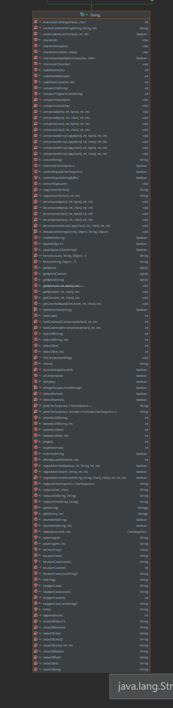

## 包装类

### 包装类是什么？

```
概念：针对八种基本数据类型相应的引用类型
有了类的特点，就可以调用类中的方法
//Boolean --> boolean
//Character --> char
//Short --> short
//Integer --> int
//Byte --> byte
//Double --> double
//Long --> long
//Float --> float
```


### 拆箱装箱
```java
package com.wrapper_;

public class Main {
    public static void main(String[] args) {
//        jdk5之前是手动装箱和拆箱
//        手动装箱两种方式
        int i1 = 100;
        Integer integer = new Integer(i1);
        Integer integer2 = Integer.valueOf(i1);

//        手动拆箱
        int i = integer.intValue();

//        jdk5之后，就可以自动装箱和自动拆箱
        int n2 = 200;
        Integer integer3 = n2;// 底层还是用Interger.valueOf(n2);
        int n3 = integer3;// 底层还是用的integer3.intValue();
        
        // 其它的包装类类似
    }
}
```

### 一元运算符是一个整体
```java
Object obj1 = true? new Integer(1) : new Double(2.0);
System.out.println(obj1); // 1.0
// 一元运算符是一个整体，因为后面的表达式最大的精度是double，所以obj1也是double类型

// 对照
Object obj2;
if(true){
	obj2 = new Integer(1);
}else {
	obj2 = new Double(2.0);
}
System.out.println(obj2);
```

### 包装类和String类相互转换
```
包装类转String
	1、 包装类变量 + "";
	2、 包装类变量.toString();
	3、 String.valueOf(包装类变量);
String转包装类
	1、包装类类.parseInt(str);
	2、new 包装类类(str); 
```

```java
package com.wrapper_;

public class WrapperToString {
    public static void main(String[] args) {
        // 包装类（Integer为例）转String
        Integer n = 1;
            // 方式1
        String sn1 = n + "";
            // 方式2
        String sn2 = n.toString();
            // 方式3
        String sn3 = String.valueOf(n);

        // String 转包装类
        String str = "1";
            // 方式1
        Integer is1 = Integer.parseInt(str);
            // 方式2
        Integer is2 = new Integer(str); // 接收字符参数的构造器
        System.out.println(sn1 instanceof String); //true
        System.out.println(sn2 instanceof String); //true
        System.out.println(sn3 instanceof String); //true
        System.out.println(is1 instanceof Integer); //true
        System.out.println(is1 instanceof Integer); //true
    }
}
```

### 包装类的方法

```
方法太多，开发时，根据需求去查阅是否有能解决需求的方法。
```


## 字符串类

### String类

#### string的说明

```
1、string对象用于保存字符串，也就是一组字符序列。
2、字符串的编码采用Unicode编码，一个字符（不管是汉字还是英文）占两个字节byte。
3、string类使用了final修饰，不能被继承
4、string类内部是用一个final char[]数组来存储字符串的(char[]数组不能修改和JavaScript一样，不能修改引用关系，而不是不能修改数组的结构)
```


#### string类常用的构造方法


#### String实现的接口


#### 创建对象的两种方式


#### string测试题（栈，堆，方法区/常量池分析）

```
1、new出来的会指向堆，常量名在栈中，真正的值在方法区中
2、执行方法创建一个新栈，方法执行完毕，新栈被清掉
3、栈中存放属性名，堆存放对象，池存放属性值
```


 

#### 字符串特性

```
1、String是一个final类，表示不可变的字符序列，内部实现是一个char[];
2、字符串是不可变的，一个字符串对象一旦被分配，其内容是不可变的。
```


```java
package com.string_;

public class Main {
    public static String str = new String("hsp");
    final char[] ch = {'j','a','v','a'};
    public void change(String str, char[] ch){
        str = "java";
        ch[0] = 'h';
    }
    public static void main(String[] args) {
        Main ma = new Main();
        ma.change(ma.str,ma.ch);
        System.out.println(ma.str+"and"); // hspand
        System.out.println(ma.ch); // hava
    }
}
```


#### String类常见的方法

[具体查阅jdk8在线文档](https://www.matools.com/api/java8)

```
String是用来保存字符串常量的，每次更新都需要重新开辟空间。效率很低。因此java之父还提供了StringBuilder和StringBuffer来增强String的功能，并提高效率。
```

```java
// 很耗时的代码
package com.string_;

public class Joint {
    public static void main(String[] args) {
        String str = "";
        for (int i = 0; i < 99999; i++) {
            str += "a";
        }
        System.out.println(str);
    }
}
```



### StringBuffer类

#### StringBuffer的定义

```
1、StringBuffer的直接父类是AbstractStringBuilder
2、StringBuffer实现了Serializable,即StringBuffer的对象可以串行化
3、在父类中 AbstractStringBuilder 有属性char[] value，没有被final修饰，因此StringBuffer的字符串里面的内容可以更改，但是当字符串的长度超过这个StringBuffer的容器长度时，就需要重新开辟空间赋值
4、StringBuffer是一个final类，不能被继承
```

#### StringBuffer的常用方法

```
增：append(value)
删：delete(start,end) 前后都不包含
改：replave(start,end,value) [start,end) 前闭后开
查: indexOf 第一次出现的索引，差不多返回-1
插: insert(index,value)
获取长度: length
```

```java
package com.stringbuffer_;

public class Main {
    public static void main(String[] args) {
        StringBuffer stringBuffer = new StringBuffer();
        stringBuffer.append("abcd");
        System.out.println(stringBuffer); // abcd
        stringBuffer.delete(0,2);
        System.out.println(stringBuffer);
        stringBuffer.replace(0,1,"e"); // cd
        System.out.println(stringBuffer.indexOf("e")); // 0
        stringBuffer.insert(1,"f");
        System.out.println(stringBuffer); // efd
        System.out.println(stringBuffer.length()); // 3
    }
}
```

#### StringBuffer的构造器

```
StringBuffer() 构造一个其中不带字符的字符串缓冲区，其初始容量为16个字符
StringBuffer(CharSequence seq) 构造一个字符串缓冲区，包含与指定的字符数组相同的字符
StringBuffer(int capacity) capacity 创建多大的容量
StringBuffer(String str) 初始化为指定的字符创内容
```

#### StringBuffer与String相互转换

```
String --> StringBuffer
	1、使用构造器StringBuffer(String str)
	2、使用append方法
StringBuffer --> String
	1、StringBuffer对象的toString()
	2、使用构造器String(StringBuffer buffer)
```

```java
package com.stringbuffer_;

public class Conversion {
    public static void main(String[] args) {
        /*String --> StringBuffer
        1、使用构造器StringBuffer(String str)
        2、使用append方法
        StringBuffer --> String
        1、StringBuffer对象的toString()
        2、使用构造器String(StringBuffer buffer)*/
        String str = "abc";
        StringBuffer stringBuffer = new StringBuffer(str);
        StringBuffer stringBuffer2 = new StringBuffer().append(str);
        System.out.println(stringBuffer);
        System.out.println(stringBuffer2);
//        --------------------------------
        String str2 = stringBuffer.toString();
        String str3 = new String(stringBuffer);
        System.out.println(str2+str3);

    }
}
```

### StringBuilder类

#### StringBuilder类的定义

```
1、一个可变的字符序列。此类提供一个与StringBuffer兼容的API,但不保证同步（StringBuilder不是线程安全）。此类被设计用作StringBuffer的一个简易替换，用在字符创缓冲区被单线程使用的时候。如果可能，建议优先采用该类。因为在大多数实现中，它比StringBuffer要快
2、在StringBuilder上的主要操作时append和insert方法，可重载这些方法，以接收任意类型的数据
3、StringBuilder 继承了 AbstractStringBuilder
4、实现了Serializable, 说明StringBuilder对象是可以串行化（也就是可以进行网络传输，可以保存到文件）
5、StringBuildershifinal类，不能被继承
6、StringBuilder char[]仍然存放在其父类 AbstractStringBuilder的value中，因此还是存在堆中
7、StringBuilder 的方法，没有做互斥处理，即没有synchronized关键字，只能在单线程的情况下使用 	
```

## Math类

```
abs绝对值
pow 求幂
ceil 向上取整
floor 向下取整
round 四舍五入
sqrt 求开方
random 求随机数
max 求两数最大值
min 求两数最小值
```

```java
package com.math_;

public class Main {
    public static void main(String[] args) {
        System.out.println(Math.abs(-100)); // 100
        System.out.println(Math.pow(2.0,2.0)); // 4.0
        System.out.println(Math.ceil(2.3)); // 3
        System.out.println(Math.floor(3.2)); // 3
        System.out.println(Math.round(2.2f)); // 2
        System.out.println(Math.sqrt(4.0)); // 2
        System.out.println(Math.random());
        System.out.println(Math.min(1,2)); // 1
        System.out.println(Math.max(1,2)); // 2
    }
}
```

## Array类

```
Array用于管理或操作数组
方法：
	1、toString() 返回数组的字符串形式。
	2、sort() 自然排序和定制排序。
	3、binarySearch() 通过二分搜索法进行查找，要求必须排好序。
	4、copyOf() 数组元素的复制
	5、fill 替换数组所有元素
	6、equals 比较两个数组里面的元素是否相同
	7、asList 将一串数字转换为list
```

```java
package com.Arrays_;

import java.util.Arrays;
import java.util.List;

public class Main {
    public static void main(String[] args) {
        int[] arr = {2, 1, 3, 5, 4};
//        排序会改变原数组
        Arrays.sort(arr);
        System.out.println(Arrays.toString(arr)); //[1, 2, 3, 4, 5]
//        二分查找指定值的下标
        System.out.println(Arrays.binarySearch(arr, 3)); // 2
//        复制数组
        int[] arr2 = Arrays.copyOf(arr, 3);// [1, 2, 3]
        System.out.println(Arrays.toString(arr2));
        int[] arr3 = Arrays.copyOfRange(arr, 2, 4);// [3, 4]
        System.out.println(Arrays.toString(arr3));
//        数组元素的填充,用给与的值去替换数组中所有的值
        Integer[] arr4 = new Integer[]{9, 3, 2};
        Arrays.fill(arr4, 10);
        System.out.println(Arrays.toString(arr4)); // [10, 10, 10]
//        比较两个数组中的元素是否完全相同
        int[] arr5 = {1, 2};
        int[] arr6 = {2, 1};
        System.out.println(Arrays.equals(arr5, arr6));// false
//        将一组值转换为list
        List<Integer> asList = Arrays.asList(2,3,5,6);
        System.out.println(asList); // [2, 3, 5, 6]
    }
}
```

## System类

```
1、exit() 退出当前程序
2、arraycopy() 复制数组元素， Array.copyOf也是调用的这个方法
3、currentTimeMillens() 放回当前时间距离1970-1-1的毫秒数
4、gc() 运行垃圾回收机制
```

```java
package com.System_;

import java.util.Arrays;

public class Main {
    public static void main(String[] args) {
        System.out.println(System.currentTimeMillis());
        int[] arr = {1,2,3};
        int[] arr2 = new int[3];
//     参数   Object array1, int start1, Object array2, int start2, int length
        System.arraycopy(arr, 0,arr2,0,3);
        System.out.println(Arrays.toString(arr2));
        System.out.println(System.currentTimeMillis());
        System.gc();
        System.exit(0);
    }
}
```

## 大数类（BigInteger/BigDecimal）

```
1、BigInteger适合保存比较大的整型
2、BigDecimal适合保存精度更高的浮点型（小数）
3、他们在进行运算时，都不能直接使用运算符，而是使用类提供的方法来进行运算
```

## 日期类

### 第一代日期类Date与SimpleDateFormat

```java
package com.date_;

import java.text.SimpleDateFormat;
import java.util.Date;

public class First {
    public static void main(String[] args) {
//        获取系统当前时间
        Date date = new Date();
        System.out.println(date);
//        根据传递的long毫秒来生成时间
        Date date2 = new Date(123123123123l);
        System.out.println(date2);
//        创建SimpleDateFormat对象，可以指定相应的格式
        SimpleDateFormat simpleDateFormat = new SimpleDateFormat("yyyyMMdd");
        String format = simpleDateFormat.format(new Date());
        System.out.println(format);
//      转换String字符串来生成时间
        String s = "20200220";
        try{
            Date parse = simpleDateFormat.parse(s);
            System.out.println(parse);
        }catch(Exception e){
            System.out.println(e);
        }
    }
}
```

### 第二代日期类Calendar

```java
package com.date_;

import java.util.Calendar;

public class Second {
    public static void main(String[] args) {
//        Calendar是抽象的，不能直接被实例化
        Calendar calendar = Calendar.getInstance();
        System.out.println(calendar);
        System.out.println("年"+calendar.get(Calendar.YEAR));
        System.out.println("月"+(calendar.get(Calendar.MONTH)+1));
        System.out.println("日"+calendar.get(Calendar.DAY_OF_MONTH));
        System.out.println("时"+calendar.get(Calendar.HOUR));
        System.out.println("时24小时制"+calendar.get(Calendar.HOUR_OF_DAY));
        System.out.println("分"+calendar.get(Calendar.MINUTE));
        System.out.println("秒"+calendar.get(Calendar.SECOND));
//        Calender 没有专门的格式化方法，需要自己组合显示
    }
}
```

### 第三代日期类localDateTime与DateTimeFormatter

```
前面两代日期类的不足
jdk1.0中包含了一个java.util.Date类，但是它的大多数方法已经在jdk1.1引入Calendar类之后被弃用了。而Calendar也存在问题
	1、可变性：日期和时间应该是不可变的
	2、偏移性：Date中的年份是从1900年开始的，而月份都从0开始
	3、格式化：Calendar不能格式化
	4、线程不是安全的，不能处理闰秒（每隔2天多出1秒）
```

```java
package com.date_;

import java.time.LocalDate;
import java.time.LocalDateTime;
import java.time.LocalTime;
import java.time.format.DateTimeFormatter;

public class Third {
    public static void main(String[] args) {
//        获取当前时间
        LocalDate localDate = LocalDate.now();
        LocalDateTime localDateTime = localDate.atTime(LocalTime.now());
        System.out.println(localDateTime); // 2022-03-21
        System.out.println("年"+localDateTime.getYear());
        System.out.println("月"+localDateTime.getMonth());
        System.out.println("月"+localDateTime.getMonthValue());
        System.out.println("日"+localDateTime.getDayOfMonth());
        System.out.println("时"+localDateTime.getHour());
        System.out.println("分"+localDateTime.getMinute());
        System.out.println("秒"+localDateTime.getSecond());
//        格式化format
        DateTimeFormatter dateTimeFormatter = DateTimeFormatter.ofPattern("yyyyMMdd");
        String str = localDate.format(dateTimeFormatter);
        System.out.println(str);
    }
}
```

