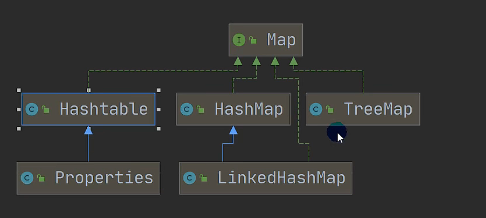

# 集合

## Collection单列集合体系图


### Collection接口

#### Collection接口说明

```
1、有些Collection的实现类，可以存放重复的元素，有些不可以
2、有些Collection的实现类，有些是有序的（List），有些是无序的（Set）
3、Collection接口没有直接的实现子类，是通过它的子接口Set和List来实现的
```
#### Collection接口的常用方法

```
以实现类ArrayList为例,LinkedList,Vector同理
	1、add添加单个元素
	2、remove移除指定元素
	3、contains获取元素是否存在
	4、isEmpty判断是否为空
	5、clear清空
	6、addAll添加多个元素
	7、containsAll查找多个元素是否都存在
	8、removeAll删除多个元素
	8、size获取元素的个数
```

```java
package com.Collection_;

import java.util.ArrayList;

public class Collection_ {
    public static void main(String[] args) {
        ArrayList list = new ArrayList();
        list.add("jack");
        System.out.println(list.contains("jack"));
        list.remove("jack");
        System.out.println(list.isEmpty());
        ArrayList list2 = new ArrayList();
        list2.add("marin");
        list2.add("jay");
        list.addAll(list2);
        System.out.println(list.containsAll(list2));
        list.removeAll(list2);
        System.out.println(list.size());
        System.out.println(list);
    }
}
```

#### Collection接口遍历元素

##### 方式1：Iterator迭代器

```
1、Iterator对象称为迭代器，主要用于遍历Collection集合中的元素。
2、所有实现了Collection接口的集合类都有iterator()方法，因为Collection实现了Iterable接口，改接口中有iterator方法。iterator()方法用来返回一个Iterator对象，即放回一个迭代器。
3、Iterator就是一个队列结构，先进遍历的时候就先出。
4、注意：迭代器执行完毕之后，指针已经指到最后一个元素了，需要重置迭代器。
	方法：
		1、hasNext()
		2、next()
		3、remove（）
5、iterator()底层还是去调用的增强for
```

```java
package com.Collection_;

import java.util.ArrayList;
import java.util.Iterator;

public class Iterator_ {

    public static void main(String[] args) {
        ArrayList arrayList = new ArrayList();
        arrayList.add(new People("zhangsan", 18.5, "nan"));
        arrayList.add(new People("zhangsan", 20, "nan"));
        arrayList.add(new People("zhangsan", 21.5, "nan"));
        Iterator iterator = arrayList.iterator();
        while (iterator.hasNext()) {
            Object next = iterator.next();
            System.out.println(next);
        }
        /*注意：迭代器执行完毕之后，指针已经指到最后一个元素了，需要重置迭代器。
         *否则使用iterator.next()去拿第一个值时会抛出NoSuchElementException异常 */
        iterator = arrayList.iterator();
        Object next = iterator.next();
        System.out.println(next);
    }
}

class People {
    private String name;
    private double age;
    private String sex;

    public People(String name, double age, String sex) {
        this.name = name;
        this.age = age;
        this.sex = sex;
    }

    public String getName() {
        return name;
    }

    public void setName(String name) {
        this.name = name;
    }

    public double getAge() {
        return age;
    }

    public void setAge(double age) {
        this.age = age;
    }

    public String getSex() {
        return sex;
    }

    public void setSex(String sex) {
        this.sex = sex;
    }

    @Override
    public String toString() {
        return "People{" +
                "name='" + name + '\'' +
                ", age=" + age +
                ", sex='" + sex + '\'' +
                '}';
    }
}
```

##### 方式2：增强for循环

```java
package com.Collection_;

import java.util.ArrayList;

public class for_ {
    public static void main(String[] args) {
        ArrayList arrayList = new ArrayList();
        arrayList.add(new People("zhangsan", 18.5, "nan"));
        arrayList.add(new People("zhangsan", 20, "nan"));
        arrayList.add(new People("zhangsan", 21.5, "nan"));
        for (Object o :arrayList) {
            System.out.println(o);
        }
    }
}
```

##### 方式3使用普通的for循环

```java
package com.Collection_;

import java.util.ArrayList;

public class for_ {
    public static void main(String[] args) {
        ArrayList arrayList = new ArrayList();
        arrayList.add(new People("zhangsan", 18.5, "nan"));
        arrayList.add(new People("zhangsan", 20, "nan"));
        arrayList.add(new People("zhangsan", 21.5, "nan"));   

        for (int i = 0; i < arrayList.size(); i++) {
            Object o = arrayList.get(i);
            System.out.println(o);
        }
    }
}
```

#### List接口

##### List的定义

```
List接口是Collection接口的子接口
	1、List集合类中元素是有序的，且可重复的
	2、List集合中的每个元素都有其对应的顺序索引，从0开始（通过get(0)可以取得）
	3、JDK中List接口的实现类有如下图
```


##### List接口的常用方法

```
1、add(int index,Object ele)插入元素
2、addAll(int index,Collection eles)插入实现了Collection接口的类集合
3、get(int index)获取元素
4、indexOf(Object ele)返回obj首次出现的位置
5、lastIndexOf(object ele)返回obj在当前末尾出现的位置
6、remove(int index)移除index位置的元素
7、set(int index, Object ele)替换index位置的元素
8、subList(int fromIndex, int toIndex)返回从fromIndex到toIndex位置的子集合
```

```java
package com.List_;

import java.util.ArrayList;
import java.util.List;

public class Methods_ {
    public static void main(String[] args) {
        /*
8、subList(int fromIndex, int toIndex)返回从fromIndex到toIndex位置的子集合*/
        List list = new ArrayList();
        List list2 = new ArrayList();
        list2.add("f");
        list2.add("g");
        list.add("a");
        list.add("b");
        list.add("c");
        list.add("d");
        list.add("a");
        list.addAll(list2);
        list.remove(2);
        list.set(1,"h");
        System.out.println(list.get(1));
        System.out.println(list.indexOf("a"));
        System.out.println(list.lastIndexOf("a"));
        System.out.println(list.subList(0,3));
        System.out.println(list);
    }
}
```

##### List遍历的三种方式

```
见Collection接口遍历的三种方式，与之相同。
```

##### List测试

```java
package com.List_;

import java.util.ArrayList;
import java.util.List;

public class Test {
    public static void main(String[] args) {
        List list = new ArrayList();
        list.add(new Book("红楼梦", 200, "曹雪芹"));
        list.add(new Book("西游记",100,"吴承恩"));
        list.add(new Book("水浒传",300,"施耐庵"));
        for (int i = 0; i < list.size() - 1; i++) {
            for (int j = 0; j < list.size() - 1 - i; j++) {
                Book b = (Book) list.get(i);
                Book b2 = (Book) list.get(i+1);
                if(b.getPrice() > b2.getPrice()){
                    list.set(j,b2);
                    list.set(j+1,b);
                }
            }
        }
        for (Object o :list) {
            System.out.println(o.toString());
        }
    }
}

class Book {
    private String french_quotes;
    private double price;
    private String author;

    public String getFrench_quotes() {
        return french_quotes;
    }

    public void setFrench_quotes(String french_quotes) {
        this.french_quotes = french_quotes;
    }

    public double getPrice() {
        return price;
    }

    public void setPrice(double price) {
        this.price = price;
    }

    public String getAuthor() {
        return author;
    }

    public void setAuthor(String author) {
        this.author = author;
    }

    public Book(String french_quotes, double price, String author) {
        this.french_quotes = french_quotes;
        this.price = price;
        this.author = author;
    }

    @Override
    public String toString() {
        return "Book{" +
                "french_quotes='" + french_quotes + '\'' +
                ", price=" + price +
                ", author='" + author + '\'' +
                '}';
    }
}
```

##### ArrayList实现类

###### ArrayList说明

```
1、ArrayList可以加入null，并且可以加入多个
2、底层是用的数组来实现的
3、ArrayList基本等同于Vector，但是ArrayList是线程不安全的（没有使用synchronized关键字），在多线程的情况下，不建议使用ArrayList
```

###### ArrayList扩容

```
ArrayList中维护了一个Object类型的数组elementData.
当创建ArrayList对象时，如果使用的是无参构造器，则初始elementData容量为0，第一次添加，则扩容为10，如需要再次扩容，则扩容为1.5倍
如果使用的是指定大小的构造器，则初始elementDate容量为指定大小，如果需要扩容，则就是1.5倍。
```

##### Vector实现类

###### Vector说明

```
1、Vector底层也是一个对象数组
2、Vector是线程同步的，即线程安全
3、在开发时，如果需要线程同步安全时，考虑使用Vector
```

###### Vector扩容

```
Vector中维护了一个Object类型的数组
当创建Vector对象时，如果使用的是无参构造器，默认容量大小为10，如需要再次扩容，则扩容为2倍
如果使用的是指定大小的构造器，则初始容量为指定大小，如果需要扩容，则就是2倍
```

###### ArrayList与Vector的区别

```
1、线程安全不同
2、扩容的方式不同
```

##### LinkedList实现类

###### LinkenList说明

```
1、LinkedList底层维护了一个双向链表
2、LinkedList中维护了两个属性first和last分别指向首节点和尾节点
3、每个节点，里面又维护了prev、next、item三个属性，其中通过prev指向前一个，通过next指向后一个节点。最终实现双向链表
4、所以LinkedList的元素的添加和删除，不是通过数组完成的，相对来说效率较高
```

##### ArrayList和LinkedList比较

|            | 底层结构 | 增删的效率         | 改查的效率 |
| ---------- | -------- | ------------------ | ---------- |
| ArrayList  | 可变数组 | 较低，数组要扩容   | 较高       |
| LinkedList | 双向链表 | 较高，通过链表追加 | 较低       |

#### Set接口

##### Set接口基本介绍

```
1、无序（添加和取出的顺序不一致，没有索引，但是多次取出的顺序都是一样的）
2、不允许重复元素，所以最多包含一个null，且在第一个位置被取出
3、实现类有见下图
```


##### Set常用方法

```
Set接口实现了Collection接口，因此，常用方法和Collection接口一样
	Set接口的遍历方式
	1、可以使用迭代器
	2、可以使用增强for
	3、不能使用for循环了，因为不能通过索引的方式来获取值了。
```

##### HashSet实现类

###### HashSet的全面说明

```
1、HashSet实现了Set接口
2、HashSet无参构造器实际上是new HashMap<>();
3、可以存放null值，但是只能有一个null（实现了Set接口）
4、HashSet不保证元素是有序的，取决于hash后，再确定索引的结果
5、不能有重复元素/对象（默认指的是对象的地址是否是一样的，即是否是同一个对象,判断规则程序员可以更改，通过重写equals()方法）
```

###### HashSet的方法

```
1、add()
2、remove()
```

###### HashSet底层机制说明

```
HashSet添加一个元素的过程：
1、Hashset底层是HashMap，HashMap底层是（数组+链表+红黑树）
2、添加一个元素时，先得到hash值，会转成索引值
3、找到存储数据表table，看这个索引位置是否已经存放的有元素
4、如果没有，直接加入
5、如果有，调用equals比较，如果相同，就放弃添加，如果不相同，则添加到最后（一般对象都是不相同的，可以添加，但是字符串值相同的两个对象，就被判断为是同一个对象）
6、如果一个链表的元素个数到达TREEIFY_THRESHOLD（默认是8），并且table的大小>=MIN_TREEIFY_CAPACITY(默认64),就会进行树化（红黑树）
```

###### HashSet练习

```java
package com.Set_;

import java.time.LocalDate;
import java.time.LocalDateTime;
import java.time.LocalTime;
import java.util.HashSet;
import java.util.Objects;
import java.util.Set;

public class Test {
    public static void main(String[] args) {
        /*
        定义一个Employee类，该类包含private成员属性name,age,MyDate类型的birthday 要求：
        创建三个Employee对象放在HashSet中
        当name,age,birthday的值相同时，认为是同一个员工，不能添加到HashSet集合中
        * */
        Employee zhangsan = new Employee("zhangsan", 18);
        Employee lisi = new Employee("lisi", 19);
        Employee wangwu = new Employee("wangwu", 20);
        Employee zhangsan2 = new Employee("zhangsan",18);
        Set set = new HashSet();
        set.add(zhangsan);
        set.add(lisi);
        set.add(wangwu);
        set.add(zhangsan2);
        for (Object o :set) {
            System.out.println(o);
        }


    }
}

class Employee {
    private String name;
    private double age;
    private MyDate birthday;

    class MyDate {
        private int year;
        private int month;
        private int day;

        public MyDate(int year, int month, int day) {
            this.year = year;
            this.month = month;
            this.day = day;
        }

        public int getYear() {
            return year;
        }

        public void setYear(int year) {
            this.year = year;
        }

        public int getMonth() {
            return month;
        }

        public void setMonth(int month) {
            this.month = month;
        }

        public int getDay() {
            return day;
        }

        public void setDay(int day) {
            this.day = day;
        }

        @Override
        public boolean equals(Object o) {
            if (this == o) return true;
            if (o == null || getClass() != o.getClass()) return false;
            MyDate myDate = (MyDate) o;
            return Objects.equals(year, myDate.year) && Objects.equals(month, myDate.month) && Objects.equals(day, myDate.day);
        }

        @Override
        public int hashCode() {
            return Objects.hash(year, month, day);
        }

        @Override
        public String toString() {
            return "MyDate{" +
                    "year=" + year +
                    ", month=" + month +
                    ", day=" + day +
                    '}';
        }
    }

    public String getName() {
        return name;
    }

    public void setName(String name) {
        this.name = name;
    }

    public double getAge() {
        return age;
    }

    public void setAge(double age) {
        this.age = age;
    }

    public Employee(String name, double age) {
        this.name = name;
        this.age = age;
        LocalDate localDate = LocalDate.now();
        LocalDateTime localDateTime = localDate.atTime(LocalTime.now());
        this.birthday = new MyDate(localDateTime.getYear(),localDateTime.getMonthValue(),localDateTime.getDayOfMonth());
    }

    @Override
    public boolean equals(Object o) {
        if (this == o) return true;
        if (o == null || getClass() != o.getClass()) return false;
        Employee employee = (Employee) o;
        return Double.compare(employee.age, age) == 0 && Objects.equals(name, employee.name);
    }

    @Override
    public int hashCode() {
        return Objects.hash(name, age);
    }

    @Override
    public String toString() {
        return "Employee{" +
                "name='" + name + '\'' +
                ", age=" + age +
                ", birthday=" + birthday +
                '}';
    }
}

```


##### LinkedHashSet实现类

```
1、LinkedHashSet是HashSet的子类
2、LinkedHashSet底层是一个LinkedHashMap,底层是一个数组+双向链表
3、LinkedHashSet根据元素的hashCode值来决定元素的存储位置，同时使用链表维护元素的次序图，这使得元素看起来是以插入顺序保存的
4、LinkedHashSet不允许添加重复元素
```

###### LinkedHashSet中的方法


```
但是因为LinkedHashSet类是HashSet类的子类，因此可以调用父类的方法。
```

###### LinkedHashSet的底层机制说明

```
1、在LinkedHashSet中维护了野怪hash表和双向链表（LinkedHashSet有head和tail末节点）
2、每一个节点有pre和next属性，这样可以形成双向链表
3、在添加一个元素时，先求hash值，再求索引确定该元素在hashtable的位置，然后将添加的元素加入到双向链表中
	tail.next = newElement;
	newElement.pre = tail;
	tail = newElement;
```

#### TreeSet接口实现类

##### TreeSet的说明

```
1、TreeSet如果使用的是无参构造器，那么就是无序的
2、使用TreeSet提供一个构造器，可以传入一个比较器（匿名内部类）
3、TreeSet底层用的是TreeMap
```

```java
package com.Set_.TreeSet_;

import java.util.Comparator;
import java.util.TreeSet;

public class Main {
    public static void main(String[] args) {
//        无参构造器，是无序的
        TreeSet treeSet = new TreeSet();
        treeSet.add("dddd");
        treeSet.add("a");
        treeSet.add("ccc");
        System.out.println(treeSet);
//        传入一个比较器匿名内部类
        TreeSet treeSet2 = new TreeSet(new Comparator(){
//          比较两个字符串第一个字母的哈希值大小
            @Override
            public int compare(Object o1, Object o2) {
                return ((String) o1).compareTo((String) o2);
            }
        });
        treeSet2.add("d");
        treeSet2.add("ada");
        treeSet2.add("c");
        System.out.println(treeSet2);
    }
}
```

## Map双列集合



### Map接口

#### Map接口的说明

```
1、Map接口用于保存居于哦映射关系的数据Key-Value
2、Map中的key和value可以是任意引用类型数据
3、Map中的key不允许重复
4、Map中的value可以重复
5、Map中的key可以为null,value也可以为null，只能有一个key为null，value为null的可以有多个
6、常用String类作为Map的key
7、key和value之间存在单向一对一关系，即通过指定的key总能找到对应的value
```

#### 底层机制说明


#### Map接口的常用方法

```
1、put()添加
2、remove()根据键删除
3、get()根据键获取值
4、size()获取元素个数
5、isEmpty()判断个数是否为空
6、clear()清除
7、containsKey()查找键是否存在
8、containsValue()查找值是否存在
```

```java
package com.Map_;

import java.util.HashMap;
import java.util.Map;

public class Methods_ {
    public static void main(String[] args) {
        Map map = new HashMap();
        map.put("a","aa");
        map.put(null,"null");
        map.put("b","aa");
        System.out.println(map.get("a"));
        System.out.println(map.size());
        System.out.println(map.isEmpty());
        System.out.println(map.containsKey("a"));
        System.out.println(map.containsValue("aa"));
        map.clear();
        System.out.println(map.size());
    }
}
```

#### Map接口的遍历方式

```
1、先遍历key，再拿到value
	增强for
	迭代器
2、直接把所有的values去取出
	增强for
	迭代器
3、EntrySet来获取k-v
	增强for
	迭代器
```

```java
package com.Map_;

import java.util.*;

public class Methods_ {
    public static void main(String[] args) {
        Map map = new HashMap();
        map.put("b","aa");
        map.put("a","aa");
        map.put(null,"null");
        map.put("c",null);
//        1、先拿到key
//        1.1、增强for
        Set keyset = map.keySet();
        for (Object o :keyset) {
            System.out.println(o+"-"+map.get(o));
        }
//        1.2、迭代器
        Iterator iterator = keyset.iterator();
        while (iterator.hasNext()) {
            Object next =  iterator.next();
            System.out.println(next+"-"+map.get(next));
        }
//        2、直接拿到所有的values
        Collection values = map.values();
        for (Object o :values) {
            System.out.println("key-"+o);
        }
        Iterator iterator1 = values.iterator();
        while (iterator1.hasNext()) {
            Object next = iterator1.next();
            System.out.println("key-"+next);
        }
//        3、通过EntrySet来获取k-v
        Set entrySet = map.entrySet();
        for (Object o :entrySet) {
            Map.Entry m = (Map.Entry) o;
            System.out.println(m.getKey()+"-"+m.getValue());
        }
        Iterator iterator2 = entrySet.iterator();
        while (iterator2.hasNext()) {
            Map.Entry next = (Map.Entry) iterator2.next();
            System.out.println(next.getKey()+"-"+next.getValue());
        }
    }
}
```

#### Map接口测试题

```java
package com.Map_;

import java.security.Permission;
import java.util.HashMap;
import java.util.Iterator;
import java.util.Map;
import java.util.Set;

public class Test {
    public static void main(String[] args) {
        /*
        * Map接口课堂练习
        使用HashMap添加3个员工对象
        要求
        键:员工id
        值:员工对象
        并遍历显示工资>18000的员工(
        遍历方式最少两种)
        员工类:姓名、工资
        */
        Map map = new HashMap();
        map.put("id1", new Personnel("id1","zhangsan",30000));
        map.put("id2",new Personnel("id2","lisi",20000));
        map.put("id3",new Personnel("id3","wangwu",10000));
        Set keyset = map.keySet();
        for (Object o :keyset) {
            Personnel personnel = (Personnel) map.get(o);
            if(personnel.getSalary() > 18000){
                System.out.println(personnel);
            }
        }
        Iterator iterator = keyset.iterator();
        while (iterator.hasNext()) {
            Object next =  iterator.next();
            if(((Personnel)map.get(next)).getSalary()>18000){
                System.out.println(map.get(next));
            }
        }
    }
}

class Personnel {
    private String name;
    private double salary;
    private String id;

    public double getSalary() {
        return salary;
    }

    public void setSalary(double salary) {
        this.salary = salary;
    }

    public String getName() {
        return name;
    }

    public void setName(String name) {
        this.name = name;
    }

    public Personnel(String id,String name, double salary) {
        this.id = id;
        this.name = name;
        this.salary = salary;
    }

    @Override
    public String toString() {
        return "Personnel{" +
                "name='" + name + '\'' +
                ", salary=" + salary +
                ", id='" + id + '\'' +
                '}';
    }
}
```

#### HashMap接口实现类

##### HashMap的介绍

```
1、key不能重复，但是值可以重复，允许使用null键和null值
2、如果添加相同的key，则会覆盖原来的key-val，等同于修改value值
3、与HashSet一样，不保证映射的顺序，因为底层是以hash表的方式来存储的
4、HashMap没有实现同步，因此是线程不安全的
```

##### HashMap底层扩容机制

```
>扩容机制[和HashSet相同]
1、HashMap底层维护了Node类型的数组table，默认为null
2、当创建对象时，将加载因子(loadfactor)初始化为0.75.
3、当添加key-val时，通过key的哈希值得到在table的索引。然后判断该索引处是否有元素,如果没有元素直接添加。如果该索引处有元素,继续判断该元素的key是否和准备加入的key相等，如果相等，则直接替换val;如果不相等需要判断是树结构还是链表结构，做出相应处理。如果添加时发现容量不够，则需要扩容。
4、第1次添加，则需要扩容table容量为16，临界值(threshold)为12.
5、以后再扩容，则需要扩容table容量为原来的2倍，临界值为原来的2倍,即24,依次类推.
6、在Java8中,如果一条链表的元素个数超过 TREEIFY_THRESHOLD(默认是8)，并且table的大小>= MIN_TREEIFY_CAPACITY(默认64),就会进行树化(红黑树)
```

#### HashTable接口实现类

##### HashTable的基本介绍

```
1、存放的元素是键值对，hashtable的键和值都不能为null
2、hashTable使用方法基本上和HashMap一样
3、hashTable是线程安全的，hashMap是线程不安全的
```

#### Properties接口实现类

##### Properties的基本介绍

```
1、Properties类继承自Hashtable类并且实现了Map接口，也是使用一种键值对的形式来保存数据。
2、他的使用特点和Hashtable类似
3、Properties还可以用于从 xx.properties文件中，加载数据到Properties类对象,并进行读取和修改
```

#### TreeMap接口实现类

##### TreeMap说明

```
1、TreeMap如果使用的是无参构造器，那么就是无序的
2、使用TreeMap提供一个构造器，可以传入一个比较器（匿名内部类）
```

```java
package com.Map_.TreeMap_;

import java.util.Comparator;
import java.util.TreeMap;

public class Main {
    public static void main(String[] args) {
//        1、使用无参构造器，是无序的
        TreeMap treeMap = new TreeMap();
        treeMap.put("ad","ad");
        treeMap.put("abc","abc");
        treeMap.put("zxmn","zxmn");
        System.out.println(treeMap);
//        2、传入比较器
        TreeMap treeMap2 = new TreeMap(new Comparator() {
//            按照key字符串的长度排序
            @Override
            public int compare(Object o1, Object o2) {
                return ((String) o1).length() - ((String) o2).length();
            }
        });
        treeMap2.put("ad","ad");
        treeMap2.put("abc","abc");
        treeMap2.put("zxmn","zxmn");
        System.out.println(treeMap2);
    }
}
```

## 开发时集合怎么选择


## Collections集合辅助类

### 基本介绍

```
Collections是一个操作Set、Map、List等集合的工具类
Collections中提供了一系列静态的方法对集合元素进行排序、查询和修改等操作
```

### 常用方法

```
排序操作（均为static静态方法）
	reverse(List)反转List中元素的顺序
	shuffle(List)对List元素进行随机排序
	sort(List)根据元素的自然顺序（字符串首字母的顺序大小来排序）对指定List集合元素按升序排序
	sort(List,Comparator)根据指定的Comparator产生的顺序对List集合元素进行排序
	swap(List,int,int)将指定List集合中的i处元素与j处元素进行交换
查找、替换
	max(Collection)根据元素的自然顺序，返回给定集合中的最大元素
	max(Collection,Comparator)
	min(Collection)
	min(Collection,Comparator)
	frequency(Collection,Object)返回指定集合中指定元素的出现次数
	copy(List oldList,List newList)将newList复制到oldList，从头开始替换,如果newList的长度比oldList的长度短，那么多出来的部分依然存在。
	replaceAll(List,Object oldVal,Object newVal)使用新值替换List对象中的所有旧值
```

```java
package com.Collections_;

import java.util.Collections;
import java.util.Comparator;
import java.util.LinkedList;
import java.util.List;

public class Main {
    public static void main(String[] args) {
        List list = new LinkedList();
        list.add("abc");
        list.add("sadsd");
        list.add("ddqda");
        list.add("abcsda");
        System.out.println(list);// [abc, sadsd, ddqda, abcsda]
        Collections.reverse(list);
        System.out.println(list);// [abcsda, ddqda, sadsd, abc]
        Collections.shuffle(list);
        System.out.println(list);// [ddqda, abcsda, sadsd, abc] 某一次随机的结果
        Collections.sort(list);
        System.out.println(list);// [abc, abcsda, ddqda, sadsd]
        Collections.sort(list, new Comparator() {
            @Override
            public int compare(Object o1, Object o2) {
                return ((String) o1).length() - ((String) o2).length();
            }
        });
        System.out.println(list);// [abc, ddqda, sadsd, abcsda]
        Collections.swap(list,0,3);
        System.out.println(list);// [abcsda, ddqda, sadsd, abc]
        System.out.println(Collections.max(list)); //sadsd
        System.out.println(Collections.max(list, new Comparator() {
            @Override
            public int compare(Object o1, Object o2) {
                return ((String) o1).length() - ((String) o2).length();
            }
        }));// abcsda
        System.out.println(Collections.min(list));// abc
        System.out.println(Collections.max(list, new Comparator() {
            @Override
            public int compare(Object o1, Object o2) {
                return ((String) o2).length() - ((String) o1).length();
            }
        }));// abc
        System.out.println(Collections.frequency(list,"abc"));// 1
        List list2 = new LinkedList();
        list2.add("mmmmm");
        list2.add("nnnnn");
        Collections.copy(list,list2);
        System.out.println(list);// [mmmmm, nnnnn, sadsd, abc]
        Collections.replaceAll(list,"abc","cba");
        System.out.println(list);// [mmmmm, nnnnn, sadsd, cba]
    }
}
```
