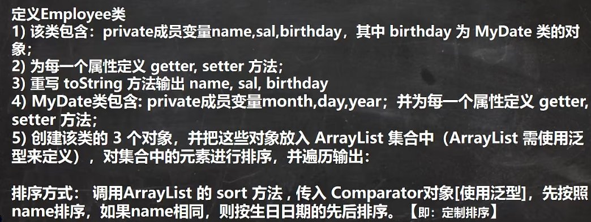
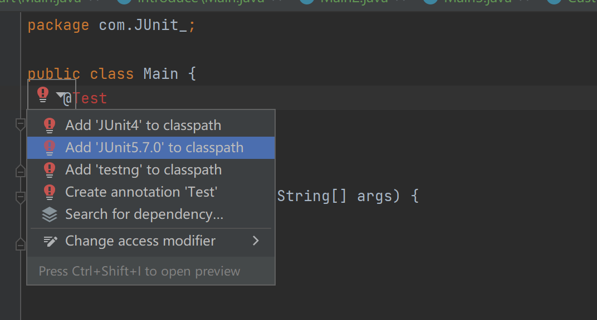
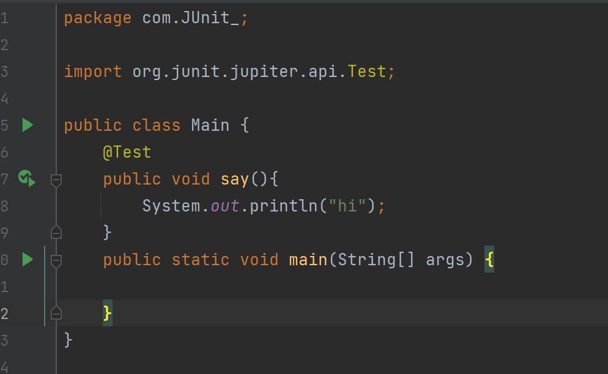

### 为什么需要泛型

#### 不使用泛型的痛点

```java
1、给集合添加元素时，传入的对象没有校验
2、迭代器里面，需要自己手动转型 
```

```java
package com.start;

import java.util.ArrayList;
import java.util.Iterator;
import java.util.List;

public class Main {
    public static void main(String[] args) {
        List list = new ArrayList();
        list.add(new Dog("小黄",5));
        list.add(new Dog("大黄",10));
//        list.add(new Cat("小花",8));
        Iterator iterator = list.iterator();
        while (iterator.hasNext()) {
            Dog next =  (Dog) iterator.next();
            System.out.println(next.getName()+"-"+next.getAge());
        }

    }
}

class Dog {
    private String name;
    private double age;

    public Dog(String name, double age) {
        this.name = name;
        this.age = age;
    }

    public String getName() {
        return name;
    }

    public void setName(String name) {
        this.name = name;
    }

    public double getAge() {
        return age;
    }

    public void setAge(double age) {
        this.age = age;
    }
}

class Cat {
    private String name;
    private double age;

    public Cat(String name, double age) {
        this.name = name;
        this.age = age;
    }

    public String getName() {
        return name;
    }

    public void setName(String name) {
        this.name = name;
    }

    public double getAge() {
        return age;
    }

    public void setAge(double age) {
        this.age = age;
    }
}
```

#### 使用泛型

```java
package com.start;

import java.util.ArrayList;
import java.util.Iterator;
import java.util.List;

public class Main {
    public static void main(String[] args) {
        List<Dog> list = new ArrayList<Dog>();
        list.add(new Dog("小黄",5));
        list.add(new Dog("大黄",10));
//        list.add(new Cat("小花",8));
        for (Dog dog :list) {
            System.out.println(dog.getName()+"-"+dog.getAge());
        }


    }
}

class Dog {
    private String name;
    private double age;

    public Dog(String name, double age) {
        this.name = name;
        this.age = age;
    }

    public String getName() {
        return name;
    }

    public void setName(String name) {
        this.name = name;
    }

    public double getAge() {
        return age;
    }

    public void setAge(double age) {
        this.age = age;
    }
}

class Cat {
    private String name;
    private double age;

    public Cat(String name, double age) {
        this.name = name;
        this.age = age;
    }

    public String getName() {
        return name;
    }

    public void setName(String name) {
        this.name = name;
    }

    public double getAge() {
        return age;
    }

    public void setAge(double age) {
        this.age = age;
    }
}
```

### 泛型是什么

```
1、泛型又称为参数化类型，是jdk5出现的新特性，解决数据类型的安全性问题
2、泛型用来约束参数（类中某个属性的类型，方法的返回值类型，方法参数类型）
3、泛型可能是类也可能是接口
```

```java
package com.introduce;

public class Main {
    public static void main(String[] args) {
        Person<String> person = new Person<>("2");
        System.out.println(person.say("1"));
    }
}

// 在新建对象编译时就确定了数据的类型
class Person<T>{
    private T name;
    public T say(T msg){
        System.out.println(msg);
        if (msg instanceof String){
            System.out.println("你传入的值是String");
        }
        return this.name;
    }

    public Person(T name) {
        this.name = name;
    }
}
```

### 泛型使用细节

```
1、可以给interface接口加泛型，也可以给类加泛型，泛型也可以是多个
2、不能使用基本数据类型来作为泛型的约束，比如不能用int而是用Integer
3、在指定泛型具体类型后，可以传入该类型或者子类类型,见下方案例1
4、如果写List list = new ArrayList();默认给它的泛型是<E>也就是Object
5、List<Integer> list1 = new ArrayList<Integer>();等同于List<Integer> list1 = new ArrayList<>();
```

`案例1`

```java
package com.introduce;

public class Main2 {
    public static void main(String[] args) {
        Job<A> aJob = new Job<>();
        // 约定的泛型是A,但是B继承了A,是A的子类
        aJob.say(new B("hhh"));
    }
}

class A {
    private String name;

    public A(String name) {
        this.name = name;
    }
}

class B extends A {

    public B(String name) {
        super(name);
    }
}

class Job<T>{
    public void say(T a){
        System.out.println(a);
    }
}
```

### 泛型测试题



```java
package com.introduce;

import java.time.LocalDate;
import java.time.LocalDateTime;
import java.time.LocalTime;
import java.util.ArrayList;
import java.util.Comparator;
import java.util.List;
import java.util.concurrent.TimeUnit;

public class Main3 {
    public static void main(String[] args) throws InterruptedException {
        List list = new ArrayList<Employee>();
        list.add(new Employee("zhangsan", 18));
        TimeUnit.SECONDS.sleep(1);
        list.add(new Employee("zhangsan", 18));
        list.add(new Employee("lisi", 20));
        list.add(new Employee("wangwu", 20));
        list.sort(new Comparator() {
            @Override
            public int compare(Object o1, Object o2) {
                if (((Employee) o1).getName() != ((Employee) o2).getName()) {
                    return ((Employee) o1).getName().length() - ((Employee) o2).getName().length();
                } else if (((Employee.MyDate) ((Employee) o1).getBirthday()).getYear() != ((Employee.MyDate) ((Employee) o2).getBirthday()).getYear()) {
                    return ((Employee.MyDate) ((Employee) o1).getBirthday()).getYear() - ((Employee.MyDate) ((Employee) o2).getBirthday()).getYear();
                } else if (((Employee.MyDate) ((Employee) o1).getBirthday()).getMonth() != ((Employee.MyDate) ((Employee) o2).getBirthday()).getMonth()) {
                    return ((Employee.MyDate) ((Employee) o1).getBirthday()).getMonth() - ((Employee.MyDate) ((Employee) o2).getBirthday()).getMonth();
                } else if(((Employee.MyDate) ((Employee) o1).getBirthday()).getDay() != ((Employee.MyDate) ((Employee) o2).getBirthday()).getDay()){
                    return ((Employee.MyDate) ((Employee) o1).getBirthday()).getDay() - ((Employee.MyDate) ((Employee) o2).getBirthday()).getDay();
                }
                return ((Employee.MyDate) ((Employee) o1).getBirthday()).getSecond() - ((Employee.MyDate) ((Employee) o2).getBirthday()).getSecond();
            }
        });
        System.out.println(list);
    };
};

class Employee {
    private String name;
    private double sal;
    private MyDate birthday;

    public String getName() {
        return name;
    }

    public void setName(String name) {
        this.name = name;
    }

    public double getSal() {
        return sal;
    }

    public void setSal(double sal) {
        this.sal = sal;
    }

    public MyDate getBirthday() {
        return birthday;
    }

    public void setBirthday(MyDate birthday) {
        this.birthday = birthday;
    }

    public Employee(String name, double sal) {
        setName(name);
        setSal(sal);
        setBirthday(new MyDate());
    }

    @Override
    public String toString() {
        return "Employee{" +
                "name='" + name + '\'' +
                ", sal=" + sal +
                ", birthday=" + birthday +
                '}';
    }

    class MyDate {
        private int year;
        private int month;
        private int day;
        private int second;

        public int getSecond() {
            return second;
        }

        public void setSecond(int second) {
            this.second = second;
        }

        public int getYear() {
            return year;
        }

        public void setYear(int year) {
            this.year = year;
        }

        public int getMonth() {
            return month;
        }

        public void setMonth(int month) {
            this.month = month;
        }

        public int getDay() {
            return day;
        }

        public void setDay(int day) {
            this.day = day;
        }

        public MyDate() {
            LocalDate localDate = LocalDate.now();
            LocalDateTime localDateTime = localDate.atTime(LocalTime.now());
            setYear(localDateTime.getYear());
            setMonth(localDateTime.getDayOfMonth());
            setDay(localDateTime.getDayOfMonth());
            setSecond(localDateTime.getSecond());
        }

        @Override
        public String toString() {
            return "MyDate{" +
                    "year=" + year +
                    ", month=" + month +
                    ", day=" + day +
                    ", second=" + second +
                    '}';
        }
    }
}
```

### 自定义泛型类

```
1、普通成员可以使用泛型（属性、方法）
2、使用泛型的数组，不能初始化
3、静态方法中不能使用类的泛型（因为泛型是在创建的时候，才能生效，静态方法可以直接被类调用。
4、如果创建对象时，没有指定类型，默认是Object
```

```
语法:
	class ClassName<T,R...>{
	
	}
```

```java
package com.custom;

public class Custom_Class {
    public static void main(String[] args) {
        Emplee<String, Double> objectObjectEmplee = new Emplee<>("zhangsan",18d, new String[]{"1", "2", "3"});
        System.out.println(objectObjectEmplee.getName()+"-"+objectObjectEmplee.getAge());
        for (Object o :objectObjectEmplee.getArr()) {
            System.out.println(o);
        }
    }
}

class Emplee<T,D> {
    private T name;
    private D age;
    private T[] arr;

/*//    编译报错：java: 无法从静态上下文中引用非静态 类型变量 T
    public static void say(T str){
        System.out.println(str);
    }*/

    public T getName() {
        return name;
    }

    public void setName(T name) {
        this.name = name;
    }

    public D getAge() {
        return age;
    }

    public void setAge(D age) {
        this.age = age;
    }

    public T[] getArr() {
        return arr;
    }

    public void setArr(T[] arr) {
        this.arr = arr;
    }

    public Emplee(T name, D age, T[] arr) {
        setName(name);
        setAge(age);
        setArr(arr);
    }
}
```

### 自定义泛型接口

```
1、接口中，静态成员也不能使用泛型
2、泛型接口的类型，在继承接口或实现接口时确定
3、没有指定类型，默认为Object
```

```java
package com.custom;

public class Custom_Interface {
    public static void main(String[] args) {

    }
}

interface IA<T,D> {

}

interface IB extends IA<String,Double>{

}

class IC implements IA<String,Double>{

}

```

### 自定义泛型方法

```java
package com.custom;

public class Custom_Methods {

    public static void main(String[] args) {
        TC<String,Double> tc = new TC<>();
        tc.say("msg");
        tc.speck(1d);
    }
}

class TC<T,D>{
//    泛型方法
    public <U> void say(U str){
        System.out.println(str);
    }

//    只是使用了泛型，并不是泛型方法
    public void speck(D d){
        System.out.println(d);
    }
}
```

### 泛型的通配符和继承

```
1、泛型不具备继承性
	错误的书写：List<Object> list = new ArrayList<String>();
2、<?> 支持任意的泛型类型
3、<? extends A> 支持A类以及A类的子类
4、<? super A> 支持A类以及A类的父类
```

```java
package com.inherit;

public class Main {
    public static void say(Pe<?> msg){
        System.out.println(msg);
    }

    public static void speck(Pe<? extends Pe> msg){
        System.out.println(msg);
    }

    public static void taik(Pe<? super Pe> msg){
        System.out.println(msg);
    }

    public static void main(String[] args) {
        say(new Pe<String>());
        speck(new Pe<Pee>());
        taik(new Pe<P>());
    }
}
class P {

}
class Pe<T> extends P{

}

class Pee extends Pe{

}
```

### JUnit单元测试类的使用

```
1、@Test，然后导入引入相关的文件
2、右键选择运行的单元
```




