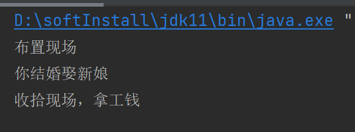
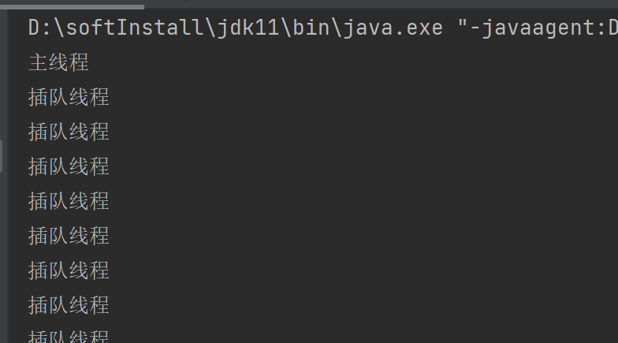
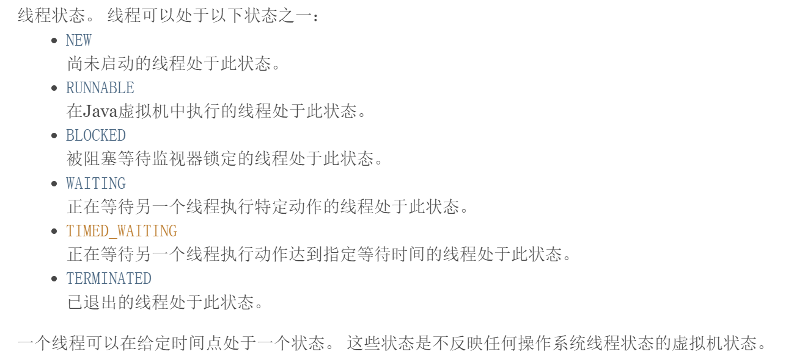
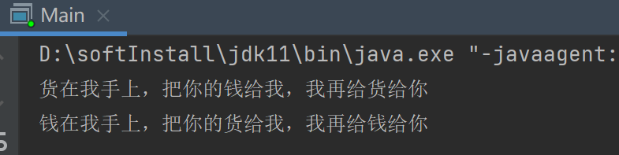
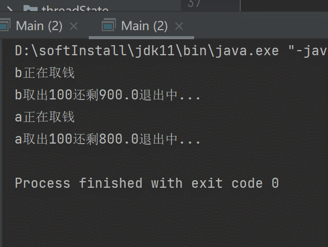
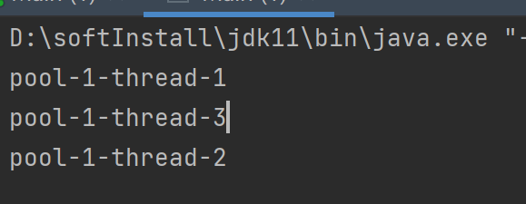

### 线程、进程、多线程

```
一个线程就是一个任务。
一个进程里面至少有一个线程。
很多多线程是模拟出来的，真正的多线程是指有多个cpu即多核，如服务器。如果是模拟出来的多线程，即在一个cpu的情况下，在同一个时间点，cpu只能执行一个代码，因为切换的很快，所以就有同时执行的错觉。（JavaScript就是单线程语言）。
```

```
线程就是独立的执行路径;
在程序运行时，即使没有自己创建线程，后台也会有多个线程，如主线程，gc线程;
main()称之为主线程，为系统的入口，用于执行整个程序;
在一个进程中，如果开辟了多个线程，线程的运行由调度器安排调度，调度器是与操作系统紧密相关的，先后顺序是不能人为的干预的;
对同一份资源操作时，会存在资源抢夺的问题，需要加入并发控制;
线程会带来额外的开销，如cpu调度时间，并发控制开销;
每个线程在自己的工作内存交互，内存控制不当会造成数据不一致;
```

### 线程创建

#### 方式1继承Thread类

```
1、继承Thread类
2、重写run方法
3、new一个继承类对象，然后调用start开启线程，直接调用run方法不会开启一个额外线程，run方法会在被调用的那个线程中被执行
```

```java
package com.extendThread;

public class Main extends Thread{
    @Override
    public void run(){
        for (int i = 0; i < 2000; i++) {
            System.out.println("run");
        }
    }
    public static void main(String[] args) {
        Main main = new Main();
        main.start();
        for (int i = 0; i < 2000; i++) {
            System.out.println("main");
        }
    }
}
```

```
两个线程交替执行
```

#### 方式2实现Runnable类

```
1、实现Runnable接口
2、实现run()方法
3、创建实现类对象，创建线程对象，调用start()方法
```

```java
package com.implementRunnable;

public class Main {
    public static void main(String[] args) {
        IRunnable iRunnable = new IRunnable();
        Thread thread = new Thread(iRunnable);
        thread.start();
        for (int i = 0; i < 2000; i++) {
            System.out.println("main");
        }
    }
}

class IRunnable implements Runnable {
    @Override
    public void run() {
        for (int i = 0; i < 2000; i++) {
            System.out.println("irunnable");
        }
    }
}
```

#### 方式3实现Callable接口（了解）

```
1.实现callable接口，需要返回值类型
2.重写call方法，需要抛出异常
3.创建目标对象
4.创建执行服务:ExecutorService ser = Executors.newFixedThreadPool(1);
5.提交执行:Future<Boolean> result1 = ser.submit(t1);
6.获取结果:boolean r1 = result1.get()
7.关闭服务:ser.shutdownNow();
```

```java
package com.implementCallable;

import java.util.concurrent.*;

public class Main {
    public static void main(String[] args) throws ExecutionException, InterruptedException {
//        创建线程
        IC ic1 = new IC();
        IC ic2 = new IC();
        IC ic3 = new IC();
//        创建开启服务
        ExecutorService ser = Executors.newFixedThreadPool(3);
//        提交线程
        Future<Boolean> r1 = ser.submit(ic1);
        Future<Boolean> r2 = ser.submit(ic2);
        Future<Boolean> r3 = ser.submit(ic3);
//        获取结果
        boolean result1 = r1.get();
        boolean result2 = r1.get();
        boolean result3 = r1.get();
//        关闭服务
        ser.shutdown();
        System.out.println(result1+""+result2+""+result3);
    }
}

class IC implements Callable<Boolean>{
    @Override
    public Boolean call() throws Exception {
        return true;
    }
}
```

### 初始并发问题

```
多个线程操作同一个资源时，会出现资源同步异常的问题
```

```java
package com.problem;

public class Main {
    public static void main(String[] args) {
        Ticket ticket = new Ticket();
        new Thread(ticket,"我").start();
        new Thread(ticket,"其它人").start();
        new Thread(ticket,"可恶的黄牛党").start();
    }
}

class Ticket implements Runnable{
    private int ticketNumber = 10;
    @Override
    public void run() {
        while(true){
            if(ticketNumber<=0){
                break;
            }
            try {
                Thread.sleep(200);
            } catch (InterruptedException e) {
                e.printStackTrace();
            }
            System.out.println(Thread.currentThread().getName()+"买了第"+ticketNumber--+"张票");
        }
    }
}
```


### 静态代理模式

```
1、说明：真实角色只负责最重要的事情，最核心的东西，但是这些最重要的事情附带着一些额外的功能，可以交给代理角色去帮忙做。代理角色实际上就是外包和服务公司。
2、实现：真实角色与代理角色都实现同一个接口，这样代理角色就可以直接获取到真实角色类中的成员名
见下方婚庆与结婚的案例
```

```java
package com.publicProxy;

public class Main {
    public static void main(String[] args) {
        Wedding_services wedding_services = new Wedding_services(new You());
        wedding_services.marry();
    }
}

interface Marry{
    public void marry();
}

class You implements Marry{
    @Override
    public void marry() {
        System.out.println("你结婚娶新娘");
    }
}

class Wedding_services implements Marry{
//    真实用户
    private You user;

    public Wedding_services(You user) {
        this.user = user;
    }

    public void before(){
        System.out.println("布置现场");
    }

    public void after(){
        System.out.println("收拾现场，拿工钱");
    }

    @Override
    public void marry() {
        before();
        user.marry();
        after();
    }
}
```



### 线程状态

```
死亡之后的线程就不能再启动了
```


### 线程方法

#### 停止线程

```
不推荐使用JDK提供的stop()/destory()方法，这两个方法已经过时了@Deprecated。
推荐自己声明一个标识，用这个标识来控制线程体的执行
```

```java
package com.stopThread;

public class Main {
    public static void main(String[] args) throws InterruptedException {
        I i = new I();
        Thread thread = new Thread(i);
        thread.start();
        Thread.sleep(8000);
        i.stop();
    }
}

class I implements Runnable {
    private boolean lock = true;

    @Override
    public void run() {
        while(lock){
            try {
                Thread.sleep(2000);
            } catch (InterruptedException e) {
                e.printStackTrace();
            }
            System.out.println("hai");
        }
    }

    public void stop(){
        this.lock = false;
    }
}
```

#### 线程休眠

```
Thread.sleep(时间)指定当前线程阻塞的毫秒数;
sleep存在异常InterruptedException;
sleep时间达到后线程进入就绪状态;
sleep可以模拟网络延时，倒计时等。
每一个对象都有一个锁,sleep不会释放锁;
```

#### 线程礼让

```
礼让线程，让当前正在执行的线程暂停，但不阻塞将线程从运行状态转为就绪状态。
让cpu重新调度，礼让不一定成功!（礼让，线程退出运行转为就绪状态，但是可能会被CPU再次调度）。
Thread.yield();
```

#### 线程插队

```
thread.join(); 让thread线程先执行完，再允许其它线程执行。
```

```java
package com.ThreadJoin;

public class Main implements Runnable{
    public static void main(String[] args) throws InterruptedException {
        Main main = new Main();
        Thread thread = new Thread(main);
        thread.start();
        for (int i = 0; i < 100; i++) {
            System.out.println("主线程");
            thread.join();
        }
    }

    @Override
    public void run() {
        for (int i = 0; i < 100; i++) {
            System.out.println("插队线程");
        }
    }
}
```



#### ### 观测线程的状态

```
api文档
```



```java
package com.threadState;

public class Main implements Runnable{
    @Override
    public void run() {
        try {
            Thread.sleep(5000);
        } catch (InterruptedException e) {
            e.printStackTrace();
        }
    }

    public static void main(String[] args) throws InterruptedException {
        Main main = new Main();
        Thread thread = new Thread(main);
        Thread.State state = thread.getState();
        System.out.println(state); //NEW
        thread.start();
        state = thread.getState();
        System.out.println(state); //RUNNABLE
        while(state != Thread.State.TERMINATED){
            Thread.sleep(1000);
            state = thread.getState();
            System.out.println(state); //TIMED_WAITING TIMED_WAITING TIMED_WAITING TIMED_WAITING TERMINATED
        
    }
}

```

#### 线程的优先级

```
java提供一个线程调度器来监控程序中启动后进入就绪状态的所有进程，线程调度器按照优先级决定应该调度那个线程来执行
线程的优先级用数字来表示，范围从1~10
	Thread.MIN_PRIORITY = 1;
	Thread.NAX_PRIORITY = 10;
	Thread.NORM_PRIORITY = 5;
获取线程的优先级和设置优先级
getPriority()
setPriority()
```

```java
package com.threadPriority;

public class Main implements Runnable{
    public static void main(String[] args) {
        Main main = new Main();
        Thread thread = new Thread(main);
        System.out.println(thread.getPriority());
        thread.setPriority(10);
        System.out.println(thread.getPriority());
    }

    @Override
    public void run() {

    }
}
```

#### 守护线程

```
线程分为用户线程和守护线程
虚拟机必须确保用户线程（main）执行完毕
虚拟机不用等待守护线程执行完毕(如gc垃圾回收线程)
设置成守护线程 setDaemon(Boolean boolean);
```

```java
package com.Daemon;

public class Main {
    public static void main(String[] args) {
        You you = new You();
        God god = new God();
        Thread thread = new Thread(god);
        /* 不将god设置成守护线程，因为god永远不会执行完毕，因此虚拟机要一直等待它执行，程序一直不会终止*/
        thread.setDaemon(true);
        new Thread(you).start();
    }
}

class You implements Runnable {

    @Override
    public void run() {
        for (int i = 0; i < 36500; i++) {

        }
        System.out.println("你死了");
    }
}

class God implements Runnable {

    @Override
    public void run() {
        while(true){

        }
    }
}
```

#### 线程等待与唤醒

```
对象监视器.wait()当前线程进入等待状态
对象监视器.wait(long timeout)指定等待的毫秒数
对象监视器.notify()唤醒一个处于等待状态的线程,唤醒是随机的
对象监视器.notifyAll()唤醒当前对象监视器的所有线程
注意：均是Object类的方法，都只能在同步方法或者同步代码块中使用，否则会抛出异常lllegalMonitorStateException
```

### 线程同步

#### 并发

```
同一个对象被多个线程同时操作。
```

#### 等待池队列

```
处理多线程问题时，多个线程访问同一个对象，并且某些线程还想修改这个对象。这时候我们就需要线程同步。线程同步其实就是一种等待机制，多个需要同时访问此对象的线程进入这个对象的等待池形成队列,等待前面线程使用完毕，下一个线程再使用。
```

#### 锁

```
由于同一进程的多个线程共享同一块存储空间,在带来方便的同时,也带来了访问冲突问题，为了保证数据在方法中被访问时的正确性，需要给资源加一个synchronized,当一个线程获得对象的排它锁﹐独占资源，其他线程必使用后释放锁即可.
但是使用锁存在以下问题：
	会导致其他所有需要此锁的线程挂起;
	在多线程竞争下,加锁。释放锁会导致比较多的上下文切换和调度延时,引起性能问题;
	如果一个优先级高的线程等待一个优先级低的线程释放锁会导致优优先级倒置﹐引起性能问题;
```

#### 同步方法

```
给方法添加synchronized（同步）关键字
	缺点：若将一个大方法申明为同步方法，会影响效率
什么时候使用？
	当线程需要修改资源时使用，如果只是只读的话，就不用加锁
```

```java
package com.synchronized_;

public class Main {
    public static void main(String[] args) {
//        new 一个ATM机
        Money money = new Money();
//        一次性创建15个人去取钱
        for (int i = 0; i < 15; i++) {
            new Thread(money, ((Integer) i).toString()).start();
        }
    }
}

class Money implements Runnable {

    private double money = 1000;

    @Override
    public synchronized void run() {
        try {
//                模拟用户操作ATM机的时间
            Thread.sleep(200);
        } catch (InterruptedException e) {
            e.printStackTrace();
        }
        if (money > 0) {
            money = money - 100;
            System.out.println(Thread.currentThread().getName() + "取出100块还剩" + money);
        } else {
            System.out.println(Thread.currentThread().getName() + "没有取到钱，因为没钱了。");
        }
    }
}
```

#### 同步块

```
同步块:
synchronized (Obj){}
Obj称之为同步监视器
	Obj可以是任何对象﹐但是推荐使用共享资源作为同步监视器;
	同步方法中无需指定同步监视器，因为同步方法的同步监视器就是this ,就是这个对象本身，或者是class[反射中讲解]
同步监视器的执行过程
	1.第一个线程访问﹐锁定同步监视器,执行其中代码。
	2.第二个线程访问，发现同步监视器被锁定，无法访问。
	3.第一个线程访问完毕﹐解锁同步监视器。
	4.第二个线程访问,发现同步监视器没有锁，然后锁定并访问。
```

```java
package com.synchronized_.block;

public class Main {
    public static void main(String[] args) {
//        new 一个ATM机
        ATM atm = new ATM();
//        一次性创建15个人去取钱
        for (int i = 0; i < 15; i++) {
            new Thread(atm, ((Integer) i).toString()).start();
        }
    }
}

class ATM implements Runnable {

    private Money money = new Money(1000);

    @Override
    public void run() {
        synchronized (money){
            try {
//                模拟用户操作ATM机的时间
                Thread.sleep(200);
            } catch (InterruptedException e) {
                e.printStackTrace();
            }
            if (money.getAmount() > 0) {
                money.setAmount(money.getAmount() - 100);
                System.out.println(Thread.currentThread().getName() + "取出100块还剩" + money.getAmount());
            } else {
                System.out.println(Thread.currentThread().getName() + "没有取到钱，因为没钱了。");
            }
        }
    }

    class Money{
        private double amount;

        public double getAmount() {
            return amount;
        }

        public void setAmount(double amount) {
            this.amount = amount;
        }

        public Money(double amount) {
            setAmount(amount);
        }
    }
}
```

### 死锁

```
多个线程各自占有一些共享资源，并且互相等待其他线程占有的资源才能运行，而导致两个或者多个线程都在等待对方释放资源，都停止执行的情形。某一个同步块同时拥有“两个以上对象的锁”时,就可能会发生“死锁”的问题。
```

```java
package com.dieLock;

public class Main {
    public static void main(String[] args) {
        Tradesman tradesman = new Tradesman();
        Buyer buyer = new Buyer();
        new Thread(tradesman).start();
        new Thread(buyer).start();
    }
}

// 商人
class Tradesman implements Runnable{

    public static String goods = "商品";

    @Override
    public void run() {
        synchronized (goods){
            System.out.println("货在我手上，把你的钱给我，我再给货给你");
            try {
//                等另外一个线程拿到资源
                Thread.sleep(2000);
                synchronized (Buyer.money){
                    System.out.println("交易成功");
                }
            } catch (InterruptedException e) {
                e.printStackTrace();
            }
        }
    }
}

// 钱
class Buyer implements Runnable{

    public static String money = "100万";

    @Override
    public void run() {
        synchronized (money){
            System.out.println("钱在我手上，把你的货给我，我再给钱给你");
            try {
//                等另外一个线程拿到资源
                Thread.sleep(2000);
                synchronized (Tradesman.goods){
                    System.out.println("交易成功");
                }
            } catch (InterruptedException e) {
                e.printStackTrace();
            }
        }
    }
}
```



### Lock锁（接口）

```
一种更高级的同步实现方式
可以显示的加锁解锁
能帮助JVM更好的调用线程，优化性能
提供多个实现类，拥有更好的扩展性，一般使用ReentrantLock实现类
使用顺序：Lock>同步代码块>同步方法
```

```java
package com.Lock;

import java.util.concurrent.locks.ReentrantLock;

public class Main {
    public static void main(String[] args) {
        Money money = new Money();
        new Thread(money, "a").start();
        new Thread(money, "b").start();
    }
}

class Money implements Runnable {

    private double amount = 1000;

    private final ReentrantLock lock = new ReentrantLock();

    @Override
    public void run() {
        try {
            lock.lock();
            if (amount > 0) {
                System.out.println(Thread.currentThread().getName() + "正在取钱");
                Thread.sleep(3000);
                amount = amount - 100;
                System.out.println(Thread.currentThread().getName() + "取出100还剩" + amount+"退出中...");
                Thread.sleep(3000);
            }
        } catch (InterruptedException e) {
            e.printStackTrace();
        } finally {
            lock.unlock();
        }
    }
}
```



### 线程通信

#### 管程法

```
使用一个容器来为线程之前的通信提供方式
```

```java
package com.threadCommunication.Container;

public class Main {
    public static void main(String[] args) {
        Container container = new Container();
        Consumers consumers = new Consumers(container);
        Producer producer = new Producer(container);
        new Thread(consumers).start();
        new Thread(producer).start();
    }
}

class Container {
    private String[] arr = new String[10];
    private int currentNumber = 0;

    public synchronized void push() {
        if (currentNumber == 9) {
            try {
                this.wait();
            } catch (InterruptedException e) {
                e.printStackTrace();
            }
        }
        arr[currentNumber++] = "鸡";
        //            通知消费者消费鸡
        this.notifyAll();
    }

    public synchronized void pop(){
        while (currentNumber == 0) {
            try {
                this.wait();
            } catch (InterruptedException e) {
                e.printStackTrace();
            }
        }
        arr[currentNumber--] = "";
        //            通知消费者消费鸡
        this.notifyAll();
    }
}

class Producer implements Runnable {
    private Container container;

    public Producer(Container container) {
        this.container = container;
    }

    @Override
    public void run() {
        for (int i = 0; i < 100; i++) {
            container.push();
            System.out.println("添加了第" + i + "只鸡");
        }
    }
}

class Consumers implements Runnable {
    private Container container;

    public Consumers(Container container) {
        this.container = container;
    }

    @Override
    public void run() {
        for (int i = 0; i < 100; i++) {
            container.pop();
            System.out.println("消费了第" + i + "只鸡");
        }
    }
}
```

### 线程池

```
背景:经常创建和销毁、使用量特别大的资源，比如并发情况下的线程，对性能影响很大。
思路:提前创建好多个线程，放入线程池中，使用时直接获取，使用完放回池中。可以避免频繁创建销毁、实现重复利用。类似生活中的公共交通工具。
好处:
	提高响应速度(减少了创建新线程的时间)
	降低资源消耗(重复利用线程池中线程，不需要每次都创建)
	便于线程管理(....)
		corePoolSize:核心池的大小
		maximumPoolSize:最大线程数
		keepAliveTime:线程没有任务时最多保持多长时间后会终止
```

```java
package com.threadPool;


import java.util.concurrent.ExecutorService;
import java.util.concurrent.Executors;

public class Main {
    public static void main(String[] args) {
//        创建线程池
        ExecutorService service = Executors.newFixedThreadPool(10);
//        执行
        service.execute(new MyThread());
        service.execute(new MyThread());
        service.execute(new MyThread());
//        关闭线程池
        service.shutdown();
    }
}

class MyThread implements Runnable{
    @Override
    public void run() {
        System.out.println(Thread.currentThread().getName());
    }
}
```


