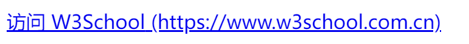

## 属性（魔法师）

```
如width,height...
```

## 值（魔法师的法术招式）

```
魔法师如width的法术10px、10%...
常用的值：
	整数值：z-index:1
	数值：line-height:1.5
    百分比值：padding:50%
    长度值：99px
    颜色值：#ccc
    位置值：float:left
    字符串值...
    css3中的角度值、频率值、时间值...
```

## 关键字

```
指的是css里面很关键的单词，如transparent
```

## 变量

```
比较少，如css3中的currentColor
```

## 单位（魔法师法术招式效果的大小）

```
时间单位
	s、ms
角度单位
	deg、rad
长度单位（最常见）
	相对长度单位
		相对字体长度单位
			em、ex(相对于字符“x”的高度。通常为字体高度的一半。如当前对行内文本的字体尺寸未被人为设置，则相对于浏览器的默认字体尺寸)、ch(字符0的宽度)
		相对视区长度单位
		vh、vw、vmin(相对于viewport的宽度或高度中较小的那个然后计算文字大小)、vmax
	绝对长度单位
		px、pt、cm、mm、pc(后面四个基本不用)
```

`！！！%不是单位，2%理解成0.02，也就是一个值`

## 功能符

```
值以函数的形式指定，主要用来表示颜色(rgba和hsla)、背景图片地址(url)、元素属性值、计算(calc)和过渡效果等，如rgba(0,0,0,.5)、url('css-world.png')、attr('href')和scale(-1)
```

```html
<style>
a:after {content: " (" attr(href) ")";}
</style>
<p><a href="https://www.w3school.com.cn">访问 W3School</a></p>
```



## 属性值（魔法师的法术招式）

```
属性冒号后面的所有内容统一称为属性值
```

## 声明（魔法师施法）

```
属性名+属性值就是一条声明
```

## 声明块（一套施法连招）

```
{
	声明
}
```

## 规则或规则集

```
为一个声明块指定标签
为一套施法连招指定魔法石
```

## 选择器（瞄准镜）

```
 类选择器：.类名
 id选择器：#id名
 属性选择器：指含有[]的选择器
 伪类选择器：
 伪元素选择器：
 关系选择器：
 	后代选择器
 	相邻后代选择器
 	兄弟选择器
 	相邻兄弟选择器
```

## @规则

```
@media、@font-face、@page、@support...
```

## 未定义的行为

```
浏览器各大厂商对于W3C规则实现效果的差异性，也就是兼容性差异我们称之为未定义的行为。
```

# 观后感

```
这一章作者为我们解释了一些css2世界中的一些专业术语，以便作者能更好的带领我们去认识参观css2世界
```

