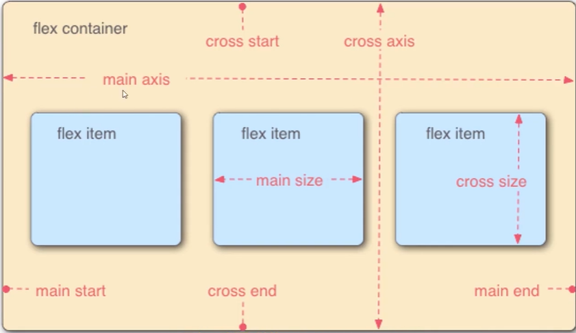

## 弹性盒子的概念
```
弹性盒子是一种用于“按行或按列”布局元素的一维布局方法。（不太适合多行多列布局）盒子可以膨胀来填充额外的空间，收缩以适应更小的空间
```

## flex容器
```css
  /* 给父盒子添加flex属性，来控制子盒子的位置和排列方式 */
  display:flex;
```

### 主轴与交叉轴



### 可以设置的样式
```
1. flex-direction（流式-方向） 
设置主轴方向 `row` 左到右（默认值）/`row-reverse `右到左/`column` 上到下/`column-reverse `下到上

2. flex-wrap（换行）
决定主轴放不下时，是改变盒子大小“强行”全部放在主轴上（`nowrap `默认值），还是换行`wrap`

3. flex-flow

是flex-direction和flex-wrap的合写

4. justify-content （保证-内容） 

设置子盒子的布局方式 `flex-start`主轴头部开始 （默认值）/ `flex-end`主轴尾部开始/ `center `居中/ `space-around`平分剩余空间/ `space-between`先贴边，再平分剩余空间/ `space-evenly`最左边最右边以及中间的间距都是相等的

5. align-items （布局- 单行未换行flex-wrap:nowrap，多行不起效果） 

设置交叉轴的排列方式 `flex-start `头部开始默认值/`flex-end` 尾部开始/`center` 居中/`stretch` （默认值）子盒子没高度时，子盒子高度铺满父盒子，有高度时，不起作用/`space-evenly`最上面最下面以及中间的间距都是相等的,单行才起效果，所以没有中间距离，因此很少用这个属性

6. align-content（布局- 多行换行起效果flex-wrap:wrap，单行不起效果）
设置交叉轴的排列方式 `flex-start`/`flex-end`/`center`/`space-around`/`space-between`/`stretch`（默认值）多行平分父盒子的高度，也是子盒子不能有高度，否则也会不起效果/`space-evenly`最上面最下面以及中间的间距都是相等的
```

## flex子项
### 可以设置的样式
```
1. align-self（布局-自己）
设置自己在交叉轴的排列方式
auto    默认值。元素继承了它的父容器的 align-items 属性。如果没有父容器则为 "stretch"。
stretch    元素被拉伸以适应容器。如果指定交叉轴大小的属性值为'auto'，则其值会使项目的边距盒的尺寸尽可能接近所在行的尺寸，但同时会遵照'min/max-width/height'属性的限制。
center    元素位于容器的中心。弹性盒子元素在该行的交叉轴（纵轴）上居中放置。（如果该行的尺寸小于弹性盒子元素的尺寸，则会向两个方向溢出相同的长度）。
flex-start    元素位于容器的开头。
flex-end    元素位于容器的结尾。
baseline    元素位于容器的基线上。如弹性盒子元素的行内轴与交叉轴为同一条，则该值与'flex-start'等效。其它情况下，该值将参与基线对齐。
inherit

2. order
设置自己在轴方向位置的优先级，默认都是0,可以设置为负数

3. flex-grow
放大倍数，默认值为0，当设置为1时，子盒子没有给宽度，默认所有的子盒子按照自己放大的倍数去占满父盒子的所有空间。

4. flex-shrink
缩小倍数，默认值为1，当父盒子装不下所有的子盒子时，默认所有的子盒子按照自己缩小的倍数去占满父盒子的所有空间。

5. flex-basis
定义了在分配多余空间之前，子盒子占据的空间，默认值是auto，即是根据内容来设置宽度/高度。也可以把它当成width或者height来设置成固定的宽度或高度(flex-direction) `flex-basis: 100px;`

6. flex
flex-grow , `flex-shrink(?可选) , ` `flex-basis(?可选)` 的缩写。默认值是 0 1 auto,当我们使用这个属性的时候`flex: 1;`代表的就是`flex-grow:1;`
```