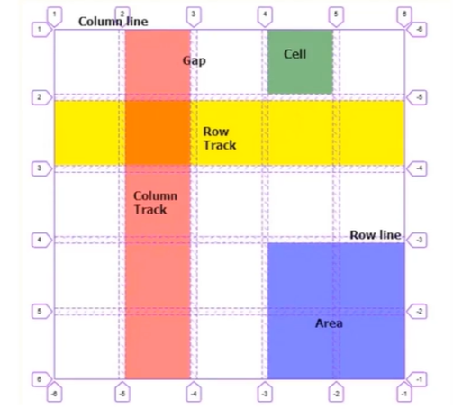
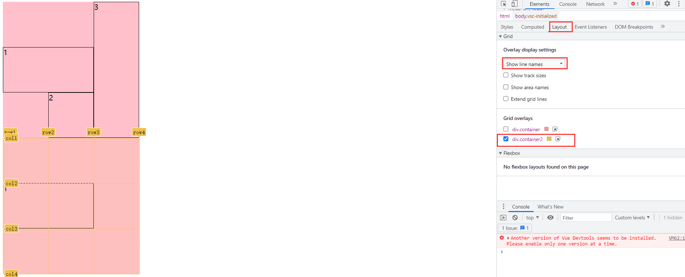

# grid网格布局
```css
    {
        display: grid;
    }
```
## gird容器与grid子项

### 定义网格及fr单位



```css
.container {
    grid-template-columns: 1fr 2fr 3fr;
    grid-template-rows: 100px 100px 100px;
}
```

### 合并网格及网格命名

```css
.container {
    /* 
        grid-template-columns: 1fr 1fr 1fr;
        grid-template-rows: 1fr 1fr 1fr;
        grid-template-areas: "a1 a1 a2" "a1 a1 a2" "a3 a3 a3"; 
    */
    /* 复合写法 */
        grid-template: "a1 a1 a2" 1fr "a1 a1 a2" 1fr "a3 a3 a3" 1fr / 1fr 1fr 1fr;
}

.container div:nth-child(1) {
    grid-area: a1;
}
```

### 网格间隙及简写
```
row-gap,column-gap,简写gap。其实原本是有一个grid前缀的，一开始间隙是诞生与网格布局中，但是后面发现其它布局方式里面也有间隙，比如flex弹性布局。
```
```css
.container {
    /* 
    row-gap: 20px;
    column-gap: 30px; 
    */
    gap: 20px 30px;
}
```

### 网格对齐方式与简写
```css
.container {
    /* 相对于自己分配的盒子的主轴的位置 */
    /* justify-items: center; */
    /* 相对于自己分配的盒子的交叉轴的位置 */
    /* align-items: center; */
    /* 简写 */
    place-items: center center;
}

.container2 {
    /* justify-content: center; */
    /* align-content: center; */
    place-content: center center;
}
```

### 显式网格与隐式网格
```
grid-template-rows，grid-template-columns绘制出来的网格就是显式网格，当子盒子的数量大于这个显式网格数量，会自动生成隐式网格
```
```css
.container {
    grid-template-columns: 100px 100px 100px;
    grid-template-rows: 100px;
    /* 默认 row 行产生隐式网格 */
    grid-auto-flow: row;
    /* row产生隐式网格时，默认自动拉伸适应容器，可以调节隐式网格的高度 */
    grid-auto-rows: 150px;
}

.container2 {
    grid-template-rows: 100px 100px 100px;
    grid-template-columns: 100px;
    /* 默认 row 行产生隐式网格 */
    grid-auto-flow: column;
    /* columns产生隐式网格时，默认高度由内容决定，可以调节隐式网格的高度 */
    grid-auto-rows: 150px;
}
```

### 基于线放置位置



```css
    .container div:nth-child(1){
        /* 打开google调试工具，选择layout，勾选要查看的盒子，选择show line numbers */
            /* grid-column-start: 2;
            grid-column-end: 3;
            grid-row-start: 1;
            grid-row-end: 3; */
            /* 简写 */
            /* grid-column: 2/3;
            grid-row: 1/3; */
            /* 复合写法rowstart columnstart rowend columnend */
            /* grid-area: 2 / 1 / 3 / 3; */
            /* span代表占多少个单元格 */
            /* grid-row-end: span 3; */
             /* 默认基线是数字，可以手动命名 */
            /* grid-template-rows: [col1] 1fr [col2] 1fr [col3] 1fr [col4];
            grid-template-columns: [row1] 1fr [row2] 1fr [row3] 1fr [row4]; */
            /* 打开google调试工具，选择layout，勾选要查看的盒子，选择show line numbers */
            grid-column-start: row1;
            grid-column-end: row3;
            grid-row-start: col2;
            grid-row-end: col3;
    }
```

### repeat()与minmax()
```css
.container {
    background-color: pink;
    display: grid;
    height: 500px;
    /* grid-template-columns: 100px 100px 100px; */
    /* repeat()书写重复的值 */
    /* grid-template-columns: repeat(3, 100px); */
    /* grid-template-columns: 150px 100px 100px; */
    /* grid-template-columns: 150px repeat(2, 100px); */
    /* auto-fill自适应grid容器大小的网格个数 */
    /* grid-template-columns: repeat(auto-fill, 100px); */
    /* minmax()设置网格最小值和最大值 */
    grid-template-columns: repeat(auto-fill, minmax( 100px, 1fr));
    grid-template-rows: 100px;
    gap: 20px 20px;
    grid-auto-rows: 100px;
        }
```