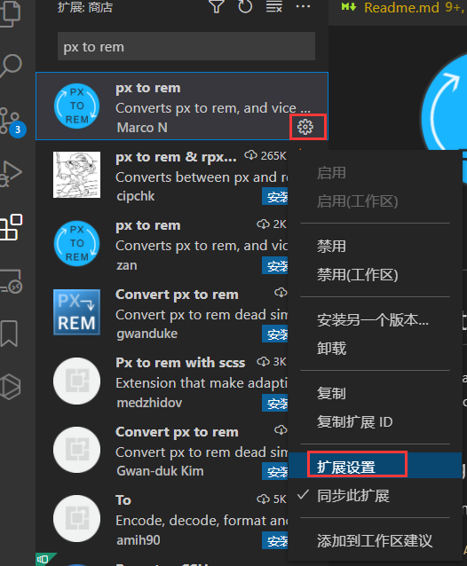
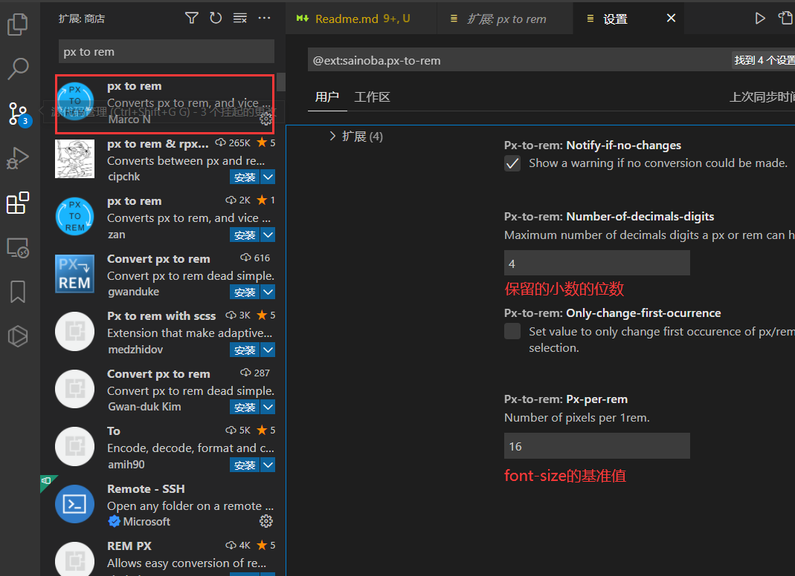
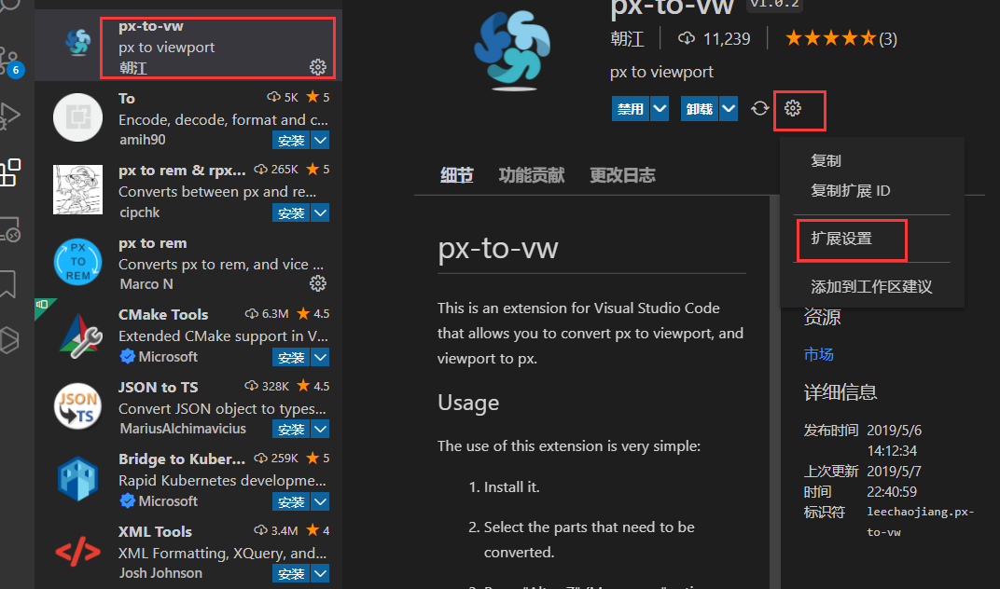
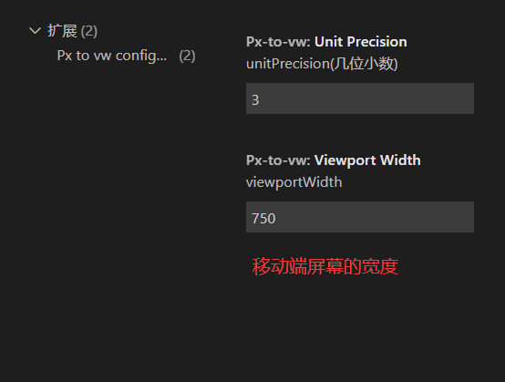

## 移动端适配布局单位

<div style="color:red">注意事项：在移动端中，量取的值是物理像素，在css中设置的时候应该使用逻辑像素（物理像素*2）</div>

### %
```
相对于`父元素`的`百分比`，如果父元素没有宽高，不生效。
```
### vw,vh（ie8+）
```
相对于`可视窗口`的`百分比`。
```
### em rem(ie8+)
```
em相对于父元素px值的倍数，谷歌浏览器默认值是16px。
rem（用的多）针对于根元素HTML的px值。
```

### 测量rem数值以及vscode插件的使用
1. 下载`px to rem`插件，免去了手动计算的麻烦，但是一定要进行拓展设置里面的font-size的值审核是否是当前项目的基准值
2. 拓展设置



3. 选中区域，按下alt+z快捷键，会将选中区域所有的px单位转化为rem

### vw,vh布局以及vscode插件的使用
1. 下载`px-to-vw`


2. 拓展设置



3. 选中区域，按下alt+z快捷键，会将选中区域所有的px单位转化为vw

<div style="color:red">注意：这个插件和上面那个插件快捷键会冲突，选择一种使用即可</div>