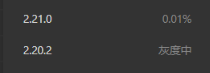

## 小程序的种类
1. 微信小程序（主流）
2. 支付宝小程序
3. QQ小程序
4. 抖音小程序
5. ...各大厂的小程序

## 推荐的小程序框架（2022年）
1. uni-app
```
由DCloud团队开发和维护
uni-app是一个使用vue开发所有前端应用的框架，开发者编写一套代码，可发布到IOS、Android、Web、以及各种小程序
```
2. taro
```
由京东团队开发和维护
taro是一个开放式跨端 跨框架解决方案，支持使用react、vue、Nerv等框架来开发小程序和RN等应用
Taro3.x之后，支持Vue3、React Hook写法等
```
<div style="color:red">使用框架会遇到很多问题，无法解决，还是推荐使用原生来开发小程序比较好</div>

## 微信小程序的核心技术
```
WXML,页面布局
WXSS,页面样式
JavaScript+WXS(WeiXinScript),页面脚本
```

## 开发准备
### 申请APPID
1. [微信小程序官网](https://mp.weixin.qq.com/)点击注册


2. 账号邮箱注册


3. 注册完之后，直接微信扫码登录，点击开发设置


4. 查看APPID


### 下载小程序开发工具

1. 微信开发者工具稳定版，必须安装，[下载地址](https://developers.weixin.qq.com/miniprogram/dev/devtools/download.html)
2. Vscode或者Hbuilder
3. Vscode插件推荐，然后直接用Vscode打开项目直接编写即可


### 微信开发者工具

```
选择微信云开发会有一些模板选择，但是是存在收费的情况的
不使用云服务的选择项
```


## 小程序的文件结构


## demo简单试水

### 页面结构


### 页面数据与逻辑


### 页面的样式


### 学习资料

[官方文档](https://developers.weixin.qq.com/miniprogram/dev/framework/)

### 在手机上预览

点击预览，然后会出现一个二维码，手机微信扫描这个二维码就可以在手机上进行展示了


### 小程序基础库

- 点开小程序编辑器的右上角详情 - 本地设置 - 调试基础库，会发现有很多基础库，有的后面是百分比，有的后面是灰度中

- 

- 基础库官方文档：[https://developers.weixin.qq.com/miniprogram/dev/framework/client-lib/](https://developers.weixin.qq.com/miniprogram/dev/framework/client-lib/)

- 微信小程序开发的时候，会有大量的代码，也会用到各种 API，这些 API 都存在与微信 SDK（software development kit 软件开发工具包）中，小程序运行的时候所需要的 SDK 存在于微信这个 APP 中，在下载微信的时候，这个 SDK 也自动下载下来了。

- 比如一个微信 a 的基础库版本是 1.3.2，另一个微信 b 的基础库是 1.8.5；这时候有一个小程序被开发了出来，里面有一个新的功能是基础库 1.8.3 新增的，那么微信 a 没法正常运行该小程序，而微信 b 则可以正常运行。微信团队会定时自动更新基础库的版本的

- 微信新版本发布的过程：

  1. 比如当前微信开发的最新的版本是 8.0.9，最新的基础库版本是 2.2.2，那么微信发布该版本的时候，不会将最新的基础库携带着一起发布出去，因为即使经过了很多次测试，但是在实际使用中多多少少会存在 bug，这个时候，微信发布的是基础库 2.2.2 前一个比较稳定的版本，这里就例如 2.1.9 版本的基础库
  2. 在新版本发布后，微信的后台会做一个**灰度发布，也叫金丝雀发布（国外与这个发布思想相近的发布方式是 A/B 测试）**，会先将基础库 2.2.2 给一部分用户去使用，当这一群用户使用中没有任何问题的话，那么微信就会将最新的基础库进行全部的发布出去，这一阶段是**全量发布**。
  3. 如果这一群用户使用基础库 2.2.2 出现的问题的时候，微信后台会将这一群用户的基础库回退到上一个稳定的版本，然后修复新版本的问题
  4. 在基础库后面的百分比指的是当前基础库的版本在用户中使用的占比；如果后面是灰度中的话，表示当前的基础库版本正在一群用户中进行测试，还未批量发布。
     

  5. 所以项目中不是必须使用最新版本的，可以选择比较稳定的版本

### 小程序 wxss 的 background 图片

- 小程序的 background 背景图片不能使用本地图片，只能使用网络图片

### 小程序上 position: sticky 失效

- 官网给了说明文档：
  [https://developers.weixin.qq.com/miniprogram/dev/platform-capabilities/extended/component-plus/sticky.html](https://developers.weixin.qq.com/miniprogram/dev/platform-capabilities/extended/component-plus/sticky.html)

### wx.switchTab 方法

- 如果在小程序导航栏处，使用 `wx.navigateTo` 进行页面跳转的话，会报错

  ```JavaScript
  handleBack() {
    wx.navigateTo({
      url: '/pages/home-music/index',
    })
  },
  ```

  

- 在导航栏处设置路由跳转的话需要使用 `wx.switchTab` 方法

```js
handleBack() {  
    wx.switchTab({    
        url: '/pages/home-music/index', 
    })
},
```

