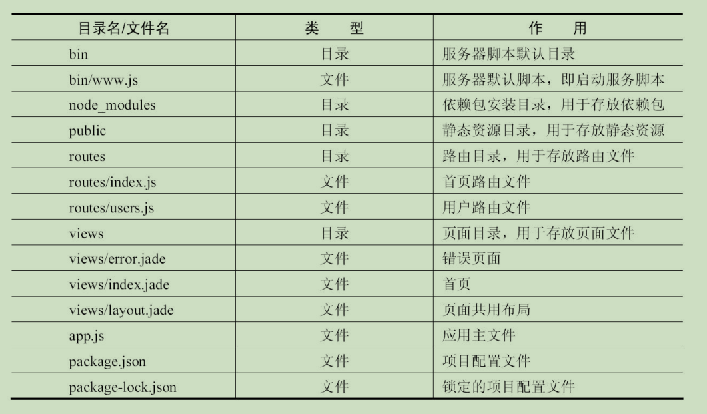
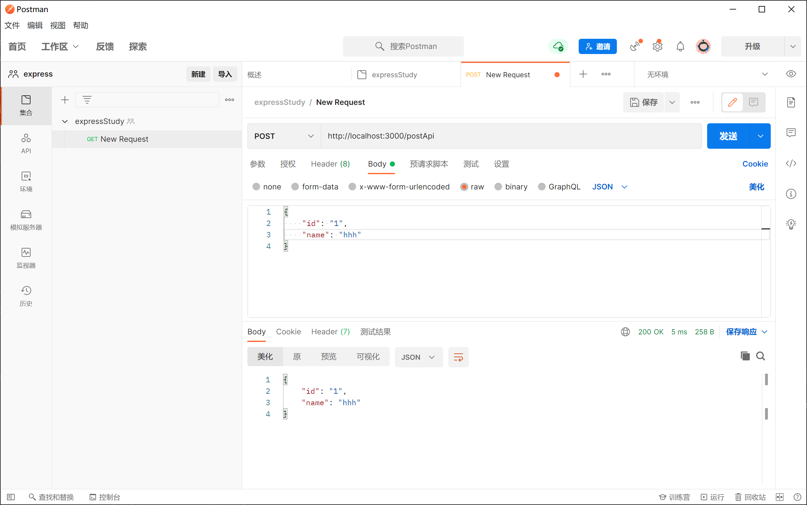
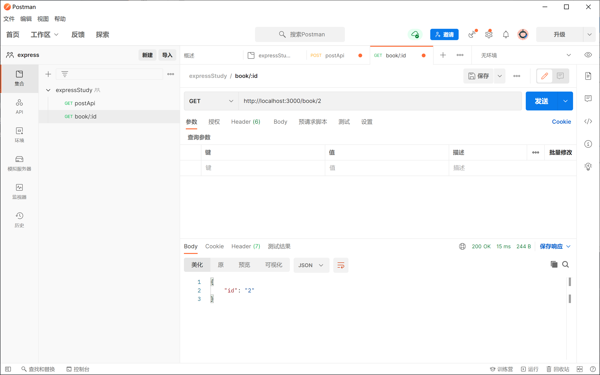
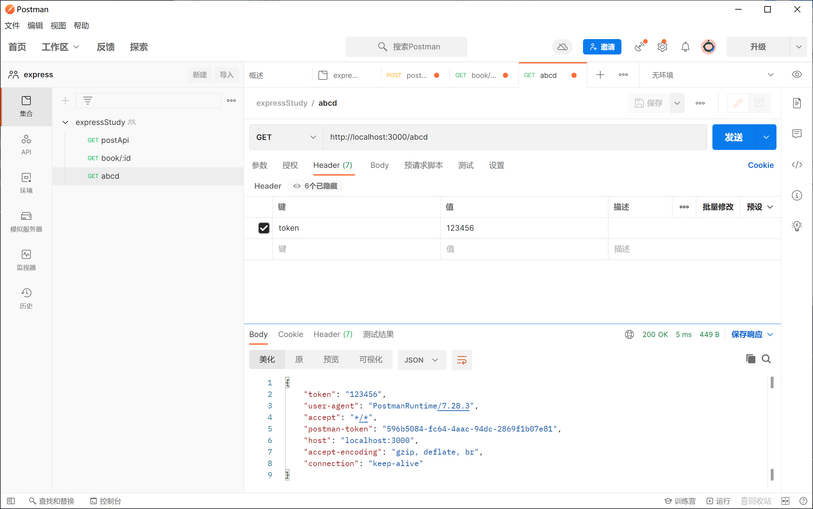
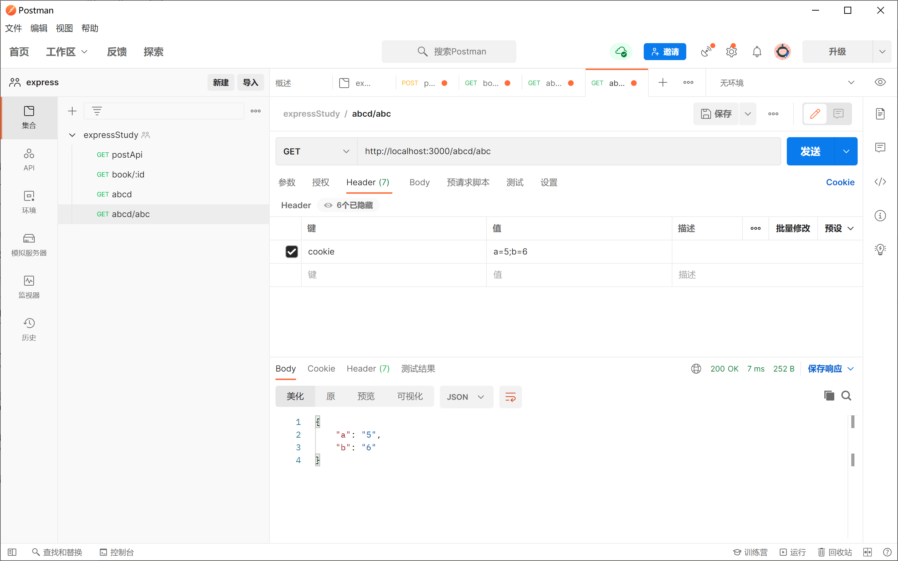
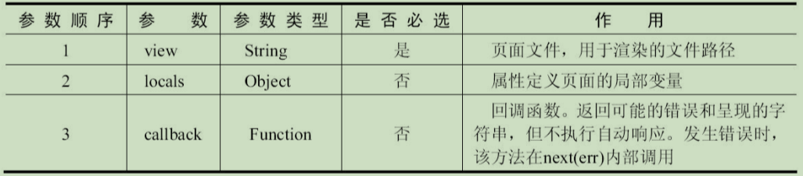
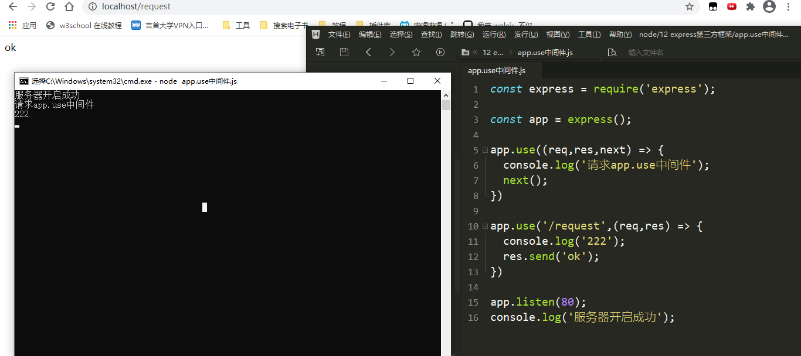

## 官网

[express中文网](https://www.expressjs.com.cn/)

[express官网](http://expressjs.com)

[nodejs中文社区](https://cnodejs.org)

[nodejs官网](https://nodejs.org)

[nodejs官方文档](https://nodejs.org/en/docs/)

## 项目初始化

### 安装

```
前置安装node
```

```
npm install express --save
```

### express脚手架安装

```
npm install -g express-generator && express --version
显示版本表示安装成功当前最新版本V4.16.1
```

### 创建项目

```
express projectName && cd projectName && npm install && npm run start
浏览器输入http://localhost:3000/查看express欢迎页
```

## express-generator项目文件分析



### app.js分析

```js
// http错误处理模块
var createError = require('http-errors');
// 引入Express
var express = require('express');                            
// 引入path
var path = require('path');
// 引入cookie处理对象
var cookieParser = require('cookie-parser');
// 引入日志模块
var logger = require('morgan');
// 引入路由目录中的index.js文件
var indexRouter = require('./routes/index');
// 引入路由目录中的users.js文件
var usersRouter = require('./routes/users');
// 创建Express应用
var app = express();      
// 定义页面目录
app.set('views', path.join(__dirname, 'views'));
// 定义页面模板引擎
app.set('view engine', 'jade');
// 定义日志打印级别
app.use(logger('dev'));
// 定义JSON格式处理数据
app.use(express.json());
// 定义使用urlencode处理数据及querystring模块解析数据
app.use(express.urlencoded({ extended: false }));
// 定义使用cookie处理对象
app.use(cookieParser());                                 
// 定义静态资源目录public
app.use(express.static(path.join(__dirname, 'public')));
// 定义指向index.js的路由
app.use('/', indexRouter);     
// 定义指向users.js的路由
app.use('/users', usersRouter);
// 定义404错误处理
app.use(function(req, res, next) {
  next(createError(404));
});
// 定义其他错误处理
app.use(function(err, req, res, next) {
  // 设置locals，只在开发环境生效
  res.locals.message = err.message;
  res.locals.error = req.app.get('env') === 'development' ? err : {};
  // 返回错误http状态码
  res.status(err.status || 500);
  // 渲染错误页面
  res.render('error');                       
});
module.exports = app;
```

### routes/index.js分析

```js
// 引入Express
var express = require('express');    
// 引入Express路由对象
var router = express.Router();                        
//首页路由
router.get('/', function(req, res, next) {
	//res.render()方法，该方法的作用是渲染页面。其第一个参数就是页面的文件名，这里对应的就是views目录中的index.jade文件；第二个参数是传入到页面文件的对象，可以将数据渲染到页面上。
  res.render('index', { title: 'Express' });
});

module.exports = router;
```

### 修改package.json的scripts

```
npm install nodemon -g
```

```json
"scripts": {
  -- "start": "node ./bin/www"
  ++ "start": "nodemon ./bin/www"
},
```

### router请求方式

```js
// HTTP请求方式除了GET之外，还有POST、PUT等其他方式
// POST请求方式
router.post('/world', function(req, res, next) {
  res.render('index', { title: 'Hello World' });            // 渲染index页面
});
// PUT请求方式
router.put('/world', function(req, res, next) {
  res.render('index', { title: 'Hello World' });            // 渲染index页面
});
// DELETE请求方式
router.delete('/world', function(req, res, next) {
  res.render('index', { title: 'Hello World' });            // 渲染index页面
});
```

### 路由匹配规则

```js
// 在Express中，除了完整匹配，还支持模糊匹配
router.get('/wes?t', function(req, res, next) {
  res.render('index', { title: 'Hello World' });
});
// 在浏览器中查看，会发现当请求http://localhost:3000/west和http://localhost:3000/wet时都可以成功。
```

```js
// 模糊匹配还可以按如下处理
// 能够匹配/west、/weest、/weeest等
router.get('/we+st', function (req, res, next) {
  res.render('index', { title: 'Hello World' });
})
// 能够匹配/west、/wt
router.get('/w(es)?t', function (req, res, next) {
  res.render('index', { title: 'Hello World' });
})
// 能够匹配/west、/we123st、/wexxxst等
router.get('/we*st', function (req, res, next) {
  res.render('index', { title: 'Hello World' });
})
```

```js
// Express路由还支持正则表达式
// 能够匹配路径中包含west的任何内容，如/west、/aawest、/westee等
router.get(/west/, function (req, res, next) {
  res.render('index', { title: 'Hello World' });
})
```

### express页面模板引擎art-template

```
views页面目录中有3个页面文件：index.jade、error.jade和layout.jade。大家可能对jade这样的拓展名文件不太熟悉，其实它就是一种模板引擎，为了使用大家熟悉的HTML结构，通常在项目实际开发过程中会将其更换成便于理解的其他模板引擎，比如art-template等。
Express默认的模板引擎是jade，为了便于新用户上手开发，需要把它替换成更简洁、高效的art-template。
```

```
npm install -S art-template && npm install -S express-art-template
```

```
// 修改项目根目录下的app.js文件
-- app.set('view engine', 'jade');
++ app.engine('.html', require('express-art-template'));
++ app.set('view engine', 'html');
```

## 请求对象Requset

```
当请求到路由的时候会进入路由处理方法中，而路由处理方法本质上就是一个中间件，它包括3个参数，即请求对象Request、返回对象Response和下一步方法next。
```

### Request.url属性：获取请求地址

```js
// 学习router中间件函数中的requset对象
router.get("/abcd", function(req, res, next) {
    console.log(req.url); // /abcd
});
router.get("/abcd/abc", function(req, res, next) {
    console.log(req.url); // /abcd/abc
});
router.get("/book/:id", function(req, res, next) {
    console.log(req.url); // /book/2
});
```

### Request.query属性：获取GET请求参数

```js
router.get("/goods", function(req, res, next) {
    // 浏览器地址栏输入/goods?id=2&name=商品
    console.log(req.query); // { id: '2', name: '商品' }
});
```

### Request.body属性：获取POST请求参数

```js
router.post('/postApi', function(req, res, next) {
    console.log(req.body);
    // res.send()方法发送数据到页面显示
    res.send(req.body);
});
```

使用postman来测试



### Request.params属性：获取URL中的自定义参数

```
router.get("/book/:id", function(req, res, next) {
    console.log(req.url); // /book/2
    res.send(req.params); // { id: '2' }
});
```



### Request.headers属性：获取请求头数据

```js
router.get("/abcd", function(req, res, next) {
    console.log(req.url); // /abcd
    ++ res.send(req.headers);
});
```

```
在请求头中添加了token字段，接着在Postman中发送请求，查看结果。返回了很多数据，这些数据都是在Postman中默认添加的以及我们添加的token。
```



### Request.cookies属性：获取客户端cookie

```
从Request.headers中可以获取到cookie，但是获取过来的是字符串，并不太容易操作。Express提供了一种更简单的方式，它将cookie信息保存在了Request.cookies属性中。如果请求不包含cookie，则默认为{}。
注意：客户端的cookie是存在于请求头里面的，而并不在请求体中，使用Request.cookies能够获取到cookie，是因为Express做了处理，所以在设置的时候需要到请求的Header中去设置。
```

```js
router.get("/abcd/abc", function(req, res, next) {
    console.log(req.url); // /abcd/abc
    res.send(req.cookies);
});
```



## 响应对象Response

### Response.render()方法：渲染页面



```js
// 渲染一个页面文件到客户端
router.get("/res", function(req, res, next) {
    res.render("index.html");
});
// 回调函数，明确指定发送HTML字符串
router.get("/reshtml", function(req, res, next) {
    res.render("index", function(err, html) {
        // 读取的页面文件文本 
        console.log(html);
        // html和css都是文本，渲染到浏览器的时候，浏览器会帮我们解析，js会被浏览器引擎执行
        res.send(
            `<!DOCTYPE html><html lang="en"><head><meta charset="UTF-8"><title>Title</title></head><body><h2>我是一个页面</h2></h2></body></html>`
        );
    });
});
// 设置一个局部变量，渲染到user页面上
res.render('user', {
  name: 'Tobi'
}, function(err, html) {
  // 渲染完毕的回调函数
});
```

### Response.send()方法：发送HTTP响应

```js
// Response.send()方法是发送一个HTTP响应至前端，它只接收一个参数，这个参数可以是任何类型，可以是一个Buffer对象、一个String、一个Object，或一个Array。
// Response.send()方法之所以可以接收任何类型的参数，是因为执行这个方法返回的时候它会自动设置响应头数据类型，即响应头里的Content-Type字段。
// 1. 当参数是Buffer对象时，Response.send()方法将Content-Type响应头字段设置为application/octet-stream。
router.get("/resbuffer", function(req, res, next) {
    // 下载2进制文件
    res.send(new Buffer("<p>html</p>"));
});
// 2. 当参数为String时，Response.send()方法将Content-Type设置为text/html。
router.get("/resstring", function(req, res, next) {
    res.send("<h1>html</h1>");
});
// 3. 当参数是Array或Object时，Express以JSON表示响应，设置Content-Type为application/json。
router.get("/resobject", function(req, res, next) {
    res.send({ a: 1, b: 2 });
});
```

### Response.json()方法：返回JSON格式的数据

```
除了使用模板页面返回HTML页面之外，返回JSON格式的数据也是目前开发人员常做的事，尤其是在目前流行前后端分离开发方式的形势下
在Express中，返回JSON格式的数据也特别简单，使用Response.json()方法就能轻松地将封装好的数据通过JSON的方式返回给前端。
Response.json()方法只接收一个参数，可以是任何的JSON格式类型，包括对象、数组、字符串、布尔值或数字，甚至可以将其他值转换为JSON格式类型，例如null和undefined（尽管这些格式类型在技术上是无效的JSON）。
```

```js
router.get('/resjson', function(req, res, next) {
    // 返回JSON格式的数据
    res.json({
        name: 'john',
        age: 28,
        hobby: ['打篮球', '唱歌', '旅游']
    })
});
```

### Response.status()方法：设定HTTP状态码

```
有时候需要给前端返回指定的HTTP状态码，让前端更能明确地知道本次请求的状态。
```

```js
router.get('/resstatus', function(req, res, next) {
    res.status(202).end();
});
```

```
在使用Response.status()方法时，后面一定要有结束方法end()或者发送方法send()和json()等，因为Response.status()方法并不是返回结果，它只是设置了一个状态。
```

```js
router.get('/resstatus2', function(req, res, next) {
  // 定义一个404状态码，并以JSON格式返回
  res.status(404).json({
    statusCode: 404,
    msg: 'Not Found'
  })
});
```

### Response.redirect()方法：跳转指定路由

```
在实际开发过程中，经常需要跳转URL。Express提供了很好的跳转方法Response.redirect()，使用该方法可以很轻松地跳转到指定的路由。
除了可以跳转到本地路径外，还可以跳转到任意一个URL。
Response.redirect()方法还提供了设置当前路由的ResponseHTTP状态码的参数，而不是重定向路由的。
```

```js
router.get('/resredirect1', function(req, res, next) {
    console.log('resredirect1');
    res.redirect('/resredirect11');
});
router.get('/resredirect11', function(req, res, next) {
    console.log('resredirect11');
    res.end(); // 直接结束
});
// 先打印resredirect1，再打印resredirect11
```

```js
router.get('/resredirect2', function(req, res, next) {
  res.redirect('http://www.baidu.com');
});
```

```js
router.get('/resredirect3', function(req, res, next) {
  console.log ('/resredirect3');
  res.redirect(301, '/resredirect33');                  // 301跳转到“/resredirect33”路由
});
router.get('/resredirect33', function(req, res, next) {
  console.log ('/resredirect33');
  res.end();                                          // 直接结束
});
```

## express web构建工具

`npm install express`

### 初次使用

```JavaScript
// 引入express框架
const express = require('express');
// 创建网站服务器
const app = express();
app.get('/', (req, res) => {  
    // send()方法  
    /*    send()内部会检测响应内容的类型    自动设置http状态码    自动设置响应的内容类型及编码  */  
    res.send('哈哈哈');})
app.get('/list', (req, res) => {  
    res.send({    name: '刘德华',    age: 18  });})
app.listen(80);console.log('网站服务器启动成功');
```


### 中间件

```
中间件就是一堆方法， 可以接收客户端发来的请求、可以对请求做出响应，也可以将请求继续交给下一个中间件继续处理。
中间件主要由两部分构成，中间件方法以及请求处理函数。
中间件方法由Express提供，负责拦截请求，请求处理函数由开发人员提供，负责处理请求。
```

#### get\post都是中间件

```
可以针对同一个请求设多个中间件，对同一个请求进行多次处理。
```

```JavaScript
const express = require('express');const app = express();app.get('/request',(req , res , next) => {  req.name = '哈哈';  next();})app.get('/request',(req,res) => {  res.send(req.name);})app.listen(80);console.log('服务器开启成功');
```


#### app.use中间件

```
app.use匹配所有的请求方式，可以直接传入请求处理函数，代表接收所有的请求。

app.use第一个参数也可以传入请求地址，代表不论什么请求方式，只要这个请求地址就接收这个请求。
```

```JavaScript
const express = require('express');const app = express();app.use((req,res,next) => {  console.log('请求app.use中间件');  next();})app.use('/request',(req,res) => {  console.log('222');  res.send('ok');})app.listen(80);console.log('服务器开启成功');
```




#### 中间件的应用

1.路由保护, 客户端在访问需要登录的页面时，可以先使用中间件判断用户登录状态，如果未登录则拦截请求，直接响应，禁止用户进入需要登录的页面。

```JavaScript
const express = require('express');
const app = express();
app.get('/admin',(req,res,next) => {  
    let isLogin = false;  
    if(isLogin){    
        next();  
    }else{    
        res.send('用户未登录');  
    }})
app.get('/admin',(req,res) => {  
    res.send('用户想要的');
})
app.listen(80);
console.log('服务器开启成功');
```


2、网站维护公告

```JavaScript
const express = require('express');
const app = express();
// 网站公告
app.use((req,res,next) => {  
    res.send('网站正在维护中。。。')
})
app.use('/admin',(req,res,next) => {  
    let isLogin = false;  
    if(isLogin){    
        next();  
    }else{    
        res.send('用户未登录');  
    }})
app.get('/admin',(req,res) => {  
    res.send('用户想要的');
})
app.listen(80);
console.log('服务器开启成功');
```


3、自定义404页面

```JavaScript
const express = require('express');
const app = express();
app.use('/admin',(req,res,next) => {  
    let isLogin = false;  
    if(isLogin){    
        next();  
    }else{    
        res.send('用户未登录');  
    }})
app.get('/admin',(req,res) => {  
    res.send('用户想要的');
})app.use((req,res,next) => {  
    res.status(404).send('404页面不存在哇嘤');
})
app.listen(80);
console.log('服务器开启成功');
```


#### 错误处理中间件

```
在程序执行的过程中，不可避免的会出现一些无法预料的错误，比如文件读取失败，数据库连接失败。错误处理中间件是一个集中处理错误的地方。
```

```JavaScript
const express = require('express');
const fs = require('fs');
const app = express();
app.get('/index',(req,res,next) => {  
    /*
    // 错误处理中间件，只能捕获同步代码错误  throw new Error('程序发生了错误');
    */  
    fs.readFile('不存在的路径',(err,data) => {    
        if (err) {      
            next(err);    
        }else {      
            res.send(data);    
        }  
    })
})
app.use((err,req,res,next) => {  
    res.status(500).send(err.message);
})
app.listen(80);console.log('服务器开启成功');
```


#### 捕获异步错误

```JavaScript
const express = require('express');
const fs = require('fs');
// 系统模块util下的promisify方法可以将传入的方法改为异步方法
const promisify = require('util').promisify;
const readFile = promisify(fs.readFile);
const app = express();app.get('/index', async (req, res, next) => {  
    // try...catch捕获异步函数的错误promise的异步API  
    try {    
        await readFile('不存在的路径');  
    } catch (e) {    
        // 调用错误处理件    
        next(e);  
    }
})
app.use((err, req, res, next) => {  
    res.status(500).send(err.message);
})
app.listen(80);
console.log('服务器开启成功');
```


#### 静态资源的访问

```JavaScript
const express = require('express');
const path = require('path');
const app = express();
// 实现静态资源访问功能
app.use(express.static(path.join(__dirname,'public')))
app.listen(80);console.log('服务器开启成功');
```


#### GET请求参数的获取

```JavaScript
const express = require('express');
const app = express();
app.get('/index',(req,res) => {  
    // 返回的是对象  
    res.send(req.query);
})
app.listen(80);console.log('服务器开启成功');
```


#### POST 请求参数的获取

Express中接收post请求参数需要借助第三模块body-parser

```JavaScript
const express = require('express');
const bodyParser = require('body-parser');
const app = express();
// 拦截所有的请求
/*{extended:false}使用queryString模块处理请求参数{extended:true}使用第三方模块qs处理请求参数*/
app.use(bodyParser.urlencoded({extended:false}))
app.post('/add',(req,res) => {  res.send(req.body)})
app.listen(80);console.log('服务器开启成功');
```


html

```html
<!DOCTYPE html>
<html>  
    <head>    
        <meta charset="utf-8">    
        <title></title>  
    </head>  
    <body>    
        <form action="http://localhost:80/add" method="post">      
            <input type="text" name="username"  />      
            <input type="password" name="password"  />      
            <input type="submit" value="submit"/>    
        </form>  
    </body>
</html>
```


#### app.use()传入一个函数然后调用

```JavaScript
const express = require('express');
const bodyParser = require('body-parser');
const app = express();
// 拦截所有的请求
/*{extended:false}使用queryString模块处理请求参数{extended:true}使用第三方模块qs处理请求参数*/
app.use(fn())
function fn(){  return function (req,res,next) {    
    console.log(req.method);    
    next();  
}}
app.post('/add',(req,res) => {  res.send('ok');})
app.listen(80);console.log('服务器开启成功');
```


#### Express路由参数

获取get请求参数的另外一种方式

```JavaScript
const express = require('express');const app = express();app.get('/index/:id/:name/:age',(req,res) => {  
    // 接受post请求参数  
    res.send(req.params);
})
app.listen(80);
console.log('服务器开启成功'); 
```


#### 模板引擎

```
为了使art-template模板引擎能够更好的和Express框架配合,模板引擎官方在原art-template模板引擎的基础上封装了express- art-template.两个都需要下载
```

```JavaScript
const express = require('express');
const path = require('path');
const app = express();
// 1、告诉express框架使用什么模板引擎渲染什么后缀的模板文件
app.engine('art',require('express-art-template'));
// 2、告诉express框架模板存放的位置是什么
app.set('views',path.join(__dirname,'views'));
// 3、告诉express框架模板的默认后缀是什么
app.set('view engine','art');
app.get('/index',(req,res) => {  
    res.render('index',{    msg:'message'  })
})
app.listen(80);console.log('服务器开启成功'); 
```


`index.art`

```html
<!DOCTYPE html>
<html>  
    <head>    
        <meta charset="utf-8">    
        <title></title>  
    </head>  
    <body>    
        {{msg}}  
    </body>
</html>
```


#### app.locals

对象下面的数据，在所有的模板中都可以获取

index2.art

```html
<!DOCTYPE html>
<html>  
    <head>    
        <meta charset="utf-8">    
        <title></title>  
    </head>  
    <body>    
        {{msg}}    
        {{each user}}      
        <h1>{{$value}}</h1>    
        {{/each}}  
    </body>
</html>
```


```JavaScript
const express = require('express');
const path = require('path');
const app = express();
// 1、告诉express框架使用什么模板引擎渲染什么后缀的模板文件
app.engine('art',require('express-art-template'));
// 2、告诉express框架模板存放的位置是什么
app.set('views',path.join(__dirname,'views'));
// 3、告诉express框架模板的默认后缀是什么
app.set('view engine','art');
app.locals.user = {  name: '刘德华',  age: 18}
app.get('/index',(req,res) => {  
    res.render('index2',{    msg:'message'  })})
app.listen(80);
console.log('服务器开启成功'); 
```


#### 模块化路由

简单使用

```JavaScript
const express = require('express');const app = express();// 创建路由const home = express.Router();// 为路由匹配请求路径app.use('/home',home);home.get('/index',(req,res) => {  res.send('hahaha')})app.listen(80);console.log('服务器开启成功');
```


模块化使用

01.js

```JavaScript
const express = require('express');// 创建路由const home = express.Router();home.get('/index',(req,res) => {  res.send('home-index')})module.exports = home;
```


02.js

```JavaScript
const express = require('express');// 创建路由const list = express.Router();list.get('/index',(req,res) => {  res.send('list-index')})module.exports = list;
```


app.js

```JavaScript
const express = require('express');const app = express();const home = require('./01.js');const list = require('./02.js');app.use('/home',home);app.use('/list',list);app.listen(80);console.log('服务器开启成功');
```
