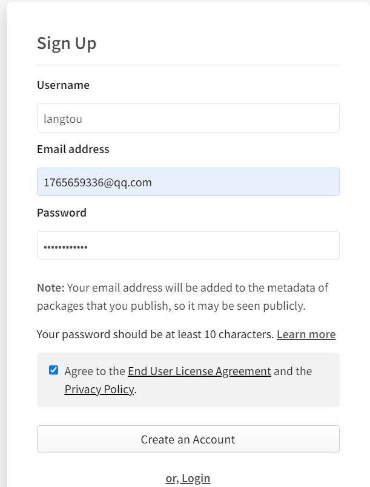
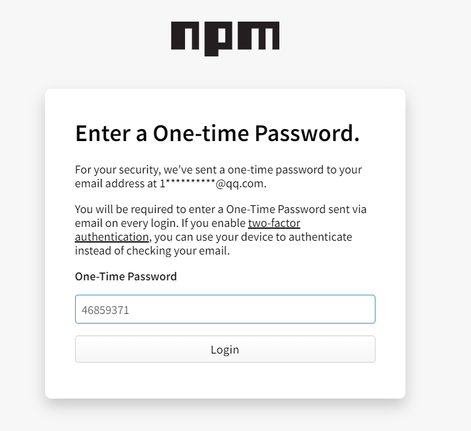
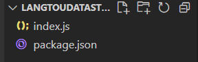
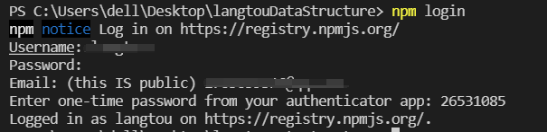
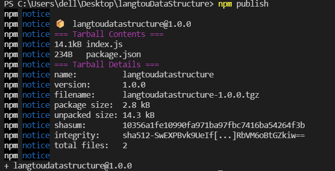
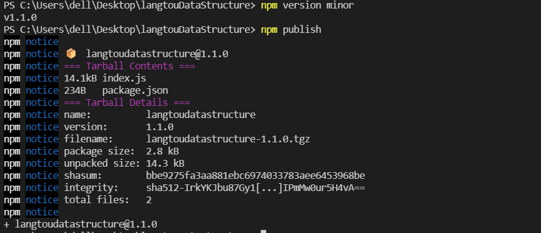
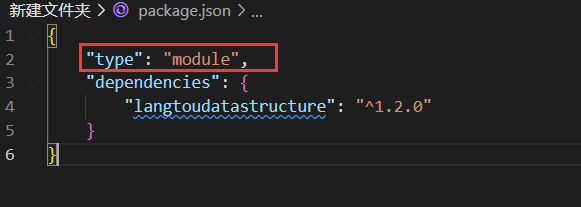
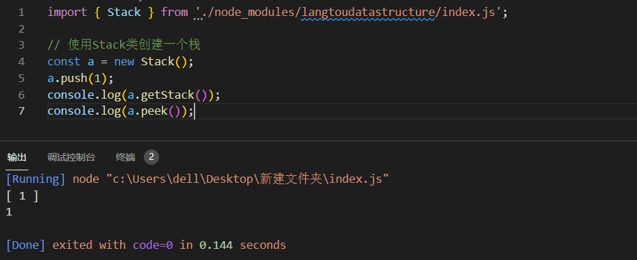

## 注册账号

[注册地址](https://www.npmjs.com/signup)

1. 输入账号名\邮箱\密码



2. 查看邮箱中收到的验证码,验证邮箱



## 创建本地npm包



1. 创建主文件`index.js`
2. 执行`npm init -y` 生成`package.json`文件

## 发布本地npm包

1. 登录npm 执行`npm login`输入账号,密码,邮箱,验证码



2. 在本地npm包目录下执行`npm publish`



```
最终生成的包名为本地文件夹名称的全小写
默认版本为1.0.0
！！！要注意查看npm的源是否是官方的源，要确保是官方源，如果上传到淘宝源的话，别的用户只能通过淘宝源才能下载到你的包。
```

## 更新npm包

进行npm包的修改之后

在package中指定当前的版本，

执行`npm version minor`迭代版本（会在当前版本基础上+1）,

最后执行`npm publish`发布



## 撤销软件包

1. 只有在发布软件包的24小时之内才允许被撤销
2. 软件包撤销24小时以后才能重新发布
3. 重新发布时需要修改包名称和版本号

执行 `npm unpublish <包名> --force`

## 使用自己发布的包

`npm install langtoudatastructure`

不管是使用npm官方源还是第三方国内镜像源(如淘宝源,淘宝源会每十分钟去同步npm官方源),都可以下载

在package.json中添加"type": "module",才能使用import es6语法



## 添加npm忽略说明文件

`.npmignore`