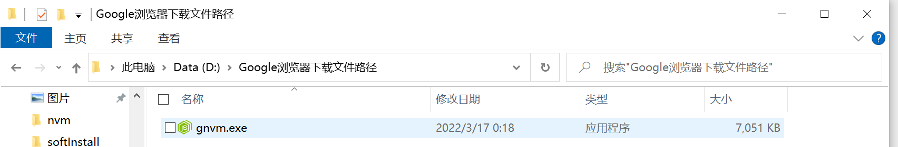

## gnvm参考资料

[官网](http://ksria.com/gnvm/doc/zh/index.html)

### 下载安装


```
官网文档里面的下载分栏页面有多种下载方式，我开了代理选择去github下载64-bit会得到一个gnvm.exe文件。然后将这个文件放在我们想要放置的位置。我喜欢放在D盘，点击会生成一个.gnvmrc文件。（！！！注意，一定要先移到想放在的位置，再点击。因为你在哪个文件夹下点击，到时候安装npm的时候，就会安装在哪个文件夹下）然后将这个文件夹路径添加到环境变量中。
```




***


```
验证gnvm是否安装成功
```


### 下载node与npm

```
1、`gnvm search *.*.*`查看所有版本的node和与之对应的npm版本
2、`gnvm install node版本` `gnvm npm npm版本`选择一个版本进行下载，注意要下载对应版本的npm，以及注意查阅官网查看最新的LTS版本是多少。
```

`注意`


```
是因为gnvm默认的下载地址是国外的，可能会安装失败。因此需要设置成淘宝源
```

### 设置gnvm的下载地址为淘宝源

`gnvm config registry TAOBAO`

如果淘宝源不行也可以设置成`gnvm config registry DEFAULT`


### 实际开发使用时的个人实践

```
1、gnvm install 想设置的node版本
2、node -v 查看是否下载成功
3、gnvm search 我们需要的node版本（执行会输出对应的npm版本）
4、gnvm npm 对应的npm版本
5、npm install -g cnpm --registry=https://registry.npm.taobao.org 设置成淘宝源 使用cnpm来安装
6、清理掉不用的node版本 gnvm uninstall node版本 不推荐经常清理，占不了电脑多少内存。
```

