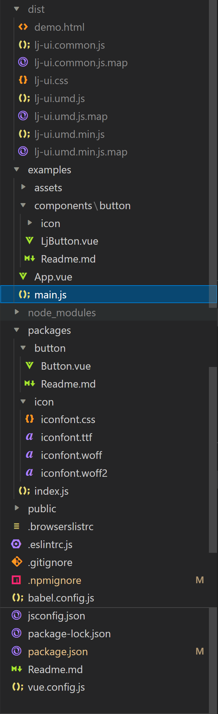

## 发布一个自己的Vue组件库到npm上



```
+ dist 打包好的静态文件
	. lj-ui.umd.min.js 打包之后组件库的主文件
	. lj-ui.css 打包之后组件库的全部样式文件
+ examples 原本的src文件，本地开发测试用
	+ components vue组件模板原始文件
	. App.vue 开发测试项目主模板
	. main.js 开发测试项目主入口文件
+ packages 复制examples/components下所有模板组件用到的文件，用来生成打包编译的dist包的原始文件
	. index.js 组件库主入口文件
. .npmignore npm忽略文件
. jsconfig.json js文件路径配置文件
. vue.config.js vue配置文件
```

### 将组件用到的文件全放在packages下

```
将我们本地开发的src/components下的组件全部复制到packages下，包括静态资源(图片，icon，css等)
```

`设置主文件index.js`

```js
// 统一导出
import Button from "./button/Button.vue";
import "./icon/iconfont.css";

const components = [Button];
const install = function(Vue) {
    components.forEach((component) => {
        Vue.component(component.name, component);
    });
};

// 判断是否直接引入的LjUI组件库，如果是，那么就把所有的组件注册成全局组件
if (typeof window !== "undefined" && window.Vue) {
    install(window.Vue);
}
export default install;
```

### 将src改为examples,作为我们的测试文件

`main.js`

```js
import Vue from "vue";
import App from "./App.vue";
import ElementUI from "element-ui";
import "element-ui/lib/theme-chalk/index.css";
// 全局引入
import LjUI from "lj-vue2-ui";
import "lj-vue2-ui/dist/lj-ui.css";
Vue.use(ElementUI);
Vue.use(LjUI);
Vue.config.productionTip = false;
new Vue({
    render: (h) => h(App),
}).$mount("#app");
```

`App.vue`

```vue
<template>
  <div>
    <LjButton autofocus circle type="primary" @click="aaa">12</LjButton>
    <LjButton plain round  disabled nativeType="submit">默</LjButton>
    <LjButton type="primary" size="small" plain round circle loading disabled autofocus></LjButton>
    <LjButton
      type="success"
      size="medium"
      plain
      round
      circle
      loading
      disabled
    ></LjButton>
    <LjButton
      type="info"
      size="mini"
      plain
      round
      circle
      icon="iconfont lj-icon-loading"
      disabled
      >信</LjButton
    >
    <LjButton type="warning" plain round circle disabled>警</LjButton>
    <LjButton type="danger" plain round circle disabled>危</LjButton>
    <el-button plain round circle disabled autofocus>默认按钮</el-button>
    <el-button type="primary" size="small" plain round circle loading disabled>主</el-button
    >
    <el-button type="success" size="medium" plain round circle disabled>成</el-button>
    <el-button type="info" size="mini" plain round circle disabled>信</el-button>
    <el-button type="warning" plain round circle disabled>警</el-button>
    <el-button type="danger" plain round circle disabled>危</el-button>
  </div>
</template>

<script>
export default {
  name: "App",
  components: {},
  methods:{
    aaa(){
      console.log("a");
    }
  }
};
</script>

<style lang="less">
</style>
```

`vue.config.js`

```js
const { defineConfig } = require("@vue/cli-service");
const path = require("path");
module.exports = defineConfig({
    transpileDependencies: true,
    pages: {
        index: {
            // 修改项目的入口文件
            entry: "examples/main.js",
            template: "public/index.html",
            filename: "index.html",
        },
    },
    // 扩展webpack配置，使packages加入编译
    chainWebpack: (config) => {
        config.module
            .rule("js")
            .include.add(path.resolve(__dirname, "packages"))
            .end()
            .use("babel")
            .loader("babel-loader")
            .tap((options) => {
                return options;
            });
    },
});
```

`.npmignore`

```
# 忽略目录
examples/
packages/
public/

# 忽略文件
vue.config.js
babel.config.js
jsconfig.js
.eslint.js
.gitignore
Readme.md
```

### 打包组件文件夹dist

`package.json`

```json
{
    "name": "lj-vue2-ui",
    "version": "0.1.0",
    "private": false,
    "main": "dist/lj-ui.umd.min.js",
    "author": {
        "name": "LiuJie"
    },
    "scripts": {
        "serve": "vue-cli-service serve",
        "build": "vue-cli-service build",
        "lint": "vue-cli-service lint",
        "lib": "vue-cli-service build --target lib packages/index.js"
    },
}
```

### 发布到npm上

```
见另外一篇文章，不再赘述
```

