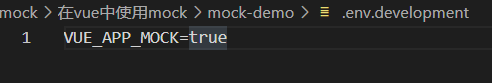

1. 创建vue项目 `vue create mock-demo`
2. 安装依赖 `npm i axios` `npm i mockjs -D`
2. 编写mock文件

```js
if (process.env.VUE_APP_MOCK) {
    require('./test');
}
```

```js
const Mock = require("mockjs");
// 请求的响应时间1秒到3秒之间
Mock.setup({
    timeout: "1000-3000",
});

// 请求方式要使用小写
Mock.mock("/test", "get", {
    "string|1-10": "★",
});
```

4. 使用vue环境变量控制mock的开启

   